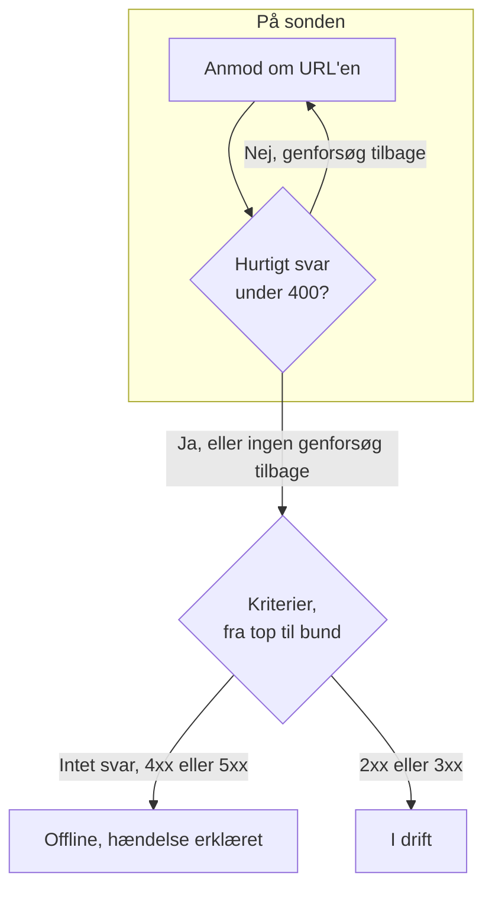

# Websted-monitor

En webstedsmonitor tjekker, at en webside svarer. Ved hvert tjek anmoder en sonde om sidens URL, og monitoren går offline og erklærer en hændelse, når siden ikke svarer eller svarer med en fejl. For at kalde et endpoint med en metode, headere eller en brødtekst bruger du i stedet en [API-monitor](/docs/monitor/api-monitor).

:::cards
- [Opret monitoren](#opret-en-webstedsmonitor): Seks trin i dashboardet.
- [Konfigurationsmuligheder](#konfigurationsmuligheder): URL-pladsholdere, omdirigeringer, certifikater, timeouts og genforsøg.
- [Overvågningskriterier](#overvågningskriterier): Hvad der fra start tæller som oppe eller nede.
- [Fejlfinding](#fejlfinding): Når monitoren og din browser er uenige.
:::

## Sådan virker det

Ved hvert tjek anmoder en sonde om URL'en, følger omdirigeringer og registrerer, hvad der kom tilbage: statuskoden, svartiden, headerne og, når et kriterium har brug for den, brødteksten. En anmodning, der fejler, får timeout, svarer med en status `4xx` eller `5xx` eller tager længere end 10 sekunder, forsøges igen, op til det antal genforsøg, du tillader. Derefter kører OneUptime resultatet gennem monitorens kriterier.



Når ingen af monitorens kriterier læser svarets brødtekst (et filter **Svarets brødtekst** eller **JavaScript Expression**), sender sonden en anmodning `HEAD` i stedet for et `GET` og gentager den som `GET`, hvis serveren afviser `HEAD`. Din servers adgangslogge kan vise begge.

En sonde, der har mistet sin egen netværksforbindelse, rapporterer intet resultat, så den kan ikke markere dit websted som offline.

## Før du starter

- **En rolle, der kan oprette monitorer**: Project Owner, Project Admin, Project Member, Monitor Admin eller Monitor Member eller en brugerdefineret rolle med tilladelsen Create Monitor.
- **En sonde, der kan nå webstedet.** Dit projekts standardsonder vælges for hver ny monitor. Står der en firewall foran webstedet, så tillad [OneUptime Clouds sonde-IP-adresser](/docs/configuration/ip-addresses). Et websted på et privat netværk har brug for en [brugerdefineret sonde](/docs/probe/custom-probe) i det netværk, som må nå private adresser: se [Adgang til privat netværk](/docs/self-hosted/private-network-access).

## Opret en webstedsmonitor

:::steps
### Start en ny monitor

Gå til **Monitorer**, og klik på **Opret monitor**. Vælg **Websted** under **Monitortype**.

### Navngiv den

Angiv et **Navn**, som `Marketing site`, og klik så på **Næste**.

### Angiv URL'en

Angiv sidens fulde adresse under **Websteds-URL**, inklusive `https://`, som `https://example.com`. For at ændre omdirigeringer, certifikater, timeout eller genforsøg åbner du **Flere felter** nedenunder (se [Konfigurationsmuligheder](#konfigurationsmuligheder)).

### Test den

Klik på **Test monitor**, vælg en sonde under **Vælg sonde**, og klik på **Kør test**. **Overvågningstestresultat** viser, hvad sonden fik tilbage.

### Gennemgå kriterierne

**Monitorkriterier** starter med [standardkriterierne](#standardkriterier): offline, når webstedet ikke svarer eller svarer med en fejl, online ved enhver status `2xx` eller `3xx`. Ret dem efter behov, og klik så på **Næste**.

### Vælg sonder, og opret

Behold eller ret **Sonder** og **Overvågningsinterval** (det starter på **Hvert 5. minut**), og klik så på **Opret monitor**. Monitorens side åbner.
:::

## Konfigurationsmuligheder

### Websteds-URL

Siden, der skal tjekkes, som fuld URL med skema: `https://example.com`, `https://example.com/pricing` eller `http://example.com:8080/health`. Du kan sætte en [monitorhemmelighed](/docs/monitor/monitor-secrets) ind i URL'en som `{{monitorSecrets.NAME}}`, for eksempel et token i forespørgselsstrengen.

### Dynamiske URL-pladsholdere

Når et CDN eller en caching-proxy står foran webstedet, kan en sonde få svar fra cachen i stedet for fra din server. For at komme forbi cachen tilføjer du en pladsholder i URL'en; sonden erstatter den med en ny værdi ved hvert tjek.

| Pladsholder | Erstattes med | Eksempelværdi |
| --- | --- | --- |
| `{{timestamp}}` | Den aktuelle Unix-tid i sekunder | `1719500000` |
| `{{random}}` | En tilfældig, unik streng på 32 hexadecimale tegn | `3f2b8c1d9e7a4b6c8d0e1f2a3b4c5d6e` |

En URL med en pladsholder:

```text
https://example.com/health?cb={{timestamp}}
```

Hvad sonden anmoder om ved to tjek med fem minutters mellemrum:

```text
https://example.com/health?cb=1719500000
https://example.com/health?cb=1719500300
```

Brug `{{random}}` på samme måde: `https://example.com/health?nocache={{random}}`.

### Flere felter

Disse indstillinger er foldet sammen under **Flere felter** under URL'en. Den sammenfoldede overskrift nævner dem og viser, hvilke du har ændret.

| Felt | Standard | Hvad det gør |
| --- | --- | --- |
| **Følg ikke omdirigeringer** | Fra | Bedøm det første svar i stedet for at følge omdirigeringer. Se [nedenfor](#følg-ikke-omdirigeringer). |
| **Tillad selvsignerede certifikater** | Fra | Spring valideringen af TLS-certifikatet over for monitorens eget værtsnavn. |
| **Brug klientcertifikat (mTLS)** | Fra | Præsentér et klientcertifikat og en privat nøgle. Se [Klientcertifikat (mTLS)](#klientcertifikat-mtls). |
| **Anmodningstimeout (sekunder)** | `60` | Hvor længe der ventes på hvert forsøg. Maksimum er 60 sekunder. |
| **Genforsøg ved fejl** | Sondens standard, som regel `3` | Hvor mange gange et mislykket forsøg gentages. Maksimum er 3. Se [Genforsøg og timeouts](#genforsøg-og-timeouts). |

#### Følg ikke omdirigeringer

Som standard følger sonden omdirigeringer (`301`, `302`, `303`, `307` og `308`), op til 10 af dem, og bedømmer den side, den ender på. Slå **Følg ikke omdirigeringer** til for i stedet at bedømme selve omdirigeringssvaret, for eksempel for at tjekke, at `http://` omdirigerer til `https://`. [Standardkriterierne](#standardkriterier) tæller et omdirigeringssvar som online.

**Tillad selvsignerede certifikater** følger omdirigeringer, der bliver på monitorens eget værtsnavn. En omdirigering til et andet værtsnavn verificeres som normalt.

#### Klientcertifikat (mTLS)

Kræver webstedet gensidig TLS, så slå **Brug klientcertifikat (mTLS)** til, og udfyld:

| Felt | Hvad du angiver |
| --- | --- |
| **Klientcertifikat (PEM)** | Det PEM-kodede klientcertifikat, der præsenteres. |
| **Privat klientnøgle (PEM)** | Den tilsvarende PEM-kodede private nøgle. |
| **Adgangsudtryk til privat klientnøgle** | Valgfrit. Adgangsudtrykket, kun hvis den private nøgle er krypteret. |

Det svarer til curls flag `--cert` og `--key`:

```bash
curl --cert client.crt --key client.key https://example.com/health
```

For at holde nøglen ude af monitorens indstillinger gemmer du certifikatet og nøglen som [monitorhemmeligheder](/docs/monitor/monitor-secrets) og angiver `{{monitorSecrets.NAME}}` i disse felter. Hemmeligheder udfyldes på serveren, og deres værdier vises aldrig i dashboardet.

Klientcertifikatet præsenteres kun, så længe anmodningen bliver på monitor-URL'ens oprindelse (samme skema, vært og port). Efter en omdirigering til en anden oprindelse fortsætter sonden uden det.

#### Genforsøg og timeouts

**Genforsøg ved fejl** tæller genforsøg _efter_ det første forsøg, så `0` kører tjekket én gang og `2` op til tre gange. Står feltet tomt, bruges sondens standard: 3, medmindre sondens `PROBE_MONITOR_RETRY_LIMIT` siger andet. Sonden venter et sekund mellem forsøgene, og hvert forsøg får hele **Anmodningstimeout (sekunder)**.

Disse fejl forsøges igen: forbindelsesfejl, timeouts, svar `4xx` og `5xx` og svar, der er langsommere end 10 sekunder. Disse gør ikke, fordi et nyt forsøg ikke kan ændre dem: en ugyldig eller blokeret URL, mere end 10 omdirigeringer og et svar større end 512 KiB.

## Overvågningskriterier

Kriterier afgør, hvornår webstedet tæller som online, forringet eller offline, og om det erklærer en hændelse eller opretter en advarsel. Hvert kriterium tjekker et eller flere filtre:

| Filter | Betingelser | Hvad det tjekker |
| --- | --- | --- |
| **Is Online** | **Sand**, **Falsk** | Om webstedet overhovedet svarede, uanset statuskode. |
| **Svarstatuskode** | **Equal To**, **Not Equal To**, **Greater Than**, **Less Than**, **Greater Than Or Equal To**, **Less Than Or Equal To** | HTTP-statuskoden. |
| **Svartid (i ms)** | **Greater Than**, **Less Than**, **Greater Than Or Equal To**, **Less Than Or Equal To** | Hvor lang tid anmodningen tog, omdirigeringer medregnet. |
| **Svarets brødtekst** | **Indeholder**, **Not Contains** | Tekst i svarets brødtekst. Der skelnes mellem store og små bogstaver. |
| **Response Header** | **Indeholder**, **Not Contains** | Om svaret har en header med dette navn. Angiv navnet med små bogstaver, som `x-cache`. |
| **Response Header Value** | **Indeholder**, **Not Contains** | Om en header har præcis denne værdi, sammenlignet med små bogstaver, som `no-store`. |
| **JavaScript Expression** | **Evaluates To True** | Et udtryk over svaret. Se [JavaScript-udtryk](/docs/monitor/javascript-expression). |
| **Is Request Timeout** | **Sand**, **Falsk** | Om anmodningen fik timeout ved hvert forsøg. |

**Tilføj kriterier** tilføjer et kriterium, der allerede er navngivet efter sit filter, for eksempel _Response Time (in ms) is above 3000_. Navnet ændrer sig med filtrene, indtil du skriver dit eget. En beskrivelse er valgfri: for at tilføje en åbner du kriteriets **Indstillinger**.

Med to eller flere filtre afgør **Matchbetingelse**, om **Alle** skal matche, eller om **Enhver** enkelt er nok. Et kriteriums **Handlinger** afgør, hvad det gør: ændrer monitorstatus, opretter en advarsel, erklærer en hændelse eller flere af dem.

### Standardkriterier

En ny webstedsmonitor starter med to kriterier, så den virker uden ændringer:

- **Offline** — webstedet svarer ikke eller svarer med en statuskode på `400` eller derover (eller under `200`). Monitoren markeres som **Offline**, og der oprettes en hændelse. Hændelsen løser sig selv, når webstedet er tilbage.
- **Oppe** — webstedet svarer med en hvilken som helst statuskode `2xx` eller `3xx`, som `200`, `204` eller `301`. Monitoren markeres som **I drift**.

På listen over kriterier er de navngivet efter monitoren: _Check if (name) is offline_ og _Check if (name) is online_.

En side, der svarer `204 No Content`, eller en omdirigering, du holder øje med, mens **Følg ikke omdirigeringer** er slået til, tæller altså som oppe. Hvis kun én statuskode betyder sund for dig, så ret begge kriterier på monitorens side **Konfiguration → Kriterier**: for eksempel **Svarstatuskode** / **Equal To** / `200` i online-kriteriet og **Not Equal To** / `200` i offline-kriteriet, i stedet for de to statuskodefiltre, hvert af dem har.

Kriterier tjekkes fra top til bund, og det første, der matcher, afgør, hvad der sker.

Når intet matcher, falder monitoren tilbage til sin standardstatus: **I drift**, medmindre du vælger en anden under **Flere felter** under kriterierne. Den sammenfoldede overskrift på **Flere felter** viser, hvilken status det er.

Monitorer, der blev oprettet, før OneUptime ændrede disse standarder, beholder de kriterier, de blev oprettet med, og tæller kun `200` som online. Monitorer, der oprettes via API'et eller Terraform, bruger de kriterier, du sender.

### Evaluering over en periode

**Evaluér disse kriterier over en periode** er et afkrydsningsfelt under et filter, der tilbydes for **Is Online**, **Svarstatuskode** og **Svartid (i ms)**. Slå det til for at bedømme et vindue af tidligere tjek i stedet for kun det seneste: vælg en aggregering under **Evaluér** og et vindue fra 2 til 60 minutter under **For de seneste (i minutter)**.

| Aggregering | Matcher, når |
| --- | --- |
| **Gennemsnit**, **Sum**, **Maximum Value**, **Minimum Value** | Den værdi over vinduet opfylder betingelsen. Kun numeriske filtre. |
| **All Values** | Hvert tjek i vinduet opfylder betingelsen. |
| **Any Value** | Mindst ét tjek i vinduet opfylder betingelsen. |

**All Values** matcher først, når vinduet virkelig er dækket af data. En monitor, der lige er oprettet, eller en, hvis tjek ikke længere er blevet registreret, har ikke nok historik til at sige noget om de seneste N minutter, så kriteriet venter i stedet for at matche på den ene måling, det har. **Any Value** er indstillingen for "sig det med det samme, når et enkelt tjek overskrider grænsen" og udløses stadig med det samme.

**Hvis ingen data** afgør, hvad der sker, så længe vinduet ikke kan bære kriteriet:

| Mulighed | Hvad der sker | Brug den til |
| --- | --- | --- |
| **Ignore** (standard) | Kriteriet matcher ikke. | Almindelige tærskeladvarsler. |
| **Trigger** | De manglende data tæller som problemet. | Tjek, hvor stilhed i sig selv er en fejl. |
| **Treat As Zero** | Vinduet sammenlignes som et enkelt nul. | Tællere, hvor ingen hændelser virkelig betyder nul. |

### Eksempelkriterier

| Mål | Filter | Betingelse | Værdi |
| --- | --- | --- | --- |
| Markér webstedet som forringet, når det er langsomt | **Svartid (i ms)** | **Greater Than** | `3000` |
| Fang en fejlside, der leveres med `200` | **Svarets brødtekst** | **Not Contains** | `Welcome` |
| Tjek, at en CDN-header er til stede | **Response Header** | **Indeholder** | `x-cache` |
| Accepter kun `200` som sund | **Svarstatuskode** | **Equal To** | `200` |

## Fejlfinding

:::details Monitoren er offline, men webstedet indlæses i min browser
Sonden fik et andet svar end din browser. Hændelsens grundårsag og **Overvågningslogs** på monitoren viser, hvad sonden så. Almindelige årsager:

- En firewall eller et botfilter blokerer sonderne. Tillad [OneUptime Clouds sonde-IP-adresser](/docs/configuration/ip-addresses).
- Webstedet kan kun nås på dit netværk. Brug en [brugerdefineret sonde](/docs/probe/custom-probe) inde i det.
- Certifikatet er selvsigneret eller fra en privat certifikatudsteder. Slå **Tillad selvsignerede certifikater** til, eller overvåg certifikatet for sig med en [SSL-certifikatmonitor](/docs/monitor/ssl-certificate-monitor).
:::

:::details Tjekket fejler med "Remote response exceeded the allowed size."
Sonden læser højst 512 KiB af et svar, og denne side er større. Peg monitoren på en mindre side, som et health-endpoint, eller fjern filtrene **Svarets brødtekst** og **JavaScript Expression**, så sonden kun behøver headerne.
:::

:::details Tjekket fejler med "Monitor target exceeded 10 redirects."
URL'en omdirigerer mere end 10 gange, som regel i en løkke. Åbn URL'en med `curl -IL` for at se kæden, og peg monitoren på den side, kæden burde ende på.
:::

:::details Tjekket fejler med en besked om en privat netværksadresse
URL'en slås op til en privat adresse, og sonden, der kørte tjekket, må ikke nå private adresser. På en selvhostet sonde slår du det til med `PROBE_ALLOW_PRIVATE_NETWORK_MONITORS`: se [Adgang til privat netværk](/docs/self-hosted/private-network-access).
:::

## Næste skridt

:::cards
- [API-monitor](/docs/monitor/api-monitor): Kald et endpoint med en metode, headere og en brødtekst.
- [SSL-certifikat-monitor](/docs/monitor/ssl-certificate-monitor): Få besked, før webstedets certifikat udløber.
- [Monitorhemmeligheder](/docs/monitor/monitor-secrets): Hold tokens og nøgler ude af monitorindstillingerne.
- [Hændelser](/docs/incidents/index): Hvad der sker, efter at monitoren har erklæret en.
:::
