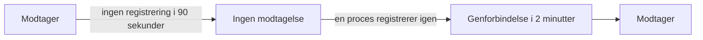

# Når OneUptime ikke modtager data

Mens OneUptime genstarter, bliver opgraderet eller arbejder sig igennem en kø, kan intet af det, dine agenter, collectors, sonder og heartbeat-afsendere sender, nå dine monitorer. OneUptime registrerer, hvornår det sker, og holder aldrig den tid imod en server, en vært eller nogen anden ressource: tiden blev ikke overvåget, så den er ikke nedetid.

## Sådan virker det

Hver OneUptime-proces, der tager imod data, registrerer hvert 30. sekund, at den modtager, så længe den kan nå de databaser, den gemmer data i. OneUptime udelader tre slags tid:

- Ingen modtagelse: ingen proces har registreret noget i mere end 90 sekunder. OneUptime var stoppet, genstartede, blev opgraderet eller kunne ikke nå en af sine databaser.
- Genforbindelse: de første 2 minutter efter, at OneUptime modtager igen, mens agenter genforbinder og sender det, de har holdt tilbage.
- Indhentning: så længe køen af data, der venter på behandling, er mere end et minut bagud, tiden siden de ældste data, der stadig venter i den.



En genstart, der tager under 90 sekunder, er ikke et hul: collectors sender igen det, de ikke kunne levere.

## Hvad der ændrer sig i den tid

| Hvor | Hvad OneUptime gør |
| --- | --- |
| Server- / VM-monitorer | **Is Online** tæller kun de minutter, hvor OneUptime modtog: som standard er en server offline efter 3 minutters stilhed, som OneUptime kunne have hørt. |
| Monitorer for indgående anmodninger og indgående e-mail | **Recieved In Minutes** og **Not Recieved In Minutes** tæller kun de minutter, hvor OneUptime modtog. Når et sådant kriterium er opfyldt, oplyser dets årsag, hvor mange af minutterne der blev udeladt. |
| Værts-, Kubernetes-, Docker-, metrik-, log- og trace-monitorer og de andre monitorer, der læser telemetri | Et tjek, hvis vindue rummer tid uden modtagelse, venter, til den tid har forladt vinduet, og aldrig længere end 15 minutter efter, at den sluttede. Indtil da ændres intet: ingen statusændring, og ingen hændelse eller advarsel åbnes eller løses. Så længe køen er bagud, læser et tjek op til, hvor køen er, i stedet for op til nu. |
| Værter, klynger og resten af inventaret | En ressource bliver først **Afbrudt**, når dens stilhedstærskel, 15 minutter for de fleste, er gået, mens OneUptime modtog. |
| Sonder og AI-agenter | Bliver **Afbrudt** efter 3 minutters stilhed, mens OneUptime modtog. |
| **Tilgængelighed**-diagrammer for værter, Docker- og Podman-værter og Kubernetes-klynger | Tiden skraveres som **Ikke overvåget**, og linjen brydes der i stedet for at falde til nede. Uptime-mærket udelader den tid; et interval med data tæller stadig som oppe. |
| Uptime på statussider og SLO'er | Begge beregnes ud fra monitorstatusser: uden falsk statusændring ingen falsk nedetid. |

> [!NOTE]
> At udelade tid er ikke at udfylde den. En ressource vises aldrig som oppe for tid, hvor OneUptime ikke kunne høre den: den tid bliver simpelthen ikke bedømt. Så snart OneUptime modtager igen, bedømmes en ressource, der virkelig er nede, fra da af på det, den sender eller undlader at sende.

## Selvhostede installationer

### Ved opstart

Mens en OneUptime-proces starter, besvarer den alle anmodninger undtagen sine statustjek med `503 Service Unavailable` og `Retry-After: 5`, og en browser får en side, der genindlæser sig selv. OpenTelemetry-collectors og -SDK'er sender en sådan anmodning igen i stedet for at kassere dataene. `/status/ready` fejler, indtil processen er klar, så Kubernetes sender den ingen trafik før da.

### Worker-replikaer

En proces registrerer kun, at OneUptime modtager, når indgående trafik kan nå den. Hvis du kører replikaer, der kun arbejder sig gennem køer, uden ingress foran, så sæt `RECEIVES_INGRESS_TRAFFIC` til `false` på dem. Ellers bliver de ved med at registrere, mens alle replikaer, der tager imod trafik, er nede, og det nedbrud tæller igen imod dine ressourcer. Helm-chartet sætter det allerede på sine worker-pods, og en enkelt OneUptime-container behøver intet.

```yaml title="Worker-container"
env:
  - name: RECEIVES_INGRESS_TRAFFIC
    value: "false"
```

### Hvad der registreres

OneUptime begynder at føre denne registrering, når du opgraderer til en version, der har den; tid før det bedømmes som altid. Så længe ingen proces registrerer, at den modtager, behandles tiden siden den seneste registrering som et hul i højst en time; derefter tæller stilhed igen, så en registrering, der ikke længere skrives, ikke længe kan skjule et nedbrud af dine ressourcer. Registreringer gemmes i 400 dage, og når OneUptime ikke kan læse dem, bedømmer den stilhed, som om den havde modtaget hele tiden.

## Næste trin

:::cards
- [Værts-monitor](/docs/monitor/host-monitor): Advar på en værts metrikker.
- [Server- / VM-monitor](/docs/monitor/server-monitor): Få besked, når en servers agent holder op med at rapportere.
- [Indgående anmodning-monitor](/docs/monitor/incoming-request-monitor): Gør et heartbeat til en dødmandskontakt.
- [Opgradering](/docs/installation/upgrading): Opgrader en selvhostet installation.
:::
