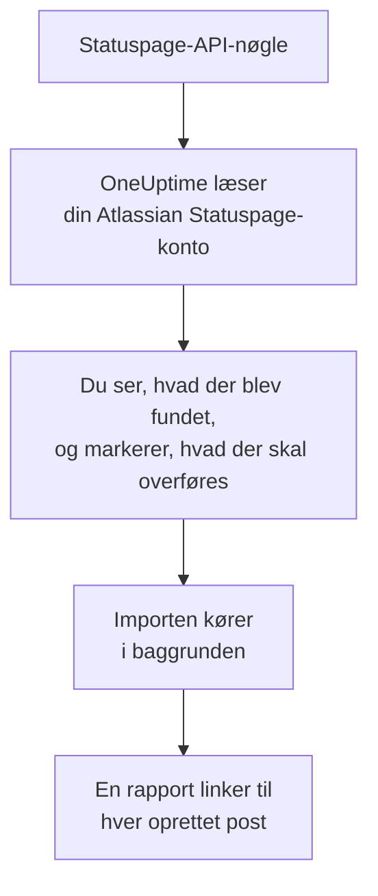

# Skift fra Atlassian Statuspage

**Importér fra et andet værktøj** henter dine Atlassian Statuspage-sider over i OneUptime på få minutter. Med en Statuspage-API-nøgle læser OneUptime dine sider, deres komponenter og grupper og deres e-mail-abonnenter, viser dig, hvad det fandt, og opretter det, du markerer. Intet ændres i Statuspage.

:::cards
- [Importér din konto](#importér-din-atlassian-statuspage-konto): Opret en nøgle, læs din konto, og markér, hvad der skal overføres.
- [Hvad overføres](#hvad-overføres): Hvad hver Statuspage-side, -komponent og -abonnent bliver til i OneUptime.
- [Gør skiftet færdigt](#gør-skiftet-færdigt): Hvad du gør, når importen er færdig.
:::

## Sådan fungerer det

- **Nøglen bruges én gang.** Den opbevares krypteret, mens OneUptime læser din konto, og slettes, så snart læsningen slutter, uanset om den lykkedes. Den vises aldrig igen og skrives aldrig i en log.
- **OneUptime læser kun.** Det kalder kun Atlassian Statuspages egen API: `api.statuspage.io`. Det sender én anmodning i sekundet, det højeste, Statuspage tillader en nøgle. Når Atlassian Statuspage beder det om at sætte farten ned, venter det og prøver igen.
- **Intet oprettes, før du starter importen.** Forhåndsvisningen viser for hvert element, om det er nyt, allerede findes i OneUptime (og bruges som det er), er overført af en tidligere import, eller hvorfor det ikke kan overføres.
- **At køre den igen opretter aldrig noget to gange.** OneUptime husker, hvad hver import overførte, ud fra Atlassian Statuspage-id'et. Kør den igen, når du har tilføjet sider eller komponenter i Atlassian Statuspage, og kun de nye oprettes.

## Før du begynder

- **Et OneUptime-projekt og retten til at oprette det, du overfører.** Projektejere og projektadministratorer kan overføre alt. Andre roller kan også køre en import og overføre de typer poster, de må oprette. Resten vises som ikke overført, med årsagen.
- **En Statuspage-API-nøgle.** Kun en kontoejer kan oprette en. Importen skriver aldrig til Statuspage, og den læser hver side, nøglen kan se.
- **Plads til dine sider, i OneUptime Cloud.** Dit abonnement har plads til et bestemt antal statussider og abonnenter. Det, der ikke er plads til, vises som ikke overført. Komponenterne bliver manuelle monitorer, som er gratis.

## Importér din Atlassian Statuspage-konto

:::steps
### Opret en API-nøgle i Statuspage
Vælg din avatar nederst til venstre i Statuspage og derefter **API info**. Vælg **Create key**, kald den `OneUptime import`, og kopiér den.

### Åbn importsiden
Gå i OneUptime til **Projektindstillinger** > **Importér fra et andet værktøj**, og vælg **Atlassian Statuspage**.

### Forbind Atlassian Statuspage
Indsæt nøglen i **Atlassian Statuspage-API-nøgle**, og vælg **Læs min Atlassian Statuspage-konto**. En stor konto tager et par minutter, og du kan forlade siden, mens den læses.

### Markér, hvad der skal overføres
Forhåndsvisningen viser, hvad der blev fundet, med én sektion pr. type. Alt, der ville blive oprettet, er markeret fra start, undtagen abonnenter. Under hvert element fortæller OneUptime, hvad der ikke overføres præcis, som det var. Når en markeret statusside viser en monitor, du ikke har markeret, siger det det, og **Markér dem også** markerer den. For at overføre abonnenter skal du markere dem og bekræfte under dem, at de har sagt ja til at få dine opdateringer, og at du må flytte dem. Ingen får en e-mail.

### Start importen
Vælg **Start import**. Importen kører i baggrunden: Du kan forlade siden, og rapporten venter på dig der.
:::

Rapporten tæller, hvad der blev oprettet og ikke overført, og viser hvert element med et link til den post, det blev til, fejl først. Tidligere importer står under **Tidligere importer** på samme side.

## Hvad overføres

| I Atlassian Statuspage | I OneUptime | Hvordan |
| --- | --- | --- |
| Components | Manuelle monitorer | Hver komponent bliver en manuel monitor, som statussiden viser. Intet kontrollerer den: Du sætter dens status i OneUptime, som du gjorde i Statuspage. En komponentgruppe bliver en gruppe på siden. |
| Pages | Statussider | Hver side overføres med navn og beskrivelse, sine komponenter i deres grupper og oppetid og historik for de komponenter, den fremhæver. En side, kun nogle personer må se, overføres som privat. |
| Email subscribers | Statusside-abonnenter | Bekræftede e-mail-abonnenter overføres, når du bekræfter, at du må flytte dem, og følger de samme komponenter. Ingen får en e-mail, og hver opdatering, de får fra OneUptime, har et link til at afmelde sig. |

Komponenter overføres som i drift. Forhåndsvisningen nævner hver komponent, der ikke er i drift i Statuspage lige nu, så du kan sætte dens status efter importen.

## Hvad overføres ikke

- **Hændelser, planlagt vedligeholdelse og deres historik.** En hændelse i OneUptime er en levende post, der tilkalder personer, så de tidligere bliver i Statuspage.
- **Abonnenter via sms, webhook, Slack eller Microsoft Teams.** Forhåndsvisningen tæller dem. Kun e-mail-abonnenter overføres.
- **Hændelsesskabeloner og systemmetrikker.** Tilføj det, du stadig har brug for, i OneUptime.
- **En statussides eget domæne og branding.** Tilføj i OneUptime domænet under **Brugerdefinerede domæner** og logoet under **Branding**.

## Grænser

Én import opretter højst 2.000 poster: højst 1.000 monitorer og 50 statussider. Abonnenter tæller ikke med i det: Én import overfører højst 5.000 abonnenter. Alt over en grænse vises som ikke overført. Kør importen igen for at overføre resten.

I OneUptime Cloud vises statussider og abonnenter, dit abonnement ikke har plads til, som ikke overført, med det, de kræver.

En forhåndsvisning gemmes i en dag. Kun den person, der læste kontoen, kan markere elementer og starte importen. Projektejere og projektadministratorer ser forløbet og rapporten for hver import.

## Gør skiftet færdigt

:::steps
### Tjek dine statussider
Åbn hver side under **Statussider**, og sammenlign den med den i Statuspage. Hver komponent er en manuel monitor: Ret dens status i OneUptime, når noget ændrer sig.

### Peg din statussides adresse på OneUptime
Åbn siden under **Statussider**, tilføj dit domæne under **Brugerdefinerede domæner**, og ret derefter dets DNS-post. Så når dine besøgende og abonnenter den nye side.

### Slå din side fra i Atlassian Statuspage
Når dit domæne peger på OneUptime, så luk siden i Statuspage, så dens abonnenter ikke får besked to gange.
:::

## Fejlfinding

:::details Atlassian Statuspage accepterede ikke API-nøglen
Tjek, at du kopierede hele nøglen, og at en kontoejer oprettede den under **API info**. En nøgle hører til én Statuspage-organisation og læser kun dens sider. Vælg derefter **Prøv igen**.
:::

:::details Abonnenterne kan ikke overføres
Markér feltet under dem, der bekræfter, at de har sagt ja til dine opdateringer, og at du må flytte dem: **Start import** venter på det. Abonnenter, der aldrig bekræftede deres abonnement i Statuspage, bliver der.
:::

:::details Nogle elementer kan ikke markeres
Ved hvert står der hvorfor: et navn, projektet allerede har, noget, en tidligere import har overført, eller en post, du ikke må oprette, eller som dit abonnement ikke omfatter.
:::

## Næste trin

:::cards
- [Statussider – Oversigt](/docs/status-pages/index): Hvad en statusside viser, og hvem der kan se den.
- [Abonnenter og meddelelser](/docs/status-pages/subscribers): Hvordan abonnenter hører om hændelser.
- [Manuel monitor](/docs/monitor/manual-monitor): En monitor, hvis status du selv sætter.
:::
