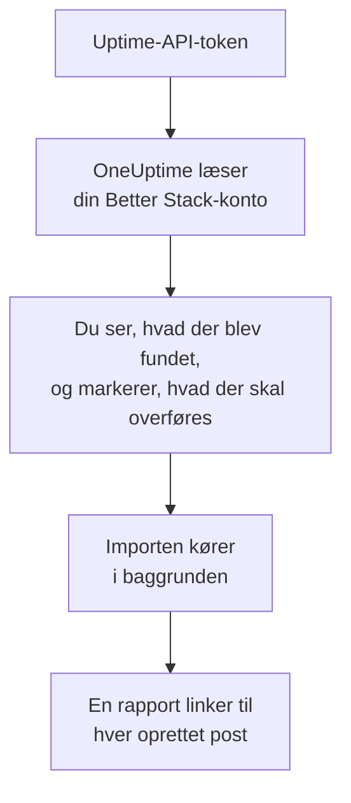

# Skift fra Better Stack

**Importér fra et andet værktøj** henter dine Better Stack Uptime-monitorer, heartbeats og statussider over i OneUptime på få minutter. Med et Uptime-API-token fra Better Stack læser OneUptime dine monitorer, heartbeats, statussider og deres e-mail-abonnenter, viser dig, hvad det fandt, og opretter det, du markerer. Intet ændres i Better Stack.

:::cards
- [Importér din konto](#importér-din-better-stack-konto): Opret et token, læs din konto, og markér, hvad der skal overføres.
- [Hvad overføres](#hvad-overføres): Hvad hver Better Stack-monitor, -heartbeat og -statusside bliver til i OneUptime.
- [Gør skiftet færdigt](#gør-skiftet-færdigt): Hvad du gør, når importen er færdig.
:::

## Sådan fungerer det

- **Nøglen bruges én gang.** Den opbevares krypteret, mens OneUptime læser din konto, og slettes, så snart læsningen slutter, uanset om den lykkedes. Den vises aldrig igen og skrives aldrig i en log.
- **OneUptime læser kun.** Det kalder kun Better Stacks egen API: `incidents.betterstack.com`. Når Better Stack beder det om at sætte farten ned, venter det og prøver igen.
- **Intet oprettes, før du starter importen.** Forhåndsvisningen viser for hvert element, om det er nyt, allerede findes i OneUptime (og bruges som det er), er overført af en tidligere import, eller hvorfor det ikke kan overføres.
- **At køre den igen opretter aldrig noget to gange.** OneUptime husker, hvad hver import overførte, ud fra Better Stack-id'et. Kør den igen, når du har tilføjet monitorer eller heartbeats i Better Stack, og kun de nye oprettes.

## Før du begynder

- **Et OneUptime-projekt og retten til at oprette det, du overfører.** Projektejere og projektadministratorer kan overføre alt. Andre roller kan også køre en import og overføre de typer poster, de må oprette. Resten vises som ikke overført, med årsagen.
- **Et Uptime-API-token fra Better Stack.** Brug et teambaseret Uptime-token: Det læser det teams monitorer, heartbeats og statussider. Importen skriver aldrig til Better Stack.
- **En betalingsmetode, i OneUptime Cloud.** Monitorer, der udfører kontroller, faktureres efter forbrug, også på Free-abonnementet, så tilføj en under **Projektindstillinger** > **Fakturering**, før du importerer. Uden en vises de monitorer som ikke overført.

## Importér din Better Stack-konto

:::steps
### Opret et API-token i Better Stack
Gå i Better Stack til **API tokens** > **Team-based tokens**, og vælg dit team. Opret under **Uptime API tokens** et token med navnet `OneUptime import`, og kopiér det.

### Åbn importsiden
Gå i OneUptime til **Projektindstillinger** > **Importér fra et andet værktøj**, og vælg **Better Stack**.

### Forbind Better Stack
Indsæt tokenet i **Better Stack-API-nøgle**, og vælg **Læs min Better Stack-konto**. En stor konto tager et par minutter, og du kan forlade siden, mens den læses.

### Markér, hvad der skal overføres
Forhåndsvisningen viser, hvad der blev fundet, med én sektion pr. type. Alt, der ville blive oprettet, er markeret fra start, undtagen monitorer på pause, som overføres på pause, hvis du markerer dem, og abonnenter. Under hvert element fortæller OneUptime, hvad der ikke overføres præcis, som det var. Når en markeret statusside viser en monitor, du ikke har markeret, siger det det, og **Markér dem også** markerer den. For at overføre abonnenter skal du markere dem og bekræfte under dem, at de har sagt ja til at få dine opdateringer, og at du må flytte dem. Ingen får en e-mail.

### Start importen
Vælg **Start import**. Importen kører i baggrunden: Du kan forlade siden, og rapporten venter på dig der.
:::

Rapporten tæller, hvad der blev oprettet og ikke overført, og viser hvert element med et link til den post, det blev til, fejl først. Tidligere importer står under **Tidligere importer** på samme side.

## Hvad overføres

| I Better Stack | I OneUptime | Hvordan |
| --- | --- | --- |
| Monitors and heartbeats | Monitorer | Hver monitor bliver en monitor af samme type, med samme adresse, interval og timeout. Hver heartbeat bliver en monitor for indgående anmodninger. |
| Status pages | Statussider | Hver side overføres med sine sektioner som grupper og de monitorer og heartbeats, den viser. Et element, du følger manuelt, bliver en manuel monitor. En side med adgangskode eller en IP-tilladelsesliste overføres som privat. |
| Email subscribers | Statusside-abonnenter | Bekræftede e-mail-abonnenter overføres, når du bekræfter, at du må flytte dem, og følger de samme ressourcer. Ingen får en e-mail, og hver opdatering, de får fra OneUptime, har et link til at afmelde sig. |

- **Status-, expected status code-, keyword- og keyword absence-monitorer** bliver webstedsmonitorer, eller API-monitorer, når de sender en anden metode, headers eller en JSON-body. En statusmonitor er oppe ved ethvert 2xx-svar, og en expected status code-monitor ved de koder, den nævner.
- **Ping- og TCP-monitorer** bliver ping- og portmonitorer. **SMTP-, POP- og IMAP-monitorer** bliver portmonitorer på deres port: OneUptime kontrollerer, at porten svarer, ikke mailsamtalen.
- **DNS-monitorer** bliver DNS-monitorer for det navn, de slår op, hos den samme server.
- **Heartbeats** bliver monitorer for indgående anmodninger, som går ned, når der ikke er kommet en anmodning i perioden og henstanden. Hver får en ny adresse i OneUptime.
- **SSL-udløbsadvarsler.** En monitor, der advarer, før dens certifikat udløber, får også en SSL-certifikatmonitor, opkaldt efter den, der advarer lige så mange dage før.

Hver monitor kontrolleres fra dit projekts sonder, ligesom en, du selv opretter. Et interval, som OneUptime ikke tilbyder, bliver det nærmeste, det tilbyder, og en timeout på over et minut bliver ét minut. Forhåndsvisningen siger, når et af dem ændres.

## Hvad overføres ikke

- **Oppetidshistorik, svartider og hændelser.** OneUptime begynder at kontrollere, når importen er færdig.
- **Alarmkontakter og integrationer.** Vælg i OneUptime, hvem der får besked, som beskrevet i [Gør skiftet færdigt](#gør-skiftet-færdigt).
- **Adgangskoder og headers, der kan indeholde en hemmelighed.** En monitor, der logger ind eller sender en `Authorization`-, cookie- eller token-header, overføres uden den: Tilføj den med en [monitorhemmelighed](/docs/monitor/monitor-secrets).
- **UDP- og Playwright-monitorer.** OneUptime har ingen monitor, der gør det samme, og forhåndsvisningen nævner hver enkelt.
- **Abonnenter, der aldrig bekræftede deres abonnement.** De bliver i Better Stack.
- **Det, en statusside viser ud over monitorer, heartbeats og manuelt fulgte elementer.** Forhåndsvisningen nævner hvert enkelt.
- **En statussides eget domæne og branding.** Tilføj i OneUptime domænet under **Brugerdefinerede domæner** og logoet under **Branding**.

## Grænser

Én import opretter højst 2.000 poster: højst 1.000 monitorer og 50 statussider. Abonnenter tæller ikke med i det: Én import overfører højst 5.000 abonnenter. Alt over en grænse vises som ikke overført. Kør importen igen for at overføre resten.

I OneUptime Cloud kræver monitorer, der udfører kontroller, en betalingsmetode, og det, dit abonnement ikke har plads til, vises som ikke overført, med det, det kræver.

En forhåndsvisning gemmes i en dag. Kun den person, der læste kontoen, kan markere elementer og starte importen. Projektejere og projektadministratorer ser forløbet og rapporten for hver import.

## Gør skiftet færdigt

:::steps
### Tjek dine monitorer
Åbn hver enkelt under **Monitorer**, og tjek de første resultater. En heartbeat-monitor har en ny adresse: Peg det job, der kalder den, derhen.

### Vælg, hvem der får besked
Tilføj ejere til dine monitorer eller en vagtpolitik under **Vagtordning** > **Vagtpolitikker** til de hændelser, de åbner, så de rigtige personer får besked, når noget går ned.

### Peg din statussides adresse på OneUptime
Åbn siden under **Statussider**, tilføj dit domæne under **Brugerdefinerede domæner**, og ret derefter dets DNS-post. Så når dine besøgende og abonnenter den nye side.

### Slå kontrollerne fra i Better Stack
Når OneUptime kontrollerer de samme ting, så sæt dem på pause i Better Stack, så ingen får besked to gange.
:::

## Fejlfinding

:::details Better Stack accepterede ikke API-nøglen
Tjek, at du kopierede hele tokenet, og at det er teamets token fra **Uptime API tokens**, ikke et Telemetry-token. Vælg derefter **Prøv igen**.
:::

:::details En monitor vises som ikke overført
Der står hvorfor: en type monitor, som OneUptime ikke har, en adresse, som OneUptime ikke kan læse, eller et projekt uden plads eller betalingsmetode til den. En monitor, som OneUptime allerede kører med samme navn, type og adresse, bruges, som den er.
:::

:::details Nogle elementer kan ikke markeres
Ved hvert står der hvorfor: et navn, projektet allerede har, noget, en tidligere import har overført, eller en post, du ikke må oprette, eller som dit abonnement ikke omfatter.
:::

## Næste trin

:::cards
- [Indgående anmodning-monitor](/docs/monitor/incoming-request-monitor): Hvordan en heartbeat fungerer i OneUptime.
- [Statussider – Oversigt](/docs/status-pages/index): Hvad en statusside viser, og hvem der kan se den.
- [Skift fra UptimeRobot](/docs/moving-to-oneuptime/uptimerobot): Hent dine kontroller over fra UptimeRobot.
:::
