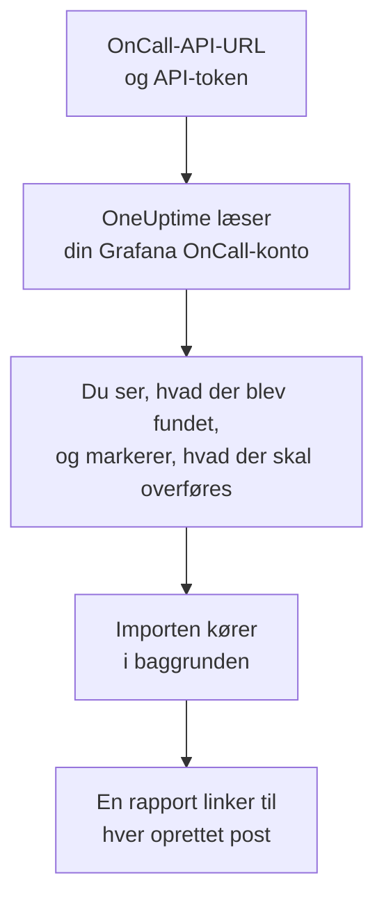

# Skift fra Grafana OnCall

Grafana Labs arkiverede open source-udgaven af Grafana OnCall i marts 2026, og i Grafana Cloud lever den videre som en del af Grafana Cloud IRM. Uanset hvor din kører, henter **Importér fra et andet værktøj** din vagtopsætning over i OneUptime på få minutter. Med din OnCall-API-URL og et API-token læser OneUptime dine brugere, teams, vagtplaner og eskaleringskæder, viser dig, hvad det fandt, og opretter det, du markerer. Intet ændres i Grafana OnCall.

:::cards
- [Importér din konto](#importér-din-grafana-oncall-konto): Opret et token, læs din konto, og markér, hvad der skal overføres.
- [Hvad overføres](#hvad-overføres): Hvad hver Grafana OnCall-post bliver til i OneUptime.
- [Gør skiftet færdigt](#gør-skiftet-færdigt): Hvad du gør, når importen er færdig.
:::

## Sådan fungerer det

- **Tokenet bruges én gang.** Det opbevares krypteret sammen med API-URL'en, mens OneUptime læser din konto, og slettes, så snart læsningen slutter, uanset om den lykkedes. Det vises aldrig igen og skrives aldrig i en log.
- **OneUptime læser kun, og kun fra den adresse, du angiver.** Det kalder kun den OnCall-API-URL, du indsætter, højst én gang i sekundet, og holder sig dermed inden for Grafana OnCalls grænse på 300 forespørgsler pr. token på fem minutter. Når Grafana OnCall beder det om at sætte farten ned, venter det og prøver igen.
- **Adressen kontrolleres før hver forespørgsel.** OneUptime kalder aldrig den maskine, det kører på, eller en metadatatjeneste i skyen, og følger aldrig en omdirigering. I OneUptime Cloud skal adressen desuden være offentlig og begynde med `https://`. Et selvhostet OneUptime kan også læse et Grafana OnCall på dit eget netværk, medmindre dets administrator har slået det fra, som beskrevet i [Private Network Access](/docs/self-hosted/private-network-access).
- **Intet oprettes, før du starter importen.** Forhåndsvisningen viser for hvert element, om det er nyt, allerede findes i OneUptime (og bruges som det er), er overført af en tidligere import, eller hvorfor det ikke kan overføres.
- **At køre den igen opretter aldrig noget to gange.** OneUptime husker, hvad hver import overførte, ud fra Grafana OnCall-id'et. Kør den igen, når du har tilføjet personer eller vagtplaner i Grafana OnCall, og kun de nye oprettes.

## Før du begynder

- **Et OneUptime-projekt og retten til at oprette det, du overfører.** Projektejere og projektadministratorer kan overføre alt. Andre roller kan også køre en import og overføre de typer poster, de må oprette. Resten vises som ikke overført, med årsagen.
- **Et API-token fra Grafana OnCall.** Brug et OnCall-API-token, ikke et token fra en Grafana-tjenestekonto. Importen skriver aldrig til Grafana OnCall. Slet tokenet, når importen er færdig.
- **Din OnCall-API-URL.** OnCalls indstillinger viser den ved siden af API-tokenene. I Grafana Cloud ser den ud som `https://oncall-prod-us-central-0.grafana.net/oncall`. På din egen installation er det adressen på din OnCall-motor.

## Importér din Grafana OnCall-konto

:::steps
### Opret et API-token i Grafana OnCall
Åbn **OnCall** > **Settings** i Grafana. I Grafana Cloud åbner du **IRM** > **Settings** > **Admin & API**. Kopiér den OnCall-API-URL, der vises der. Opret under **API tokens** et token med navnet `OneUptime import`, og kopiér det.

### Åbn importsiden
Gå i OneUptime til **Projektindstillinger** > **Importér fra et andet værktøj**, og vælg **Grafana OnCall**.

### Forbind Grafana OnCall
Indsæt adressen i **Grafana OnCall-API-URL** og tokenet i **Grafana OnCall-API-nøgle**, og vælg **Læs min Grafana OnCall-konto**. En stor konto tager et par minutter, og du kan forlade siden, mens den læses.

### Markér, hvad der skal overføres
Forhåndsvisningen viser, hvad der blev fundet, med én sektion pr. type. Alt, der ville blive oprettet, er markeret fra start, undtagen personer, der ikke er på noget team, nogen vagtplan eller eskaleringskæde. Under hvert element fortæller OneUptime, hvad der ikke overføres præcis, som det var. Når et markeret element bruger noget, du ikke har markeret, siger det det, og **Markér dem også** markerer det.

### Start importen
Hvis personer bliver inviteret, vælger du under **Invitér nye personer til** det team, de kommer på. Vælg derefter **Start import**. Importen kører i baggrunden: Du kan forlade siden, og rapporten venter på dig der.
:::

Rapporten tæller, hvad der blev oprettet, inviteret og ikke overført, og viser hvert element med et link til den post, det blev til, fejl først. Tidligere importer står under **Tidligere importer** på samme side.

## Hvad overføres

| I Grafana OnCall | I OneUptime | Hvordan |
| --- | --- | --- |
| Brugere | Projektmedlemmer | Matches på e-mailadresse. Alle, der ikke er i projektet endnu, inviteres til det team, du vælger. |
| Teams | Teams | Oprettes med deres medlemmer. Et team, hvis navn projektet allerede har, bruges som det er, og dets medlemmer røres ikke. |
| Vagtplaner | Vagtplaner | Hver rotation bliver et lag med de samme personer, den samme start, den samme overdragelse og de samme vagttimer, i vagtplanens tidszone, ejet af vagtplanens team. En rotation på et højere lag går stadig forud for lagene under det. |
| Eskaleringskæder | Vagtpolitikker | De trin, der giver besked til personer, et team eller den, der har vagt i en vagtplan, bliver eskaleringsregler, og et ventetrin bliver ventetiden før den næste regel. Et trin, der gentager kæden, bliver politikkens gentagelser. |

Rotationer på samme lag, der har vagt samtidig, og en rotation, der sætter flere personer på vagt på én gang, bliver hver deres egen OneUptime-vagtplan, fordi en OneUptime-vagtplan har én person på vagt ad gangen. Hver vagtpolitik, der tilkaldte vagtplanen, tilkalder dem alle.

## Hvad overføres ikke

- **Alarmgrupper og deres historik.** OneUptime starter med din opsætning, ikke med dine tidligere alarmer.
- **Integrationer, ruter og udgående webhooks.** Ret i stedet dine monitorer og alarmkilder mod OneUptime, som beskrevet i [Gør skiftet færdigt](#gør-skiftet-færdigt).
- **Overstyringer, enkeltstående vagter og rotationer, der allerede er slut.** Tilføj de overstyringer, du stadig har brug for, i OneUptime efter importen.
- **Vagter fra et kalenderlink.** En vagtplan, hvis vagter kommer fra et iCal-link, overføres uden lag, så tilføj dem i OneUptime.
- **Hver persons notifikationsregler.** Hver person vælger, hvordan de tilkaldes, i deres egne **Brugerindstillinger**, når de har accepteret invitationen.
- **Trin, som OneUptime ikke har et præcist modstykke til.** Et trin, der giver besked til en Slack-brugergruppe eller -kanal, kalder en webhook, erklærer en hændelse eller løser alarmen, udelades. Et trin, der giver besked til personer én ad gangen, tilkalder dem alle på én gang, et trin, der kun fortsætter på bestemte tidspunkter eller ved et bestemt antal alarmer, fortsætter altid, og forhåndsvisningen fortæller, hvad der ændres.

## Grænser

Én import opretter højst 2.000 poster: højst 500 personer, 200 teams, 200 vagtplaner og 200 vagtpolitikker. Alt over en grænse vises som ikke overført. Kør importen igen for at overføre resten.

I OneUptime Cloud vises poster, som dit abonnement ikke omfatter, som ikke overført, med det abonnement, de kræver.

En forhåndsvisning gemmes i en dag. Kun den person, der læste kontoen, kan markere elementer og starte importen. Projektejere og projektadministratorer ser forløbet og rapporten for hver import.

## Gør skiftet færdigt

:::steps
### Tjek vagtplanerne
Åbn hver vagtplan under **Vagtordning** > **Vagtplaner**, og tjek, hvem der har vagt nu, og hvem der er den næste.

### Sørg for, at alle kan tilkaldes
Inviterede personer accepterer deres invitation og tilføjer derefter et telefonnummer, en e-mailadresse eller mobilappen, de kan tilkaldes på. **Vagtordning** > **Parathed** viser, hvem der endnu ikke kan nås.

### Send dine alarmer til OneUptime
Ret dine monitorer og de værktøjer, der udløser alarmer, mod OneUptime, og tilkald dig selv én gang for at teste det.

### Slå tilkald fra i Grafana OnCall
Når OneUptime tilkalder de rigtige personer, så slå notifikationerne fra i Grafana OnCall, så ingen tilkaldes to gange.
:::

## Fejlfinding

:::details Grafana OnCall accepterede ikke API-nøglen
Tjek, at du kopierede hele tokenet, at det er et OnCall-API-token og ikke et token fra en Grafana-tjenestekonto, og at API-URL'en er den, der vises ved siden af det. Vælg derefter **Prøv igen**.
:::

:::details OneUptime kaldte ikke API-URL'en
Indsæt OnCall-API-URL'en præcis, som OnCalls indstillinger viser den. I OneUptime Cloud skal den begynde med `https://` og kunne nås fra internettet. Et selvhostet OneUptime kan også nå en adresse på dit eget netværk, medmindre dets administrator har slået det fra, men aldrig en adresse på den maskine, OneUptime kører på.
:::

:::details En type post mangler i forhåndsvisningen
Tokenet kunne ikke læse den, og forhåndsvisningen siger det øverst. Et token læser det, som personen, der oprettede det, må se, så opret det som administrator i Grafana OnCall, og læs kontoen igen.
:::

:::details Nogle elementer kan ikke markeres
Ved hvert står der hvorfor: et navn, projektet allerede har, noget, en tidligere import har overført, eller en post, du ikke må oprette, eller som dit abonnement ikke omfatter.
:::

## Næste trin

:::cards
- [Vagtplaner](/docs/on-call/schedules): Lag, begrænsninger og overdragelser.
- [Eskaleringsregler](/docs/on-call/escalation-rules): Hvordan vagtpolitikker tilkalder personer.
- [Skift fra PagerDuty](/docs/moving-to-oneuptime/pagerduty): Hent et team over fra PagerDuty.
:::
