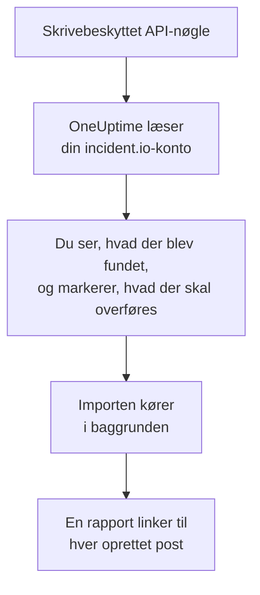

# Skift fra incident.io

**Importér fra et andet værktøj** henter din incident.io-opsætning ind i OneUptime på få minutter. Med en skrivebeskyttet incident.io-API-nøgle læser OneUptime dine brugere, teams, vagtplaner, eskaleringsstier, tjenester og hændelsesindstillinger, viser dig, hvad det fandt, og opretter det, du markerer. Intet ændres i incident.io.

:::cards
- [Importér din konto](#importér-din-incidentio-konto): Opret en nøgle, læs din konto, og markér, hvad der skal overføres.
- [Hvad overføres](#hvad-overføres): Hvad hver incident.io-post bliver til i OneUptime.
- [Gør skiftet færdigt](#gør-skiftet-færdigt): Hvad du gør, når importen er færdig.
:::

## Sådan fungerer det

- **Nøglen bruges én gang.** Den opbevares krypteret, mens OneUptime læser din konto, og slettes, så snart læsningen slutter, uanset om den lykkedes. Den vises aldrig igen og skrives aldrig i en log.
- **OneUptime læser kun.** Det kalder kun incident.io's egen API, `api.incident.io`. Når incident.io beder det om at sætte farten ned, venter det og prøver igen.
- **Intet oprettes, før du starter importen.** Forhåndsvisningen viser for hvert element, om det er nyt, allerede findes i OneUptime (og bruges som det er), er overført af en tidligere import, eller hvorfor det ikke kan overføres.
- **At køre den igen opretter aldrig noget to gange.** OneUptime husker, hvad hver import overførte, ud fra incident.io-id'et. Kør den igen, når du har tilføjet personer eller vagtplaner i incident.io, og kun de nye oprettes.

## Før du begynder

- **Et OneUptime-projekt og retten til at oprette det, du overfører.** Projektejere og projektadministratorer kan overføre alt. Andre roller kan også køre en import og overføre de typer poster, de må oprette. Resten vises som ikke overført, med årsagen.
- **En incident.io-API-nøgle, der kun kan se data.** Importen skriver aldrig til incident.io, så nøglen behøver ingen tilladelse til at oprette, redigere eller administrere noget.

## Importér din incident.io-konto

:::steps
### Opret en API-nøgle i incident.io
Gå i incident.io til **Settings** > **API keys**, og vælg **Add new**. Kald den `OneUptime import`, giv den kun tilladelser til at se data, ingen til at oprette, redigere eller administrere, og kopiér nøglen.

### Åbn importsiden
Gå i OneUptime til **Projektindstillinger** > **Importér fra et andet værktøj**, og vælg **incident.io**.

### Forbind incident.io
Indsæt nøglen i **incident.io-API-nøgle**, og vælg **Læs min incident.io-konto**. En stor konto tager et par minutter, og du kan forlade siden, mens den læses.

### Markér, hvad der skal overføres
Forhåndsvisningen viser, hvad der blev fundet, med én sektion pr. type. Alt, der ville blive oprettet, er markeret fra start, undtagen personer, der ikke er på noget team, nogen vagtplan eller eskaleringssti. Under hvert element fortæller OneUptime, hvad der ikke overføres præcis, som det var. Når et markeret element bruger noget, du ikke har markeret, siger det det, og **Markér dem også** markerer det.

### Start importen
Hvis personer bliver inviteret, vælger du under **Invitér nye personer til** det team, de kommer på. Vælg derefter **Start import**. Importen kører i baggrunden: Du kan forlade siden, og rapporten venter på dig der.
:::

Rapporten tæller, hvad der blev oprettet, inviteret og ikke overført, og viser hvert element med et link til den post, det blev til, fejl først. Tidligere importer står under **Tidligere importer** på samme side.

## Hvad overføres

| I incident.io | I OneUptime | Hvordan |
| --- | --- | --- |
| Brugere | Projektmedlemmer | Matches på e-mailadresse. Alle, der ikke er i projektet endnu, inviteres til det team, du vælger. Deaktiverede brugere overføres ikke. |
| Teams | Teams | Oprettes med deres medlemmer. Et team, hvis navn projektet allerede har, bruges som det er, og dets medlemmer røres ikke. |
| Vagtplaner | Vagtplaner | Hver rotation bliver et lag med de samme personer, den samme start, den samme vagtlængde og den samme arbejdstid, i vagtplanens tidszone. Den version af rotationen, der gælder nu, er den, der overføres. |
| Eskaleringsstier | Vagtpolitikker | Hvert niveau bliver en eskaleringsregel, der tilkalder de samme vagtplaner, brugere og teams efter den samme ventetid. En gentagelse bliver politikkens gentagelser, og fra en forgrening overføres den første sti. |
| Katalogtjenester | Tjenester | Posterne i dine katalogtyper i tjenestekategorien, oprettet i tjenestekataloget. Arkiverede poster udelades. |
| Alvorligheder | Hændelsesalvorligheder | Oprettes i incident.io's rækkefølge, den mest alvorlige først. En alvorlighed, hvis navn projektet allerede har, bruges som den er. |
| Statusser | Hændelsestilstande | En triagestatus svarer til den tilstand, OneUptime starter hændelser i, og en lukket status til den tilstand, hvor hændelser er løst. Aktive og pausede statusser oprettes mellem Bekræftet og Løst. |
| Hændelsesroller | Hændelsesroller | Den ledende rolle svarer til OneUptimes hændelsesleder, og de andre roller oprettes. OneUptime registrerer, hvem der erklærede hver hændelse, så rapportørrollen er ikke nødvendig. |
| Brugerdefinerede felter | Brugerdefinerede hændelsesfelter | Felter med ét valg bliver rullelister, felter med flere valg rullelister med flere valg, tekst- og linkfelter tekst og numeriske felter tal, med deres valgmuligheder. |

En rotation med flere personer på vagt samtidig bliver én OneUptime-vagtplan pr. person på vagt, fordi en OneUptime-vagtplan har én person på vagt ad gangen. Hver vagtpolitik, der tilkaldte vagtplanen, tilkalder dem alle.

## Hvad overføres ikke

- **Hændelser, alarmer og deres historik.** OneUptime starter med din opsætning, ikke med dine tidligere hændelser.
- **Workflows, statussider, alert routes og integrationer.** Ret i stedet dine monitorer og alarmkilder mod OneUptime, som beskrevet i [Gør skiftet færdigt](#gør-skiftet-færdigt).
- **Brugerdefinerede felter, hvis valgmuligheder kommer fra kataloget,** og statusser, som OneUptime ikke har en tilstand for: declined, merged, canceled og learning.
- **Overstyringer af vagtplaner og ændringer af en rotation, der er planlagt til senere.** Forhåndsvisningen nævner hver planlagt ændring, så du kan foretage den i OneUptime, når den skal ske.
- **Eskaleringstrin, som OneUptime ikke har et præcist modstykke til.** Et trin, der skriver i en Slack- eller Microsoft Teams-kanal, udelades, fordi arbejdsområdets notifikationsregler gør det i OneUptime, og det samme gælder et trin, der giver videre til en anden eskaleringssti. Et trin, der tilkalder den, der har vagt næste gang, overføres som det nærmeste, OneUptime har, og forhåndsvisningen fortæller, hvad der ændres.

## Grænser

Én import opretter højst 2.000 poster: højst 500 personer, 200 teams, 200 vagtplaner, 200 vagtpolitikker, 500 tjenester, 100 brugerdefinerede hændelsesfelter og 25 af hver af hændelsesalvorligheder, hændelsestilstande og hændelsesroller. Alt over en grænse vises som ikke overført. Kør importen igen for at overføre resten.

I OneUptime Cloud vises poster, som dit abonnement ikke omfatter, som ikke overført, med det abonnement, de kræver.

En forhåndsvisning gemmes i en dag. Kun den person, der læste kontoen, kan markere elementer og starte importen. Projektejere og projektadministratorer ser forløbet og rapporten for hver import.

## Gør skiftet færdigt

:::steps
### Tjek vagtplanerne
Åbn hver vagtplan under **Vagtordning** > **Vagtplaner**, og tjek, hvem der har vagt nu, og hvem der er den næste.

### Sørg for, at alle kan tilkaldes
Inviterede personer accepterer deres invitation og tilføjer derefter et telefonnummer, en e-mailadresse eller mobilappen, de kan tilkaldes på. **Vagtordning** > **Parathed** viser, hvem der endnu ikke kan nås.

### Send dine alarmer til OneUptime
Ret dine monitorer og de værktøjer, der udløser alarmer, mod OneUptime, og tilkald dig selv én gang for at teste det.

### Slå tilkald fra i incident.io
Når OneUptime tilkalder de rigtige personer, så slå notifikationerne fra i incident.io, så ingen tilkaldes to gange.
:::

## Fejlfinding

:::details incident.io accepterede ikke API-nøglen
Tjek, at du kopierede hele nøglen, og at den ikke er slettet under **Settings** > **API keys**. Vælg derefter **Prøv igen**.
:::

:::details En type post mangler i forhåndsvisningen
Nøglen kunne ikke læse den, og forhåndsvisningen siger det øverst. Giv nøglen tilladelse til at se den type data, og læs kontoen igen.
:::

:::details Nogle elementer kan ikke markeres
Ved hvert står der hvorfor: en deaktiveret bruger, et navn, projektet allerede har, noget, en tidligere import har overført, eller en post, du ikke må oprette, eller som dit abonnement ikke omfatter.
:::

## Næste trin

:::cards
- [Vagtplaner](/docs/on-call/schedules): Lag, begrænsninger og overdragelser.
- [Hændelsestilstande og alvorligheder](/docs/incidents/states-and-severities): De tilstande og alvorligheder, hændelser går igennem.
- [Skift fra Opsgenie](/docs/moving-to-oneuptime/opsgenie): Hent et team over fra Opsgenie.
:::
