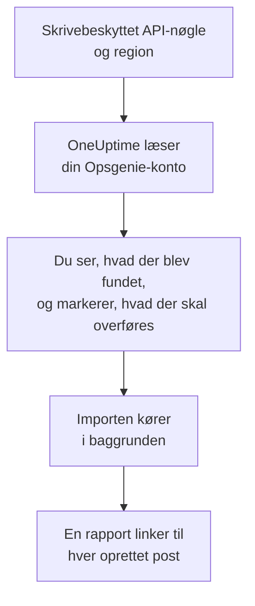

# Skift fra Opsgenie

Atlassian lukker Opsgenie: Opsgenie er ikke blevet solgt siden juni 2025, og supporten slutter i april 2027. OneUptime er et nyt hjem for dit vagtteam, og **Importér fra et andet værktøj** henter det over på få minutter. Med en skrivebeskyttet Opsgenie-API-nøgle læser OneUptime dine brugere, teams, vagtplaner, eskaleringer og tjenester, viser dig, hvad det fandt, og opretter det, du markerer. Intet ændres i Opsgenie.

:::cards
- [Importér din konto](#importér-din-opsgenie-konto): Opret en nøgle, læs din konto, og markér, hvad der skal overføres.
- [Hvad overføres](#hvad-overføres): Hvad hver Opsgenie-post bliver til i OneUptime.
- [Gør skiftet færdigt](#gør-skiftet-færdigt): Hvad du gør, når importen er færdig.
:::

## Sådan fungerer det

- **Nøglen bruges én gang.** Den opbevares krypteret, mens OneUptime læser din konto, og slettes, så snart læsningen slutter, uanset om den lykkedes. Den vises aldrig igen og skrives aldrig i en log.
- **OneUptime læser kun.** Det kalder kun Opsgenies egen API: `api.opsgenie.com`, eller `api.eu.opsgenie.com` for en konto i Europa. Når Opsgenie beder det om at sætte farten ned, venter det og prøver igen.
- **Intet oprettes, før du starter importen.** Forhåndsvisningen viser for hvert element, om det er nyt, allerede findes i OneUptime (og bruges som det er), er overført af en tidligere import, eller hvorfor det ikke kan overføres.
- **At køre den igen opretter aldrig noget to gange.** OneUptime husker, hvad hver import overførte, ud fra Opsgenie-id'et. Kør den igen, når du har tilføjet personer eller vagtplaner i Opsgenie, og kun de nye oprettes.

## Før du begynder

- **Et OneUptime-projekt og retten til at oprette det, du overfører.** Projektejere og projektadministratorer kan overføre alt. Andre roller kan også køre en import og overføre de typer poster, de må oprette. Resten vises som ikke overført, med årsagen.
- **En Opsgenie-API-nøgle med adgangene Read og Configuration access.** Configuration access er det, der lader en nøgle læse brugere, teams, vagtplaner og eskaleringer. Importen skriver aldrig til Opsgenie.
- **Din Opsgenie-region.** Hvis du logger ind på `app.eu.opsgenie.com`, ligger din konto i Europa. Ellers ligger den i USA.

## Importér din Opsgenie-konto

:::steps
### Opret en API-nøgle i Opsgenie
Gå i Opsgenie til **Settings** > **API key management**, og vælg **Add new API key**. Kald den `OneUptime import`, giv den kun **Read** og **Configuration access**, og kopiér nøglen.

### Åbn importsiden
Gå i OneUptime til **Projektindstillinger** > **Importér fra et andet værktøj**, og vælg **Opsgenie**.

### Forbind Opsgenie
Under **Hvor er din Opsgenie-konto?** vælger du **USA** eller **Europa**. Indsæt nøglen i **Opsgenie-API-nøgle**, og vælg **Læs min Opsgenie-konto**. En stor konto tager et par minutter, og du kan forlade siden, mens den læses.

### Markér, hvad der skal overføres
Forhåndsvisningen viser, hvad der blev fundet, med én sektion pr. type. Alt, der ville blive oprettet, er markeret fra start, undtagen vagtplaner, der er slået fra i Opsgenie, og personer, der ikke er på noget team, nogen vagtplan eller eskalering. Under hvert element fortæller OneUptime, hvad der ikke overføres præcis, som det var. Når et markeret element bruger noget, du ikke har markeret, siger det det, og **Markér dem også** markerer det.

### Start importen
Hvis personer bliver inviteret, vælger du under **Invitér nye personer til** det team, de kommer på. Vælg derefter **Start import**. Importen kører i baggrunden: Du kan forlade siden, og rapporten venter på dig der.
:::

Rapporten tæller, hvad der blev oprettet, inviteret og ikke overført, og viser hvert element med et link til den post, det blev til, fejl først. Tidligere importer står under **Tidligere importer** på samme side.

## Hvad overføres

| I Opsgenie | I OneUptime | Hvordan |
| --- | --- | --- |
| Brugere | Projektmedlemmer | Matches på e-mailadresse. Alle, der ikke er i projektet endnu, inviteres til det team, du vælger. Blokerede brugere overføres ikke. |
| Teams | Teams | Oprettes med deres medlemmer. Et team, hvis navn projektet allerede har, bruges som det er, og dets medlemmer røres ikke. |
| Vagtplaner | Vagtplaner | Hver rotation bliver et lag med de samme personer, den samme start, den samme vagtlængde og den samme tidsbegrænsning, i vagtplanens tidszone, ejet af vagtplanens team. |
| Eskaleringer | Vagtpolitikker | Hver regel bliver en eskaleringsregel, der tilkalder den samme vagtplan, bruger eller det samme team. Regler med samme forsinkelse tilkalder sammen, og ventetiden før den næste eskaleringsregel er forskellen mellem forsinkelserne. Eskaleringens gentagelser bliver politikkens gentagelser. |
| Tjenester | Tjenester | Oprettes i tjenestekataloget, ejet af deres team. |

En vagtplan, hvis rotationer sætter to personer på vagt samtidig, bliver én OneUptime-vagtplan pr. rotation, fordi en OneUptime-vagtplan har én person på vagt ad gangen. Hver vagtpolitik, der tilkaldte vagtplanen, tilkalder dem alle.

## Hvad overføres ikke

- **Alarmer, hændelser og deres historik.** OneUptime starter med din opsætning, ikke med dine tidligere alarmer.
- **Integrationer, heartbeats, alarmpolitikker og routingregler.** Ret i stedet dine monitorer og alarmkilder mod OneUptime, som beskrevet i [Gør skiftet færdigt](#gør-skiftet-færdigt).
- **Overstyringer af vagtplaner og rotationer, der allerede er slut.** Tilføj de overstyringer, du stadig har brug for, i OneUptime efter importen.
- **Hver persons notifikationsregler.** Hver person vælger, hvordan de tilkaldes, i deres egne **Brugerindstillinger**, når de har accepteret invitationen.
- **Trin, som OneUptime ikke har et præcist modstykke til.** En regel, der tilkalder den, der har vagt næste gang, eller et teams administratorer, overføres som det nærmeste, OneUptime har, og forhåndsvisningen fortæller, hvad der ændres.

## Grænser

Én import opretter højst 2.000 poster: højst 500 personer, 200 teams, 200 vagtplaner, 200 vagtpolitikker og 500 tjenester. Alt over en grænse vises som ikke overført. Kør importen igen for at overføre resten.

I OneUptime Cloud vises poster, som dit abonnement ikke omfatter, som ikke overført, med det abonnement, de kræver.

En forhåndsvisning gemmes i en dag. Kun den person, der læste kontoen, kan markere elementer og starte importen. Projektejere og projektadministratorer ser forløbet og rapporten for hver import.

## Gør skiftet færdigt

:::steps
### Tjek vagtplanerne
Åbn hver vagtplan under **Vagtordning** > **Vagtplaner**, og tjek, hvem der har vagt nu, og hvem der er den næste.

### Sørg for, at alle kan tilkaldes
Inviterede personer accepterer deres invitation og tilføjer derefter et telefonnummer, en e-mailadresse eller mobilappen, de kan tilkaldes på. **Vagtordning** > **Parathed** viser, hvem der endnu ikke kan nås.

### Send dine alarmer til OneUptime
Ret dine monitorer og de værktøjer, der udløser alarmer, mod OneUptime, og tilkald dig selv én gang for at teste det.

### Slå tilkald fra i Opsgenie
Når OneUptime tilkalder de rigtige personer, så slå notifikationerne fra i Opsgenie, så ingen tilkaldes to gange.
:::

## Fejlfinding

:::details Opsgenie accepterede ikke API-nøglen
Tjek, at du kopierede hele nøglen, at det er en nøgle fra **API key management** og ikke en integrations nøgle, at den har **Read** og **Configuration access**, og at du valgte den region, din konto ligger i. Vælg derefter **Prøv igen**.
:::

:::details En type post mangler i forhåndsvisningen
Nøglen kunne ikke læse den, og forhåndsvisningen siger det øverst. Giv nøglen **Configuration access**, og læs kontoen igen.
:::

:::details Nogle elementer kan ikke markeres
Ved hvert står der hvorfor: en blokeret bruger, et navn, projektet allerede har, noget, en tidligere import har overført, eller en post, du ikke må oprette, eller som dit abonnement ikke omfatter.
:::

## Næste trin

:::cards
- [Vagtplaner](/docs/on-call/schedules): Lag, begrænsninger og overdragelser.
- [Eskaleringsregler](/docs/on-call/escalation-rules): Hvordan vagtpolitikker tilkalder personer.
- [Skift fra incident.io](/docs/moving-to-oneuptime/incident-io): Hent et team over fra incident.io.
:::
