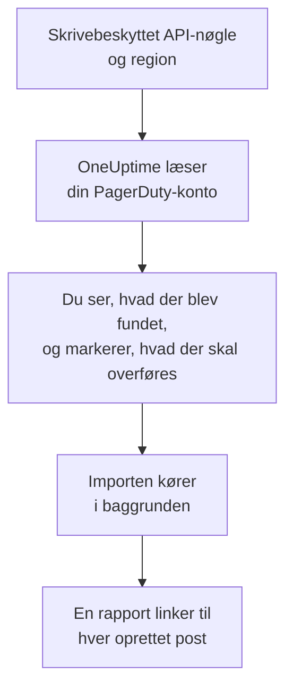

# Skift fra PagerDuty

**Importér fra et andet værktøj** henter din PagerDuty-opsætning over i OneUptime på få minutter. Med en skrivebeskyttet PagerDuty-API-nøgle læser OneUptime dine brugere, teams, vagtplaner, eskaleringspolitikker og tjenester, viser dig, hvad det fandt, og opretter det, du markerer. Intet ændres i PagerDuty.

:::cards
- [Importér din konto](#importér-din-pagerduty-konto): Opret en nøgle, læs din konto, og markér, hvad der skal overføres.
- [Hvad overføres](#hvad-overføres): Hvad hver PagerDuty-post bliver til i OneUptime.
- [Gør skiftet færdigt](#gør-skiftet-færdigt): Hvad du gør, når importen er færdig.
:::

## Sådan fungerer det

- **Nøglen bruges én gang.** Den opbevares krypteret, mens OneUptime læser din konto, og slettes, så snart læsningen slutter, uanset om den lykkedes. Den vises aldrig igen og skrives aldrig i en log.
- **OneUptime læser kun.** Det kalder kun PagerDutys egen REST-API: `api.pagerduty.com`, eller `api.eu.pagerduty.com` for en konto i Europa. Når PagerDuty beder det om at sætte farten ned, venter det og prøver igen.
- **Intet oprettes, før du starter importen.** Forhåndsvisningen viser for hvert element, om det er nyt, allerede findes i OneUptime (og bruges som det er), er overført af en tidligere import, eller hvorfor det ikke kan overføres.
- **At køre den igen opretter aldrig noget to gange.** OneUptime husker, hvad hver import overførte, ud fra PagerDuty-id'et. Kør den igen, når du har tilføjet personer eller vagtplaner i PagerDuty, og kun de nye oprettes.

## Før du begynder

- **Et OneUptime-projekt og retten til at oprette det, du overfører.** Projektejere og projektadministratorer kan overføre alt. Andre roller kan også køre en import og overføre de typer poster, de må oprette. Resten vises som ikke overført, med årsagen.
- **En skrivebeskyttet REST-API-nøgle fra PagerDuty.** Administratorer og kontoejere i PagerDuty kan oprette en. Importen skriver aldrig til PagerDuty, så nøglen behøver kun læseadgang.
- **Din PagerDuty-region.** Hvis du logger ind på en adresse, der ender på `eu.pagerduty.com`, ligger din konto i Europa. Ellers ligger den i USA.

## Importér din PagerDuty-konto

:::steps
### Opret en API-nøgle i PagerDuty
Gå i PagerDuty til **Integrations** > **Developer Tools** > **API Access Keys**, og vælg **Create New API Key**. Beskriv den som `OneUptime import`, markér **Read-only API Key**, vælg **Create Key**, og kopiér nøglen.

### Åbn importsiden
Gå i OneUptime til **Projektindstillinger** > **Importér fra et andet værktøj**, og vælg **PagerDuty**.

### Forbind PagerDuty
Under **Hvor er din PagerDuty-konto?** vælger du **USA** eller **Europa**. Indsæt nøglen i **PagerDuty-API-nøgle**, og vælg **Læs min PagerDuty-konto**. En stor konto tager et par minutter, og du kan forlade siden, mens den læses.

### Markér, hvad der skal overføres
Forhåndsvisningen viser, hvad der blev fundet, med én sektion pr. type. Alt, der ville blive oprettet, er markeret fra start, undtagen tjenester, der er slået fra i PagerDuty, og personer, der ikke er på noget team, nogen vagtplan eller eskaleringspolitik. Under hvert element fortæller OneUptime, hvad der ikke overføres præcis, som det var. Når et markeret element bruger noget, du ikke har markeret, siger det det, og **Markér dem også** markerer det.

### Start importen
Hvis personer bliver inviteret, vælger du under **Invitér nye personer til** det team, de kommer på. Vælg derefter **Start import**. Importen kører i baggrunden: Du kan forlade siden, og rapporten venter på dig der.
:::

Rapporten tæller, hvad der blev oprettet, inviteret og ikke overført, og viser hvert element med et link til den post, det blev til, fejl først. Tidligere importer står under **Tidligere importer** på samme side.

## Hvad overføres

| I PagerDuty | I OneUptime | Hvordan |
| --- | --- | --- |
| Brugere | Projektmedlemmer | Matches på e-mailadresse. Alle, der ikke er i projektet endnu, inviteres til det team, du vælger. |
| Teams | Teams | Oprettes med deres medlemmer. Et team, hvis navn projektet allerede har, bruges som det er, og dets medlemmer røres ikke. |
| Vagtplaner | Vagtplaner | Hvert lag bliver et lag med de samme personer, den samme start, den samme vagtlængde og de samme begrænsninger, i vagtplanens tidszone, ejet af vagtplanens team. Lagene beholder deres rækkefølge, så et højere lag stadig går forud for lagene under det. |
| Eskaleringspolitikker | Vagtpolitikker | Hver eskaleringsregel bliver en eskaleringsregel, der tilkalder de samme vagtplaner og brugere og eskalerer efter den samme forsinkelse. Politikkens gentagelser bliver vagtpolitikkens gentagelser. |
| Tjenester | Tjenester | Oprettes i tjenestekataloget, ejet af deres team. En tjeneste, der er slået fra i PagerDuty, er ikke markeret fra start. |

En PagerDuty-vagtplan forbliver én OneUptime-vagtplan: Dens lag går forud for hinanden, som de gør i PagerDuty. Et lag, hvis vagter ikke varer et helt antal timer, overføres med vagter afrundet til timen, og forhåndsvisningen siger det.

## Hvad overføres ikke

- **Hændelser, alarmer og deres historik.** OneUptime starter med din opsætning, ikke med dine tidligere hændelser.
- **Integrationer, Event Orchestrations, Incident Workflows og statussider.** Ret i stedet dine monitorer og alarmkilder mod OneUptime, som beskrevet i [Gør skiftet færdigt](#gør-skiftet-færdigt).
- **Overstyringer af vagtplaner og lag, der allerede er slut.** Tilføj de overstyringer, du stadig har brug for, i OneUptime efter importen.
- **Vagtbaserede vagtplaner.** Importen læser PagerDutys vagtplaner med lag, ikke de nyere vagtbaserede vagtplaner (shift-based schedules). Hvis din konto har nogen, siger forhåndsvisningen det øverst, og en eskaleringsregel, der tilkalder en af dem, overføres uden den. Opret dem i OneUptime.
- **Hver persons notifikationsregler.** Hver person vælger, hvordan de tilkaldes, i deres egne **Brugerindstillinger**, når de har accepteret invitationen.
- **Regler, som OneUptime ikke har et præcist modstykke til.** En eskaleringsregel, der fordeler sine personer på skift (round robin), tilkalder dem alle på én gang i OneUptime, og forhåndsvisningen fortæller, hvad der ændres.

## Grænser

Én import opretter højst 2.000 poster: højst 500 personer, 200 teams, 200 vagtplaner, 200 vagtpolitikker og 500 tjenester. Alt over en grænse vises som ikke overført. Kør importen igen for at overføre resten.

I OneUptime Cloud vises poster, som dit abonnement ikke omfatter, som ikke overført, med det abonnement, de kræver.

En forhåndsvisning gemmes i en dag. Kun den person, der læste kontoen, kan markere elementer og starte importen. Projektejere og projektadministratorer ser forløbet og rapporten for hver import.

## Gør skiftet færdigt

:::steps
### Tjek vagtplanerne
Åbn hver vagtplan under **Vagtordning** > **Vagtplaner**, og tjek, hvem der har vagt nu, og hvem der er den næste.

### Sørg for, at alle kan tilkaldes
Inviterede personer accepterer deres invitation og tilføjer derefter et telefonnummer, en e-mailadresse eller mobilappen, de kan tilkaldes på. **Vagtordning** > **Parathed** viser, hvem der endnu ikke kan nås.

### Send dine alarmer til OneUptime
Ret dine monitorer og de værktøjer, der udløser alarmer, mod OneUptime, og tilkald dig selv én gang for at teste det.

### Slå tilkald fra i PagerDuty
Når OneUptime tilkalder de rigtige personer, så slå notifikationerne fra i PagerDuty, så ingen tilkaldes to gange.
:::

## Fejlfinding

:::details PagerDuty accepterede ikke API-nøglen
Tjek, at du kopierede hele nøglen, at det er en REST-API-nøgle fra **API Access Keys** og ikke en integrationsnøgle, og at du valgte den region, din konto ligger i. Vælg derefter **Prøv igen**.
:::

:::details En type post mangler i forhåndsvisningen
Nøglen kunne ikke læse den, og forhåndsvisningen siger det øverst. Nogle typer findes kun i PagerDuty-abonnementer, der omfatter dem, for eksempel teams. Læs kontoen igen med en nøgle, der kan læse dem.
:::

:::details Nogle elementer kan ikke markeres
Ved hvert står der hvorfor: et navn, projektet allerede har, noget, en tidligere import har overført, eller en post, du ikke må oprette, eller som dit abonnement ikke omfatter.
:::

## Næste trin

:::cards
- [Vagtplaner](/docs/on-call/schedules): Lag, begrænsninger og overdragelser.
- [Eskaleringsregler](/docs/on-call/escalation-rules): Hvordan vagtpolitikker tilkalder personer.
- [Skift fra Opsgenie](/docs/moving-to-oneuptime/opsgenie): Hent et team over fra Opsgenie.
:::
