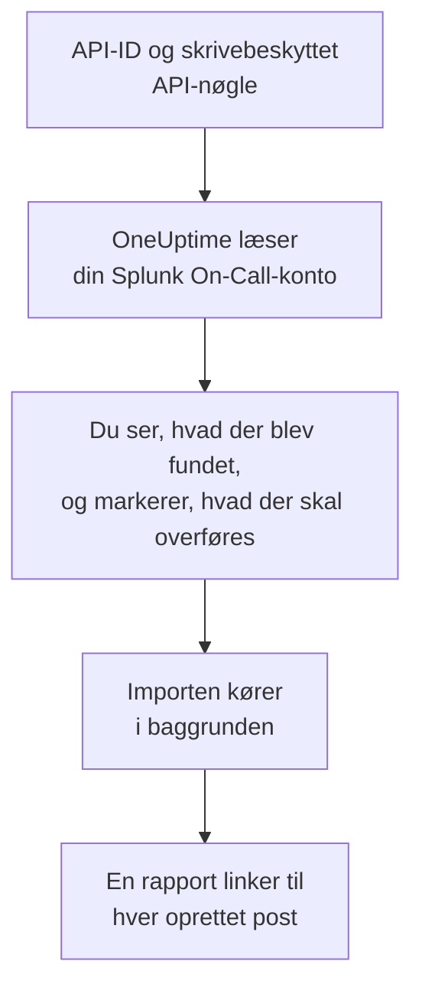

# Skift fra Splunk On-Call

**Importér fra et andet værktøj** henter din Splunk On-Call-opsætning (tidligere VictorOps) over i OneUptime på få minutter. Med dit API-ID og en skrivebeskyttet API-nøgle læser OneUptime dine brugere, teams, rotationer og eskaleringspolitikker, viser dig, hvad det fandt, og opretter det, du markerer. Intet ændres i Splunk On-Call.

:::cards
- [Importér din konto](#importér-din-splunk-on-call-konto): Opret en nøgle, læs din konto, og markér, hvad der skal overføres.
- [Hvad overføres](#hvad-overføres): Hvad hver Splunk On-Call-post bliver til i OneUptime.
- [Gør skiftet færdigt](#gør-skiftet-færdigt): Hvad du gør, når importen er færdig.
:::

## Sådan fungerer det

- **Nøglen bruges én gang.** Den opbevares krypteret sammen med API-ID'et, mens OneUptime læser din konto, og slettes, så snart læsningen slutter, uanset om den lykkedes. Den vises aldrig igen og skrives aldrig i en log.
- **OneUptime læser kun.** Det kalder kun Splunk On-Calls egen API, `api.victorops.com`. Splunk On-Call besvarer hver type forespørgsel højst to gange i sekundet, så OneUptime holder det tempo, og når Splunk On-Call beder det om at sætte farten ned, venter det og prøver igen.
- **Intet oprettes, før du starter importen.** Forhåndsvisningen viser for hvert element, om det er nyt, allerede findes i OneUptime (og bruges som det er), er overført af en tidligere import, eller hvorfor det ikke kan overføres.
- **At køre den igen opretter aldrig noget to gange.** OneUptime husker, hvad hver import overførte, ud fra Splunk On-Call-id'et. Kør den igen, når du har tilføjet personer eller rotationer i Splunk On-Call, og kun de nye oprettes.

## Før du begynder

- **Et OneUptime-projekt og retten til at oprette det, du overfører.** Projektejere og projektadministratorer kan overføre alt. Andre roller kan også køre en import og overføre de typer poster, de må oprette. Resten vises som ikke overført, med årsagen.
- **Dit Splunk On-Call-API-ID og en skrivebeskyttet API-nøgle.** Begge findes under **Integrations** > **API** i Splunk On-Call. Importen skriver aldrig til Splunk On-Call, så en skrivebeskyttet nøgle er nok.

## Importér din Splunk On-Call-konto

:::steps
### Opret en API-nøgle i Splunk On-Call
Gå i Splunk On-Call til **Integrations** > **API**. Dit API-ID vises over dine API-nøgler. Opret en ny API-nøgle med navnet `OneUptime import`, markér **Read-only**, og kopiér API-ID'et og nøglen.

### Åbn importsiden
Gå i OneUptime til **Projektindstillinger** > **Importér fra et andet værktøj**, og vælg **Splunk On-Call**.

### Forbind Splunk On-Call
Indsæt API-ID'et i **Splunk On-Call-API-ID** og nøglen i **Splunk On-Call-API-nøgle**, og vælg **Læs min Splunk On-Call-konto**. En stor konto tager et par minutter, og du kan forlade siden, mens den læses.

### Markér, hvad der skal overføres
Forhåndsvisningen viser, hvad der blev fundet, med én sektion pr. type. Alt, der ville blive oprettet, er markeret fra start, undtagen personer, der ikke er på noget team, nogen rotation eller eskaleringspolitik. Under hvert element fortæller OneUptime, hvad der ikke overføres præcis, som det var. Når et markeret element bruger noget, du ikke har markeret, siger det det, og **Markér dem også** markerer det.

### Start importen
Hvis personer bliver inviteret, vælger du under **Invitér nye personer til** det team, de kommer på. Vælg derefter **Start import**. Importen kører i baggrunden: Du kan forlade siden, og rapporten venter på dig der.
:::

Rapporten tæller, hvad der blev oprettet, inviteret og ikke overført, og viser hvert element med et link til den post, det blev til, fejl først. Tidligere importer står under **Tidligere importer** på samme side.

## Hvad overføres

| I Splunk On-Call | I OneUptime | Hvordan |
| --- | --- | --- |
| Brugere | Projektmedlemmer | Matches på e-mailadresse. Alle, der ikke er i projektet endnu, inviteres til det team, du vælger. |
| Teams | Teams | Oprettes med deres medlemmer. Et team, hvis navn projektet allerede har, bruges som det er, og dets medlemmer røres ikke. |
| Rotationer | Vagtplaner | Hver rotation bliver en vagtplan ejet af dens team, og hver af dens vagter et lag med de samme personer, den samme start, den samme overdragelse og de samme vagtdage og -timer. Den, der har vagt i Splunk On-Call nu, har også vagt i OneUptime. |
| Eskaleringspolitikker | Vagtpolitikker | Ejet af politikkens team. Hvert trin bliver en eskaleringsregel, der tilkalder de samme rotationer og brugere. Et trins timeout bliver ventetiden før det, og trin uden timeout imellem tilkalder sammen. |

Vagter i én rotation, der har vagt samtidig, bliver hver deres egen OneUptime-vagtplan, fordi en OneUptime-vagtplan har én person på vagt ad gangen. Hver vagtpolitik, der tilkaldte rotationen, tilkalder dem alle. Vagtplanen beholder tidszonen fra rotationens første vagt, og en vagt i en anden tidszone får sine timer omregnet til den.

## Hvad overføres ikke

- **Hændelser, alarmer og deres historik.** OneUptime starter med din opsætning, ikke med dine tidligere hændelser.
- **Integrationer, routing keys og alert rules.** Ret i stedet dine monitorer og alarmkilder mod OneUptime, som beskrevet i [Gør skiftet færdigt](#gør-skiftet-færdigt).
- **Planlagte overstyringer.** Tilføj de overstyringer, du stadig har brug for, i OneUptime efter importen.
- **Hver persons tilkaldepolitik.** Hver person vælger, hvordan de tilkaldes, i deres egne **Brugerindstillinger**, når de har accepteret invitationen.
- **Trin, som OneUptime ikke har et præcist modstykke til.** Et trin, der kalder en webhook eller sender videre til en anden eskaleringspolitik, udelades, og det samme gør et trin, der mailer til en adresse, som ingen af de overførte personer har. Et trin, der tilkalder den, der har vagt næste gang eller havde vagt før, tilkalder den, der har vagt nu, og forhåndsvisningen fortæller, hvad der ændres.

## Grænser

Én import opretter højst 2.000 poster: højst 500 personer, 200 teams, 200 vagtplaner og 200 vagtpolitikker. Alt over en grænse vises som ikke overført. Kør importen igen for at overføre resten.

I OneUptime Cloud vises poster, som dit abonnement ikke omfatter, som ikke overført, med det abonnement, de kræver.

En forhåndsvisning gemmes i en dag. Kun den person, der læste kontoen, kan markere elementer og starte importen. Projektejere og projektadministratorer ser forløbet og rapporten for hver import.

## Gør skiftet færdigt

:::steps
### Tjek vagtplanerne
Åbn hver vagtplan under **Vagtordning** > **Vagtplaner**, og tjek, hvem der har vagt nu, og hvem der er den næste.

### Sørg for, at alle kan tilkaldes
Inviterede personer accepterer deres invitation og tilføjer derefter et telefonnummer, en e-mailadresse eller mobilappen, de kan tilkaldes på. **Vagtordning** > **Parathed** viser, hvem der endnu ikke kan nås.

### Send dine alarmer til OneUptime
Ret dine monitorer og de værktøjer, der udløser alarmer, mod OneUptime, og tilkald dig selv én gang for at teste det.

### Slå tilkald fra i Splunk On-Call
Når OneUptime tilkalder de rigtige personer, så slå notifikationerne fra i Splunk On-Call, så ingen tilkaldes to gange.
:::

## Fejlfinding

:::details Splunk On-Call accepterede ikke API-ID'et og API-nøglen
Tjek, at du kopierede API-ID'et og hele nøglen fra **Integrations** > **API**, og at nøglen ikke er slettet der. Vælg derefter **Prøv igen**.
:::

:::details En type post mangler i forhåndsvisningen
Nøglen kunne ikke læse den, og forhåndsvisningen siger det øverst. Tjek nøglen under **Integrations** > **API**, og læs kontoen igen.
:::

:::details Nogle elementer kan ikke markeres
Ved hvert står der hvorfor: et navn, projektet allerede har, noget, en tidligere import har overført, eller en post, du ikke må oprette, eller som dit abonnement ikke omfatter.
:::

## Næste trin

:::cards
- [Vagtplaner](/docs/on-call/schedules): Lag, begrænsninger og overdragelser.
- [Eskaleringsregler](/docs/on-call/escalation-rules): Hvordan vagtpolitikker tilkalder personer.
- [Skift fra PagerDuty](/docs/moving-to-oneuptime/pagerduty): Hent et team over fra PagerDuty.
:::
