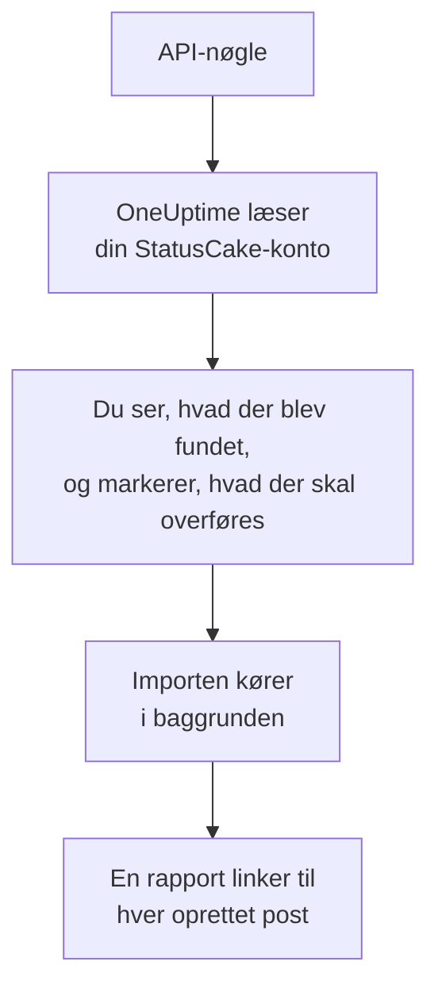

# Skift fra StatusCake

**Importér fra et andet værktøj** henter dine StatusCake-kontroller over i OneUptime på få minutter. Med en StatusCake-API-nøgle læser OneUptime dine oppetids-, SSL- og heartbeat-kontroller, viser dig, hvad det fandt, og opretter det, du markerer. Intet ændres i StatusCake.

:::cards
- [Importér din konto](#importér-din-statuscake-konto): Opret en nøgle, læs din konto, og markér, hvad der skal overføres.
- [Hvad overføres](#hvad-overføres): Hvilken OneUptime-monitor hver StatusCake-kontrol bliver til.
- [Gør skiftet færdigt](#gør-skiftet-færdigt): Hvad du gør, når importen er færdig.
:::

## Sådan fungerer det

- **Nøglen bruges én gang.** Den opbevares krypteret, mens OneUptime læser din konto, og slettes, så snart læsningen slutter, uanset om den lykkedes. Den vises aldrig igen og skrives aldrig i en log.
- **OneUptime læser kun.** Det kalder kun StatusCakes egen API: `api.statuscake.com`. Det sender én anmodning i sekundet, inden for de 60 i minuttet, som StatusCake tillader en Free-konto. Når StatusCake beder det om at sætte farten ned, venter det og prøver igen.
- **Intet oprettes, før du starter importen.** Forhåndsvisningen viser for hvert element, om det er nyt, allerede findes i OneUptime (og bruges som det er), er overført af en tidligere import, eller hvorfor det ikke kan overføres.
- **At køre den igen opretter aldrig noget to gange.** OneUptime husker, hvad hver import overførte, ud fra StatusCake-id'et. Kør den igen, når du har tilføjet kontroller i StatusCake, og kun de nye oprettes.

## Før du begynder

- **Et OneUptime-projekt og retten til at oprette det, du overfører.** Projektejere og projektadministratorer kan overføre alt. Andre roller kan også køre en import og overføre de typer poster, de må oprette. Resten vises som ikke overført, med årsagen.
- **En StatusCake-API-nøgle.** Importen skriver aldrig til StatusCake.
- **En betalingsmetode, i OneUptime Cloud.** Monitorer, der udfører kontroller, faktureres efter forbrug, også på Free-abonnementet, så tilføj en under **Projektindstillinger** > **Fakturering**, før du importerer. Uden en vises de monitorer som ikke overført.

## Importér din StatusCake-konto

:::steps
### Opret en API-nøgle i StatusCake
Åbn dit kontopanel i StatusCake, og gå til **API Keys**. Opret en nøgle med navnet `OneUptime import`, og kopiér den.

### Åbn importsiden
Gå i OneUptime til **Projektindstillinger** > **Importér fra et andet værktøj**, og vælg **StatusCake**.

### Forbind StatusCake
Indsæt nøglen i **StatusCake-API-nøgle**, og vælg **Læs min StatusCake-konto**. En stor konto tager et par minutter, og du kan forlade siden, mens den læses.

### Markér, hvad der skal overføres
Forhåndsvisningen viser, hvad der blev fundet, med én sektion pr. type. Alt, der ville blive oprettet, er markeret fra start, undtagen kontroller, der er sat på pause i StatusCake. De overføres på pause, hvis du markerer dem. Under hvert element fortæller OneUptime, hvad der ikke overføres præcis, som det var.

### Start importen
Vælg **Start import**. Importen kører i baggrunden: Du kan forlade siden, og rapporten venter på dig der.
:::

Rapporten tæller, hvad der blev oprettet og ikke overført, og viser hvert element med et link til den post, det blev til, fejl først. Tidligere importer står under **Tidligere importer** på samme side.

## Hvad overføres

| I StatusCake | I OneUptime | Hvordan |
| --- | --- | --- |
| Uptime, SSL and heartbeat checks | Monitorer | Hver kontrol bliver en monitor af samme type, med samme adresse, interval, timeout og den tekst, en side skal eller ikke må indeholde. |

- **HTTP- og HEAD-kontroller** bliver webstedsmonitorer, eller API-monitorer, når de sender data eller headers. StatusCake angiver de statuskoder, der udløser en alarm: Enhver anden kode tæller også som oppe i OneUptime.
- **Ping- og TCP-kontroller** bliver ping- og portmonitorer. **SMTP- og SSH-kontroller** bliver portmonitorer på deres port: OneUptime kontrollerer, at porten svarer, ikke samtalen på den.
- **DNS-kontroller** bliver DNS-monitorer, der spørger den samme server.
- **SSL-kontroller** bliver SSL-certifikatmonitorer, der advarer lige så tidligt som den første alarm. En oppetidskontrol med SSL-alarmer får også en.
- **Heartbeat-kontroller** bliver monitorer for indgående anmodninger, som går ned, når der ikke er kommet en anmodning i perioden. Hver får en ny adresse i OneUptime.

Hver monitor kontrolleres fra dit projekts sonder, ligesom en, du selv opretter. Et interval, som OneUptime ikke tilbyder, bliver det nærmeste, det tilbyder, og en timeout på over et minut bliver ét minut. Forhåndsvisningen siger, når et af dem ændres.

## Hvad overføres ikke

- **Oppetidshistorik, svartider og hændelser.** OneUptime begynder at kontrollere, når importen er færdig.
- **Alarmkontakter og integrationer.** Vælg i OneUptime, hvem der får besked, som beskrevet i [Gør skiftet færdigt](#gør-skiftet-færdigt).
- **Adgangskoder og headers, der kan indeholde en hemmelighed.** En monitor, der logger ind eller sender en `Authorization`-, cookie- eller token-header, overføres uden den: Tilføj den med en [monitorhemmelighed](/docs/monitor/monitor-secrets).
- **De adresser, en DNS-kontrol forventer.** Tilføj dem som kriterier i OneUptime.
- **Sidehastigheds-, domæne- og serverkontroller.** OneUptime har sin egen [domænemonitor](/docs/monitor/domain-monitor) og serverovervågning, som du sætter op i stedet.
- **Vedligeholdelsesvinduer.** Forhåndsvisningen tæller dem: Planlæg dem som planlagt vedligeholdelse i OneUptime.

## Grænser

Én import opretter højst 2.000 poster og højst 1.000 monitorer. Alt over en grænse vises som ikke overført. Kør importen igen for at overføre resten.

I OneUptime Cloud kræver monitorer, der udfører kontroller, en betalingsmetode, og det, dit abonnement ikke har plads til, vises som ikke overført, med det, det kræver.

En forhåndsvisning gemmes i en dag. Kun den person, der læste kontoen, kan markere elementer og starte importen. Projektejere og projektadministratorer ser forløbet og rapporten for hver import.

## Gør skiftet færdigt

:::steps
### Tjek dine monitorer
Åbn hver enkelt under **Monitorer**, og tjek de første resultater. En heartbeat-monitor har en ny adresse: Peg det job, der kalder den, derhen.

### Vælg, hvem der får besked
Tilføj ejere til dine monitorer eller en vagtpolitik under **Vagtordning** > **Vagtpolitikker** til de hændelser, de åbner, så de rigtige personer får besked, når noget går ned.

### Slå kontrollerne fra i StatusCake
Når OneUptime kontrollerer de samme ting, så sæt dem på pause i StatusCake, så ingen får besked to gange.
:::

## Fejlfinding

:::details StatusCake accepterede ikke API-nøglen
Tjek, at du kopierede hele nøglen fra **API Keys**, og at den ikke er slettet. Vælg derefter **Prøv igen**.
:::

:::details En monitor vises som ikke overført
Der står hvorfor: en type monitor, som OneUptime ikke har, en adresse, som OneUptime ikke kan læse, eller et projekt uden plads eller betalingsmetode til den. En monitor, som OneUptime allerede kører med samme navn, type og adresse, bruges, som den er.
:::

:::details Nogle elementer kan ikke markeres
Ved hvert står der hvorfor: et navn, projektet allerede har, noget, en tidligere import har overført, eller en post, du ikke må oprette, eller som dit abonnement ikke omfatter.
:::

## Næste trin

:::cards
- [Websted-monitor](/docs/monitor/website-monitor): Hvad en webstedsmonitor kontrollerer, og hvordan.
- [SSL-certifikat-monitor](/docs/monitor/ssl-certificate-monitor): Hvordan OneUptime advarer, før et certifikat udløber.
- [Skift fra Uptime Kuma](/docs/moving-to-oneuptime/uptime-kuma): Hent dine kontroller over fra Uptime Kuma.
:::
