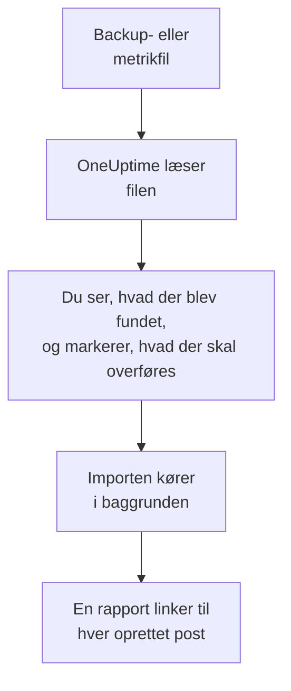

# Skift fra Uptime Kuma

Uptime Kuma kører på dine egne maskiner, så **Importér fra et andet værktøj** læser det fra en fil i stedet for med en nøgle: den backup, Uptime Kuma 1 eksporterer, eller den metrikside, alle versioner stiller til rådighed. OneUptime læser dine monitorer fra den, viser dig, hvad det fandt, og opretter det, du markerer. Intet ændres i Uptime Kuma.

:::cards
- [Importér dine monitorer](#importér-dine-uptime-kuma-monitorer): Gem filen, læs den, og markér, hvad der skal overføres.
- [Hvad overføres](#hvad-overføres): Hvad hver Uptime Kuma-monitor bliver til i OneUptime.
- [Gør skiftet færdigt](#gør-skiftet-færdigt): Hvad du gør, når importen er færdig.
:::

## Sådan fungerer det

- **Filen læses én gang.** OneUptime læser den, mens den uploades, for at finde dine monitorer, og gemmer den aldrig. Adgangskoder, tokens og push-nøgler i den kopieres aldrig.
- **OneUptime forbinder sig aldrig til Uptime Kuma.** Alt kommer fra filen. En fil, der hverken er en backup eller en metrikside fra Uptime Kuma, afvises med årsagen.
- **Intet oprettes, før du starter importen.** Forhåndsvisningen viser for hvert element, om det er nyt, allerede findes i OneUptime (og bruges som det er), er overført af en tidligere import, eller hvorfor det ikke kan overføres.
- **At køre den igen opretter aldrig noget to gange.** OneUptime husker, hvad hver import overførte, ud fra Uptime Kuma-id'et. Læs en nyere fil, når du har tilføjet monitorer, og kun de nye oprettes.

## Før du begynder

- **Et OneUptime-projekt og retten til at oprette det, du overfører.** Projektejere og projektadministratorer kan overføre alt. Andre roller kan også køre en import og overføre de typer poster, de må oprette. Resten vises som ikke overført, med årsagen.
- **En fil fra Uptime Kuma.** I Uptime Kuma 1 indeholder JSON-backuppen hver monitor med dens indstillinger. Uptime Kuma 2 har ingen backup, så gem i stedet dens metrikside: Den angiver hver monitors navn, type og adresse, men ikke hvor ofte den kontrolleres, eller hvad den leder efter.
- **En betalingsmetode, i OneUptime Cloud.** Monitorer, der udfører kontroller, faktureres efter forbrug, også på Free-abonnementet, så tilføj en under **Projektindstillinger** > **Fakturering**, før du importerer. Uden en vises de monitorer som ikke overført.

## Importér dine Uptime Kuma-monitorer

:::steps
### Gem filen i Uptime Kuma
Gå i Uptime Kuma 1 til **Settings** > **Backup**, og vælg **Export**. Tilføj i Uptime Kuma 2 en nøgle under **Settings** > **API Keys**, åbn `/metrics` på din Uptime Kuma, log ind uden brugernavn med nøglen som adgangskode, og gem siden som en tekstfil.

### Åbn importsiden
Gå i OneUptime til **Projektindstillinger** > **Importér fra et andet værktøj**, og vælg **Uptime Kuma**.

### Læs filen
Vælg **Vælg fil** under **Backup- eller metrikfil fra Uptime Kuma**, vælg den gemte fil, og vælg **Læs filen**. OneUptime læser den med det samme og viser, hvad det fandt.

### Markér, hvad der skal overføres
Forhåndsvisningen viser, hvad der blev fundet, med én sektion pr. type. Alt, der ville blive oprettet, er markeret fra start, undtagen monitorer, der er sat på pause i Uptime Kuma. De overføres på pause, hvis du markerer dem. Under hvert element fortæller OneUptime, hvad der ikke overføres præcis, som det var.

### Start importen
Vælg **Start import**. Importen kører i baggrunden: Du kan forlade siden, og rapporten venter på dig der.
:::

Rapporten tæller, hvad der blev oprettet og ikke overført, og viser hvert element med et link til den post, det blev til, fejl først. Tidligere importer står under **Tidligere importer** på samme side.

## Hvad overføres

| I Uptime Kuma | I OneUptime | Hvordan |
| --- | --- | --- |
| Monitors | Monitorer | Fra en backup bliver hver monitor en monitor af samme type, med samme adresse, interval, timeout og de samme statuskoder, der tæller som oppe. Fra metriksiden overføres hver enkelt med en kontrol hvert femte minut: Tjek dem hver især efter importen. |

- **HTTP(S)- og nøgleordsmonitorer** bliver webstedsmonitorer, eller API-monitorer, når de sender en anden metode, headers eller en JSON-body, med nøgleordet, hvor det skal være.
- **JSON-forespørgselsmonitorer** bliver API-monitorer, uden forespørgslen: Tilføj den som kriterium i OneUptime.
- **Ping-, port- og DNS-monitorer** bliver ping-, port- og DNS-monitorer.
- **Push-monitorer** bliver monitorer for indgående anmodninger, som går ned, når der ikke er kommet en anmodning i intervallet og dets genforsøg. Hver får en ny adresse i OneUptime.
- **Manuelle monitorer** forbliver manuelle monitorer. **Grupper** er mapper, så deres monitorer overføres hver for sig.
- **Certifikatudløb.** En monitor, der advarer, før dens certifikat udløber, får også en SSL-certifikatmonitor, opkaldt efter den.

Hver monitor kontrolleres fra dit projekts sonder, ligesom en, du selv opretter. Et interval, som OneUptime ikke tilbyder, bliver det nærmeste, det tilbyder, og en timeout på over et minut bliver ét minut. Forhåndsvisningen siger, når et af dem ændres.

## Hvad overføres ikke

- **Oppetidshistorik, svartider og hændelser.** OneUptime begynder at kontrollere, når importen er færdig.
- **Notifikationer.** Vælg i OneUptime, hvem der får besked, som beskrevet i [Gør skiftet færdigt](#gør-skiftet-færdigt).
- **Adgangskoder og headers, der kan indeholde en hemmelighed.** En monitor, der logger ind eller sender en `Authorization`-, cookie- eller token-header, overføres uden den: Tilføj den med en [monitorhemmelighed](/docs/monitor/monitor-secrets).
- **Omvendte monitorer**, der tæller som oppe, når deres kontrol fejler. OneUptime har ingen monitor, der gør det.
- **Docker-, database-, spilserver-, MQTT- og andre monitorer, som OneUptime ikke har noget modstykke til.** Forhåndsvisningen nævner hver enkelt.
- **Statussider og vedligeholdelse.** Opret de statussider, du har brug for, i OneUptime, og vis de importerede monitorer på dem.

## Grænser

Én import opretter højst 2.000 poster og højst 1.000 monitorer. En fil må højst være 10 MB. Alt over en grænse vises som ikke overført. Kør importen igen for at overføre resten.

I OneUptime Cloud kræver monitorer, der udfører kontroller, en betalingsmetode, og det, dit abonnement ikke har plads til, vises som ikke overført, med det, det kræver.

En forhåndsvisning gemmes i en dag. Kun den person, der læste filen, kan markere elementer og starte importen. Projektejere og projektadministratorer ser forløbet og rapporten for hver import.

## Gør skiftet færdigt

:::steps
### Tjek dine monitorer
Åbn hver enkelt under **Monitorer**, og tjek de første resultater. En heartbeat-monitor har en ny adresse: Peg det job, der kalder den, derhen.

### Vælg, hvem der får besked
Tilføj ejere til dine monitorer eller en vagtpolitik under **Vagtordning** > **Vagtpolitikker** til de hændelser, de åbner, så de rigtige personer får besked, når noget går ned.

### Slå kontrollerne fra i Uptime Kuma
Når OneUptime kontrollerer de samme ting, så sæt dem på pause i Uptime Kuma, så ingen får besked to gange.
:::

## Fejlfinding

:::details Filen blev afvist
OneUptime siger hvorfor: en fil over 10 MB, en fil, der ikke er gyldig JSON, eller en fil, der hverken er en backup eller metriksiden fra Uptime Kuma. Eksportér backuppen igen, eller gem `/metrics` igen som ren tekst, og vælg filen igen.
:::

:::details En monitor vises som ikke overført
Der står hvorfor: en type monitor, som OneUptime ikke har, en adresse, som OneUptime ikke kan læse, eller et projekt uden plads eller betalingsmetode til den. En monitor, som OneUptime allerede kører med samme navn, type og adresse, bruges, som den er.
:::

:::details Nogle elementer kan ikke markeres
Ved hvert står der hvorfor: et navn, projektet allerede har, noget, en tidligere import har overført, eller en post, du ikke må oprette, eller som dit abonnement ikke omfatter.
:::

## Næste trin

:::cards
- [Websted-monitor](/docs/monitor/website-monitor): Hvad en webstedsmonitor kontrollerer, og hvordan.
- [Indgående anmodning-monitor](/docs/monitor/incoming-request-monitor): Hvordan en heartbeat fungerer i OneUptime.
- [Skift fra UptimeRobot](/docs/moving-to-oneuptime/uptimerobot): Hent dine kontroller over fra UptimeRobot.
:::
