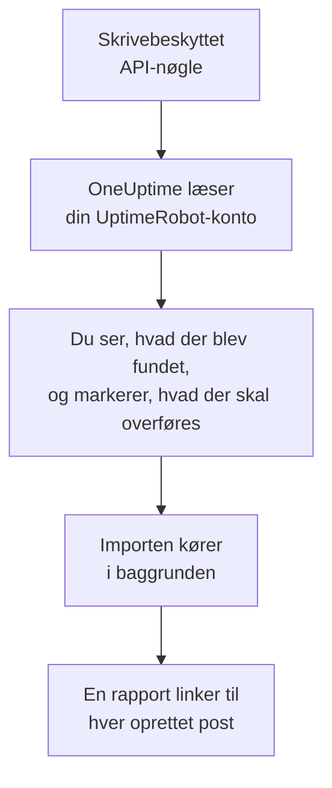

# Skift fra UptimeRobot

**Importér fra et andet værktøj** henter dine UptimeRobot-monitorer og -statussider over i OneUptime på få minutter. Med en skrivebeskyttet UptimeRobot-API-nøgle læser OneUptime dine monitorer og offentlige statussider, viser dig, hvad det fandt, og opretter det, du markerer. Intet ændres i UptimeRobot.

:::cards
- [Importér din konto](#importér-din-uptimerobot-konto): Opret en nøgle, læs din konto, og markér, hvad der skal overføres.
- [Hvad overføres](#hvad-overføres): Hvad hver UptimeRobot-monitor og -statusside bliver til i OneUptime.
- [Gør skiftet færdigt](#gør-skiftet-færdigt): Hvad du gør, når importen er færdig.
:::

## Sådan fungerer det

- **Nøglen bruges én gang.** Den opbevares krypteret, mens OneUptime læser din konto, og slettes, så snart læsningen slutter, uanset om den lykkedes. Den vises aldrig igen og skrives aldrig i en log.
- **OneUptime læser kun.** Det kalder kun UptimeRobots egen API: `api.uptimerobot.com`. Det sender én anmodning hvert sjette sekund, inden for de ti i minuttet, som UptimeRobot tillader en Free-konto, så en stor konto tager et par minutter. Når UptimeRobot beder det om at sætte farten ned, venter det og prøver igen.
- **Intet oprettes, før du starter importen.** Forhåndsvisningen viser for hvert element, om det er nyt, allerede findes i OneUptime (og bruges som det er), er overført af en tidligere import, eller hvorfor det ikke kan overføres.
- **At køre den igen opretter aldrig noget to gange.** OneUptime husker, hvad hver import overførte, ud fra UptimeRobot-id'et. Kør den igen, når du har tilføjet monitorer i UptimeRobot, og kun de nye oprettes.

## Før du begynder

- **Et OneUptime-projekt og retten til at oprette det, du overfører.** Projektejere og projektadministratorer kan overføre alt. Andre roller kan også køre en import og overføre de typer poster, de må oprette. Resten vises som ikke overført, med årsagen.
- **En UptimeRobot-API-nøgle.** Read-only API key er nok: Importen skriver aldrig til UptimeRobot. Main API key virker også, men en nøgle til én monitor læser kun den monitor.
- **En betalingsmetode, i OneUptime Cloud.** Monitorer, der udfører kontroller, faktureres efter forbrug, også på Free-abonnementet, så tilføj en under **Projektindstillinger** > **Fakturering**, før du importerer. Uden en vises de monitorer som ikke overført.

## Importér din UptimeRobot-konto

:::steps
### Opret en API-nøgle i UptimeRobot
Gå i UptimeRobot til **Integrations & API** > **API**. Opret en **Read-only API key**, eller kopiér den, du har.

### Åbn importsiden
Gå i OneUptime til **Projektindstillinger** > **Importér fra et andet værktøj**, og vælg **UptimeRobot**.

### Forbind UptimeRobot
Indsæt nøglen i **UptimeRobot-API-nøgle**, og vælg **Læs min UptimeRobot-konto**. En stor konto tager et par minutter, og du kan forlade siden, mens den læses.

### Markér, hvad der skal overføres
Forhåndsvisningen viser, hvad der blev fundet, med én sektion pr. type. Alt, der ville blive oprettet, er markeret fra start, undtagen monitorer, der er sat på pause i UptimeRobot. De overføres på pause, hvis du markerer dem. Under hvert element fortæller OneUptime, hvad der ikke overføres præcis, som det var. Når en markeret statusside viser en monitor, du ikke har markeret, siger det det, og **Markér dem også** markerer den.

### Start importen
Vælg **Start import**. Importen kører i baggrunden: Du kan forlade siden, og rapporten venter på dig der.
:::

Rapporten tæller, hvad der blev oprettet og ikke overført, og viser hvert element med et link til den post, det blev til, fejl først. Tidligere importer står under **Tidligere importer** på samme side.

## Hvad overføres

| I UptimeRobot | I OneUptime | Hvordan |
| --- | --- | --- |
| Monitors | Monitorer | Hver monitor bliver en monitor af samme type, med samme adresse, interval og timeout og de samme statuskoder, der tæller som oppe. |
| Public status pages | Statussider | Hver side viser de samme monitorer: dem, den nævner, dem med dens tags eller dem alle, med oppetid og historikbjælker, som den viste dem. En side med adgangskode overføres som privat. |

- **HTTP(S)- og nøgleordsmonitorer** bliver webstedsmonitorer, eller API-monitorer, når de sender en anden metode, headers eller en JSON-body. En nøgleordsmonitor går ned, når dens nøgleord dukker op eller mangler, som i UptimeRobot, og matcher det præcist, inklusive store bogstaver.
- **Ping- og portmonitorer** bliver ping- og portmonitorer.
- **Heartbeat-monitorer** bliver monitorer for indgående anmodninger, som går ned, når der ikke er kommet en anmodning i intervallet og henstandsperioden. Hver får en ny adresse i OneUptime.
- **DNS- og API-monitorer** bliver DNS- og API-monitorer.
- **SSL-udløbspåmindelser.** En monitor, der advarer, før dens certifikat udløber, får også en SSL-certifikatmonitor, opkaldt efter den, der advarer lige så mange dage før.

Hver monitor kontrolleres fra dit projekts sonder, ligesom en, du selv opretter. Et interval, som OneUptime ikke tilbyder, bliver det nærmeste, det tilbyder, og en timeout på over et minut bliver ét minut. Forhåndsvisningen siger, når et af dem ændres.

## Hvad overføres ikke

- **Oppetidshistorik, svartider og hændelser.** OneUptime begynder at kontrollere, når importen er færdig.
- **Alarmkontakter og integrationer.** Vælg i OneUptime, hvem der får besked, som beskrevet i [Gør skiftet færdigt](#gør-skiftet-færdigt).
- **Adgangskoder og headers, der kan indeholde en hemmelighed.** En monitor, der logger ind eller sender en `Authorization`-, cookie- eller token-header, overføres uden den: Tilføj den med en [monitorhemmelighed](/docs/monitor/monitor-secrets).
- **UDP-, visual comparison- og dependency-monitorer.** OneUptime har ingen monitor, der gør det samme, og forhåndsvisningen nævner hver enkelt.
- **Portmonitorer, der alarmerer, mens porten er åben.** De virker omvendt af OneUptimes portmonitorer.
- **De svar, en DNS-monitor forventer, og en API-monitors assertions.** Tilføj dem som kriterier i OneUptime.
- **Vedligeholdelsesvinduer.** Forhåndsvisningen tæller dem: Planlæg dem som planlagt vedligeholdelse i OneUptime.
- **En statussides eget domæne og branding.** Tilføj i OneUptime domænet under **Brugerdefinerede domæner** og logoet under **Branding**.

## Grænser

Én import opretter højst 2.000 poster: højst 1.000 monitorer og 50 statussider. Alt over en grænse vises som ikke overført. Kør importen igen for at overføre resten.

I OneUptime Cloud kræver monitorer, der udfører kontroller, en betalingsmetode, og det, dit abonnement ikke har plads til, vises som ikke overført, med det, det kræver.

En forhåndsvisning gemmes i en dag. Kun den person, der læste kontoen, kan markere elementer og starte importen. Projektejere og projektadministratorer ser forløbet og rapporten for hver import.

## Gør skiftet færdigt

:::steps
### Tjek dine monitorer
Åbn hver enkelt under **Monitorer**, og tjek de første resultater. En heartbeat-monitor har en ny adresse: Peg det job, der kalder den, derhen.

### Vælg, hvem der får besked
Tilføj ejere til dine monitorer eller en vagtpolitik under **Vagtordning** > **Vagtpolitikker** til de hændelser, de åbner, så de rigtige personer får besked, når noget går ned.

### Peg din statussides adresse på OneUptime
Åbn siden under **Statussider**, tilføj dit domæne under **Brugerdefinerede domæner**, og ret derefter dets DNS-post. Så når dine besøgende og abonnenter den nye side.

### Slå kontrollerne fra i UptimeRobot
Når OneUptime kontrollerer de samme ting, så sæt dem på pause i UptimeRobot, så ingen får besked to gange.
:::

## Fejlfinding

:::details UptimeRobot accepterede ikke API-nøglen
Tjek, at du kopierede hele nøglen, og at det er kontoens Read-only eller Main API key fra **Integrations & API**, ikke en nøgle til én monitor. Vælg derefter **Prøv igen**.
:::

:::details En monitor vises som ikke overført
Der står hvorfor: en type monitor, som OneUptime ikke har, en adresse, som OneUptime ikke kan læse, eller et projekt uden plads eller betalingsmetode til den. En monitor, som OneUptime allerede kører med samme navn, type og adresse, bruges, som den er.
:::

:::details Nogle elementer kan ikke markeres
Ved hvert står der hvorfor: et navn, projektet allerede har, noget, en tidligere import har overført, eller en post, du ikke må oprette, eller som dit abonnement ikke omfatter.
:::

## Næste trin

:::cards
- [Websted-monitor](/docs/monitor/website-monitor): Hvad en webstedsmonitor kontrollerer, og hvordan.
- [Indgående anmodning-monitor](/docs/monitor/incoming-request-monitor): Hvordan en heartbeat fungerer i OneUptime.
- [Skift fra Pingdom](/docs/moving-to-oneuptime/pingdom): Hent dine kontroller over fra Pingdom.
:::
