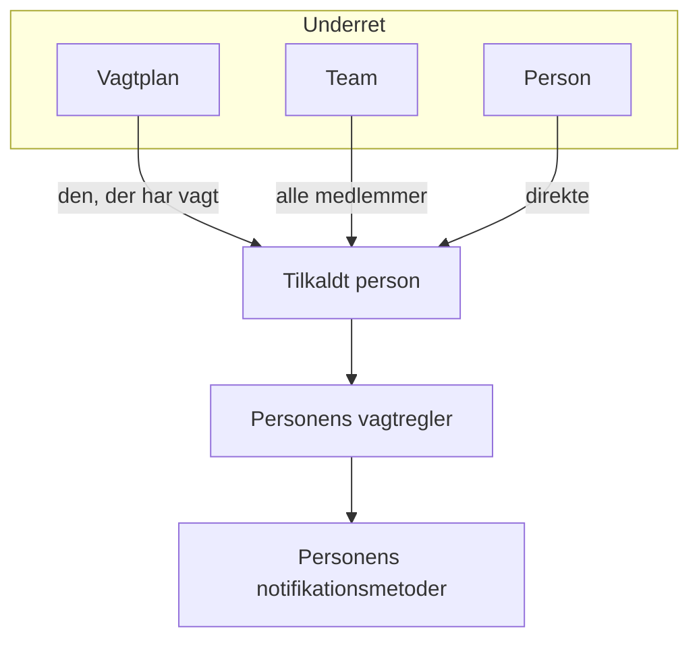

# Eskaleringsregler

En vagtpolitik tilkalder folk i niveauer. Hver eskaleringsregel er ét niveau: hvem der tilkaldes, og hvor længe der ventes på, at nogen kvitterer, før næste niveau tilkaldes. En politiks regler står i rækkefølge på dens side **Eskaleringsregler**.

```mermaid title="En vagtpolitik tilkalder niveau for niveau, indtil nogen kvitterer"
flowchart TB
    trigger["Hændelse eller advarsel"] --> level1["Level 1 tilkalder"]
    level1 --> ack1{"Kvitteret<br/>i tide?"}
    ack1 -->|"Ja"| stop["Tilkaldet stopper"]
    ack1 -->|"Nej"| level2["Level 2 tilkalder"]
    level2 --> ack2{"Kvitteret<br/>i tide?"}
    ack2 -->|"Ja"| stop
    ack2 -->|"Nej, sidste niveau"| repeat{"Gentage politikken?"}
    repeat -->|"Ja"| level1
    repeat -->|"Nej"| done["Politikken stopper"]
```

:::cards
- [Hvem der tilkaldes først](#hvem-der-tilkaldes-først): Opret en politik med dens første niveau.
- [Tilføj en eskaleringsregel](#tilføj-en-eskaleringsregel): Tilføj næste niveau, trin for trin.
- [Sådan tilkalder niveauerne folk](#sådan-tilkalder-niveauerne-folk): Timing, gentagelser og hvordan hver person nås.
- [API og Terraform](#opret-regler-med-apiet-eller-terraform): Opret politikker og regler som kode.
:::

## Hvem der tilkaldes først

Når du opretter en vagtpolitik på siden **Vagtpolitikker**, beder formularen om dens **Navn** og **Hvem tilkaldes først?**. Spørgsmålet bruger samme vælger som **Underret**: vagtplaner, teams og personer, så mange du har brug for. Dem, du vælger, bliver politikkens første eskaleringsregel, **Level 1**, som venter **30 minutter** på en kvittering, før næste niveau tilkaldes.

:::steps
1. Gå til **Vagtordning** > **Vagtpolitikker**, og klik på **Opret Vagtpolitik**.
2. Indtast et **Navn**.
3. Klik under **Hvem tilkaldes først?** på **Tilføj modtager**, og vælg de vagtplaner, teams og personer, der skal tilkaldes først.
4. Klik på **Opret Vagtpolitik**. Den nye politik åbner derefter på sin side **Eskaleringsregler**, hvor du kan tilføje flere niveauer.
:::

**Hvem tilkaldes først?** er valgfrit. Lader du det stå tomt, starter politikken uden eskaleringsregler: den tilkalder ingen, før du tilføjer en, og dens oversigt siger det. Beskrivelsen og etiketterne ligger under **Flere felter**. Spørgsmålet stilles kun til dem, der må tilføje eskaleringsregler.

## Tilføj en eskaleringsregel

:::steps
### Åbn politikkens eskaleringsregler

Åbn vagtpolitikken, vælg **Eskaleringsregler** i dens sidemenu, og klik på **Tilføj eskaleringsregel**. Dialogen er én kort side.

### Vælg, hvem der skal underrettes

Klik under **Underret** på **Tilføj modtager**, søg, og vælg så mange vagtplaner, teams og personer, som dette niveau skal tilkalde. Tilføj mindst én.

| Modtager | Hvem der tilkaldes, når niveauet kører |
| --- | --- |
| En **vagtplan** | Den, der har vagt i den, når niveauet kører, ikke en fast person. |
| Et **team** | Alle teamets medlemmer. |
| En **person** | Den person, direkte. |

### Angiv, hvor længe der ventes

**Eskalér efter (i minutter)** er, hvor længe der ventes på en kvittering, før næste niveau tilkaldes. Den starter på **30 minutter**; ret den til det, der passer til niveauet.

### Giv reglen et navn, hvis du vil

Alt andet ligger under **Flere felter**, foldet sammen, indtil du åbner det:

- **Navn**: valgfrit. En regel, du ikke navngiver, opkaldes efter sit niveau: en politiks første regel er **Level 1**, den anden **Level 2** og så videre. Navnefeltet viser det navn, reglen får.
- **Beskrivelse**: valgfrie noter, fx hvem dette niveau tilkalder og hvorfor.

Sammenfoldet nævner overskriften på **Flere felter** de to og viser dem, reglen har: en beskrivelse eller et navn, du selv har valgt.

### Opret reglen

Klik på **Create Rule**. Reglen tilføjes under de andre, som politikkens næste niveau.
:::

## Sådan tilkalder niveauerne folk

Når en hændelse eller advarsel når politikken, tilkalder **Level 1** straks sine modtagere. Kvitterer ingen inden for ventetiden, tilkaldes **Level 2**, og så videre ned gennem listen. Når det sidste niveaus ventetid er gået uden kvittering, starter politikken forfra fra **Level 1**, hvis dens **Gentagelsespolitik** (under reglerne) siger, at der skal gentages, så mange gange som den tillader, og ellers stopper den. Kvitterer man for eller løser hændelsen eller advarslen, stopper tilkaldet på ethvert niveau.

En hændelse, en advarsel eller en episode, der oprettes allerede bekræftet eller løst — registreret bagefter — udfører ingen af sine politikker: ingen tilkaldes, og dens feed siger det og nævner dem ved navn. Se [Erklæret allerede bekræftet eller løst](/docs/incidents/declaring-incidents#erklæret-allerede-bekræftet-eller-løst).

For at gentage en politik skal du klikke på **Rediger** på kortet **Gentagelsespolitik**, slå **Repeat if no one acknowledges** til og angive **Number of times to repeat**.

### Eskaleringsoversigten

Oversigten øverst på siden **Eskaleringsregler** viser hele stigen: hvornår hvert niveau tilkaldes, hvem det tilkalder, og hvad der sker efter det sidste. Et niveau, hvis modtagere ikke alle kan tilkaldes, siger det på sit kort; klik på etiketten for at se hvem og hvorfor.

### Sådan nås hver person

Hver person, et niveau tilkalder, nås sådan, som personens egne vagtregler siger: **Brugerindstillinger** > **Vagtregler**, med en fane for hændelser, hændelsesepisoder, advarsler og advarselsepisoder og et kort pr. alvorlighed, der viser, hvilken notifikationsmetode der prøves og efter hvor lang tid. En projektadministrator kan se og ændre et medlems regler under **Brugere** > medlemmet > **Vagtregler**.



En brugeroverride, der gælder for en person, sender personens tilkald til den, der dækker for vedkommende, i stedet.

Hver besked er en, som udbyderen tager imod, så et tilkald går altid ud. Så meget bærer hver kanal:

| Kanal | Den længste besked, den bærer |
| --- | --- |
| SMS | 1.600 tegn |
| Telefonopkald | Det, der kan være i Twilios opkaldsscript på 4.000 tegn |
| Pushnotifikation | 4 KB, hvoraf titel, tekst og data fylder højst 3 KB |
| WhatsApp | 1.024 tegn |
| Telegram | 4.096 tegn |

En længere besked, med en lang titel eller en lang beskrivelse, som en skabelon har sat ind, bliver afkortet og slutter med en bemærkning om, at den fulde tekst står i OneUptime: "… (truncated — see OneUptime for the full text)". Ordlyden i en WhatsApp-besked er en fast skabelon, så dér afkortes de længste værdier i stedet, hver med "…" til sidst. Links i en besked afkortes aldrig.

### Når et tilkald ikke sendes

Et tilkald, der ikke sendes, siger hvorfor i personens **Vagtlogs** (Brugerindstillinger): rækken viser **Fejl**, og statusbeskeden giver årsagen. Det bliver ikke længere stående på **Sending**. Beskeden siger én af disse ting:

- projektets saldo kunne ikke betale for det, og hvem der kan tilføje saldo;
- kanalen er slået fra i projektet, og hvem der kan slå den til.

Projektets ejere får én e-mail om det, indtil saldoen er fyldt op, eller kanalen er slået til igen.

På OneUptime Cloud betales hver SMS, hvert opkald, hver WhatsApp- og Telegram-besked af projektets saldo på **Projektindstillinger > Notifikationer > Notifikationsindstillinger**: den præcise pris trækkes fra saldoen, når udbyderen tager imod beskeden, uanset hvor mange beskeder der går ud på én gang.

- Er **Automatisk genopfyldning** slået til dér, lægger den besked, der finder saldoen under tærsklen, først det beløb til, som automatisk genopfyldning er sat til, og trækker det på projektets kort; beskeder, der finder saldoen lav i samme øjeblik, trækker på kortet én gang.
- Mislykkes trækket (der er ingen betalingsmetode, eller kortet blev afvist), prøver automatisk genopfyldning kortet igen en time senere, og **Notifikationsindstillinger** siger det øverst indtil da. At tilføje saldo manuelt eller gemme automatisk genopfyldning igen prøver med det samme.
- Tilkald bliver ved med at gå ud på den resterende saldo, mens automatisk genopfyldning ikke kan trække på kortet.

> [!IMPORTANT]
> SMS, telefonopkald, WhatsApp og Telegram er slået fra i et nyt projekt: på OneUptime Cloud betales hver besked af projektets saldo, og en selvhostet installation skal først have en Twilio-konto eller en Telegram-bot sat op. Så længe en kanal er slået fra, kan ingen i projektet tilføje en metode på den. Kun en projektejer, en **Billing Admin** eller en person med tilladelsen **Manage Billing** kan slå en til, i kortet **Notifikationskanaler** på **Projektindstillinger > Notifikationer > Notifikationsindstillinger** — en projektadministrator kan ikke. Alle andre får præcis at vide, hvem der kan, overalt hvor en kanal er slået fra: over deres egen liste over metoder på den, på deres opsætningstjekliste og i den besked, de får, når noget har brug for den.

## Rediger, omarranger og slet regler

Hver regels kort har **Edit rule** og en **⋯**-menu med de andre handlinger:

- **Edit rule** åbner den samme dialog på én side, udfyldt med reglen, som den er: dens modtagere, dens ventetid og dens navn og beskrivelse under **Flere felter**. Tilføj eller fjern modtagere, og klik på **Gem ændringer**. Rydder du navnet, får reglen sit niveaus navn igen.
- **Move up** og **Move down** i en regels **⋯**-menu ændrer dens niveau. En regel, der er opkaldt efter sit niveau, beholder et navn, der passer til dens plads: når **Level 3** rykker op forbi **Level 2**, bytter de to navne. Et navn, du selv har valgt, fx **Ledere**, forbliver det samme, uanset hvor reglen flytter hen.
- **Delete rule** spørger først og siger, hvem niveauet tilkalder. Sletter du et niveau, rykker niveauerne under det op, og regler, der er opkaldt efter deres niveau, omdøbes, så de passer.

## Opret regler med API'et eller Terraform

Eskaleringsregler er ressourcen `/api/on-call-duty-policy-escalation-rule`; de personer, teams og vagtplaner, en regel tilkalder, er ressourcerne `/api/on-call-duty-policy-escalation-rule-user`, `-team` og `-schedule`.

- En regel, der oprettes uden `name`, opkaldes efter sit niveau, ligesom i dashboardet: **Level 3** for en regel, der bliver det tredje niveau i sin politik. Terraforms ressource for eskaleringsregler kræver stadig et navn.
- `escalateAfterInMinutes` har ingen standardværdi uden for dashboardet. En regel, der oprettes uden den, venter ikke: næste niveau tilkaldes, så snart dette har kørt. Angiv den eksplicit — 30 er det, dashboardet foreslår.
- En regel, der oprettes med `onCallSchedules`, `teams` eller `users` (lister med id'er) i sine `miscDataProps`, får de modtagere; det er sådan, dashboardets vælger **Underret** sender dem. En regel, der oprettes uden dem, tilkalder ingen, før du tilføjer modtagere via ressourcerne ovenfor.
- Regler, der er opkaldt efter deres niveau, omdøbes, når du flytter eller sletter regler i dashboardet. At ændre `order` via API'et eller Terraform ændrer kun rækkefølgen.
- At oprette en vagtpolitik på `/api/on-call-duty-policy` med `onCallSchedules`, `teams` eller `users` (lister med id'er) i dens `miscDataProps` giver den dens første eskaleringsregel, ligesom dashboardet gør: **Level 1**, som tilkalder dem, med en `escalateAfterInMinutes` på 30. Hvert id skal høre til projektet, og kalderen skal have lov til at oprette eskaleringsregler, ellers oprettes politikken ikke. En politik, der oprettes uden dem, har ingen regler, som før; Terraforms ressource for politikker sender dem ikke.

```bash
curl -X POST https://oneuptime.com/api/on-call-duty-policy \
  -H "apikey: $ONEUPTIME_API_KEY" \
  -H "Content-Type: application/json" \
  -d '{
    "data": {
      "projectId": "<project-id>",
      "name": "Production on-call"
    },
    "miscDataProps": {
      "onCallSchedules": ["<schedule-id>"],
      "users": ["<user-id>"]
    }
  }'
```

## Næste trin

:::cards
- [Vagtplaner](/docs/on-call/schedules): Byg de rotationer, et niveau tilkalder.
- [Tidslinje for vagtplaner](/docs/on-call/schedule-timeline): Se, hvem der har vagt på tværs af alle vagtplaner, og find huller i dækningen.
- [Politik for indgående opkald](/docs/on-call/incoming-call-policy): Lad opkaldere nå den vagthavende ingeniør over telefonen.
:::
