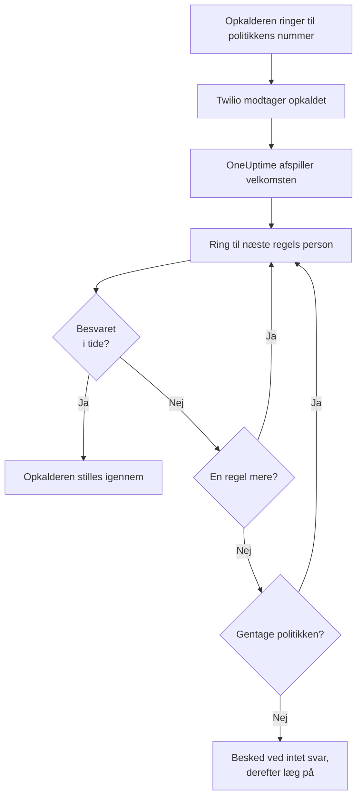
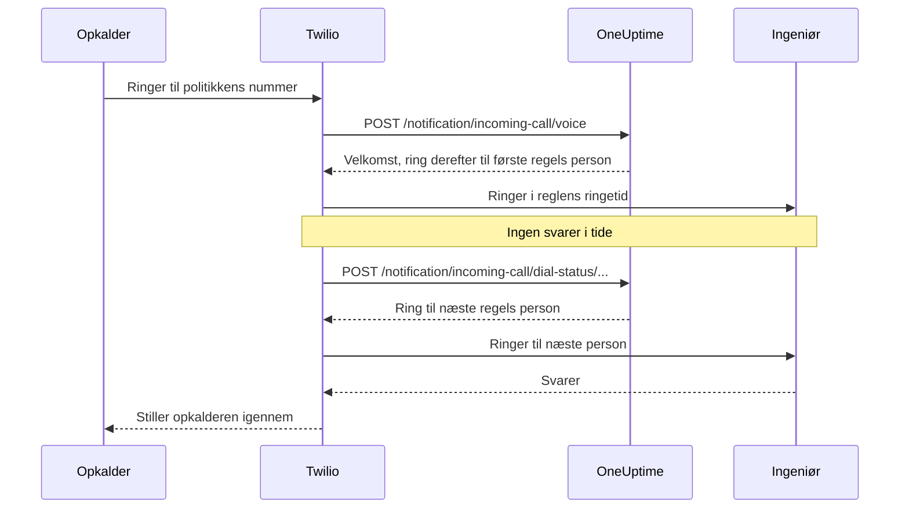

# Politik for indgående opkald

En politik for indgående opkald giver dit team et telefonnummer, der når den, der har vagt. Når nogen ringer til det, ringer OneUptime til personerne i politikkens eskaleringsregler, én efter én, indtil nogen svarer, og stiller opkalderen igennem. Numrene og opkaldene kører på din egen Twilio-konto.

:::cards
- [Opsæt en politik](#opsæt-en-politik): Fra din Twilio-konto til et testopkald, i syv trin.
- [Sådan routes et opkald](#sådan-routes-et-opkald): Hvem der ringes til, hvor længe, og hvad opkalderen hører.
- [Ubesvarede opkald](#ubesvarede-opkald): Hvem der får besked, og hvordan du reagerer på dem i et workflow.
- [Fejlfinding](#fejlfinding): Opkald, der aldrig kommer frem eller aldrig når en ingeniør.
:::

## Før du begynder

| Du skal bruge | Hvorfor |
| --- | --- |
| En Twilio-konto med dens Account SID og Auth Token | Politikkens numre og opkald kører på den, og Twilio fakturerer dem til den. |
| Planen **Growth** på OneUptime Cloud | Et projekt skal have den for at få sin egen Twilio-konfiguration. |
| En OneUptime-server, som Twilio kan nå, hvis du selv hoster den | Twilio sender hvert opkald til `https://<your host>/notification/incoming-call/voice`. |
| **SMS** slået til i projektet | Hver ingeniørs nummer bekræftes med en kode, der sendes via SMS. |
| Et bekræftet nummer for hver ingeniør | En regel ringer kun til personer, der har tilføjet og bekræftet et nummer til indgående opkald i projektet. |

## Opsæt en politik

:::steps
### Tilføj din Twilio-konto

Gå til **Projektindstillinger** > **Notifikationer** > **Notifikationsindstillinger**. Klik i kortet **Twilio-konfiguration** på **Create Twilio Config**, og udfyld formularen:

- **Navn** og **Beskrivelse**: hvad kontoen bruges til, fx "Supportlinje".
- **Twilio Account SID**: fra Twilio Console. Den starter med `AC`.
- **Twilio Auth Token**: fra Twilio Console.
- **Twilio primært telefonnummer**: et nummer på den konto, til de SMS'er og opkald, den sender.
- **Twilio sekundære telefonnumre**: valgfrit. Numre, der sender i stedet for det primære til modtagere i deres land.
- **Indstil som projektstandard**: slået til for projektets første Twilio-konfiguration, så SMS'er og opkald til projektets medlemmer også går gennem denne konto. Slå det fra, hvis kontoen kun er til indgående opkald.

### Opret politikken

Gå til **Vagtordning** > **Indgående opkaldspolitikker**, og klik på **Opret Indgående opkaldspolitik**. Giv den et **Navn**, fx "Supportlinje", og eventuelt en **Beskrivelse** og **Etiketter**. Åbn den derefter fra listen.

### Vælg Twilio-kontoen

Politikkens **Oversigt** viser et kort **Opsætning** med tre nummererede trin. Klik i det første på **Vælg**, vælg kontoen under **Twilio-konfiguration**, og klik på **Gem**.

### Tilføj et telefonnummer

Klik i det andet trin på **Add Phone Number**. Vælg **Use Existing Phone Number** for at tage et nummer med, som din Twilio-konto allerede har, eller **Reserve New Phone Number** for at få et nyt. OneUptime peger nummeret på sig selv, så der er intet at sætte op i Twilio. Se [Telefonnumre](#telefonnumre).

### Tilføj eskaleringsregler

Klik i det tredje trin på **Administrer regler**. Tilføj en regel for hver vagtplan eller person, der skal ringes til, i den rækkefølge, der skal ringes. Se [Eskaleringsregler](#eskaleringsregler).

### Bekræft hver ingeniørs nummer

Alle, som en regel kan ringe til, tilføjer og bekræfter deres eget nummer til indgående opkald. Se [Ingeniørernes telefonnumre](#ingeniørernes-telefonnumre).

### Ring til nummeret

Når alle tre trin er færdige, bliver kortet til **Phone Numbers & Twilio Configuration**. Ring til nummeret fra en hvilken som helst telefon, og åbn derefter politikkens **Opkaldslogs** for at se, hvem der blev ringet til.
:::

## Sådan routes et opkald

1. Twilio sender opkaldet til OneUptime, som læser politikkens **Velkomstbesked** op.
2. OneUptime ringer til den person, den første eskaleringsregel nævner: den person, eller den, der har vagt i reglens vagtplan i det øjeblik, brugeroverrides medregnet. Personens telefon viser politikkens nummer som opkalder.
3. Svarer personen inden for reglens **Ringetid**, stilles opkalderen igennem, og opkaldsloggen registrerer, hvem der svarede.
4. Hvis ikke, hører opkalderen "Connecting you to the next available engineer.", og der ringes til næste regels person.
5. Efter den sidste regel starter politikken forfra fra den første regel, hvis **Gentag politik hvis ingen svarer** er slået til, så mange gange som **Antal gentagelser af politik** siger. Ellers hører opkalderen **Besked ved intet svar**, og opkaldet slutter.

En regel springes over, uden at der ringes til nogen, når der lige nu ikke er nogen at ringe til for den: dens vagtplan har ingen på vagt, personen har intet bekræftet nummer til indgående opkald i dette projekt, eller personen er ikke længere medlem af projektet. Når ingen regel har nogen at ringe til, hører opkalderen **Besked ved ingen tilgængelige**. En deaktiveret politik besvarer hvert opkald med "Sorry, this service is currently disabled." og lægger på.

OneUptime kontrollerer Twilios signatur på hver forespørgsel med Twilio-konfigurationens Auth Token og afviser en forespørgsel, den ikke kan verificere.

> [!TIP]
> Gem politikkens nummer som en kontakt på din telefon, fx "Supportlinje", så du genkender et viderestillet opkald, når det ringer.

## Eskaleringsregler

Eskaleringsregler bestemmer, hvem der ringes til, når nogen ringer til politikkens nummer, oppefra og ned i listen. Åbn politikken, vælg **Eskaleringsregler** i dens sidemenu, og klik på **Tilføj eskaleringsregel**. En regel er ét kort trin:

- **Hvem der skal ringes til**: en vagtplan eller én person. En vagtplan ringer til den, der har vagt i den, når opkaldet kommer ind. Personer er medlemmerne af dit projekt.
- **Ringetid (i sekunder)**: hvor længe personens telefon ringer, før opkaldet går videre til næste regel. Den starter på 20 sekunder, og Twilio accepterer 5 til 600.
- **Navn** og **Beskrivelse** er valgfrie, under **Flere felter**. En regel uden navn står i listen efter sin plads: **Level 1**, **Level 2**.

Reglerne kaldes oppefra og ned i listen, og en ny regel tilføjes til sidst. For at ændre rækkefølgen trækker du en regel i håndtaget øverst til venstre. Med tastaturet sætter du fokus på håndtaget, trykker på mellemrumstasten, flytter det med piletasterne og trykker på mellemrumstasten igen.

> [!WARNING]
> **Pas på telefonsvareren**: hold **Ringetid** kortere end den tid, personens telefon er om at sende et ubesvaret opkald til telefonsvareren. Svarer telefonsvareren først, forbindes opkalderen til den, og opkaldet går ikke videre til næste regel. Twilio lægger et par sekunder af sine egne til hver ringning. Derfor starter en ny regel på 20 sekunder. Regler, der blev tilføjet, da standarden var 30 sekunder, beholder deres 30: ender deres opkald på telefonsvareren, så sænk **Ringetid** på de regler.

For eksempel tre regler, der prøver to rotationer og derefter en leder:

| Niveau | Hvem der skal ringes til | Ringetid |
| --- | --- | --- |
| Level 1 | Primær vagtplan | 20 sekunder |
| Level 2 | Sekundær vagtplan | 20 sekunder |
| Level 3 | Teknisk leder (én person) | 20 sekunder |

## Telefonnumre

En politik kan have flere numre, og hvert af dem ringer til de samme regler. Hvert nummer hører til én politik. Tilføj dem med **Add Phone Number** på politikkens **Oversigt**:

:::tabs
@tab Brug et nummer, du har
1. Klik på **Add Phone Number** og derefter på **Use Existing Phone Number**. OneUptime viser numrene på politikkens Twilio-konto.
2. Klik på **Vælg** ud for nummeret og derefter på **Tildel nummer**.

Et nummer, der allerede sender sine opkald et andet sted hen, siger "Currently has a webhook configured". At tildele det sender dets opkald til OneUptime i stedet.
@tab Reservér et nyt nummer
1. Klik på **Add Phone Number**, derefter på **Reserve New Phone Number** og **Søg efter numre**.
2. Vælg et **Land**. Udfyld eventuelt **Områdekode (valgfrit)**, fx 415, eller **Indeholder (valgfrit)** med cifre, nummeret skal indeholde. Klik på **Søg**: op til 10 lokale numre vises.
3. Klik på **Reserver** ud for et nummer, og bekræft med **Reserver**. Twilio opkræver nummeret på din Twilio-konto.
:::

OneUptime sætter nummerets voice-webhook til `https://<your host>/notification/incoming-call/voice`, bygget ud fra `HOST` og `HTTP_PROTOCOL` på en selvhostet installation. For at flytte en politik til en anden Twilio-konto skal du først frigive dens numre: kontoen kan kun ændres, mens politikken ikke har nogen.

For at frigive et nummer skal du klikke på **Frigiv** ud for det og bekræfte med **Frigiv nummer**.

> [!CAUTION]
> At frigive et nummer giver det tilbage til Twilio, også et nummer, du tog med via **Use Existing Phone Number**, og du får det måske ikke igen. At slette en politik, eller den Twilio-konfiguration, den bruger, frigiver også dens numre.

## Ingeniørernes telefonnumre

En regel ringer til en person på det nummer, personen har bekræftet til indgående opkald i dette projekt, og springer alle over, der ikke har et. Hver person tilføjer sit eget:

:::steps
1. Åbn **Brugerindstillinger** > **Indgående opkaldspolitik** > **Indgående telefonnumre**. **Indgående opkaldspolitik** er et afsnit i sidemenuen, der starter foldet sammen.
2. Klik i kortet **Telefonnumre til indgående opkaldsrouting** på **Tilføj Telefonnummer til indgående opkaldsrouting**, og indtast nummeret med landekode, fx `+15551234567`.
3. Indtast den 6-cifrede kode, som OneUptime sender til nummeret via SMS, under **Bekræftelseskode**, og klik på **Bekræft**. **Send a new code** sender en ny.
:::

Hver person kan have ét bekræftet nummer pr. projekt. For at skifte det skal du først slette det gamle nummer. Disse numre er adskilt fra telefonnumrene under **Notifikationsmetoder**, som vagttilkald bruger.

Numre til indgående opkald bekræftes via SMS, så **SMS** skal først være slået til for projektet. En projektejer, en **Billing Admin** eller en person med **Manage Billing** slår det til i kortet **Notifikationskanaler** på **Projektindstillinger > Notifikationer > Notifikationsindstillinger**.

## Talebeskeder og politikindstillinger

Åbn politikken, og vælg **Indstillinger** under **Avanceret** i dens sidemenu. **Edit Messages** på kortet **Talebeskeder** ændrer, hvad opkaldere hører; **Edit Policy Settings** på kortet **Politikindstillinger** ændrer resten.

| Indstilling | Hvad den gør | For en ny politik |
| --- | --- | --- |
| **Velkomstbesked** | Læses op, når opkaldet besvares, før der ringes til den første person. | "Please wait while we connect you to the on-call engineer." |
| **Besked ved intet svar** | Læses op, når alle regler er prøvet, og ingen svarede. | "No one is available. Please try again later." |
| **Besked ved ingen tilgængelige** | Læses op, når ingen regel har nogen at ringe til. | "We are sorry, but no on-call engineer is currently available. Please try again later or contact support." |
| **Aktiveret** | En deaktiveret politik afviser alle opkald. | Til |
| **Gentag politik hvis ingen svarer** | Starter forfra fra den første regel efter den sidste. | Fra |
| **Antal gentagelser af politik** | Hvor mange gange der startes forfra. | 1 |

Twilio læser beskederne op med en tekst-til-tale-stemme, så skriv dem, som du vil have dem til at lyde.

## Opkaldslogs

Hvert opkald står på politikkens side **Opkaldslogs** under **Protokoller** i dens sidemenu: **Opkalder**, **Number Called**, dets **Status**, hvem der besvarede det (**Besvaret af**), **Varighed**, og hvornår det startede (**Startet den**). Klik på **View Timeline** ved et opkald for at se dets **Opkaldstidslinje**: hver person, der blev ringet til, på hvilket nummer, og hvordan hvert forsøg endte.

| Status | Hvad der skete |
| --- | --- |
| **Initiated**, **Escalated** | Opkaldet er stadig i gang: det kom ind, og en telefon ringer, eller det gik videre til en senere regel. |
| **Fuldført** | Nogen svarede, og opkalderen blev stillet igennem. |
| **Intet svar** | Alle eskaleringsregler blev prøvet, og ingen svarede. Opkalderen hørte din **Besked ved intet svar**. |
| **Caller Hung Up** | Opkalderen lagde på, mens en ingeniørs telefon ringede. |
| **Mislykkedes** | Der kunne ikke ringes til nogen: ingen eskaleringsregel havde en bruger på vagt med et bekræftet nummer til indgående opkald (opkalderen hørte din **Besked ved ingen tilgængelige**), eller politikken er deaktiveret. |

## Ubesvarede opkald

Et opkald er ubesvaret, når det slutter uden at nå nogen: dets status er **Intet svar**, **Caller Hung Up** eller **Mislykkedes**.

### Hvem der får besked

Når et opkald er ubesvaret, giver OneUptime politikkens ejere besked: brugerne og medlemmerne af de teams, der er tilføjet på politikkens side **Ejere**. Har politikken ingen ejere, får projektets ejere besked i stedet.

Notifikationen siger, hvem der ringede, hvilket nummer der blev ringet til, hvorfor ingen svarede, og hvem der blev ringet til, og hvordan hvert forsøg endte. Den linker til opkaldet i opkaldsloggen.

Ejere får som standard en e-mail. Hver person kan vælge andre kanaler (SMS, opkald, push og mere) eller slå den fra i **Brugerindstillinger** > **Notifikationsindstillinger** under **Vagt** > **Indgående opkaldspolitikker** > **Ubesvaret opkald**.

### Reagér på ubesvarede opkald i et workflow

Logs over indgående opkald er tilgængelige som workflowudløsere:

- **On Create Incoming Call Log** kører, når et opkald kommer ind.
- **On Update Incoming Call Log** kører, efterhånden som opkaldet skrider frem. Den opdatering, der sætter **Ended At**, er opkaldets afslutning.

For kun at reagere på ubesvarede opkald, fx for at poste dem i Slack eller Microsoft Teams eller for at åbne en sag:

:::steps
1. Tilføj udløseren **On Update Incoming Call Log**. Sæt **Listen on** til **Ended At**, og vælg de felter, du vil bruge, fx **Status**, **Caller Phone Number** og **Routing Phone Number**.
2. Tilføj et trin **If / Else**. Tjek udløserens **Status** med sammenligningen **is not equal to** og `Completed`.
3. Forbind dine trin til porten **Yes**.
:::

Et workflow kan læse opkaldslogs med **Find One** og **Find Many**, men det kan ikke oprette eller ændre dem.

## Hvem der kan tilføje og frigive telefonnumre

En politiks telefonnumre følger de samme roller som selve politikken:

- **Slå numre op** - søge i Twilio efter et nummer at reservere eller vise de numre, din Twilio-konto allerede har - kræver tilladelse til at læse politikker for indgående opkald og til at læse konfigurationer for opkald og SMS, fordi det læser din Twilio-konto via en af dem. **Project Owner**, **Project Admin**, **Project Member**, **Viewer**, **Settings Admin**, **Settings Member** og **Settings Viewer** har begge. I en brugerdefineret rolle er det **Read Incoming Call Policy** og **Read Call and SMS**.
- **At reservere et nummer, bruge et eksisterende og frigive et** kræver tilladelse til at redigere politikker for indgående opkald: **Project Owner**, **Project Admin**, **Project Member**, **Settings Admin** og **Settings Member** eller **Edit Incoming Call Policy** i en brugerdefineret rolle. De ændrer numrene på en politik, du må redigere: med en rolle, der er begrænset til bestemte etiketter, de politikker, der har de etiketter.

Et teams blokering uden etiketter på en af disse tilladelser fjerner den. For alle andre bliver **Add Phone Number** og **Frigiv** på siden, låst, og deres tooltip siger, hvad der kræves. API'et afviser deres forespørgsel med en sætning, der siger, hvad der kræves: "Looking up phone numbers needs permission to read incoming call policies and call and SMS settings." eller "Adding or releasing a phone number needs permission to edit incoming call policies." At reservere et nummer opkræves på din egen Twilio-konto, ikke på din OneUptime-saldo, så det kræver ingen faktureringstilladelse.

## Opret politikker med API'et eller Terraform

| Ressource | API-rute |
| --- | --- |
| Politikker for indgående opkald | `/api/incoming-call-policy` |
| Deres eskaleringsregler | `/api/incoming-call-policy-escalation-rule` |
| Deres telefonnumre, kun læsning | `/api/incoming-call-policy-phone-number` |
| Opkaldslogs, kun læsning | `/api/incoming-call-log` |

En regel, der oprettes via API'et uden `escalateAfterSeconds`, ringer i 20 sekunder, og det gør en regel, som Terraform opretter uden `escalate_after_seconds`, også.

### Indstillinger for en eskaleringsregel

| Indstilling | API-felt | Hvad det indeholder |
| --- | --- | --- |
| Hvem der skal ringes til | `onCallDutyPolicyScheduleId` eller `userId` | Ét af dem, aldrig begge: vagtplanen, hvis vagthavende ringes op, eller personen. |
| Ringetid (i sekunder) | `escalateAfterSeconds` | Hvor længe telefonen ringer, før opkaldet går videre (standard: 20; fra 5 til 600). |
| Navn og Beskrivelse | `name`, `description` | Valgfrie. En regel uden navn står som Level 1, Level 2 og så videre, efter sin plads i listen. |
| Rækkefølge | `order` | Hvor reglen står i listen: reglerne kaldes oppefra og ned. En ny regel uden rækkefølge kommer til sidst. |

## Fejlfinding

:::details Opkald når ikke frem til OneUptime
- Åbn nummeret i Twilio Console: **A call comes in** skal være webhooken `https://<your host>/notification/incoming-call/voice` med HTTP POST. OneUptime sætter den, når nummeret tilføjes, ud fra `HOST` og `HTTP_PROTOCOL`. Er de ændret siden, så ret webhooken i Twilio.
- En selvhostet OneUptime skal kunne nås fra internettet via https. Nummerets opkaldslog i Twilio Console og Twilios **Debugger** viser, hvad OneUptime svarede.
- Et svar `403` betyder, at forespørgslens signatur ikke stemte. Sørg for, at Twilio-konfigurationen har kontoens aktuelle **Twilio Auth Token**, og at en proxy foran OneUptime videregiver den vært og det skema, Twilio kaldte (`X-Forwarded-Host` og `X-Forwarded-Proto`).
:::

:::details Opkaldet besvares, men der ringes ikke til nogen
Opkaldsloggen siger **Mislykkedes**. Tjek, at politikken er **Aktiveret**, at hver regels vagtplan har nogen på vagt lige nu, og at de personer, reglerne ringer til, har et bekræftet nummer under **Brugerindstillinger** > **Indgående opkaldspolitik** > **Indgående telefonnumre** i dette projekt. Regler ringer kun til projektets medlemmer.
:::

:::details Opkald ender på telefonsvareren
Ender opkald på en ingeniørs telefonsvarer, så sæt reglens **Ringetid** under den tid, personens telefon er om at gå til telefonsvareren. En telefonsvarer, der svarer, tæller som et svar, og opkaldet stopper dér.
:::

:::details Et nyt nummer kan ikke reserveres
Twilio kræver i mange lande en godkendt regulatory bundle, før det sælger lokale numre, og nogle numre kræver en positiv Twilio-saldo. Sæt det op i Twilio Console, eller få nummeret dér, og tilføj det med **Use Existing Phone Number**.
:::

:::details Politikkens Twilio-konto kan ikke ændres
Kontoen kan kun ændres, mens politikken ikke har nogen telefonnumre: siden siger "Remove all phone numbers to change". At frigive numrene giver dem tilbage til Twilio, så planlæg flytningen først.
:::

:::details Koden til en ingeniørs nummer kommer ikke frem
SMS skal være slået til for projektet. På OneUptime Cloud betaler et projekt uden sin egen standard-Twilio-konfiguration for SMS'erne af sin saldo, som skal være over 1 USD. Koder kan være et minut om at komme frem; klik på **Send a new code** for at sende en ny, og **Projektindstillinger** > **Notifikationer** > **Notifikationslogs** viser, hvad der skete med den.
:::

## Næste trin

:::cards
- [Eskaleringsregler](/docs/on-call/escalation-rules): Hvordan en vagtpolitik tilkalder folk, niveau for niveau.
- [Vagtplaner](/docs/on-call/schedules): Byg de rotationer, dine regler ringer til.
- [Workflows](/docs/workflows/index): Reagér på ubesvarede opkald: post dem i en kanal, eller åbn en sag.
- [Twilio-integration til SMS og tale](/docs/self-hosted/twilio-integration): Opsæt Twilio til en selvhostet installation.
:::
