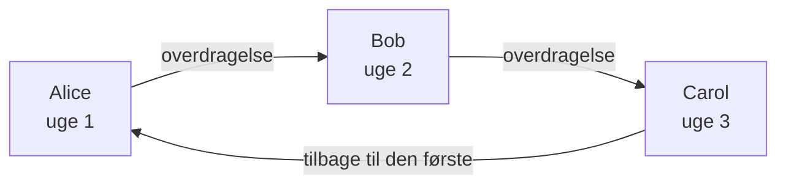

# Vagtplaner

En vagtplan bestemmer, hvem der har vagt på ethvert tidspunkt. Folk skiftes i den: hver har vagt et stykke tid, og så tager den næste over. Føj en vagtplan til en vagtpolitiks eskaleringsregler, så tilkalder politikken den, der har vagt i den, når det niveau kører.

> [!NOTE]
> På OneUptime Cloud hører vagtplaner til planen **Growth** og derover. En vagtplan, som et projekt stadig har, bliver ved med at tilkalde personerne i den, via de eskaleringsregler, der nævner den, efter at en Growth-prøveperiode slutter, eller planen sænkes. Under **Growth** viser siden **Vagtplaner** derfor bemærkningen om planen med de vagtplaner, der stadig er sat op, nedenunder, hvor du kan slette dem. At oprette eller ændre en vagtplan kræver **Growth**.

:::cards
- [Hvem der skiftes](#hvem-der-skiftes): Opret en vagtplan med dens første rotation.
- [Lag](#lag): Stabl rotationer, begræns vagttimerne, og tilføj reservedækning.
- [API og Terraform](#opret-vagtplaner-med-apiet-eller-terraform): Opret vagtplaner og deres rotationer som kode.
:::

## Hvem der skiftes

Når du opretter en vagtplan på siden **Vagtplaner**, beder formularen om dens **Navn** og **Hvem skiftes til at have vagt?**. De personer, du vælger, bliver vagtplanens første lag, **Layer 1**, med vagt døgnet rundt.

:::steps
1. Gå til **Vagtordning** > **Vagtplaner**, og klik på **Opret vagtplan**.
2. Indtast et **Navn**.
3. Klik under **Hvem skiftes til at have vagt?** på **Tilføj bruger**, og vælg personerne i den rækkefølge, de skiftes.
4. Åbn eventuelt **Flere felter** for at ændre, hvor længe hver tørn varer, tidszonen, beskrivelsen eller etiketterne.
5. Klik på **Opret vagtplan**. Den nye vagtplan åbner derefter på sin side **Lag**, hvor du kan ændre rotationen eller tilføje flere lag.
:::

Personerne skiftes én ad gangen, og den første har vagt, så snart vagtplanen er oprettet:



**Hvem skiftes til at have vagt?** er valgfrit. Lader du det stå tomt, starter vagtplanen uden lag: den sætter ingen på vagt, før du tilføjer et lag på dens side **Lag**. Spørgsmålet stilles kun til dem, der må tilføje lag.

Alt andet ligger under **Flere felter**, foldet sammen, indtil du åbner det:

| Felt | Hvad det gør |
| --- | --- |
| **Hver tørn varer** | **1 dag**, **1 uge**, **2 uger** eller **1 måned**, og **1 uge**, medmindre du ændrer det. Det spørges om, så snart nogen skiftes. Hver person har vagt så længe, og så tager den næste over, på det tidspunkt af dagen, hvor vagtplanen blev oprettet. |
| **Tidszone** | Den tidszone, overdragelsestider og vagttimer holdes i. Den starter på din. |
| **Beskrivelse** | Noter om vagtplanen. |
| **Etiketter** | Etiketter til at finde og gruppere vagtplanen. |

Så længe nogen skiftes, og intet under **Flere felter** er ændret, siger den sammenfoldede overskrift, hvad der vil ske: hver person har vagt i en uge, og så tager den næste over.

## Lag

En vagtplans rotation består af lag, på dens side **Lag**. Lag læses oppefra og ned: det øverste lag med en person på vagt er det, der tilkalder, så læg hovedrotationen øverst og reservedækningen under den.

```mermaid title="Det øverste lag med en person på vagt er det, der tilkalder"
flowchart TB
    start["Et niveau tilkalder vagtplanen"] --> first{"Nogen på vagt<br/>i det øverste lag?"}
    first -->|"Ja"| pageTop["Tilkald den person"]
    first -->|"Nej"| next{"Nogen på vagt<br/>i det næste lag?"}
    next -->|"Ja"| pageNext["Tilkald den person"]
    next -->|"Nej"| gap["Ingen tilkaldes<br/>et hul i dækningen"]
```

**Tilføj lag** tilføjer et lag, der starter som det første: på vagt fra nu, hver person i en uge, døgnet rundt. Fold et lag ud for at tilføje personer til det og for at ændre, hvornår det starter, hvor ofte det overdrager, hvornår det overdrager første gang, og de timer, det har vagt:

| Felt | Hvad det angiver |
| --- | --- |
| **Layer name** | Hvad laget dækker, fx "Primær på hverdage". |
| **Rotation starts at** | Den dato og det klokkeslæt, lagets rotation begynder. |
| **Rotate every** | Hvor ofte vagten går videre til den næste person i laget. |
| **First hand-off time** | Den første overdragelse til den næste person, ved eller efter starten. Senere overdragelser følger hvert rotationsinterval. |
| **Restrictions** | De timer, laget har vagt: **Ingen begrænsninger**, **Bestemte tidspunkter på dagen** eller **Bestemte tidspunkter i ugen**, i vagtplanens tidszone. Uden for dem tager lavere lag over. |

For at ændre, hvilket lag der kommer først, skal du bruge **Move layer up (higher priority)** eller **Move layer down (lower priority)** i et lags menu.

Hver person beholder én farve overalt, så du kan følge personen med et blik: i hvert lag, i den endelige vagtplan og dens overrides og på **Tidslinje for vagtplaner**.

## Opret vagtplaner med API'et eller Terraform

Vagtplaner er ressourcen `/api/on-call-duty-policy-schedule`; deres lag og personerne i dem er ressourcerne `/api/on-call-duty-schedule-layer` og `/api/on-call-duty-schedule-layer-user`.

- At oprette en vagtplan med `firstLayerUsers` (en liste med bruger-id'er i den rækkefølge, de skiftes) i dens `miscDataProps` giver den dens første lag, ligesom dashboardet gør: **Layer 1**, på vagt fra nu, døgnet rundt. `firstLayerRotation` siger, hvor længe hver tørn varer, som en rotation som `{"_type": "Recurring", "value": {"intervalType": "Week", "intervalCount": 1}}`; uden den en uge. Hver bruger skal være medlem af projektet, og kalderen skal have lov til at oprette lag, ellers oprettes vagtplanen ikke.
- En vagtplan, der oprettes uden dem, har ingen lag, som før; Terraforms ressource for vagtplaner sender dem ikke.
- Et lag, der oprettes uden `rotation`, overdrager dagligt, som det altid har gjort.

```bash
curl -X POST https://oneuptime.com/api/on-call-duty-policy-schedule \
  -H "apikey: $ONEUPTIME_API_KEY" \
  -H "Content-Type: application/json" \
  -d '{
    "data": {
      "projectId": "<project-id>",
      "name": "Primary on-call",
      "timezone": "Europe/Berlin"
    },
    "miscDataProps": {
      "firstLayerUsers": ["<user-id-1>", "<user-id-2>", "<user-id-3>"],
      "firstLayerRotation": {"_type": "Recurring", "value": {"intervalType": "Week", "intervalCount": 1}}
    }
  }'
```

## Næste trin

:::cards
- [Eskaleringsregler](/docs/on-call/escalation-rules): Lad et niveau i en vagtpolitik tilkalde denne vagtplan.
- [Tidslinje for vagtplaner](/docs/on-call/schedule-timeline): Se alle vagtplaner side om side, med hullerne i dækningen.
- [Kalenderfeeds](/docs/on-call/calendar-feeds): Få vagter ind i Google Kalender, Outlook eller Apple Kalender.
:::
