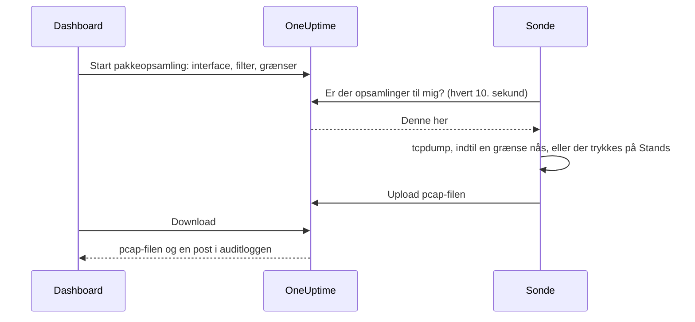

# Pakkeopsamling

Opsaml den trafik, en af dine sonder ser, direkte fra dashboardet, og åbn filen i Wireshark. Sonden står allerede i det netværk, du fejlsøger i: ingen VPN at åbne og ingen jump host at logge ind på.

Opsamlinger er slået fra på hver sonde, indtil den, der driver sonden, slår dem til, og de kører kun på dit projekts egne sonder.

:::cards
- [Sådan virker det](#sådan-virker-det): Fra Start pakkeopsamling til en fil i Wireshark.
- [Slå pakkeopsamling til](#slå-pakkeopsamling-til): Hvad den, der driver sonden, indstiller, til Docker, Docker Compose og Kubernetes.
- [Start en opsamling](#start-en-opsamling): Vælg et interface, afgræns til det, du har brug for, og download filen.
- [Reference](#reference): Grænser, filtre, tilladelser, auditloggen og hvor længe filer gemmes.
- [Fejlfinding](#fejlfinding): Hvad meddelelsen fra en mislykket opsamling betyder.
:::

## Sådan virker det



1. **Start.** En person, der må starte opsamlinger, vælger sondens interface, et filter og grænserne og klikker på **Start opsamling**. OneUptime kontrollerer filteret og grænserne mod det, sonden tillader, før opsamlingen gemmes.
2. **Afhentning.** Sonden spørger OneUptime om arbejde hvert tiende sekund, på samme måde som den spørger efter monitorer. Den tager opsamlingen og starter `tcpdump`.
3. **Opsamling.** Opsamlingen stopper ved den første af sine grænser: varigheden, pakkegrænsen eller filstørrelsen. **Stands** afslutter den tidligt og beholder det, der allerede er opsamlet.
4. **Upload.** Sonden uploader pcap-filen. OneUptime gemmer den som en privat fil i projektet.
5. **Download.** Opsamlingen viser **Fuldført** med en **Download**-knap. Filen åbner i Wireshark, tcpdump eller ethvert andet værktøj, der læser pcap-filer.

## Før du begynder

- **En af dit projekts egne sonder.** Globale sonder bærer andre projekters trafik, så de opsamler aldrig. Se [Brugerdefinerede probes](/docs/probe/custom-probe) for at installere din egen sonde.
- **En sonde fra denne udgivelse eller nyere.** Ældre sonder rapporterer ikke, hvad de kan opsamle på.
- **De rette tilladelser.** At starte og standse en opsamling kræver **Start Packet Capture**, og at downloade en fil kræver **Download Packet Capture**. Projektejere og -administratorer har begge. Se [Tilladelser](#tilladelser).
- **En spejlet port, til trafik, der ikke når sonden.** En sonde ser kun trafikken på sin egen værts interfaces. For at opsamle trafik mellem andre enheder skal du spejle deres switchport (SPAN) til et ledigt interface på sondens vært.

## Slå pakkeopsamling til

Den, der driver sonden, slår opsamlinger til der, hvor sonden kører: dashboardet kan det ikke, og det er med vilje. Sonden har brug for tre ting:

| Indstilling | Hvorfor |
| --- | --- |
| `PROBE_PACKET_CAPTURE_ENABLED=true` | Slår opsamlinger til. Enhver anden værdi, eller ingen, lader dem være slået fra. |
| Værtsnetværk | Lader sonden se værtens egne interfaces og en spejlet port. Uden det ser sonden kun sin containers netværk. |
| Capability'en `NET_RAW` | Lader tcpdump opsamle. Docker giver den som standard. Kubernetes' Pod Security-standard 'restricted' fjerner den, så tilføj den. |

:::tabs
@tab Docker
```bash
docker run --name oneuptime-probe --network host \
  --cap-add NET_RAW \
  -e PROBE_KEY=<probe-key> \
  -e PROBE_ID=<probe-id> \
  -e ONEUPTIME_URL=https://oneuptime.com \
  -e PROBE_PACKET_CAPTURE_ENABLED=true \
  -d oneuptime/probe:release
```
@tab Docker Compose
```yaml
services:
  oneuptime-probe:
    image: oneuptime/probe:release
    container_name: oneuptime-probe
    network_mode: host
    cap_add:
      - NET_RAW
    environment:
      - PROBE_KEY=<probe-key>
      - PROBE_ID=<probe-id>
      - ONEUPTIME_URL=https://oneuptime.com
      - PROBE_PACKET_CAPTURE_ENABLED=true
    restart: always
```
@tab Kubernetes
```yaml
apiVersion: apps/v1
kind: Deployment
metadata:
  name: oneuptime-probe
spec:
  selector:
    matchLabels:
      app: oneuptime-probe
  template:
    metadata:
      labels:
        app: oneuptime-probe
    spec:
      hostNetwork: true
      dnsPolicy: ClusterFirstWithHostNet
      containers:
        - name: oneuptime-probe
          image: oneuptime/probe:release
          securityContext:
            capabilities:
              add: ["NET_RAW"]
          env:
            - name: PROBE_KEY
              value: "<probe-key>"
            - name: PROBE_ID
              value: "<probe-id>"
            - name: ONEUPTIME_URL
              value: "https://oneuptime.com"
            - name: PROBE_PACKET_CAPTURE_ENABLED
              value: "true"
```
:::

Når sonden starter, skriver den i sin log `Packet capture is on: captures of up to 30 minutes and 25 MB can be started on this probe from the dashboard.` Inden for et minut tilbyder sondens side i dashboardet **Start pakkeopsamling**.

For at sætte et lavere loft på denne sonde end det, alle sonder holder sig til, kan du tilføje en af disse:

| Variabel | Standard | Hvad den gør |
| --- | --- | --- |
| `PROBE_PACKET_CAPTURE_MAX_DURATION_IN_SECONDS` | `1800` | Den længste opsamling, denne sonde kører, fra 5 til 1800 sekunder. |
| `PROBE_PACKET_CAPTURE_MAX_FILE_SIZE_IN_MB` | `25` | Den største opsamlingsfil, denne sonde laver, fra 1 til 25 MB. |

> [!NOTE]
> De sonder, der følger med en selvhostet OneUptime-installation, via Docker Compose eller Helm-chartet, er globale sonder, så de opsamler aldrig. Kør en brugerdefineret sonde i det netværk, du vil opsamle i.

## Start en opsamling

:::steps
### Åbn sonden eller enheden

Åbn **Monitorer → Indstillinger → Sonder** og klik på din sonde: dens kort **Pakkeopsamlinger** viser dens opsamlinger. Eller åbn en netværksenhed og gå til dens side **Traffic**: opsamlinger der kører på enhedens egen sonde og starter filtreret på enhedens adresse.

### Klik på Start pakkeopsamling

Formularen fortæller, hvad en opsamling indeholder, før du starter en: adgangskoder, tokens og persondata, der sendes over forbindelsen, ender i filen.

### Vælg interfacet

**Alle interfaces (any)** opsamler på alle sondens interfaces. Vælg det interface, en switch spejler trafik til, når du opsamler spejlet trafik.

### Vælg hvilke pakker

Udfyld **Vært eller netværk**, **Port** og **Protokol** for at afgrænse opsamlingen, eller lad dem være tomme for at beholde alle pakker. Formularen viser det filter, de danner, for eksempel `host 10.0.0.5 and tcp port 443`. Klik på **Skriv et BPF-filter i stedet** for at skrive dit eget.

### Tjek grænserne

**Flere felter** indeholder **Varighed**, **Pakkegrænse** og **Grænse for filstørrelse (MB)**. Dets resumé fortæller, hvornår opsamlingen stopper: `Stopper efter 1 minut, 100.000 pakker eller 10 MB, alt efter hvad der kommer først.`

### Klik på Start opsamling

Opsamlingen viser **Afventer**, indtil sonden henter den, og derefter **Kører** med, hvor langt den er nået. Klik på **Stands** for at afslutte den tidligt.
:::

Når opsamlingen viser **Fuldført**, skal du klikke på **Download** og åbne `.pcap`-filen i Wireshark. En opsamling på **Alle interfaces (any)** er en Linux cooked capture, som Wireshark læser som enhver anden.

## Reference

### Grænser

| Grænse | Standard | Område |
| --- | --- | --- |
| Varighed | 1 minut | 5 sekunder til 30 minutter |
| Pakkegrænse | 100.000 | 1 til 1.000.000 |
| Grænse for filstørrelse | 10 MB | 1 til 25 MB |

- En opsamling stopper ved den første grænse, den når. En fil, der når sin størrelsesgrænse, skæres af efter den sidste hele pakke, så den altid kan åbnes.
- En sonde kører højst 2 opsamlinger ad gangen.
- En opsamling, som sonden ikke henter inden for 5 minutter, mislykkes og siger det.
- Sonden holder hver opsamling til disse grænser igen og til sine egne, lavere grænser.

### Filtre

Formularens felter danner et [BPF-filter](https://www.tcpdump.org/manpages/pcap-filter.7.html), opsamlingsfiltersproget i tcpdump og Wireshark:

| Vært eller netværk | Port | Protokol | Filter |
| --- | --- | --- | --- |
| `10.0.0.5` | | Enhver protokol | `host 10.0.0.5` |
| `10.0.0.0/24` | `443` | TCP | `net 10.0.0.0/24 and tcp port 443` |
| | `5060` | UDP | `udp port 5060` |
| | `8000-8080` | Enhver protokol | `portrange 8000-8080` |
| `10.0.0.5` | | ICMP | `host 10.0.0.5 and (icmp or icmp6)` |

Et filter, du selv skriver, er én linje på højst 500 tegn, lavet af bogstaver, tal, mellemrum og `. : / ( ) [ ] ! & | < > = + - * % ^ _`. OneUptime kontrollerer det, før det gemmes, og tcpdump kompilerer det på sonden. Sonden giver det til tcpdump som ét argument, aldrig gennem en shell.

### Tilladelser

| Tilladelse | Lader en person | Hvem har den som standard |
| --- | --- | --- |
| **Start Packet Capture** | Starte opsamlinger og standse dem | Project Owner, Project Admin |
| **Download Packet Capture** | Downloade opsamlingsfiler | Project Owner, Project Admin |
| **Delete Packet Capture** | Slette opsamlinger og deres filer | Project Owner, Project Admin |
| **Read Packet Capture** | Se opsamlinger: hvornår de kørte, på hvilken sonde og med hvilket filter | Project Owner, Project Admin, Project Member, Viewer |

For at give et team **Start Packet Capture** eller **Download Packet Capture** skal du åbne det under **Indstillinger → Teams** og tilføje tilladelsen på dets side **Tilladelser**. Se [Tilladelser](/docs/permissions/index).

### Auditlog og privatliv

- At starte en opsamling registreres i auditloggen som en **Create** af **Packet Capture**, og at slette en som en **Delete**. Hver download registreres som en **Download**, med hvem der downloadede hvilken opsamling.
- Filen er en privat fil i projektet. Kun knappen **Download**, med **Download Packet Capture**, udleverer den.
- Opsamlinger og deres filer slettes 7 dage efter, at de starter. At slette en opsamling sletter dens fil med det samme.

## Fejlfinding

:::details »Pakkeopsamling er slået fra på denne sonde«
Sonden kører uden `PROBE_PACKET_CAPTURE_ENABLED=true`. Genstart den med indstillingerne i [Slå pakkeopsamling til](#slå-pakkeopsamling-til).
:::

:::details "The probe is not allowed to capture packets on eth0"
tcpdump kunne ikke åbne interfacet. Giv sondens container capability'en `NET_RAW`: `--cap-add NET_RAW` med Docker, `cap_add` med Docker Compose, `securityContext.capabilities.add` med Kubernetes.
:::

:::details "The interface does not exist on the probe"
Interfacet er forsvundet, siden sonden sidst rapporterede det, eller sonden kører uden værtsnetværk og ser kun sin containers interfaces. Kør den med værtsnetværk, og vælg derefter interfacet igen.
:::

:::details "tcpdump could not use the filter"
tcpdump kunne ikke kompilere filteret. Meddelelsen indeholder tcpdumps egne ord, for eksempel `syntax error`. Tjek filteret mod [pcap-filter-manualen](https://www.tcpdump.org/manpages/pcap-filter.7.html).
:::

:::details "The probe did not pick up this capture within 5 minutes"
Sonden er afbrudt, eller pakkeopsamling blev slået fra på den, efter at opsamlingen blev startet. Tjek sondens **Forbindelsesstatus** og dens log.
:::

:::details »Ingen pakker matchede filteret.«
Opsamlingen kørte, og intet på interfacet matchede filteret. Tjek, at trafikken går over dette interface: trafik mellem andre enheder når kun sonden gennem en spejlet port.
:::

:::details "This probe is already running 2 packet captures"
En sonde kører 2 opsamlinger ad gangen. Vent på, at en bliver færdig, eller stands en, og start din igen.
:::

## Næste skridt

:::cards
- [Brugerdefinerede probes](/docs/probe/custom-probe): Installer en sonde i det netværk, du vil opsamle i.
- [Netværksenheds-monitor](/docs/monitor/network-device-monitor): Overvåg de enheder, hvis trafik du opsamler.
- [Tilladelser](/docs/permissions/index): Giv et team tilladelserne til pakkeopsamling.
:::
