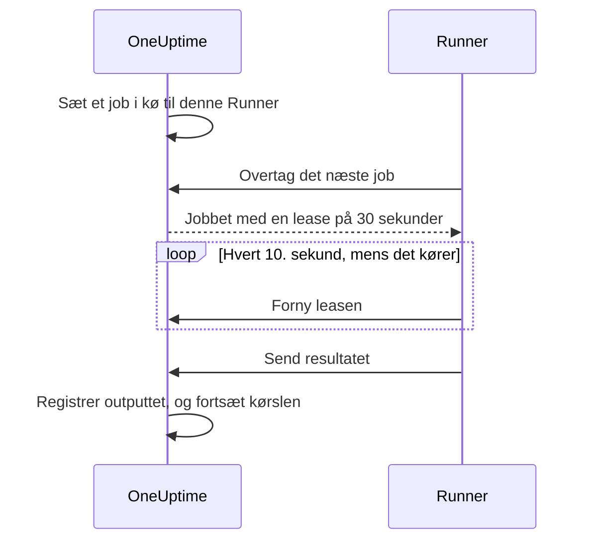

# Runbook-agenter

En **runbook-agent**, der kaldes **Runner** i dashboardet, er en lille selvhostet proces, der kører JavaScript-, Bash-, SSH- og Kubernetes-trinnene i dine runbooks **i din egen infrastruktur**. OneUptime Worker kører aldrig dine scripts: den sætter dem i kø, og den Runner, som trinnets forfatter valgte, overtager hvert job, kører det og sender resultatet tilbage. Denne side er til dem, der installerer og driver Runners.

:::cards
- [Installer en Runner](#installer-en-runner): Fra dashboardet til en forbundet container i fem trin.
- [Peg et trin mod en Runner](#peg-et-trin-mod-en-runner): Bind et trin til den Runner, der skal køre det.
- [Timeouts](#timeouts): Claim- og udførelsestimeouts, og hvordan de spiller sammen.
- [Miljøvariabler](#miljøvariabler): Hvad containeren læser ved opstart.
:::

## Sådan virker det

```mermaid title="Hvad der krydser netværket mellem en Runner og OneUptime"
flowchart TB
    subgraph yours["Din infrastruktur"]
        direction LR
        runner["Runner-container"]
        targets["Værter, klynger, interne tjenester"]
    end
    subgraph cloud["OneUptime"]
        direction LR
        worker["Workeren sætter trinnet i kø"]
        ingest["Runner-API"]
    end
    worker --> ingest
    runner -->|"Udgående HTTPS, Runner-ID og nøgle"| ingest
    ingest -->|"Overtaget job med dets hemmeligheder eller loginoplysning"| runner
    runner -->|"Script, SSH eller Kubernetes-API"| targets
```

1. Du opretter en Runner i OneUptime. OneUptime genererer et ID og en hemmelig nøgle til den.
2. Du kører Runner-containeren på en vært i din infrastruktur med det ID, den nøgle og din OneUptime-URL.
3. Runneren beder OneUptime om arbejde hvert 5. sekund og melder hvert 60. sekund, at den er i live.
4. Når du skriver et JavaScript-, Bash-, SSH- eller Kubernetes-trin, vælger du Runneren fra en rulleliste. Trinnet bindes til den Runner.
5. Når trinnet kører, sætter Workeren et job i kø med `targetAgentId` sat til den Runner. Kun den Runner kan overtage det.
6. Runneren kører jobbet lokalt — `bash -c <script>` til Bash, en `isolated-vm`-sandkasse til JavaScript, en SSH-forbindelse eller et kald til klyngens API-server med trinnets loginoplysning —, registrerer resultatet og sender det tilbage. Workeren genoptager runbooket med resultatet.

Runneren har kun brug for **udgående HTTPS** til din OneUptime-instans. Den accepterer ingen indgående forbindelser.

En Runner har kun sit ID og sin nøgle. Alt andet modtager den med det job, den overtager: et script, hvor de [runbook-hemmeligheder](/docs/runbooks/credentials#hemmeligheder-til-scripts), der er tildelt den, er udfyldt, eller den [loginoplysning](/docs/runbooks/credentials), som et SSH- eller Kubernetes-trin nævner. Derfor kan alle, der har en Runners nøgle, optræde som den Runner: behandl nøglen som de loginoplysninger, der er tildelt den.

## Hvorfor scripts kører på en Runner

At køre scripts på OneUptime Worker havde to problemer:

- **Tillidsgrænse.** Alle, der kunne skrive et runbook, kunne køre kode på Workeren med adgang til alt, hvad Workeren kunne nå.
- **Rækkevidde.** De fleste nyttige trin virker på _din_ infrastruktur ("genstart denne tjeneste", "slå en post op i vores interne database"), ikke på OneUptimes.

Med Runners kører de trin på en vært, du styrer, og du bestemmer, hvad den vært må. HTTP-anmodnings- og AI-trin kører stadig på Workeren, fordi de ikke har brug for noget fra dit netværk.

## Før du går i gang

- **En vært med Docker** i din infrastruktur, som kan nå din OneUptime-URL over HTTPS og de systemer, dine trin virker på.
- **En rolle, der opretter Runners.** Project Owner, Project Admin, Project Member og Runbook Admin kan oprette en. Kun en Project Owner, Project Admin eller Runbook Admin kan se en Runners nøgle, som opsætningskommandoen indeholder.

## Installer en Runner

### 1. Opret agentposten

Gå til **Runbooks → Runbook-agenter**, og opret en ny agent. Klik på **Opret Runner**, og udfyld de to trin:

| Felt | Trin | Noter |
| --- | --- | --- |
| **Navn** | **Runner** | Et forståeligt navn, typisk hvor den kører, og hvad den kan nå, f.eks. `prod-eu-west-1`. Det er det, du vælger, når du skriver et trin. |
| **Beskrivelse** | **Runner** | Valgfri. En sætning om, hvad denne vært kan nå. |
| **Etiketter** | **Runner** (under **Flere felter**) | Valgfri. |
| **Kører runbooks** | **Funktioner** | Slået til som standard. Lader denne Runner overtage runbook-trin. |
| **Kører AI-koderettelser** | **Funktioner** | Slået fra som standard. Lader den åbne pull requests med AI-koderettelser; se [Fix Tasks](/docs/ai/ai-agent). |
| **Kører AI-afhjælpningskommandoer** | **Funktioner** | Slået fra som standard. Lader automatisk AI-afhjælpning køre politikkontrollerede kommandoer på den. At slå den til for en Runner, der har SSH-loginoplysninger, kræver tilladelse til at læse runbook-loginoplysninger; se [Runners, der kører OneUptime AI's kommandoer](/docs/runbooks/credentials#runners-der-kører-oneuptime-ais-kommandoer). |

En Runner henter en ændring af sine funktioner ved sit næste heartbeat; den skal ikke genstartes.

### 2. Kopiér installationskommandoen

Klik på **Vis opsætningsvejledning** i Runnerens række. Dialogen **Opsætning af runbook-agent** viser en `docker run`-kommando, der allerede indeholder denne Runners ID og nøgle. Samme kommando står på Runnerens egen side under **Opsætningsvejledning**.

Kun en Project Owner, Project Admin eller Runbook Admin kan læse nøglen. Alle andre ser "Du har ikke tilladelse til at se denne runbook-agents nøgle" i stedet for kommandoen.

### 3. Kør den på en vært i din infrastruktur

Kør kommandoen på en vært i dit miljø, der kan:

- nå din OneUptime-instans over HTTPS, og
- gøre det, dine trin har brug for, f.eks. nå andre værter via SSH, kalde en klynges API-server eller tale med en database.

```bash
docker run --name oneuptime-runner --restart unless-stopped \
  -e ONEUPTIME_RUNNER_ID=<runner-id> \
  -e ONEUPTIME_RUNNER_KEY=<runner-key> \
  -e ONEUPTIME_URL=https://oneuptime.yourdomain.com \
  -d oneuptime/runner:release
```

### 4. Kontrollér, at agenten er forbundet

Gå tilbage til **Runbooks → Runbook-agenter**. Inden for et minut efter, at containeren er startet, bør Runnerens **Status** vise **Forbundet** med et nyt **Sidst set**. På Runnerens egen side viser kortet **Status for runbook-agent** dens **Version af runbook-agent** og **Vært**. Bliver den ved med at vise **Aldrig forbundet** eller **Afbrudt**, så se [Fejlfinding](#fejlfinding).

### 5. Hold agenten opdateret

Når en agent kører en ældre version end din OneUptime, vises et advarselstegn ud for dens **Version af runbook-agent** på dens side. Vælg det for at se, hvordan du opgraderer: hent det nye image, og fjern containeren, og kør så installationskommandoen fra trin 2 igen. En agent, som Kubernetes-agentens chart installerede, opgraderes i stedet med chartet.

```bash
docker pull oneuptime/runner:release
docker rm -f oneuptime-runner
```

## Peg et trin mod en Runner

:::steps
### Tilføj et trin, der kører på en Runner

Tilføj et JavaScript-, Bash-, SSH- eller Kubernetes-trin i dit runbooks **Trin**.

### Vælg Runneren

Trinnets rulleliste **Runner** viser alle Runners i projektet, og om de er forbundet. Har projektet endnu ingen, siger trinnet det og henviser dig til **Runbooks › Runners**.

### Gem trinnene

Klik på **Save Steps**. Når en kørsel når trinnet, sætter Workeren et job i kø til den Runners ID, og kun den Runner kan overtage det.
:::

Bash køres med `bash -c`. JavaScript kører i en `isolated-vm`-sandkasse på Runneren uden adgang til filsystemet eller processer; det kan kalde offentlige HTTP-API'er med `axios`, men ikke adresser på et privat netværk. SSH- og Kubernetes-trin bruger den [loginoplysning](/docs/runbooks/credentials), trinnet nævner, og den skal være tildelt samme Runner.

Brug for mere end én Runner? Opret dem, og peg hvert trin mod den rette. For redundans kører du en ekstra Runner og deler dine trin mellem dem, eller du holder et reserve-runbook, hvis trin peger mod den anden Runner.

## Driftsnoter

### Timeouts

To timeouts gælder for hvert trin, der kører på en Runner:

| Timeout | Standard | Hvad den styrer |
| --- | --- | --- |
| **Claim timeout** | 2 minutter | Hvor længe Workeren venter på, at den valgte Runner overtager jobbet. Overtager Runneren det ikke i tide, fejler trinnet på grund af timeout, og runbooket fortsætter (eller stopper, afhængigt af **Fortsæt ved fejl**). |
| **Execution timeout** | 30 sekunder | Hvor længe Runneren lader trinnet køre, før den stopper det. Bash får `SIGKILL`; JavaScripts sandkasse rives ned. |

Begge kan indstilles pr. trin. Åbn **Runbooks › dit runbook › Trin**, fold trinnet ud, og angiv **Execution timeout** og **Claim timeout** (i sekunder) i dets indstillinger. Lad et felt være tomt for at bruge standarden. Hver accepterer 1 sekund til 1 time; værdier uden for det interval begrænses, når trinnet kører.

Workerens samlede ventevindue er `claim timeout + execution timeout + a few seconds`. Vælg værdier, der passer til trinnet.

To ting at huske, når du sænker claim timeout:

- Runneren beder om arbejde i en polling-cyklus (`ONEUPTIME_RUNNER_POLL_INTERVAL_MS`, 5 sekunder som standard). En claim timeout kortere end én cyklus kan udløbe, før en helt sund Runner overhovedet har set jobbet, og trinnet fejler så med samme meddelelse, som en offline Runner giver.
- En Runner kører ét job ad gangen som standard (`ONEUPTIME_RUNNER_CONCURRENCY`). Mens et langt trin optager den, venter andre trin, der peger mod samme Runner, deres egne claim timeouts ud. Hæver du en execution timeout til minutter, så hæv claim timeout tilsvarende på de trin, der deler den Runner, eller giv dem en anden Runner.

### Lease og heartbeat



Når en Runner overtager et job, får den en kort lease (30 sekunder som standard). Mens trinnet kører, fornyer Runneren leasen hvert 10. sekund. Dør Runneren eller mister den netværket midt i et script, udløber leasen, og Workeren markerer jobbet som `TimedOut` i stedet for at vente for evigt.

Bash-underprocesser annulleres **ikke** automatisk, når leasen udløber (en JavaScript-sandkasse får også lov at blive færdig, hvis den nogensinde gør det), men Workeren holder op med at vente på dem, og Runneren kan ikke indsende et resultat, når en anden overtagelse har taget over. Design scripts, så de sikkert kan køre igen, hvis præcis én kørsel er vigtig for dig.

### Hvis OneUptime Worker genstarter midt i et trin

En runbook-udførelse kører på én Worker fra start til slut, så en udrulning eller et nedbrud kan afbryde den, mens et trin er i gang. Hvad der derefter sker, afhænger af, om udførelsen bliver taget op igen:

- **Den genoptages.** Den Worker, der tager den op, finder det job, dit trin allerede har oprettet, og **kobler sig på det igen**. Den venter på det job i stedet for at sende din Runner en ekstra kopi af scriptet. Var Runneren allerede færdig, bruges det registrerede resultat uændret. Et trin sendes højst én gang pr. udførelse til en Runner.
- **Den genoptages ikke.** Bliver udførelsen aldrig taget op igen, markerer en oprydning den som `Failed`, når den har overskredet claim- og udførelsesvinduet for sit nuværende trin, med en meddelelse, der nævner trinnet. En udførelse hænger aldrig i `Running`.

Det eneste, dette ikke kan fortælle dig, er, hvor langt et script nåede, før Workeren forsvandt. Et trin, der var midt i kørslen, rapporteres som mislykket med en note om, at det muligvis er kørt delvist: kontrollér målsystemet, før du kører runbooket igen.

### Ingen agent online

Er den valgte Runner offline, når trinnet kører, venter jobbet som `Pending`, indtil claim timeout er gået, og så fejler trinnet med "No runbook agent picked up this step before the wait window expired." Siden **Runbook-agenter** er stedet, hvor du kontrollerer dækningen, før du kører et runbook for alvor.

### Outputgrænse

stdout og stderr tilsammen er begrænset til **50 KB** pr. trin. Længere output skæres af med en markør. Har du brug for en fuld log, så skriv den fra scriptet til dit loglager eller objektlager, og vis URL'en med `echo`.

### Annullering

At annullere en runbook-udførelse, fra udførelsessiden eller API'et, markerer straks alle dens job i `Pending`, `Claimed` og `Running` som `Cancelled`. En Runner, der allerede er midt i et script, gør arbejdet færdigt, men serveren accepterer ikke resultatet, og intet senere trin i runbooket sendes ud.

### Samtidighed

Hver Runner kører ét job ad gangen som standard. Vil du tillade flere, så sæt `ONEUPTIME_RUNNER_CONCURRENCY` på containeren, men husk, at Runneren deler værten med alt det andet, der kører der.

## Miljøvariabler

Runneren læser disse ved opstart:

| Variabel | Påkrævet | Standard | Noter |
| --- | --- | --- | --- |
| `ONEUPTIME_URL` | ja | — | Basis-URL til din OneUptime-instans, f.eks. `https://oneuptime.yourdomain.com`. |
| `ONEUPTIME_RUNNER_ID` | ja | — | Runnerens ID fra dens opsætningskommando. |
| `ONEUPTIME_RUNNER_KEY` | ja | — | Runnerens hemmelige nøgle fra dens opsætningskommando. |
| `ONEUPTIME_RUNNER_POLL_INTERVAL_MS` | nej | `5000` | Hvor ofte Runneren beder om nye job. En værdi under `1000` falder tilbage til standarden. |
| `ONEUPTIME_RUNNER_HEARTBEAT_INTERVAL_MS` | nej | `60000` | Hvor ofte Runneren melder, at den er i live. En værdi under `5000` falder tilbage til standarden. |
| `ONEUPTIME_RUNNER_JOB_HEARTBEAT_INTERVAL_MS` | nej | `10000` | Hvor ofte Runneren fornyer leasen på et kørende job. En værdi under `1000` falder tilbage til standarden. |
| `ONEUPTIME_RUNNER_CONCURRENCY` | nej | `1` | Maksimalt antal samtidige job på denne Runner. |
| `ONEUPTIME_RUNNER_ENABLE_RUNBOOKS` | nej | — | Sæt til `false` for at få denne Runner til at holde op med at overtage runbook-trin, uanset hvad dashboardet siger. Den kan kun slå funktionen fra. |
| `ONEUPTIME_RUNNER_ENABLE_CODE_FIXES` | nej | — | Sæt til `false` for at få denne Runner til at holde op med at overtage AI-koderettelser, uanset hvad dashboardet siger. |
| `ONEUPTIME_RUNNER_ENABLE_AI_COMMANDS` | nej | — | Sæt til `false` for at få denne Runner til at holde op med at køre AI-afhjælpningskommandoer, uanset hvad dashboardet siger. |

## Udskift en agentnøgle

Hvis en nøgle lækker, så nulstil den. Den gamle nøgle holder straks op med at virke.

:::steps
### Nulstil nøglen

Åbn Runneren fra **Runbooks → Runbook-agenter**, klik på **Nulstil runbook-agentnøgle**, og bekræft. Runneren holder op med at forbinde, indtil den har den nye nøgle.

### Kør containeren med den nye nøgle

Kopiér den nye kommando fra Runnerens **Opsætningsvejledning**, fjern den gamle container, og kør den nye kommando på samme vært:

```bash
docker rm -f oneuptime-runner
```

### Kontrollér, at den forbinder igen

Under **Runbooks → Runbook-agenter** skifter Runnerens **Status** tilbage til **Forbundet** inden for et minut.
:::

## Tilladelser

Administration af agenter ligger i den eksisterende tilladelsesgruppe Runbooks:

- `CreateRunner`, `EditRunner`, `DeleteRunner`, `ReadRunner` — administrer agentposter.
- `RunbookAdmin`, `RunbookMember`, `RunbookViewer` (roller) — `RunbookAdmin` bygger runbooks, deres regler og de Runners, de kører på, og kører dem. `RunbookMember` åbner runbooks og deres kørsler og kører dem — starter en kørsel, fuldfører eller springer dens trin over og annullerer den — men opretter, ændrer og sletter intet runbook eller nogen Runner. `RunbookViewer` læser runbooks og deres kørsler og kører intet. `RunbookAdmin` samler alle de detaljerede tilladelser ovenfor.

At udløse et runbook (og dermed sende dets trin til Runners) kræver en rolle, der kører runbooks — `ProjectOwner`, `ProjectAdmin`, `ProjectMember`, `RunbookAdmin` eller `RunbookMember` — eller `CreateRunbookExecution`; at fuldføre, springe over eller annullere en kørsel accepterer også `EditRunbookExecution`. En rolle kører kun de runbooks, dens omfang når.

En Runners nøgle kan kun læses af Project Owners, Project Admins og Runbook Admins.

## API til agenter

For de nysgerrige: Runneren bruger disse endpoints, monteret under `/runner-ingest`. Stien fra før sammenlægningen, `/runbook-agent-ingest`, betjenes stadig for agenter, der endnu ikke er udrullet igen, så en serveropgradering ikke ødelægger dem. De godkendes med Runnerens ID og nøgle i JSON-body'en (`agentId` og `agentKey`) eller i headerne `x-agent-id` og `x-agent-key`.

| Endpoint | Formål |
| --- | --- |
| `POST /heartbeat` | Livstegn. Opdaterer Runnerens sidst-set-tid, version og værtsoplysninger og returnerer de funktioner, projektet har givet den. |
| `POST /claim-next-job` | Overtag atomisk det ældste job i `Pending`, der er rettet mod denne Runners ID. Returnerer `{ job: null }`, når der ikke er noget at gøre. |
| `POST /job/:jobId/heartbeat` | Forny jobbets lease. Returnerer 404, når leasen er udløbet, eller jobbet er afsluttet. |
| `POST /job/:jobId/result` | Indsend det endelige resultat. Ignoreres, hvis leasen allerede er gået videre. |
| `POST /disconnect` | Log af ved en pæn nedlukning. |

Du burde ikke skulle kalde dem manuelt: den medfølgende Runner gør det. De er dokumenteret her, så du kan bygge din egen agent, hvis du har en begrænsning, som vores ikke passer til.

## Fejlfinding

:::details Runneren bliver ved med at vise Aldrig forbundet eller Afbrudt
- Kontrollér containerens logs med `docker logs oneuptime-runner` for godkendelses- eller netværksfejl.
- Kontrollér, at værten kan nå din OneUptime-URL, f.eks. med `curl`.
- Kontrollér, at ID og nøgle er kopieret uden mellemrum, og at `ONEUPTIME_URL` er den adresse, du åbner OneUptime på.

**Aldrig forbundet** betyder, at Runneren aldrig har meldt sig. **Afbrudt** betyder, at den har, men ikke inden for de sidste 5 minutter.
:::

:::details Trin fejler med "No runbook agent picked up this step before the wait window expired."
Trinnets Runner overtog ikke jobbet inden for sin claim timeout. Kontrollér, at Runneren er **Forbundet**, at **Kører runbooks** er slået til for den, og at den ikke er optaget af et langt trin: den kører ét job ad gangen, medmindre du hæver `ONEUPTIME_RUNNER_CONCURRENCY`. En claim timeout kortere end polling-intervallet fejler på samme måde.
:::

:::details Trin fejler med "The runbook agent stopped responding while this step was running."
Runneren overtog jobbet og holdt så op med at forny sin lease: den gik ned, genstartede eller mistede netværket. Kontrollér, at den er online, og kontrollér derefter målsystemet, før du kører runbooket igen.
:::

:::details Runneren logger "No capability is enabled"
Alle funktioner er slået fra for denne Runner. Slå **Kører runbooks** til på Runnerens side i OneUptime. Den henter ændringen ved sit næste heartbeat.
:::

## Næste skridt

:::cards
- [Skriv et runbook](/docs/runbooks/authoring): Skriv de trin, der kører på din Runner.
- [Runbook-loginoplysninger](/docs/runbooks/credentials): Giv SSH- og Kubernetes-trin administreret adgang.
- [Runbook-konfiguration & sikkerhed](/docs/runbooks/configuration): Grænser, tilladelser og hærdning.
:::
