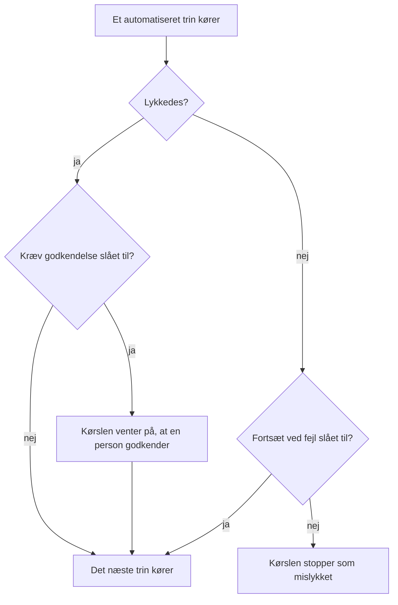

# Skriv et runbook

Du skriver et runbook som en ordnet liste af trin på dets side **Trin**. Denne side viser, hvordan du opretter et runbook, hvordan du sætter hver af de syv trintyper op, og hvordan fejl og godkendelser ændrer en kørsels forløb.

:::cards
- [Opret et runbook](#opret-et-runbook): Fra et tomt runbook til gemte trin.
- [Trintyper](#trintyper): Manual, JavaScript, HTTP request, Bash, SSH, Kubernetes og AI.
- [Fejlhåndtering og godkendelser](#fejlhåndtering-og-godkendelser): Hvad der sker, når et trin fejler eller lykkes.
- [Et gennemgået eksempel](#et-gennemgået-eksempel): En database-failover i fem trin.
:::

## Før du går i gang

- **En rolle, der skriver runbooks.** Project Owner, Project Admin og Runbook Admin opretter runbooks og gemmer deres trin. Med detaljerede tilladelser skal du have **Create Runbook** og **Edit Runbook**. Se [Tilladelser](/docs/runbooks/configuration#tilladelser).
- **En Runner, til JavaScript-, Bash-, SSH- og Kubernetes-trin.** Disse trin kører på en [Runner](/docs/runbooks/agents) i din egen infrastruktur, aldrig på OneUptime Worker. Installer en først.
- **En loginoplysning, til SSH- og Kubernetes-trin, og tilladelse til at læse den.** Se [Runbook-loginoplysninger](/docs/runbooks/credentials). Et trin kan kun nævne en loginoplysning, hvis du må læse runbook-loginoplysninger: Project Owner, Project Admin eller **Read Runbook Credential**. Runbook Admin omfatter det ikke.
- **En LLM-udbyder, til AI-trin.** Se [LLM-udbydere](/docs/ai/llm-provider).

## Opret et runbook

:::steps
### Åbn Runbooks

Åbn **Produkter → Runbooks**. Runbooks ligger i gruppen **Dashboards og automatisering**.

### Opret runbooket

Klik på **Opret Runbook**, angiv et **Navn** og eventuelt en **Beskrivelse** af, hvad runbooket er til. Under **Flere felter** ligger kontakten **Aktiveret**, der er slået til som standard, og **Etiketter**. Det nye runbook vises på listen: åbn det.

### Tilføj trin

Gå til **Trin**. Under **Start your runbook** vælger du typen af det første trin; under det sidste trin tilbyder **Add another step** de samme syv typer. Hvert trin åbner med sin **Titel**, sin **Beskrivelse** (Markdown, vises for den, der reagerer) og indstillingerne for sin type. Når runbooket har et trin, tilføjer **Tilføj trin** øverst på kortet et Manual-trin.

### Sæt trinnene i rækkefølge

Trin kører **i rækkefølge**. Du ændrer rækkefølgen ved at trække et trin i grebet til venstre i dets overskrift; med tastaturet sætter du fokus på grebet, trykker på mellemrum, flytter trinnet med piletasterne og trykker på mellemrum igen.

### Gem trinnene

Klik på **Save Steps**. Indtil du gør det, viser editoren **Ikke-gemte ændringer**. Når de er gemt, ser du **Gemt**, og runbooket er klar til at [køre](/docs/runbooks/running).
:::

## Et trins opbygning

Hvert trin har disse felter:

| Felt | Formål |
| --- | --- |
| **Titel** | En kort betegnelse, der vises på trinlisten og ved hver kørsel. |
| **Beskrivelse** | Valgfri kontekst til den, der reagerer, i Markdown. På et Manual-trin er det den instruktion, personen læser. |
| **Fortsæt ved fejl** | Kun automatiserede trin. Når den er slået til, stopper et fejlende trin ikke kørslen: det næste trin kører alligevel. |
| **Kræv godkendelse** | Kun automatiserede trin. Når den er slået til, holder runbooket pause efter dette trin og venter på, at en person godkender, før det næste trin kører. Kontakten hedder **Kræv godkendelse før kørsel af næste trin**. |
| Typespecifikke indstillinger | Scriptet, URL'en, Runneren, loginoplysningen eller prompten. Se [Trintyper](#trintyper). |

## Trintyper

| Type | Kører på | Kræver |
| --- | --- | --- |
| [Manual](#manual) | En person | Intet |
| [JavaScript](#javascript) | En Runner | En Runner |
| [HTTP request](#http-request) | OneUptime Worker | Intet |
| [Bash](#bash) | En Runner | En Runner |
| [SSH](#ssh) | En Runner | En Runner og en SSH-loginoplysning |
| [Kubernetes](#kubernetes) | En Runner | En Runner og en Kubernetes-loginoplysning |
| [AI](#ai) | OneUptime Worker | En LLM-udbyder |

### Manual

Et tjeklistepunkt til en person. Kørslen holder pause, når den når et Manual-trin, og bliver i `WaitingForManualStep` (**Venter på dig**), indtil nogen klikker på **Mark complete** eller **Spring over**. En kørsel, der venter på en person, udløber aldrig.

Brug det til det, kun et menneske kan kontrollere eller gøre: "Bekræft i load balancerens dashboard, at trafikken er flyttet til den sekundære region."

### JavaScript

Et stykke JavaScript, der kører i en `isolated-vm`-sandkasse på en [runbook-agent](/docs/runbooks/agents) i din egen infrastruktur, ikke på OneUptime Worker.

| Felt | Hvad det gør | Standard |
| --- | --- | --- |
| **Runner** | Den Runner, der kører trinnet. Kun den Runner må overtage jobbet. | — |
| **Script** | Det JavaScript, der skal køre. Returner en værdi med `return` for at registrere den; hver linje fra `console.log` registreres også. En kastet fejl får trinnet til at fejle. | — |
| **Execution timeout** | Hvor længe Runneren lader stykket køre, før den river sandkassen ned. | 30 sekunder |
| **Claim timeout** | Hvor længe Workeren venter på, at Runneren overtager jobbet. | 2 minutter |

```javascript
const start = Date.now();
// ... your logic ...
console.log("replica lag checked");
return { durationMs: Date.now() - start };
```

Sandkassen har 128 MB hukommelse og ingen adgang til filsystemet eller processer. Den kan foretage HTTP-anmodninger med `axios`, men kun til offentlige adresser: en anmodning til et privat netværk, til Runnerens egen vært eller til et cloud-metadataendpoint afvises. Brug et [Bash](#bash)-trin med `curl` for at nå en tjeneste i dit netværk.

### HTTP request

Et udgående HTTP-kald, foretaget af OneUptime Worker. Der kræves ingen Runner.

| Felt | Hvad det gør | Standard |
| --- | --- | --- |
| **Method** | `GET`, `POST`, `PUT`, `PATCH`, `DELETE` eller `HEAD`. | `GET` |
| **URL** | Det endpoint, der skal kaldes. | Tom |
| **Headers (JSON)** | Et JSON-objekt, f.eks. `{ "Authorization": "Bearer ..." }`. Headers, der ikke er gyldig JSON, får trinnet til at fejle. | Ingen |
| **Body** | Sendes som JSON, når den kan læses som JSON, og ellers som tekst. | Ingen |
| **Request timeout** | Hvor længe der ventes på endpointets svar, før trinnet fejler. | 30 sekunder |

Trinnet lykkes ved et `2xx`- eller `3xx`-svar og fejler ved alt andet med `HTTP <status>` som fejl. Omdirigeringer følges ikke. Svarets status, headers og body registreres, op til 50 KB.

> [!NOTE]
> Workeren kalder aldrig loopback- eller link-local-adresser, f.eks. et cloud-metadataendpoint. På OneUptime Cloud kalder den kun offentlige adresser. En selvhostet OneUptime når også private netværk, medmindre `DATA_SOURCE_BLOCK_PRIVATE_ADDRESSES` er `true`. Brug et [Bash](#bash)-trin med `curl` for at kalde en tjeneste i dit netværk fra OneUptime Cloud.

Nyttigt til: at åbne en PagerDuty-hændelse, sende til en Slack-webhook, kalde din cloududbyders eller dit eget offentlige API.

### Bash

Et bash-script, der køres med `bash -c <script>` på en [runbook-agent](/docs/runbooks/agents) i din egen infrastruktur. Bash kører aldrig på OneUptime Worker.

| Felt | Hvad det gør | Standard |
| --- | --- | --- |
| **Runner** | Den Runner, der kører trinnet. Kun den Runner må overtage jobbet. | — |
| **Bash-script** | Scriptet. Output (stdout og stderr) registreres op til 50 KB, og en exitkode forskellig fra nul får trinnet til at fejle. | — |
| **Execution timeout** | Hvor længe Runneren lader scriptet køre, før den dræber det med `SIGKILL`. Hæv den for trin, der med god grund tager minutter. | 30 sekunder |
| **Claim timeout** | Hvor længe Workeren venter på, at Runneren overtager jobbet. | 2 minutter |

Scriptet kører i Runnerens container med de værktøjer, dens image leveres med, f.eks. `curl`, `wget` og `ssh`-klienten, og med netværksadgangen fra den vært, det kører på. For eksempel for at kontrollere en tjeneste, som kun dit netværk kan nå:

```bash
set -euo pipefail
HTTP_CODE=$(curl -s -o /tmp/resp.txt -w "%{http_code}" "http://payments.internal:8080/health")
echo "HTTP $HTTP_CODE"
cat /tmp/resp.txt
if [[ "$HTTP_CODE" != "200" ]]; then
  echo "Health check failed"
  exit 1
fi
```

Hvis den valgte Runner er offline, når kørslen når dette trin, venter trinnet op til **claim timeout** (2 minutter som standard) og fejler derefter på grund af timeout. Tilføj en agent under **Runbooks → Runbook-agenter**, før du regner med et Bash-trin.

> [!TIP]
> Hold adgangskoder og tokens ude af scriptet. Gem dem som runbook-hemmeligheder, og skriv `{{runbookSecrets.NAME}}` i et Bash- eller JavaScript-script: Runneren modtager scriptet med værdien udfyldt. Se [Hemmeligheder til scripts](/docs/runbooks/credentials#hemmeligheder-til-scripts).

### SSH

Kør én kommando på en vært, som Runneren kan nå via SSH. I modsætning til `ssh host cmd` i et Bash-trin er adgangen en administreret [loginoplysning](/docs/runbooks/credentials) i stedet for en privat nøgle på Runnerens disk: krypteret i hvile, tildelt bestemte Runners og aldrig læsbar igen via API'et.

| Felt | Hvad det gør |
| --- | --- |
| **Runner** | Den Runner, der åbner forbindelsen. Den skal kunne nå værten over netværket. |
| **Credential** | En SSH-loginoplysning med vært, port, bruger og nøgle eller adgangskode. Den skal være tildelt den Runner, du valgte, ellers fejler trinnet i stedet for at køre med den forkerte adgang. |
| **Command** | Køres på fjernværten som loginoplysningens bruger. Output registreres op til 50 KB, og en exitkode forskellig fra nul får trinnet til at fejle. |
| **Execution timeout** | Dækker forbindelse, godkendelse og kørsel af kommandoen samlet, så en kommando, der hænger, ikke kan holde trinnet åbent. Standard 30 sekunder. |
| **Claim timeout** | Hvor længe Workeren venter på, at Runneren overtager jobbet. Standard 2 minutter. |

### Kubernetes

Genstart eller skaler en arbejdsbelastning i en klynge. Handlingerne er bevidst et lukket sæt: et trin, der kunne ændre vilkårlige objekter, ville være en klyngeadministrator-shell, og denne trintype findes for at gøre de almindelige afhjælpninger sikre nok til automatisk afhjælpning.

| Felt | Hvad det gør |
| --- | --- |
| **Runner** | Den Runner, der kalder klyngens API-server. Den skal kunne nå den. |
| **Credential** | En Kubernetes-loginoplysning: API-serverens URL, et serviceaccount-token og klyngens CA. Bind den serviceaccount til en rolle, der kun tillader det, dine runbooks har brug for. |
| **Handling** | **Restart workload** ændrer pod-skabelonen, så controlleren genopretter podsene, som `kubectl rollout restart` gør. **Scale workload** sætter antallet af replikaer. |
| **Workload kind** | **Udrulning**, **StatefulSet** eller **DaemonSet**. |
| **Navnerum** og **Workload name** | Den arbejdsbelastning, der handles på. |
| **Replikaer** | Kun ved skalering. Nul er tilladt: at tømme en arbejdsbelastning er en legitim afhjælpning. Et DaemonSet kører én pod pr. node og kan ikke skaleres; genstart det i stedet. |
| **Execution timeout** | Hvor længe Runneren venter på, at API-serveren accepterer ændringen. Standard 30 sekunder. |
| **Claim timeout** | Hvor længe Workeren venter på, at Runneren overtager jobbet. Standard 2 minutter. |

Hvis API-serveren afviser ændringen, vises dens egen meddelelse på trinnet, så en tilladelsesfejl fortæller dig, hvilken rollebinding du skal udvide.

### AI

Bed AI om at analysere, opsummere eller beslutte noget midt i kørslen. Svaret bliver trinnets output på udførelsen. AI-trin kører på OneUptime Worker; der kræves ingen Runner.

| Felt | Hvad det gør |
| --- | --- |
| **Prompt** | Hvad AI'en skal gøre. For eksempel: "Gennemgå outputtet fra de foregående trin, og sig, om det er sikkert at fortsætte med afhjælpningen." |
| **LLM provider** | Valgfri. **Project default** bruger projektets standardudbyder. Fastlæg en udbyder, når trinnet har brug for en bestemt model, f.eks. en selvhostet model til data, der ikke må forlade dit netværk. Se [LLM-udbydere](/docs/ai/llm-provider). |
| **Include previous step context** | Når den er slået til, ser AI'en alt om de trin, der kørte før dette: titel, type, status, output og fejlmeddelelser. Den får op til 4.000 tegn af hvert trins output. |
| **Include trigger context** | Når den er slået til, ser AI'en, hvad der startede kørslen: den tilknyttede hændelse, advarsel eller planlagte vedligeholdelsesbegivenhed (beskrivelse, alvorlighed, nuværende tilstand, berørte monitorer, grundårsag, tilstandstidslinje og offentlige noter), eller hvem der kørte runbooket manuelt. |

Kombiner et AI-trin med **Kræv godkendelse** for at holde et menneske med i løkken: AI'en analyserer, en person læser svaret og godkender, og først derefter kører det næste (afhjælpende) trin.

**Hvad AI'en aldrig ser.** Et AI-trins svar gemmes som trinoutput på udførelsen, og udførelser kan læses af alle med læsetilladelse til runbooks, et bredere publikum end hændelsens. Derfor udelader udløserkonteksten **private interne noter** og **kanalbeskeder fra Slack og Microsoft Teams**. Outputtet fra tidligere trin scannes for hemmeligheder (tokens, nøgler, loginoplysninger), som maskeres, før det sendes til modellen. Indlejrede billeder og lange kodede data, f.eks. et skærmbillede indsat i en hændelses beskrivelse, udelades også med en kort note i stedet.

AI-trin måles og faktureres som enhver anden AI-funktion. Trinnet fejler med en meddelelse, der siger hvorfor, når det ikke har nogen prompt, når AI-funktioner er slået fra for projektet, når ingen LLM-udbyder er tilgængelig, eller når den fastlagte udbyder ikke længere er tilgængelig for projektet. Slå **Fortsæt ved fejl** til, hvis resten af runbooket stadig skal køre.

## Fejlhåndtering og godkendelser



Som standard standser et fejlende trin kørslen og markerer udførelsen som `Failed` med trinnets fejl som årsag. Med **Fortsæt ved fejl** slået til registreres fejlen, og det næste trin kører, hvilket passer til runbooks af typen "prøv disse tre ting, og giv så besked". **Kræv godkendelse** gælder, efter at et trin er lykkedes: kørslen venter på det trin, indtil nogen klikker på **Approve & continue** eller **Spring over**.

## Gem og rediger

Ændringer af trinnene træder i kraft, når du klikker på **Save Steps**. Hver kørsel arbejder ud fra det øjebliksbillede, der blev taget, da den startede, så igangværende udførelser beholder de trin, de startede med, og redigering omskriver aldrig historikken for tidligere kørsler.

## Et gennemgået eksempel

Et runbook til "DB primary unreachable":

| # | Type | Hvad det gør |
| --- | --- | --- |
| 1 | JavaScript | Hent den nuværende primære vært fra din konfigurationstjeneste, og log den. |
| 2 | Manual | "Bekræft, at replikeringsforsinkelsen på den sekundære er under 5 sekunder." |
| 3 | HTTP request | `POST` til din failover-orkestrators API. |
| 4 | Manual | "Kontrollér, at skrivninger nu går til den nye primære." |
| 5 | HTTP request | `POST` af en afblæsningsbesked til en Slack-webhook. |

Den, der reagerer, ser trin 1 køre, afkrydser trin 2, ser trin 3 køre, afkrydser trin 4, og kørslen slutter med trin 5. Hvert trins output registreres til postmortem.

## Næste skridt

:::cards
- [Kør et runbook](/docs/runbooks/running): Start en kørsel, og fuldfør, godkend eller spring dens trin over.
- [Runbook-regler](/docs/runbooks/rules): Start dette runbook automatisk ved matchende hændelser.
- [Runbook-agenter](/docs/runbooks/agents): Installer den Runner, dine scripttrin har brug for.
- [Runbook-loginoplysninger](/docs/runbooks/credentials): Giv SSH- og Kubernetes-trin administreret adgang.
:::
