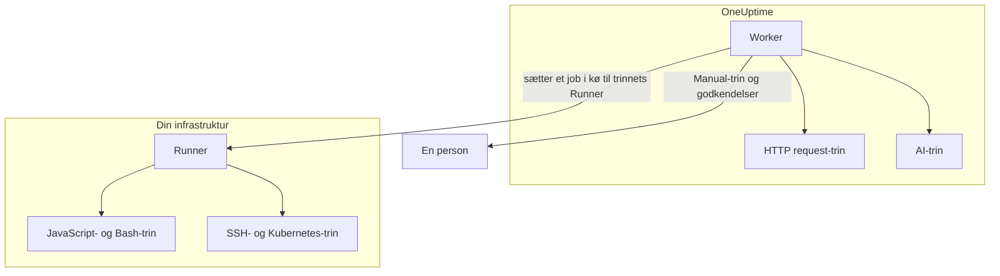

# Runbook-konfiguration & sikkerhed

Dette er referencen for driftsfolk og sikkerhedsgennemgang: hvor hver slags trin kører, hvilke grænser og timeouts et trin holdes til, hvem der må hvad, og hvordan runbooks er hærdet.

:::cards
- [Hvor hver trintype kører](#hvor-hver-trintype-kører): Workeren, en Runner eller en person.
- [Outputgrænser og timeouts](#outputgrænser-og-timeouts): Hver grænse, et trin holdes til.
- [Tilladelser](#tilladelser): Detaljerede tilladelser, de tre runbook-roller, og hvilke runbooks en rolle når.
- [Hærdningsnoter](#hærdningsnoter): Sandkasse, netværksadgang og godkendelse af Runners.
:::

## Hvor hver trintype kører

| Trintype | Kører på | Hvordan |
| --- | --- | --- |
| Manual | En person | Kørslen venter, indtil nogen fuldfører trinnet eller springer det over. |
| JavaScript | En Runner | I en `isolated-vm`-sandkasse. |
| HTTP request | OneUptime Worker | Et udgående HTTP-kald. |
| Bash | En Runner | `bash -c <script>`. |
| SSH | En Runner | En SSH-forbindelse med en [loginoplysning](/docs/runbooks/credentials). |
| Kubernetes | En Runner | Et kald til klyngens API-server med en loginoplysning. |
| AI | OneUptime Worker | Et kald til projektets LLM-udbyder. |

## Sådan sendes Runner-trin ud

JavaScript-, Bash-, SSH- og Kubernetes-trin **kører aldrig på OneUptime Worker**. De sendes som jobs til en bestemt [runbook-agent](/docs/runbooks/agents): en lille proces, du installerer på en vært i din egen infrastruktur.

Udsendelsesmodellen:

1. Den, der skriver runbook-trinnet, vælger en Runner på rullelisten.
2. Når trinnet kører, indsætter Workeren en række i `RunnerJob` med `targetAgentId` sat til den Runners ID og status `Pending`.
3. Netop den Runner (og kun den) overtager jobbet atomisk, kører det lokalt — Bash via `bash -c <script>`, JavaScript i en `isolated-vm`-sandkasse, SSH og Kubernetes med trinnets loginoplysning — og sender resultatet tilbage.
4. Workeren fortsætter runbooket med resultatet.

Der findes ikke længere et miljøflag `RUNBOOK_BASH_ENABLED`. Om disse trin virker i en installation, afhænger alene af, om projektet har en forbundet Runner med **Kører runbooks** slået til.

## Outputgrænser og timeouts

| Grænse | Værdi | Gælder for |
| --- | --- | --- |
| Output pr. trin | **50 KB**. Længere output skæres af med en markør. | Hvert automatiseret trin |
| Udførelsestimeout | **30 sekunder** som standard | JavaScript-, Bash-, SSH- og Kubernetes-trin |
| Anmodningstimeout | **30 sekunder** som standard | HTTP request-trin |
| Overtagelsestimeout | **2 minutter** som standard: hvor længe Workeren venter på, at den valgte Runner overtager jobbet, før det fejles | JavaScript-, Bash-, SSH- og Kubernetes-trin |
| Timeoutinterval | **1 sekund til 1 time** | Hver timeout |
| Venter på en person | Ingen grænse | Manual-trin og godkendelser |

Angiv timeouts pr. trin på runbookets side **Trin**; lad et felt være tomt for at beholde standarden. En værdi uden for intervallet begrænses, når trinnet kører, så en fejlindtastet konfiguration hverken kan slå timeouten fra eller holde en Worker-plads optaget i det uendelige.

## Tilladelser

Runbook-tilladelser ligger i tilladelsesgruppen `Runbook`:

- `CreateRunbook`, `EditRunbook`, `DeleteRunbook`, `ReadRunbook` — administrer runbook-skabeloner.
- `CreateRunbookExecution`, `EditRunbookExecution`, `DeleteRunbookExecution`, `ReadRunbookExecution` — start, afkryds, slet og læs udførelser.
- `CreateRunbookRule`, `EditRunbookRule`, `DeleteRunbookRule`, `ReadRunbookRule` — administrer regler for automatisk start.
- `CreateRunner`, `EditRunner`, `DeleteRunner`, `ReadRunner` — administrer Runners, der kører trin i din egen infrastruktur. (De hed `*RunbookAgent` før omdøbningen til Runner; eksisterende tildelinger er migreret, så intet skal tildeles igen.)
- `RunbookAdmin`, `RunbookMember`, `RunbookViewer` (roller) — `RunbookAdmin` bygger runbooks, deres regler og de Runners, de kører på, og kører dem. `RunbookMember` åbner runbooks og deres kørsler og kører dem — starter en kørsel, fuldfører eller springer dens trin over og annullerer den — men opretter, ændrer og sletter intet runbook og ingen Runner. `RunbookViewer` læser runbooks og deres kørsler og kører intet. `RunbookAdmin` samler alle de detaljerede tilladelser ovenfor.

En rolle kører de runbooks, dens omfang når. En tildeling af `RunbookMember`, `RunbookAdmin` eller `ProjectMember`, der er begrænset til bestemte etiketter, starter og fører kørsler videre for de runbooks, der har de etiketter, en tildeling begrænset til **Owned** for de runbooks, dens team ejer, og et teams blokering af en etiket tager de runbooks fra det. `CreateRunbookExecution` og `EditRunbookExecution` handler om kørsler, som ikke har etiketter, så de når alle runbooks i projektet. At godkende et afhjælpningsforslag, der starter et runbook, kontrolleres på samme måde.

Loginoplysninger og hemmeligheder ligger uden for `RunbookAdmin`. At administrere dem kræver `ProjectOwner` eller `ProjectAdmin` eller tilladelserne `CreateRunbookCredential`, `EditRunbookCredential`, `DeleteRunbookCredential`, `ReadRunbookCredential` og `CreateRunbookSecret`, `EditRunbookSecret`, `DeleteRunbookSecret`, `ReadRunbookSecret`. Se [Runbook-loginoplysninger](/docs/runbooks/credentials).

Ejerreglerne og etiketreglerne under **Runbooks → Indstillinger** ligger også uden for `RunbookAdmin`. At administrere dem kræver `ProjectOwner` eller `ProjectAdmin` eller tilladelserne `CreateRunbookOwnerRule` og `CreateRunbookLabelRule` og deres modstykker til redigering, sletning og læsning.

Hvordan roller og detaljerede tilladelser spiller sammen, kan du læse under [Brugere, teams og tilladelser](/docs/permissions/index).

## Kø og worker

Runbook-udførelser kører i BullMQ-køen `Runbook`. Hver Worker-proces kører op til 25 udførelser ad gangen; tallet er fastlagt i koden og angives ikke med en miljøvariabel.

Når et manuelt trin afkrydses via API'et, sættes udførelsen i kø igen for at fortsætte fra næste trin. Den venter som `Scheduled`, indtil en Worker tager den igen, og en udførelse i kø fejles aldrig, fordi den venter.

## Hærdningsnoter

- **JavaScript, Bash, SSH og Kubernetes** kører på en Runner-vært, du kontrollerer, ikke på OneUptime Worker. JavaScript kører i sit eget `isolated-vm`-isolat med 128 MB hukommelse og uden adgang til Runnerens filsystem eller processer; det kan sende HTTP-anmodninger med `axios`, men anmodninger til private netværk, loopback- og link-local-adresser afvises. Bash kører via `bash -c`, med en timeout, der håndhæves på Runneren.
- **HTTP-trin** bruger en tilladende statusvalidering, så et 4xx- eller 5xx-svar registreres som et mislykket trin i stedet for at blive kastet som en undtagelse, og det registrerede output viser, hvad modparten faktisk returnerede. Omdirigeringer følges ikke. Workeren kalder aldrig loopback- eller link-local-adresser, f.eks. et cloud-metadataendpoint; på OneUptime Cloud afviser den også private netværksadresser, og en selvhostet OneUptime afviser dem med `DATA_SOURCE_BLOCK_PRIVATE_ADDRESSES=true`.
- **AI-trin** ser aldrig private hændelsesnoter eller beskeder fra Slack og Microsoft Teams, og tidligere trins output gennemsøges for hemmeligheder, som sløres, før det når modellen. Indlejrede billeder og lange kodede data udelades af prompten. Se [AI](/docs/runbooks/authoring#ai).
- **Godkendelse af Runners** sker med ID og hemmelig nøgle, sat som miljøvariabler på Runner-containeren. På serveren kommer Runnerens gældende identitet fra den databaserække, der hører til det fremviste ID og den fremviste nøgle: en klient kan ikke udgive sig for at være en anden Runner, heller ikke med en kompromitteret nøgle.
- **Loginoplysninger og hemmeligheder** er krypteret i hvile, returneres aldrig af API'et og udleveres kun til de Runners, de er tildelt, når disse overtager et trin.

## Databasetabeller

| Tabel | Hvad den indeholder |
| --- | --- |
| `Runbook` | Skabelonen: navn, slug, beskrivelse, `isEnabled`, etiketter og trinnene som JSON. |
| `RunbookExecution` | Én række pr. kørsel med de valgfrie fremmednøgler `incidentId`, `alertId` og `scheduledMaintenanceId` og et JSON-array `stepExecutions`, der fastholder trinnene og hvert trins tilstand. |
| `RunbookRule` | Regler for automatisk start med en diskriminator `triggerEntityType` (Incident, Alert, ScheduledMaintenance), en mange-til-mange-relation til de runbooks, der skal startes, og det, de matcher på: en JSON-kolonne `criteria` (betingelserne) plus mange-til-mange-links til monitorer, hændelsesalvorligheder, advarselsalvorligheder, etiketter og monitoretiketter samt mønstre for titel, beskrivelse, monitornavn og monitorbeskrivelse. |
| `Runner` | Én række pr. installeret Runner: navn, hemmelig nøgle, `lastAlive`, `connectionStatus`, værtsoplysninger og funktioner. |
| `RunnerJob` | Én række pr. trin sendt til en Runner: `targetAgentId` (den Runner, trinnets forfatter valgte), trintype, script eller nyttelast, status (`Pending` → `Claimed` → `Running` → `Succeeded`, `Failed`, `TimedOut` eller `Cancelled`), overtagelsesfrist, lease, output og exitkode. |
| `RunbookCredential` | SSH- og Kubernetes-loginoplysninger med krypterede hemmelige felter og de Runners, de er tildelt. |
| `RunbookSecret` | Runbook-hemmeligheder, krypteret, og de Runners, der må modtage dem. |

## Driftstips

- **Sørg for, at den Runner, du vælger på et trin, er sund.** Har du brug for redundans, så kør en Runner til og fordel dine trin mellem dem, eller hav et reserve-runbook, der peger på den anden Runner.
- **Gem URL'er, ikke blobs.** Giver et trin mere end et par KB output, så skriv det til objektlagring eller din logstak, og returner URL'en.
- **Idempotens betyder noget.** Et HTTP request- eller AI-trin kører igen, hvis Workeren genstarter midt i trinnet, og kørslen genoptages. Et trin på en Runner sendes højst én gang pr. udførelse, men et script kan have kørt delvist før en fejl, og du kører måske runbooket igen. Design trin, så de tåler at blive gentaget.

## Næste skridt

:::cards
- [Runbook-agenter](/docs/runbooks/agents): Installer, drift og fejlfind Runners.
- [Runbook-loginoplysninger](/docs/runbooks/credentials): Administreret SSH- og Kubernetes-adgang og hemmeligheder til scripts.
- [Brugere, teams og tilladelser](/docs/permissions/index): Hvordan roller, etiketter og teams afgør, hvem der kører hvad.
:::
