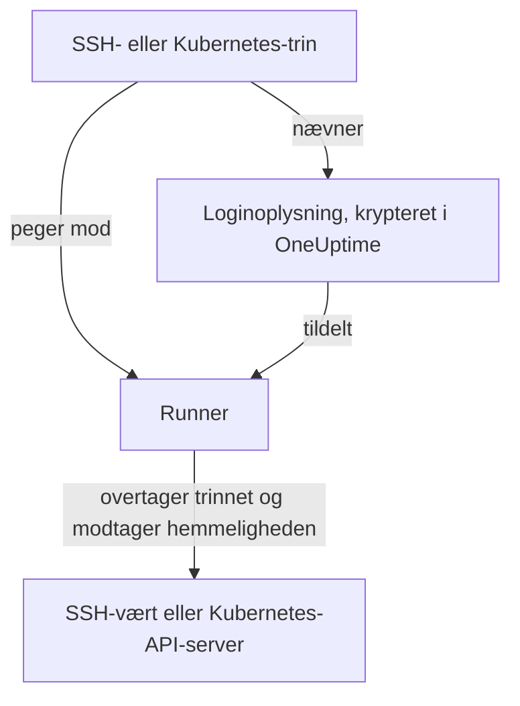

# Runbook-loginoplysninger

En loginoplysning er den måde, et runbook når noget, der **ikke** er Runnerens egen vært: en server via SSH eller en Kubernetes-klynge. Uden den betyder "genstart tjenesten", at du skriver et shell-script og manuelt lægger en nøgle eller en kubeconfig på Runnerens vært, hvor den ligger på disken uden for OneUptimes kontrol. En loginoplysning er den samme adgang som et administreret objekt: krypteret i hvile, tildelt bestemte Runners og refereret ved navn fra et trin.

Administrer dem under **Runbooks → Runbook-agenter → Loginoplysninger**.

:::cards
- [Opret en loginoplysning](#opret-en-loginoplysning): Dens adgang og de Runners, der må bruge den.
- [Mindste privilegium i den anden ende](#mindste-privilegium-i-den-anden-ende): Begræns, hvad nøglen eller tokenet kan gøre.
- [Hemmeligheder til scripts](#hemmeligheder-til-scripts): Giv et Bash- eller JavaScript-script en adgangskode eller et token.
:::

## Sådan bruges en loginoplysning



Et SSH- eller Kubernetes-trin nævner en loginoplysning og en Runner. Når den Runner overtager trinnet, kontrollerer OneUptime, at loginoplysningen er tildelt den, dekrypterer hemmeligheden og udleverer den kun i svaret på den overtagelse. Hemmeligheden gemmes aldrig på jobbet og kan aldrig læses via API'et.

## Før du går i gang

- **En rolle, der administrerer loginoplysninger.** Project Owner og Project Admin, eller alle med tilladelsen **Create Runbook Credential**. Rollen Runbook Admin omfatter den ikke. At tildele en SSH-loginoplysning til en Runner, der kører OneUptime AI's kommandoer, kræver også **Read Runbook Credential**; se [Runners, der kører OneUptime AI's kommandoer](#runners-der-kører-oneuptime-ais-kommandoer).
- **Et abonnement, der omfatter dem.** På OneUptime Cloud kræver runbook-loginoplysninger abonnementet **Growth** eller højere.
- **En [Runner](/docs/runbooks/agents)**, der kan nå værten eller klyngens API-server over netværket.

## Opret en loginoplysning

:::steps
### Åbn Loginoplysninger

Åbn **Runbooks → Runbook-agenter → Loginoplysninger**, og klik på **Opret Runbook Credential**.

### Navngiv den, og vælg dens type

I trinnet **Credential** angiver du et **Navn**, f.eks. `prod-cluster`, en valgfri **Beskrivelse** og **Type**: **SSH** eller **Kubernetes**. Typen kan ikke ændres senere; opret i stedet en ny loginoplysning.

### Angiv adgangen

:::tabs
@tab SSH
Under **SSH-vært** angiver du **Værtsnavn**, **Port** (22, hvis feltet er tomt) og **Brugernavn**. Under **SSH-godkendelse** indsætter du en **Private Key (PEM)** med dens **Private Key Passphrase**, hvis den har en, eller angiver en **Adgangskode** til en vært uden nøgleadgang. En nøgle er det bedste valg, når du har valget.
@tab Kubernetes
Under **Kubernetes** angiver du **API Server URL**, f.eks. `https://10.0.0.1:6443`, **Service Account Token** og **CA Certificate (PEM)**, så Runneren kan verificere API-serveren. Lad kun CA'en være tom, hvis API-serveren præsenterer et certifikat, som Runneren allerede stoler på.
:::

### Tildel den til Runners

I trinnet **Runbook-agenter** vælger du de Runners, der må bruge loginoplysningen, og klikker så på **Opret Runbook Credential**. En loginoplysning, der ikke er tildelt nogen Runner, kan ikke bruges af noget trin.

### Brug den i et trin

I et [SSH- eller Kubernetes-trin](/docs/runbooks/authoring#trintyper) vælger du en af de Runners og derefter loginoplysningen under **Credential**. Et trin tilbyder kun loginoplysninger af sin egen type, og at gemme et trin, der nævner en loginoplysning, kræver tilladelse til at læse runbook-loginoplysninger.
:::

## Hvad der gemmes

| Type | Felter |
| --- | --- |
| SSH | Værtsnavn, port (22 som standard), brugernavn og enten en privat PEM-nøgle (med valgfri adgangssætning) eller en adgangskode. |
| Kubernetes | API-serverens URL, et serviceaccount-token og klyngens CA-certifikat. |

## Hemmelige værdier kan kun skrives

Private nøgler, adgangssætninger, adgangskoder og serviceaccount-tokens er krypteret i hvile, og API'et **returnerer dem aldrig**: hverken til dashboardet, til et workflow eller til en eksport. Tabellen kan vise dig, hvad en loginoplysning *er*, uden nogensinde at vise, hvad den indeholder.

Der er derfor ingen "vis" for en hemmelig værdi, kun "erstat": at indtaste en værdi igen er måden at udskifte den på. Har du mistet originalen, så udsted en ny nøgle på målsystemet, og opdater loginoplysningen.

## Tildel en loginoplysning til Runners

En loginoplysning kan kun bruges af de Runners, du tildeler den, og et trin skal pege mod en af dem. Nævner et trin en loginoplysning, der ikke er tildelt dets Runner, **fejler trinnet i stedet for at køre**: en Runner, der stille og roligt ikke gør noget, ligner præcis en, der virkede.

Tildelingen er adgangsgrænsen, så hold den smal: en Runner, der kun nogensinde genstarter én klynge, har ikke brug for SSH-nøglen til dine databaseværter.

### Runners, der kører OneUptime AI's kommandoer

På en Runner med **Kører AI-afhjælpningskommandoer** slået til vælger OneUptime AI blandt de SSH-loginoplysninger, der er tildelt Runneren, til de kommandoer, den kører der. Derfor når en SSH-loginoplysning kun en sådan Runner gennem en person, der må læse runbook-loginoplysninger (**Read Runbook Credential**, eller en Project Owner eller Project Admin), uanset hvad der gemmes først:

- **Tildel loginoplysningen.** At oprette en SSH-loginoplysning med en sådan Runner, eller tilføje en sådan Runner til en, kræver den tilladelse. Uden den afvises gemningen og nævner Runneren: tildel loginoplysningen til Runners, der ikke kører AI-afhjælpningskommandoer, eller bed en med tilladelsen om at tildele den.
- **Slå kontakten til.** At slå **Kører AI-afhjælpningskommandoer** til for en Runner, der har SSH-loginoplysninger, kræver samme tilladelse.

At fjerne Runners fra en loginoplysning, gemme en loginoplysning med de Runners, den allerede har, og Kubernetes-loginoplysninger kræver ikke mere: OneUptime AI's kubectl-kommandoer kører med den loginoplysning, der er bundet til deres klynge. Tildelinger af loginoplysninger og aktivering af kontakten foretaget af en uden den tilladelse gemmes én ad gangen i et projekt, så de to ikke kan bestå deres kontroller sammen; en gemning, der kommer, mens en anden gemmes, venter på den, og tager det for lang tid, afvises den med *Try again in a moment*. Gem igen.

Et workflows trin handler som Project Admin, men låner ikke en Project Admins læsning af runbook-loginoplysninger: et trin har den kun, hvis den person, der sidst gemte workflowets trin, har den. Se [Hvad workflow-trin må gøre](/docs/workflows/configuration#hvad-workflow-trin-må-gøre).

## Mindste privilegium i den anden ende

OneUptime kan ikke begrænse, hvad din loginoplysning må gøre på målsystemet: det er målsystemets opgave, og det er værd at gøre:

- **SSH** — foretræk en nøgle frem for en adgangskode, giv brugeren kun de kommandoer, den har brug for (en tvungen kommando eller en begrænset shell, hvor det er praktisk), og genbrug ikke en administrators personlige nøgle.
- **Kubernetes** — bind serviceaccounten til en Role, der tillader `patch` på præcis de arbejdsbelastninger, dine runbooks rører, i præcis de namespaces, de kører i. **Restart workload** ændrer selve arbejdsbelastningen, og **Scale workload** ændrer dens `scale`-underressource: mere er ikke nødvendigt.

For eksempel en serviceaccount, der må genstarte og skalere én Deployment og intet andet:

```yaml title="oneuptime-runbooks-rbac.yaml"
apiVersion: v1
kind: ServiceAccount
metadata:
  name: oneuptime-runbooks
  namespace: checkout
---
apiVersion: rbac.authorization.k8s.io/v1
kind: Role
metadata:
  name: oneuptime-runbooks
  namespace: checkout
rules:
  # Restart workload: patches the Deployment's pod template.
  - apiGroups: ["apps"]
    resources: ["deployments"]
    resourceNames: ["checkout-api"]
    verbs: ["patch"]
  # Scale workload: patches the Deployment's scale subresource.
  - apiGroups: ["apps"]
    resources: ["deployments/scale"]
    resourceNames: ["checkout-api"]
    verbs: ["patch"]
---
apiVersion: rbac.authorization.k8s.io/v1
kind: RoleBinding
metadata:
  name: oneuptime-runbooks
  namespace: checkout
subjects:
  - kind: ServiceAccount
    name: oneuptime-runbooks
    namespace: checkout
roleRef:
  apiGroup: rbac.authorization.k8s.io
  kind: Role
  name: oneuptime-runbooks
```

Til et StatefulSet eller DaemonSet bruger du i stedet `statefulsets` eller `daemonsets`. Et DaemonSet kan ikke skaleres, så det har ikke brug for en `scale`-regel.

## Hemmeligheder til scripts

Bash- og JavaScript-trin har intet felt **Credential**. For at give et script en adgangskode, et token eller en API-nøgle uden at skrive den i runbooket gemmer du den som en **runbook-hemmelighed**. Hemmeligheder administreres under **Runbooks → Indstillinger → Hemmeligheder** af Project Owners og Project Admins eller med tilladelsen **Create Runbook Secret**.

:::steps
### Opret hemmeligheden

Klik på **Opret Runbook Secret**. I trinnet **Hemmelighed** angiver du et **Navn** (bogstaver, tal, bindestreger og understreger), en valgfri **Beskrivelse** og **Værdi af hemmelighed**. I trinnet **Adgang** vælger du Runnerne under **Runbook-agenter, der har adgang til denne hemmelighed**.

### Brug den i et script

Skriv `{{runbookSecrets.NAME}}`, hvor værdien skal stå:

```bash
curl -s -X POST \
  -H "Authorization: Bearer {{runbookSecrets.CDN_API_TOKEN}}" \
  "https://api.cdn.example.com/v1/purge"
```

Når en Runner, som hemmeligheden er tildelt, overtager trinnet, modtager den scriptet med værdien udfyldt.
:::

Ligesom en loginoplysnings hemmelige felter er en hemmeligheds værdi krypteret i hvile og returneres aldrig af API'et: **Opdater hemmelig værdi** erstatter den. På OneUptime Cloud kræver runbook-hemmeligheder også abonnementet **Growth** eller højere.

| | Loginoplysning | Runbook-hemmelighed |
| --- | --- | --- |
| Bruges af | SSH- og Kubernetes-trin | Bash- og JavaScript-scripts |
| Indeholder | En vært og dens nøgle, eller en klynges URL og token | En hvilken som helst enkelt værdi |
| Administreres under | **Runbooks → Runbook-agenter → Loginoplysninger** | **Runbooks → Indstillinger → Hemmeligheder** |
| Når Runneren | I svaret på overtagelsen af et trin, der nævner den | Udfyldt i scriptet for det trin, den overtager |
| Kan læses igen via API'et | Kun dens ikke-hemmelige felter | Aldrig dens værdi |

## Hvem kan se dem

At oprette, redigere og slette loginoplysninger kræver tilladelserne til runbook-loginoplysninger (eller Project Owner/Admin). At læse en loginoplysning viser kun dens ikke-hemmelige felter.

Bemærk, at en Runners **agentnøgle** svarer til de loginoplysninger, der er tildelt den Runner: alt, der har nøglen, kan overtage arbejde som den Runner og modtage loginoplysninger. Derfor kan agentnøgler kun læses af Project Owners, Project Admins og Runbook Admins: behandl dem, som du ville behandle selve loginoplysningerne.

## Næste skridt

:::cards
- [Skriv et runbook](/docs/runbooks/authoring): Skriv de SSH- og Kubernetes-trin, der bruger en loginoplysning.
- [Runbook-agenter](/docs/runbooks/agents): Installer den Runner, som en loginoplysning tildeles.
- [Runbook-konfiguration & sikkerhed](/docs/runbooks/configuration): Tilladelser og hærdning for hele runbook-stakken.
:::
