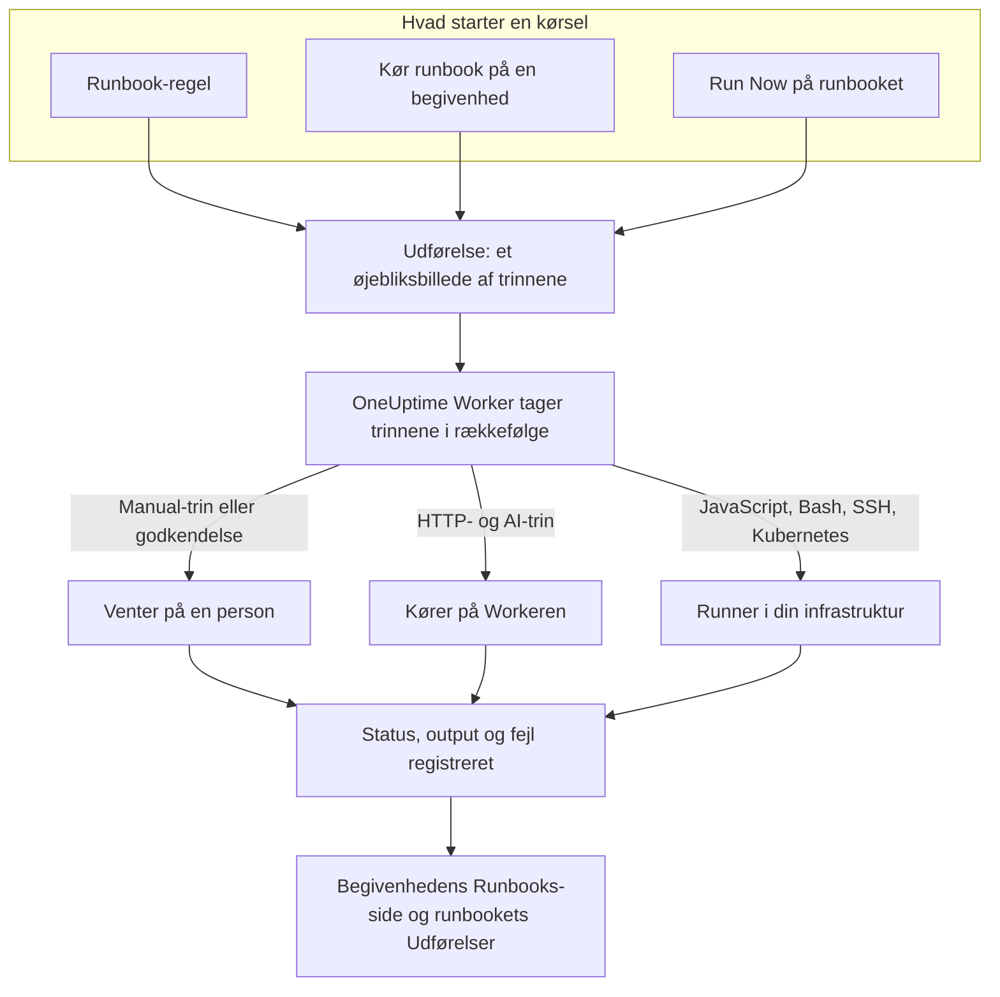

# Runbooks – Oversigt

Et runbook er en genbrugelig responsprocedure: en ordnet liste af manuelle og automatiserede trin, som du kører på en hændelse, en advarsel eller en planlagt vedligeholdelsesbegivenhed. Det gør tråden "hvad gør vi nu?" til en tjekliste, som alle med vagt kan følge klokken 3 om natten, med scripts, API-kald og godkendelser allerede skrevet. Runbooks er til vagthavende ingeniører, der reagerer på hændelser, og til platformteams, der automatiserer den respons.

:::cards
- [Skriv et runbook](/docs/runbooks/authoring): Opret et runbook, og skriv dets trin.
- [Runbook-regler](/docs/runbooks/rules): Start runbooks ved nye hændelser, advarsler og vedligeholdelsesbegivenheder.
- [Kør et runbook](/docs/runbooks/running): Start en kørsel, fuldfør og godkend dens trin, annuller den.
- [Runbook-agenter](/docs/runbooks/agents): Installer den Runner, der kører dine scripts i din egen infrastruktur.
:::

## Sådan kører et runbook



Hver kørsel er en **udførelse**. Når den starter, kopieres runbookets trin over på den, og OneUptime arbejder sig igennem dem i rækkefølge. Et Manual-trin, eller et trin der kræver godkendelse, sætter kørslen på pause, indtil nogen handler.

HTTP- og AI-trin kører på OneUptime Worker. JavaScript-, Bash-, SSH- og Kubernetes-trin kører på en [Runner](/docs/runbooks/agents), som du installerer i din egen infrastruktur, så dine scripts aldrig kører på OneUptimes servere. Hvert trins status, output og fejlmeddelelse registreres på udførelsen, som bliver ved den hændelse, advarsel eller begivenhed, den kørte for.

## Centrale begreber

| Begreb | Betydning |
| --- | --- |
| **Runbook** | Skabelonen. En navngivet, genbrugelig procedure med en ordnet liste af trin og en kontakt **Kør dette runbook**. |
| **Trin** | Ét punkt i et runbook. Det har en type (Manual, JavaScript, HTTP request, Bash, SSH, Kubernetes eller AI), en titel, en beskrivelse og typespecifikke indstillinger. |
| **Runbook-regel** | En regel, der automatisk knytter et eller flere runbooks til hændelser, advarsler eller planlagte vedligeholdelsesbegivenheder, der opfylder dens betingelser: deres monitorer, alvorlighed, etiketter, monitoretiketter, titel eller beskrivelse. |
| **Udførelse** | Én kørsel af et runbook. Oprettes, når en regel udløses, når nogen klikker på **Kør runbook** på en begivenhed, eller når nogen klikker på **Run Now** på selve runbooket. Den rummer et øjebliksbillede af trinnene og hvert trins status og output. |
| **Øjebliksbillede** | Den fastfrosne kopi af runbookets trin, der ligger på hver udførelse. Du kan redigere runbooket senere uden at omskrive historikken for tidligere kørsler. |
| **Runner** | En lille agent, du kører på en vært i din egen infrastruktur. Den kører de JavaScript-, Bash-, SSH- og Kubernetes-trin, der nævner den. Kaldes også en runbook-agent. |
| **Loginoplysning** | Administreret SSH- eller Kubernetes-adgang, som SSH- og Kubernetes-trin bruger. Krypteret i hvile og kun udleveret til de Runners, du tildeler den. |
| **Hemmelighed** | En enkelt værdi, f.eks. et API-token, som et Bash- eller JavaScript-script bruger som `{{runbookSecrets.NAME}}`. Krypteret i hvile og kun udleveret til de Runners, du tildeler den. |

## Trintyper

Vælg den type, der passer til hvert trin. [Skriv et runbook](/docs/runbooks/authoring) beskriver hver types indstillinger.

| Trintype | Kører på | Brug den, når… | Eksempel |
| --- | --- | --- | --- |
| **Manual** | En person | Et menneske skal kontrollere noget, træffe en vurdering eller handle, hvor OneUptime ikke kan. | "Bekræft, at trafikken er flyttet til den sekundære region." |
| **JavaScript** | En Runner | Du har brug for en lille, afgrænset beregning i en sandkasse. | Beregn replikaforsinkelsen, og afgør, om du skal fortsætte. |
| **HTTP request** | OneUptime Worker | Du kalder et eksisterende API: en cloududbyder, PagerDuty, en Slack-webhook, din egen tjeneste. | `POST` til din failover-orkestrator. |
| **Bash** | En Runner | Du har brug for shell-kommandoer på din egen infrastruktur. | Kør `kubectl rollout restart` eller et gendannelsesscript. |
| **SSH** | En Runner | Du har brug for én kommando på en fjernvært med en administreret SSH-loginoplysning. | Genstart en tjeneste på en webserver. |
| **Kubernetes** | En Runner | Du skal genstarte eller skalere en Deployment, et StatefulSet eller et DaemonSet. | Genstart `checkout-api` i `production`. |
| **AI** | OneUptime Worker | Du vil have en analyse, et resumé eller en vurdering midt i kørslen fra dit projekts LLM-udbyder. | "Gennemgå diagnosticeringen ovenfor. Er det sikkert at lave failover?" |

Et runbook kan blande dem alle. Styrken ved runbooks er at flette menneskelige kontroller sammen med automatisering og AI-analyse.

## Hvad starter en kørsel

| Hvordan | Hvor | Udførelsen knyttes til |
| --- | --- | --- |
| En runbook-regel | **Hændelser**, **Advarsler** eller **Planlagt vedligeholdelse** → **Regler** → **Runbook-regler** | Den nye hændelse, advarsel eller begivenhed |
| **Kør runbook** | Siden **Runbooks** for en hændelse, en advarsel eller en planlagt vedligeholdelsesbegivenhed | Den begivenhed |
| **Run Now** | Runbookets side **Oversigt** | Intet: en ad hoc-kørsel |
| En regel for automatisk afhjælpning | Se [AI SRE](/docs/ai/ai-sre) | Hændelsen eller advarslen |

Et runbook, hvis kontakt **Kør dette runbook** er slået fra på siden **Indstillinger**, startes ikke af nogen af disse. Kørsler, der allerede er startet, fortsætter.

## Hvor runbooks ligger i dashboardet

Runbooks ligger under **Produkter**, i gruppen **Dashboards og automatisering**.

| Side | Hvad du gør der |
| --- | --- |
| **Produkter → Runbooks** | Gennemse, opret og åbn runbooks. |
| Et runbooks **Trin** | Skriv og omarranger dets trin, og vælg så **Save Steps**. |
| Et runbooks **Oversigt** | Se den seneste kørsel og resultaterne, og klik på **Run Now**. |
| Et runbooks **Udførelser** | Alle kørsler af dette runbook, filtreret efter status eller startdato. |
| Et runbooks **Ejere** | Tilføj de personer og teams, der er ansvarlige for det. |
| Et runbooks **Indstillinger** | Slå **Kør dette runbook** fra uden at slette runbooket. |
| **Runbooks → Udførelser** | Alle kørsler af alle runbooks i projektet. |
| **Runbooks → Runbook-agenter** og **Runbooks → Runbook-agenter → Loginoplysninger** | Installer [Runners](/docs/runbooks/agents), og administrer [loginoplysninger](/docs/runbooks/credentials). |
| **Runbooks → Indstillinger** | Administrer [hemmeligheder](/docs/runbooks/credentials#hemmeligheder-til-scripts) til scripts, samt de **Ejerregler** og **Etiketregler**, der tilføjer ejere og etiketter til nye runbooks. |
| **Hændelser / Advarsler / Planlagt vedligeholdelse → Regler → Runbook-regler** | Opret de regler, der starter runbooks automatisk. |
| En hændelse, advarsel eller vedligeholdelsesbegivenhed → **Runbooks** | Se de kørsler, der er knyttet til den, og klik på **Kør runbook** for at starte en. |

## Et gennemgået eksempel

Antag, at hver hændelse med "db-primary" i titlen skal starte et database-failover-runbook med fem trin.

:::steps
### Opret runbooket

Under **Runbooks** klikker du på **Opret Runbook** og kalder det "DB primary failover". Åbn det, gå til **Trin**, tilføj disse trin, og klik så på **Save Steps**:

| # | Type | Titel |
| --- | --- | --- |
| 1 | JavaScript | Registrer replikaforsinkelsen før failover |
| 2 | Manual | Bekræft i DBA-dashboardet, at replikaen er sund |
| 3 | HTTP request | `POST` til failover-orkestratoren |
| 4 | Manual | Kontrollér, at skrivninger går til den nye primære |
| 5 | HTTP request | Send afblæsningen til `#db-incidents` i Slack |

### Tilføj en regel

Under **Hændelser → Regler → Runbook-regler** opretter du en regel med én betingelse og det runbook, der skal startes:

```text
Conditions:  Incident Title starts with db-primary
Runbooks:    [DB primary failover]
```

### Lad det køre

En monitor åbner hændelsen `INC-4821 · db-primary connection timeout`. Reglen matcher, og en udførelse starter:

- Trin 1 (JavaScript) kører på den Runner, du valgte til det. Returværdien, f.eks. `{ lagMs: 412 }`, registreres.
- Trin 2 (Manual) sætter kørslen på pause, som viser **Venter på dig**. Den vagthavende tjekker dashboardet og klikker på **Mark complete**.
- Trin 3 (HTTP request) kører, og svaret på `POST` registreres.
- Trin 4 (Manual) sætter kørslen på pause igen, indtil nogen fuldfører det.
- Trin 5 (HTTP request) kører, og udførelsen er **Fuldført**.

### Gennemgå den

Udførelsen bliver på hændelsens side **Runbooks**. Når du skriver postmortem, er hvert trins output, fejl og timing ét klik væk.
:::

## Almindelige anvendelser

- **Database-failover**: registrer tilstanden med JavaScript, bed den vagthavende DBA om at bekræfte replikaens tilstand (Manual), kald orkestratoren (HTTP request), bekræft DNS (Manual), send afblæsningen (HTTP request).
- **Tømning af cache**: én HTTP-anmodning, og derefter et Manual-trin "bekræft, at cache-hitraten er ved at komme sig".
- **Hændelse med kundepåvirkning**: Manual "send en opdatering på statussiden", en HTTP-anmodning for at give supportteamet besked, JavaScript for at hente listen over berørte konti.
- **Forhåndstjek før planlagt vedligeholdelse**: tag et øjebliksbillede af metrikker, bekræft ændringsvinduet med interessenterne (Manual), slå vedligeholdelsestilstand til på load balanceren (HTTP request).
- **Diagnosticer, og ret så**: et Bash-trin indsamler diagnosticering, et AI-trin med **Kræv godkendelse** læser den og anbefaler en rettelse, og et Kubernetes-trin genstarter arbejdsbelastningen, først når en person har godkendt.
- **Hygiejne, der altid kører**: en regel uden betingelser, der registrerer systemets tilstand ved hver hændelse til postmortem.

## Sådan passer runbooks ind i resten af OneUptime

- **Monitorer** åbner hændelser og advarsler, og **runbook-regler** gør dem til runbook-udførelser: opdag, udløs, reager, registrer.
- **[Vagtpolitikker](/docs/on-call/schedules)** afgør, hvem der tilkaldes. Runbooks afgør, hvad den person gør, når vedkommende er vågen.
- **[Workspace-forbindelser](/docs/workspace-connections/slack)** som Slack og Microsoft Teams er naturlige mål for HTTP-anmodningstrin, der sender opdateringer.
- **[Statussider](/docs/status-pages/index)** opdateres ofte som et Manual-trin i et kunderettet runbook.

## Næste skridt

:::cards
- [Skriv et runbook](/docs/runbooks/authoring): Opret dit første runbook og dets trin.
- [Runbook-agenter](/docs/runbooks/agents): Installer en Runner, før du skriver et JavaScript-, Bash-, SSH- eller Kubernetes-trin.
- [Runbook-regler](/docs/runbooks/rules): Start runbooks automatisk, når der oprettes hændelser.
- [Runbook-konfiguration & sikkerhed](/docs/runbooks/configuration): Grænser, timeouts, tilladelser og hærdning.
:::
