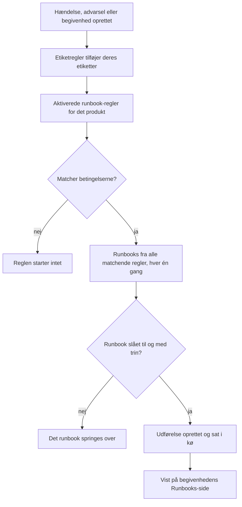

# Runbook-regler

Runbook-regler starter runbooks automatisk, når en **hændelse**, en **advarsel** eller en **planlagt vedligeholdelsesbegivenhed** oprettes, så ingen skal huske at køre dem midt i et nedbrud. Hvert produkt har sin egen regelside i sin menu **Regler**:

- Hændelser → Regler → **Runbook-regler**
- Advarsler → Regler → **Runbook-regler**
- Planlagt vedligeholdelse → Regler → **Runbook-regler**

Alle tre sider redigerer samme slags regel, filtreret til det pågældende produkts regler.

:::cards
- [Opret en runbook-regel](#opret-en-runbook-regel): Fire trin: et navn, betingelser og de runbooks, der skal startes.
- [Betingelser](#betingelser): Hvert kriterium og hver operator, en regel kan bruge.
- [Matchlogik](#matchlogik): Flere regler, monitorbetingelser og etiketregler.
- [Eksempler](#eksempler): Tre regler at kopiere.
:::

## Sådan starter en regel et runbook



Når en regel udløses, sker følgende for hvert runbook, den nævner:

1. Runbooket indlæses.
2. Dets trin kopieres som et **øjebliksbillede** over på en ny runbook-udførelse.
3. Udførelsen sættes i runbook-workerens kø.
4. Udførelsen knyttes til kildeenheden: den vises på siden **Runbooks** for hændelsen, advarslen eller den planlagte vedligeholdelsesbegivenhed og på runbookets liste **Udførelser**.

Du kan se alle kørsler, startet af en regel eller ej, under **Runbooks → Udførelser**, filtreret efter status, runbook eller startdato.

## Før du går i gang

- **Et runbook, der kan køre.** Det skal have mindst ét trin og **Kør dette runbook** slået til på dets side **Indstillinger**. Se [Skriv et runbook](/docs/runbooks/authoring).
- **Tilladelse til at administrere regler.** Project Owner, Project Admin og Runbook Admin opretter runbook-regler, ligesom alle med tilladelsen **Create Runbook Rule**.

## Opret en runbook-regel

:::steps
### Åbn Runbook-regler

I **Hændelser**, **Advarsler** eller **Planlagt vedligeholdelse** åbner du **Regler → Runbook-regler** og klikker på **Opret Runbook Rule**.

### Navngiv reglen

Under **Grundlæggende oplysninger** angiver du et **Navn**, f.eks. "Start DB-failover ved databasehændelser", og eventuelt en **Beskrivelse**.

### Tilføj betingelser

Under **Matchkriterier** klikker du på **Tilføj betingelse**, vælger et kriterium og en operator og indtaster eller vælger værdien. Tilføj flere betingelser, hvis du har brug for det, og vælg **Alle skal matche** eller **Én skal matche**. Tilføj ingen for at starte runbooks ved hver ny begivenhed af denne slags.

### Vælg runbooks

Under **Runbooks** vælger du et eller flere **Driftsmanualer til at starte** og klikker på **Opret Runbook Rule**. Reglen er aktiv, så snart den er oprettet, og vises på listen med status **Aktiveret**.
:::

## En regels opbygning

| Felt | Formål |
| --- | --- |
| **Navn** | En kort, forståelig betegnelse for reglen. |
| **Beskrivelse** | Valgfri kontekst til holdkammerater. |
| **Aktiveret** | Slået til for en ny regel. Slå den fra i reglens redigeringsformular for at sætte den på pause uden at slette den. |
| **Betingelser** | Hvad reglen matcher, i trinnet **Matchkriterier**. Lad den være tom for at matche hver begivenhed af dens type. |
| **Driftsmanualer til at starte** | Et eller flere runbooks, der startes, når reglen udløses. |

## Betingelser

Hver betingelse sammenligner én ting ved hændelsen, advarslen eller den planlagte vedligeholdelsesbegivenhed med en værdi, du angiver. En runbook-regel tilbyder de samme kriterier som produktets andre regler: en runbook-regel for hændelser matcher på det samme som en privatlivs- eller vagtregel for hændelser.

| Kriterium | Hvad det kontrollerer |
| --- | --- |
| **Monitorer** | De monitorer, hændelsen eller den planlagte vedligeholdelsesbegivenhed berører, eller den monitor, der udløste advarslen. |
| **Hændelse Alvorligheder** / **Advarsel Alvorligheder** | Hændelsens eller advarslens alvorlighed. Planlagte vedligeholdelsesbegivenheder har ingen alvorlighed, så deres regler tilbyder det ikke. |
| **Hændelsesetiketter** / **Advarselsmærkater** / **Begivenhedsetiketter** | Etiketterne på selve hændelsen, advarslen eller begivenheden, inklusive dem, etiketregler tilføjede ved oprettelsen. |
| **Overvågningsetiketter** | Etiketterne på dens monitorer. Giv dine monitorer etiketten `production` eller `staging` for kun at køre et runbook i ét miljø. |
| **Hændelsestitel** / **Advarselstitel** / **Begivenhedstitel** | Dens titel. |
| **Hændelsesbeskrivelse** / **Beskrivelse af advarsel** | Dens beskrivelse (også for begivenheder, hvor dashboardet bruger samme betegnelse). |
| **Overvågningsnavn** / **Overvågningsbeskrivelse** | Navnet eller beskrivelsen af dens monitorer. |

Vælg en operator for hver betingelse:

- Et listekriterium — **Monitorer**, alvorlighederne og etiketterne — bruger **Har en af**, **Har alle** eller **Har ingen af** de valgte værdier.
- Et tekstkriterium bruger **Indeholder** (som en ny betingelse starter med), **Indeholder ikke**, **Er lig med**, **Er ikke lig med**, **Starter med**, **Slutter med** eller **Matcher mønster** / **Matcher ikke mønster** for et regulært udtryk uden forskel på store og små bogstaver eller et `*`-jokertegn. Tekstsammenligninger ignorerer store og små bogstaver.

Med to eller flere betingelser vælger du **Alle skal matche** (hver betingelse skal være sand) eller **Én skal matche** (mindst én skal være det).

## Matchlogik

- En regel uden betingelser gælder hver begivenhed af dens type (en global "kør altid"-regel).
- Flere regler kan matche samme begivenhed. Hvert match udløses, og foreningsmængden af deres runbooks kører: hvert runbook får sin egen udførelse, og et runbook, som to matchende regler nævner, kører én gang.
- Monitorbetingelser kontrolleres én monitor ad gangen. Med **Alle skal matche** kræver "**Overvågningsnavn** indeholder `api`" og "**Overvågningsetiketter** har en af _Production_" én monitor, der opfylder begge, ikke én monitor for hver.
- Runbook-regler kører efter etiketregler, så en etiket, som en etiketregel sætter på en ny hændelse, advarsel eller begivenhed, kan starte et runbook.
- En hændelse eller advarsel, der oprettes allerede løst, starter intet runbook: den var forbi, før den blev registreret. Se [Oprettet allerede bekræftet eller løst](/docs/incidents/declaring-incidents#erklæret-allerede-bekræftet-eller-løst).
- En betingelse på et andet produkts alvorlighed — f.eks. **Advarsel Alvorligheder** i en hændelsesregel — kan aldrig blive sand, så API'et nægter at gemme den.
- Regler evalueres én gang, når begivenheden oprettes. At redigere en hændelses titel, alvorlighed eller etiketter senere udløser ikke reglerne igen.

## Eksempler

### DB-failover ved databasehændelser

```text
Name:        Start DB failover for DB incidents
Trigger:     Incident
Conditions:  Incident Title matches pattern (?:^|\b)(db|database|postgres|mysql|mongo)
Runbooks:    [DB failover playbook, Notify DBA team]
```

Dette opretter to runbook-udførelser, hver gang der oprettes en hændelse med "db", "database", "postgres" og så videre i titlen.

### Kun ved kritiske produktionshændelser

```text
Name:        Flush the CDN cache for critical production incidents
Trigger:     Incident
Conditions:  Match all
             Monitor Labels has any of Production
             Incident Severities has any of Critical
Runbooks:    [Flush CDN cache]
```

Kører ved en kritisk hændelse på en monitor med etiketten _Production_, og ved intet på staging.

### Hygiejneregel, der altid kører

```text
Name:        Always-run pre-flight check
Trigger:     Incident
Conditions:  (none)
Runbooks:    [Capture pre-incident state]
```

Udløses ved hver hændelse: nyttigt til at registrere øjebliksbilleder af systemets tilstand, metrikker og lignende til postmortem.

## Deaktiverede runbooks

Hvis en regel nævner et runbook, der er slået fra (**Kør dette runbook** slået fra på runbookets side **Indstillinger**, `isEnabled = false`), matcher reglen stadig, men runbook-udførelsen springes over. Slå kontakten til igen for at fortsætte. Et runbook uden trin springes over på samme måde.

## Test en regel

Før du stoler på en regel i produktion, opretter du en testhændelse (eller testadvarsel), der opfylder reglens betingelser, og kontrollerer, at de forventede runbooks vises på dens side **Runbooks**.

> [!NOTE]
> Runbook-regler virker kun på nye begivenheder. I modsætning til etiket- og ejerregler kan de ikke [køres på eksisterende poster](/docs/configuration/run-rules-now): det ville starte runbooks for hændelser, der allerede er overstået.

## Fejlfinding

:::details En regel matchede, men intet runbook kørte
Kontrollér i denne rækkefølge:

- Reglen er **Aktiveret**.
- Hvert runbook har **Kør dette runbook** slået til på sin side **Indstillinger** og mindst ét gemt trin.
- Hændelsen eller advarslen blev ikke oprettet allerede løst.
- Runbookets udførelse venter ikke bare: åbn den fra begivenhedens side **Runbooks**. Et Manual-trin eller en godkendelse viser **Venter på dig**.
:::

:::details En regel matcher aldrig
Regler ser begivenheden, som den blev oprettet, med de etiketter, etiketregler tilføjede i det øjeblik. En etiket, alvorlighed eller titel, der ændres bagefter, ses ikke. Med flere betingelser skal du kontrollere **Alle skal matche** over for **Én skal matche** og huske, at monitorbetingelser alle skal gælde for én monitor.
:::

:::details API'et afviser en regel med "can only be used by"
Et alvorlighedskriterium hører til ét produkt. **Advarsel Alvorligheder** i en hændelsesregel, eller **Hændelse Alvorligheder** i en advarselsregel, kunne aldrig matche, så reglen afvises med en meddelelse som "Alert Severities can only be used by alert runbook rules." Fjern den betingelse. Dashboardet tilbyder kun hvert produkts egne kriterier.
:::

## Næste skridt

:::cards
- [Kør et runbook](/docs/runbooks/running): Hvad dem, der reagerer, ser, når en regel starter en kørsel.
- [Skriv et runbook](/docs/runbooks/authoring): Skriv de runbooks, dine regler starter.
- [Opret en hændelse](/docs/incidents/declaring-incidents): Hvordan hændelser oprettes, og hvornår regler ser dem.
:::
