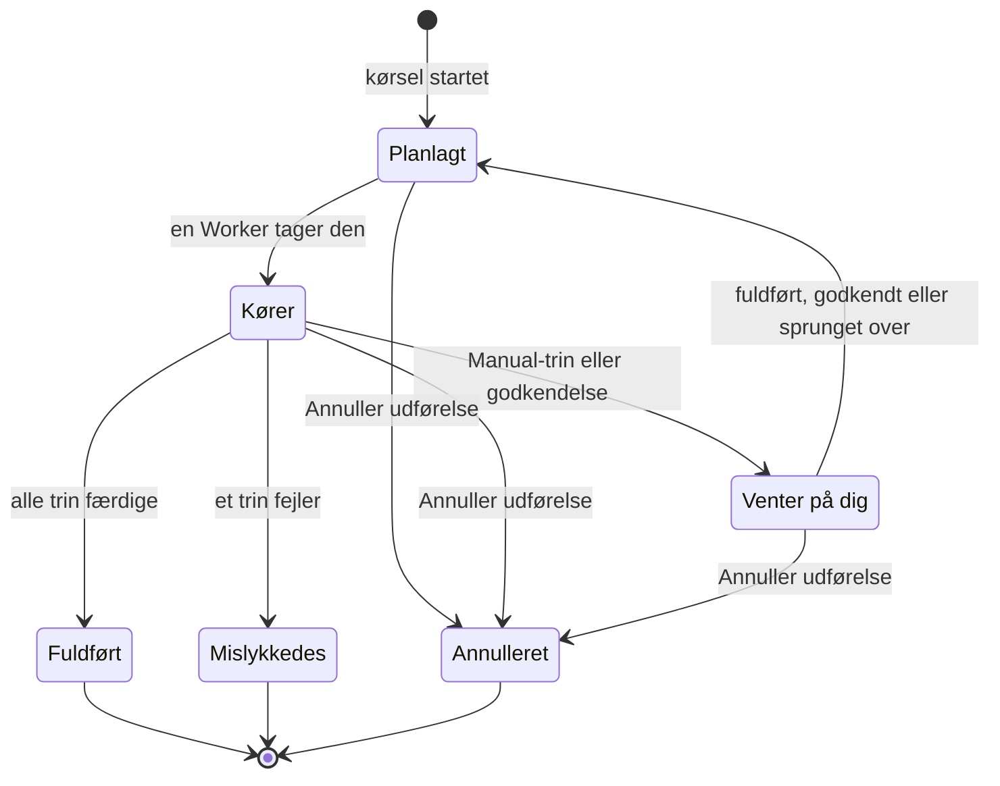

# Kør et runbook

Hver kørsel af et runbook er en **udførelse**: et øjebliksbillede af runbookets trin, der gennemgås i rækkefølge, med hvert trins status og output registreret. Denne side er til dem, der reagerer, starter kørsler og får dem videre: hvordan en kørsel starter, hvad udførelsessiden viser, og hvordan du fuldfører, godkender, springer over og annullerer trin.

:::cards
- [Start en kørsel](#start-en-kørsel): Fra en hændelse, advarsel eller begivenhed, eller fra selve runbooket.
- [Udførelsesvisningen](#udførelsesvisningen): Hvad hvert trin viser, mens en kørsel er i gang.
- [Fuldfør, godkend og spring trin over](#fuldfør-godkend-og-spring-trin-over): Hvilket trin der tager imod en beslutning, og hvornår.
- [Fejlfinding](#fejlfinding): Kørsler, der ikke starter eller ikke slutter.
:::

## Sådan bevæger en kørsel sig

En ny kørsel er **Planlagt**, indtil en Worker tager den og markerer den som **Kører**. Den holder pause som **Venter på dig** ved et Manual-trin, eller efter et trin der kræver godkendelse, og går tilbage i køen, så snart nogen handler. En kørsel, der venter på en person, udløber aldrig. Den slutter som **Fuldført**, **Mislykkedes** eller **Annulleret**.

## Start en kørsel

En runbook-udførelse oprettes på tre måder:

1. **Automatisk via en regel**: en [runbook-regel](/docs/runbooks/rules) starter den, når en matchende hændelse, advarsel eller planlagt vedligeholdelsesbegivenhed oprettes. En regel for automatisk afhjælpning kan også starte en; se [AI SRE](/docs/ai/ai-sre).
2. **Manuelt fra en begivenhed**: klik på **Kør runbook** på en hændelse, advarsel eller planlagt vedligeholdelsesbegivenhed. Udførelsen knyttes til den begivenhed.
3. **Manuelt fra runbookets side**: klik på **Run Now** på et runbooks side **Oversigt**. Kørslen knyttes ikke til nogen hændelse, advarsel eller planlagt vedligeholdelsesbegivenhed.

Sådan starter du en manuelt:

:::tabs
@tab Fra en begivenhed
1. Åbn hændelsen, advarslen eller den planlagte vedligeholdelsesbegivenhed, og gå til dens side **Runbooks**.
2. Klik på **Kør runbook**. Dialogen **Kør en runbook** viser projektets runbooks, der er slået til.
3. Klik på **Run** ud for runbooket. Kørslen vises på begivenhedens liste: klik på **Vis** for at åbne den.
@tab Fra runbooket
1. Åbn runbooket fra **Runbooks**.
2. Klik på **Run Now** på dets **Oversigt**.
3. Udførelsessiden åbner.
:::

At starte en kørsel kræver Project Owner, Project Admin, Project Member, Runbook Admin eller Runbook Member eller tilladelsen **Create Runbook Execution**. Runbook Viewer og Viewer ser **Run Now** låst med begrundelsen. Se [Tilladelser](/docs/runbooks/configuration#tilladelser).

## Udførelsesvisningen

Åbn en udførelse for at se dens tjekliste. Øverst på siden vises kørslens **Status**, dens **Progress** (færdige trin ud af alle trin), **Startet** (hvornår den begyndte) og **Udløst af** (hvad der startede den). Hvert trin viser:

- **Statusmærke** — Afventer, Kører, Venter på dig, Færdig, Sprunget over, Mislykkedes eller Annulleret.
- **Titel og beskrivelse** — kopieret fra runbooket, da udførelsen startede.
- **Output** (kan foldes sammen) — stdout, returværdier, HTTP-svar eller AI'ens svar.
- **Fejlmeddelelse**, hvis trinnet fejlede.
- På det trin, kørslen venter på: **Mark complete** (et Manual-trin) eller **Approve & continue** (et trin med **Kræv godkendelse**) og **Spring over**.
- Mens kørslen holder pause, **Spring over** på senere automatiserede trin, der ikke kræver godkendelse.

Mens kørslen er i gang, opdaterer siden sig selv hvert 30. sekund. Klik på **Opdater** for at se den nyeste tilstand med det samme.

## Fuldfør, godkend og spring trin over

Kun det trin, kørslen venter på, kan markeres som fuldført, godkendes eller springes over, så kørslen fortsætter. Et Manual-trin eller et trin med **Kræv godkendelse** kan ikke afkrydses eller springes over, før kørslen når det: dets opgave er at stoppe kørslen, så det tager først imod en beslutning, når kørslen er der (for en godkendelse: når trinnet har kørt, og du kan se dets output).

Mens kørslen holder pause, kan du også springe et senere automatiseret trin over, der ikke kræver godkendelse, så det ikke kører, når kørslen fortsætter. Kørslen holder fortsat pause ved det trin, der venter på dig. Du kan ikke springe over, mens trin kører: vent, til kørslen holder pause, eller annuller den. Hvert trin registrerer, hvem der fuldførte eller sprang det over.

| Trinnet | Fuldfør eller godkend | Spring over |
| --- | --- | --- |
| Det, kørslen venter på | Ja | Ja |
| Et senere automatiseret trin uden **Kræv godkendelse** | Nej | Ja, mens kørslen holder pause |
| Et senere Manual-trin, eller et med **Kræv godkendelse** | Nej | Nej |
| Ethvert trin, mens trin kører | Nej | Nej |

At fuldføre, godkende, springe over og annullere kræver de samme roller som at starte en kørsel eller tilladelsen **Edit Runbook Execution**.

## Flet manuelle og automatiserede trin

Det klassiske forløb:

| # | Trin | Hvad der sker |
| --- | --- | --- |
| 1 | Bash: registrer systemets tilstand | Kører på sin Runner, så snart kørslen starter. |
| 2 | Manual: "Giv kunderne besked med statussidens banner." | Kørslen holder pause, indtil nogen klikker på **Mark complete**. |
| 3 | HTTP request: tilkald DBA'en via PagerDuty | Kører på Workeren. |
| 4 | Manual: "Bekræft, at den sekundære database nu er primær." | Kørslen holder pause igen. |
| 5 | HTTP request: send afblæsningen til en Slack-webhook | Kører, og udførelsen er **Fuldført**. |

Trin 2 og 4 sætter kørslen på pause, indtil nogen afkrydser dem. Trin 1, 3 og 5 kører automatisk. Hele kørslen er én udførelse, én tidslinje og én kilde til sandheden.

## Annuller en kørsel

Klik på **Annuller udførelse** på udførelsessiden. Status bliver `Cancelled`, og intet senere trin starter. Et trin, der allerede kører, afbrydes ikke, men dets resultat registreres ikke: trinnet forbliver `Cancelled`. Job, der stadig venter på en Runner, annulleres; en Runner, der allerede kører et script, gør det færdigt, men resultatet accepteres ikke.

## Outputgrænser

Output pr. trin er begrænset til **50 KB**, så et løbsk script ikke puster databasen op. Længere output skæres af med en markør. Har du brug for større artefakter, så skriv dem fra scriptet til objektlagring eller et logsystem, og læg URL'en i outputtet.

## Kør et runbook igen

En udførelse er en engangs, uforanderlig post. Klik på **Kør igen** på en afsluttet udførelse, eller på **Run Now** på runbooket, for at køre det igen. Begge opretter en ny udførelse ud fra runbookets nuværende trin, ikke knyttet til nogen begivenhed. Brug **Kør runbook** på hændelsens side **Runbooks** for at køre det igen på en hændelse. Den oprindelige udførelse forbliver uændret til revisionssporet.

## Find tidligere udførelser

| Hvor | Hvad den viser |
| --- | --- |
| Et runbooks **Udførelser** | Alle kørsler af det runbook med filtre for status og startdato og en kolonne **Udløst af**. |
| **Runbooks → Udførelser** | Alle kørsler af alle runbooks i projektet. |
| Siden **Runbooks** for en hændelse, advarsel eller begivenhed | De kørsler, der er knyttet til den. Begivenhedens oversigt viser dem også, så snart der er nogen. |

## Fejlfinding

:::details Run Now er låst
Din rolle læser runbooks, men kører dem ikke: knappen siger "Du har ikke tilladelse til at starte runbook-kørsler i dette projekt." Bed om Runbook Member eller om tilladelsen **Create Runbook Execution**.
:::

:::details Start af en kørsel fejler med "Runbook is disabled" eller "Runbook has no steps to run"
Runbookets kontakt **Kør dette runbook** er slået fra på dets side **Indstillinger**, eller det har ingen gemte trin. Slå kontakten til, eller tilføj trin, og klik på **Save Steps**.
:::

:::details Et trin fejlede, fordi det mangler en Runner eller en loginoplysning
Meddelelsen lyder for eksempel "Bash step is missing a Runner. Pick one under Runbooks → Runners." Trinnet blev gemt uden **Runner**, eller et SSH- eller Kubernetes-trin uden **Credential**. Åbn runbookets **Trin**, vælg det, trinnet mangler, klik på **Save Steps**, og kør runbooket igen.
:::

:::details Et trin fejlede, fordi ingen runbook-agent tog det
Meddelelsen lyder "No runbook agent picked up this step before the wait window expired." Trinnets Runner overtog ikke jobbet inden for sin claim timeout. Kontrollér under **Runbooks → Runbook-agenter**, at Runneren er **Forbundet**, og at **Kører runbooks** er slået til. Se [Runbook-agenter](/docs/runbooks/agents#fejlfinding).
:::

:::details Kørslen har ventet i timevis
En kørsel, der venter på en person, udløber aldrig. Åbn den, og handl på det trin, der viser **Venter på dig**, eller klik på **Annuller udførelse**.
:::

:::details Et trin siger, at det muligvis er kørt delvist
Den OneUptime Worker, der kørte trinnet, genstartede eller holdt op med at svare, og kørslen blev markeret som mislykket i stedet for at blive hængende. Kontrollér målsystemet, før du kører runbooket igen.
:::

## Næste skridt

:::cards
- [Skriv et runbook](/docs/runbooks/authoring): Tilføj Manual-trin og godkendelser, hvor en person skal beslutte.
- [Runbook-regler](/docs/runbooks/rules): Start kørsler automatisk ved nye hændelser.
- [Runbook-agenter](/docs/runbooks/agents): Hold de Runners, dine trin har brug for, online.
:::
