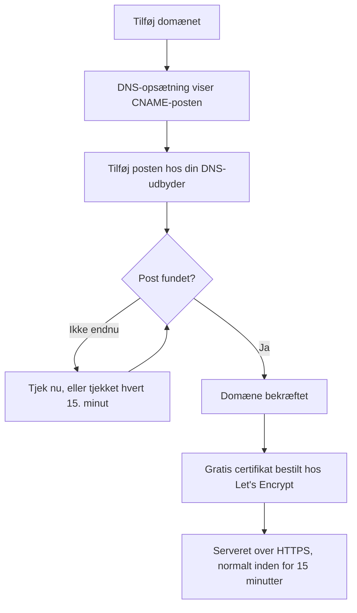

# Statusside – branding og domæner

Din statusside er den ene skærm i OneUptime, dine kunder kigger på, så den bør ligne din egen og ligge på dit eget domæne, såsom `status.yourcompany.com`. Denne side gennemgår siden **Branding** kort for kort og lægger derefter statussiden på dit domæne: tilføj domænet, tilføj én DNS-post, og det gratis SSL-certifikat følger af sig selv.

:::cards
- [Siden Branding](#siden-branding): Logo, titel, favicon, links, sidefod, farver og sprog.
- [Brugerdefineret HTML, CSS og JavaScript](#brugerdefineret-html-css-og-javascript): Alt det, de indbyggede indstillinger ikke dækker.
- [Brugerdefinerede domæner](#brugerdefinerede-domæner): Dit eget værtsnavn med et gratis certifikat.
- [Kolonnen Status](#sådan-læser-du-domænets-kolonne-status): Hvor langt hvert domæne er på vej mod HTTPS.
:::

## Hvor hver brandingindstilling bor

Åbn en statusside: sektionen **Branding** i dens sidemenu har tre punkter:

| Side | Hvad du angiver der |
| ---- | ------------------ |
| **Branding** | Logo og forsidebillede, sidetitel og -beskrivelse, favicon, header-links, beskrivelsen af oversigtssiden, copyright-linjen og sidefodslinks. Sammenfoldet under **Yderligere indstillinger**: historikdiagrammets farver, sprog og indeksering i søgemaskiner. |
| **Brugerdefinerede domæner** | Dit eget domæne, dets DNS-post og dets gratis SSL-certifikat. |
| **HTML, CSS og JavaScript** | Header-HTML, sidefods-HTML, brugerdefineret CSS, brugerdefineret JavaScript. |

Tre ting, der ligner branding, ligger i stedet under **Statussider → din side → Avanceret → Avancerede indstillinger** (`{id}/settings`), fordi de afgør, hvad siden viser, og ikke hvordan den ser ud: den samlede oppetidsprocent, hvilke monitorstatusser der tæller mod oppetiden, og linjen "Powered by OneUptime". Alle tre er rækker på kortet **Hvad din statusside viser** der.

Branding var tidligere delt over separate skærme for **Grundlæggende branding**, **Header**, **Sidefod**, **Oversigtsside** og **Sprog**. Deres gamle adresser (`{id}/header-style`, `{id}/footer-style`, `{id}/overview-page-branding` og `{id}/languages`) åbner nu siden **Branding**, så gamle bogmærker og links virker stadig.

## Siden Branding

**Statussider → din side → Branding → Branding** (`{id}/branding`). Hvert kort gemmes for sig. Efter logoet, titlen og faviconet følger kortene din statusside fra top til bund: headerens links, teksten øverst i oversigten og derefter sidefoden. Det, de færreste ændrer, ligger sammenfoldet under **Yderligere indstillinger** nederst.

### Logo og forsidebillede

Det første kort, **Logo og forsidebillede**, har knappen **Edit Images**, der åbner to trin:

| Trin | Felter |
| ---- | ------ |
| **Logo** | Upload af logoet (pladsholder `Upload logo`) og **Logo Alt Text** (pladsholder `Logo of My Company`). Lad alt-teksten stå tom, så bruges statussidens titel i stedet. |
| **Forsidebillede** | **Forside**, en upload (pladsholder `Upload cover image`) til det brede banner bag headeren, og **Cover Image Alt Text**. Lad alt-teksten stå tom, hvis forsiden er ren dekoration. |

Logoet, forsidebilledet og faviconet er filer, der er uploadet i statussidens eget projekt, og det tjekkes, hver gang et af dem gemmes, fra dashboardet, API'et, Terraform eller et workflow. En fil, der er uploadet i et andet projekt, afvises med de ord, en fil, der ikke længere findes, får: "The logo's file could not be found. Upload the logo again.", "The cover image's file could not be found. Upload the cover image again." eller "The favicon's file could not be found. Upload the favicon again." At uploade billedet igen fra siden løser det.

Din statusside viser kun billeder fra sit eget projekt; et billede, den ikke kan vise, udelades, som om siden ikke havde noget. Dashboardet, API'et og Terraform læser sidens billeder på samme måde: et billede fra et andet projekt kommer tilbage som slet intet billede. De e-mails, siden sender (til abonnenter og til private brugere om deres login), viser dens logo på samme måde: et logo, siden ikke kan vise, udelades også fra dem i stedet for at blive vist som et ødelagt billede.

### Titel, beskrivelse og favicon

- **Titel og beskrivelse**: kortet bemærker, at det også bruges til SEO. **Rediger** åbner **Sidetitel** (pladsholder `Please enter page title here.`) og **Sidebeskrivelse**. Søgemaskiner og linkforhåndsvisninger viser dem, så skriv dem til en kunde, ikke til dit team.
- **Favicon**: **Edit Favicon** åbner uploaden **Favicon**: det lille ikon i browserfanen.

### Header-links

Tabellen **Header-links** indeholder linkene i statussidens header, såsom dit websted, din dokumentation eller en supportportal. Hvert link har en **Titel** og et **Link** (en URL, pladsholder `https://link.com`), og du ændrer rækkefølgen ved at trække. Uden links siger tabellen **Intet statusoverskriftslink for denne statusside** med **Opret Statusside Header Link** nedenunder.

### Beskrivelse af oversigtssiden

**Beskrivelse af oversigtsside** er det første på statussidens oversigt, over meddelelserne, den samlede status og dine ressourcer. **Rediger beskrivelse** åbner et markdown-felt. Brug det til en sætning med kontekst: hvad siden dækker, og hvor man får support. Et billede, du sætter ind i det, vises for alle sidens besøgende.

### Sidefod

- **Copyright-information**: **Edit Copyright** åbner ét felt, **Copyright-information**, med pladsholderen `Acme, Inc.`.
- **Sidefodslinks**: det samme par **Titel** og **Link** som header-linkene, sorteret ved at trække. Uden links står der "Intet statusfodlink for denne statusside."

Header-links er til navigation; sidefodslinks er til det med småt, såsom juridiske oplysninger, privatliv og vilkår.

### Yderligere indstillinger

Sidens sidste sektion ligger sammenfoldet under **Yderligere indstillinger**, fordi de færreste nogensinde ændrer det, der står i den. Sammenfoldet nævner dens overskrift de fire sektioner (**Standardbjælkefarve**, **Regler for bjælkefarver**, **Sprog** og **Indeksering i søgemaskiner**) og viser hver af dem, der afviger fra det, en ny statusside starter med: en anden standardbjælkefarve end den grønne, alle sider starter med, en hvilken som helst regel for bjælkefarver, et andet standardsprog end engelsk, en kortere liste over sprog eller indeksering i søgemaskiner slået fra. Klik på den for at åbne den: det er ét kort med de fire sektioner under hinanden, hver med sin egen titel og knap, adskilt af skillelinjer.

**Historikdiagrammets farver.** Det er de eneste indbyggede farveindstillinger på en statusside.

- **Standardbjælkefarve for historikdiagrammet**: **Edit Default Bar Color** åbner vælgeren **Standardbjælkefarve**. Alle nye statussider starter med grøn. Med regler for bjælkefarver er det også farven for en dag, som ingen regel matcher. En dag, siden ikke har data for, tegnes altid grå.
- **Rules for Bar Colors of History Chart**: en ordnet tabel med regler, som du sorterer ved at trække. Hver regel har **Når oppetid % er større end eller lig med** og **Brug så denne søjlefarve**; tabellens kolonner hedder `When Uptime Percent >=` og `Then, Bar Color is`. En ny regels farve er allerede valgt, en som de andre regler endnu ikke bruger; vælg i stedet den, du vil have. Rækkefølgen betyder noget, så sorter reglerne, som du vil have dem evalueret. Uden regler får hver dags søjle farven på dagens laveste monitorstatus.

Hvor mange dage diagrammet dækker, angives ikke her. Det er **Oppetidshistorik** på kortet **Hvad din statusside viser** under **Avanceret → Avancerede indstillinger**, fra 1 til 90 dage. Hvilke monitorstatusser der tæller som nede, er **Tæller som nedetid** i samme række på det kort.

**Sprog.** Sektionen **Sprog** angiver den sprogvælger, besøgende får i sidens sidefod. **Rediger sprog** åbner to felter:

| Felt | Hvad det gør |
| ----- | ------------ |
| **Standardsprog** | Det sprog, førstegangsbesøgende ser, valgt fra en liste, der nævner hvert sprog på sproget selv og på engelsk (`Deutsch (German)`). Standard er engelsk, og besøgende kan altid skifte fra sidefoden. |
| **Aktiverede sprog** | En flervalgsliste, pladsholder `All languages`. Lad den stå tom, så tilbydes alle understøttede sprog; vælg nogle få, så viser sidefoden kun dem. |

OneUptime leveres med sytten sprog: engelsk, tysk, fransk, spansk, italiensk, portugisisk, nederlandsk, dansk, norsk, svensk, russisk, japansk, koreansk, kinesisk (forenklet), kinesisk (traditionelt), hindi og persisk.

**Indeksering i søgemaskiner.** Én kontakt, **Tillad søgemaskiner at indeksere denne statusside**, afgør, om Google, Bing og andre søgemaskiner må vise siden. Den er slået til som standard. Der er ingen knap **Rediger**: kontakten gemmes i det øjeblik, du slår den om. Slå den fra, så serveres siden med `noindex, nofollow` (et robots-metatag og en header `X-Robots-Tag`); alle med linket kan stadig åbne den. Søgemaskiner kan være et par uger om at fjerne en side, de allerede har indekseret.

> [!TIP]
> Slå **Tillad søgemaskiner at indeksere denne statusside** fra, mens en side kun er intern eller stadig ved at blive sat op, så en halvfærdig side ikke begynder at rangere på dit varemærke.

## Oppetidsprocent og nedetidsstatusser

Begge ligger i rækken **Oppetidshistorik** på kortet **Hvad din statusside viser** under **Statussider → din side → Avanceret → Avancerede indstillinger** (`{id}/settings`). Der er ingen knap **Rediger**: hver indstilling gemmes i det øjeblik, du ændrer den.

- **Vis samlet oppetidsprocent**: en kontakt, slået fra som standard. Mens den er slået til, vælger **Præcision** ved siden af, hvor mange decimaler procenten viser: `99%`, `99.9%`, `99.99%` (standard) eller `99.999%`. På OneUptime Cloud kræver det planen **Scale** at slå procenten til; dens præcision kan ændres på alle planer.
- **Tæller som nedetid**: monitorstatusserne, som farvede mærker, hvis tid tæller mod oppetiden på denne side. Her afgør du for eksempel, om en forringet status tæller mod oppetiden. Mindst én status forbliver valgt.

De var tidligere to selvstændige kort, **Samlet oppetidsprocent** og **Nedetidsovervågningsstatusser**, hver bag en knap **Rediger**. Se [At vælge hvad der vises på siden](/docs/status-pages/index#at-vælge-hvad-der-vises-på-siden) for resten af kortet.

## Brugerdefineret HTML, CSS og JavaScript

**Statussider → din side → Branding → HTML, CSS og JavaScript** (`{id}/custom-code`) har fire kort, der hver redigeres for sig og gemmes i en kolonne på statussiden:

| Kort | Kolonne | Hvad det indeholder |
| ---- | ------ | ------------- |
| **Header-HTML** | `headerHTML` | HTML, der tilføjes sidens header (pladsholder `Insert Custom HTML here.`). |
| **Sidefods-HTML** | `footerHTML` | HTML, der tilføjes sidens sidefod. |
| **Brugerdefineret CSS** | `customCSS` | Typografi for hele siden (pladsholder `Insert Custom CSS here.`). |
| **Brugerdefineret JavaScript** | `customJavaScript` | Et script, siden kører (pladsholder `Insert Custom JavaScript here.`). |

> [!IMPORTANT]
> Brugerdefineret HTML, CSS og JavaScript serveres kun på et bekræftet brugerdefineret domæne. De er slået fra på standardadressen `/status-page/:id`, fordi den adresse deler oprindelse med det sted, hvor man er logget ind i OneUptime.

På OneUptime Cloud kræver det planen **Growth** at tilføje eller ændre nogen af dem. At tømme et af dem virker på alle planer, så brugerdefineret kode, der blev tilføjet i en prøveperiode, altid kan fjernes.

**Der er ingen temavælger.** OneUptimes statussider har ingen indstilling for tema eller brandfarve: de eneste indbyggede farveindstillinger nogen steder er **Standardbjælkefarve** og reglerne for historikdiagrammets bjælkefarver under **Yderligere indstillinger** på siden **Branding**. Skrifttyper, baggrundsfarver, accentfarver og justeringer af layoutet går alle gennem **Brugerdefineret CSS**. Hvis du har ledt efter et felt til en "brandfarve", er dette svaret: det findes ikke, og denne boks er måden at gøre det på.

> [!WARNING]
> Brugerdefineret JavaScript kører i dine besøgendes browsere på en side, folk åbner netop, når de tror, noget er gået i stykker. Hold det lille, host selv det, det indlæser, hvor du kan, og test det, før du stoler på det.

## Brugerdefinerede domæner

Som standard kan en statusside nås på forhåndsvisnings-URL'en på dens skærm **Oversigt**. For at lægge den på dit eget værtsnavn går du til **Statussider → din side → Branding → Brugerdefinerede domæner** (`{id}/domains`).

Kortet **Brugerdefinerede domæner** siger, hvad du skal gøre: peg hvert domænes CNAME-post mod din installations CNAME-post til statussider, så udsteder OneUptime domænets SSL-certifikat og fornyer det for dig. Uden noget sat op siger tabellen **Ingen tilpassede domæner fundet** med **Opret Statusside Domæne** nedenunder. Tabellen har to kolonner, **Domæne** og **Status**, og filtre for **Domæne**, **CNAME gyldig** og **SSL provisioneret**.

At lægge siden på dit domæne tager tre trin, og kun de to første er dine:

1. **Tilføj domænet**: et underdomæne og et af dine bekræftede domæner.
2. **Tilføj dets CNAME-post** hos din DNS-udbyder. Dialogen **DNS-opsætning** viser posten, så snart du tilføjer domænet.
3. **Det gratis SSL-certifikat udstedes automatisk**, så snart posten er fundet. Der er ingen knap at trykke på.



### Før du starter

- **Det overordnede domæne skal være bekræftet.** Rullelisten **Domæne** viser kun de domæner, der er bekræftet under **Projektindstillinger → Domæner**, hvor du med en TXT-post beviser, at du ejer et domæne. Linket **Tilføj et domæne** ved siden af feltet åbner den side i en ny fane.
- **Din installation skal have en CNAME-post til statussider.** OneUptime Cloud har en. På en selvhostet installation sætter du den til et værtsnavn, der peger på din OneUptime-server (en A-post), og sørger for, at serveren svarer på port 80, hvor Let's Encrypt tjekker den. Uden den siger kortet og dialogen **DNS-opsætning** "Custom Domains not enabled for this OneUptime installation" i stedet for at vise en post.

:::tabs
@tab Docker Compose
```ini title="config.env"
STATUS_PAGE_CNAME_RECORD=oneuptime.yourcompany.com
```
@tab Kubernetes
```yaml title="values.yaml"
statusPage:
  cnameRecord: oneuptime.yourcompany.com
```
:::

### Tilføj domænet

:::steps
#### Åbn Opret Statusside Domæne

Klik på **Opret Statusside Domæne** under **Brugerdefinerede domæner**. Dialogen består af én side.

#### Angiv underdomænet

I **Underdomæne** (pladsholder `status (leave blank for root)`) angiver du kun etiketten, såsom `status`, ikke hele værtsnavnet. Lad det stå tomt, eller angiv `@`, for at bruge roddomænet (apex).

#### Vælg domænet

I **Domæne** (pladsholder `Select domain`) vælger du et af dine bekræftede domæner. Et domæne, du ikke har bekræftet, vises ikke, fordi det ville blive afvist.

#### Behold det gratis certifikat, eller upload dit eget

**Flere felter** er foldet sammen, og dets overskrift siger, hvilket certifikat domænet vil bruge: "Vi udsteder et gratis SSL-certifikat til dette domæne og fornyer det automatisk." Åbn det kun for at bruge dit eget certifikat: slå **Upload brugerdefineret certifikat** til, og indsæt derefter **Certifikat** og **Privat certifikatnøgle** i PEM-format. Begge er så påkrævede.

#### Opret domænet

Klik på **Opret Statusside Domæne**. Dialogen lukker, og det nye domænes **DNS-opsætning** åbner med den post, der skal tilføjes.
:::

Et domænes fulde navn ligger fast, når du tilføjer det, så **Rediger** ændrer kun dets certifikat. For at bruge et andet underdomæne tilføjer du det domæne og sletter det gamle.

### DNS-opsætning og bekræftelse

Dialogen **DNS-opsætning** viser den post, der skal tilføjes hos din DNS-udbyder, ét felt pr. række, hvert med en kopiknap:

| Felt | Hvad du skal angive |
| ----- | ------------- |
| **Type** | `CNAME` |
| **Navn** | Det fulde domæne, du tilføjede, for eksempel `status.yourcompany.com` |
| **Værdi** | Din installations CNAME-post til statussider |

> [!NOTE]
> For et roddomæne, uden underdomæne, tilføjer dialogen en bemærkning: mange DNS-udbydere tillader ikke en CNAME-post der. Brug i stedet din udbyders ALIAS-, ANAME- eller CNAME-flattening-post med samme værdi.

OneUptime tjekker hvert ubekræftet domæne hvert 15. minut og bekræfter dit, så snart dets post er live, uanset om du vender tilbage eller ej. For at tjekke med det samme klikker du på **Tjek nu**:

- **Posten er ikke fundet endnu.** Dialogen forbliver åben og siger, hvilken post den ledte efter. En ny DNS-post kan være et stykke tid om at dukke op: klik på **Tjek nu** igen senere, eller overlad det til tjekket hvert 15. minut.
- **Posten er fundet.** Dialogen siger "Din CNAME-post er bekræftet." og hvad der derefter sker med certifikatet. Det gratis certifikat bestilles i det øjeblik.

Indtil et domæne er bekræftet, og dets certifikat er på plads, har dets række handlingen **DNS-opsætning**, der åbner den samme dialog. På et bekræftet domæne, hvis certifikatbestilling bliver ved med at mislykkes, eller hvis certifikat er udløbet, bestiller **Tjek nu** der igen og viser, hvorfor den sidste bestilling mislykkedes. Den bestiller højst én gang pr. domæne hvert 15. minut; ind imellem bliver OneUptime selv ved med at prøve igen.

### SSL-certifikater

Hvert brugerdefineret domæne får et gratis certifikat fra Let's Encrypt, der udstedes og fornyes automatisk. Der er intet at klikke på:

- **Tjek nu** bestiller certifikatet i det øjeblik, posten findes. Dialogen siger derefter, at certifikatet normalt er live inden for 15 minutter.
- Når tjekket hvert 15. minut bekræfter et domæne, bestiller det domænets certifikat i samme tjek.
- Fornyelse sker automatisk, i god tid før certifikatet udløber. Hvis din DNS ikke svarer et øjeblik, mens et certifikat fornyes, bliver certifikatet ved med at blive serveret og fornyes ved et senere forsøg. Et mislykket DNS-tjek fjerner aldrig et certifikat, der stadig er gyldigt.

Et nyt certifikat serveres inden for 15 minutter efter udstedelsen, fordi certifikaterne så ofte skrives ud til de servere, der svarer for dit domæne. Kolonnen Status siger _normalt_ inden for 15 minutter: når mange domæner venter på én gang, behandles de nogle få ad gangen.

Hvert OneUptime-certifikat bestilles fra én delt Let's Encrypt-konto, og Let's Encrypt begrænser, hvor mange nye bestillinger én konto må afgive på kort tid, og hvor ofte en bestilling for det samme domæne må mislykkes. OneUptime holder alle sine bestillinger (nye domæner, **Tjek nu**, genudstedelser og fornyelser) inden for de grænser samlet, og fornyelser kommer altid først, så en bølge af nye domæner aldrig holder de fornyelser tilbage, der holder eksisterende domæner online.

Hvis en bestilling mislykkes, siger domænets kolonne Status det, med årsagen på linjen under, og **Tjek nu** i **DNS-opsætning** viser det også. OneUptime bliver selv ved med at prøve og venter lidt længere efter hver fejl i træk, så et domæne, hvis bestilling bliver ved med at mislykkes, ikke bruger de bestillinger, alle andre domæner har brug for. De almindelige årsager er en CAA-post på dit domæne, der ikke tillader `letsencrypt.org`, og, på en selvhostet installation, en server, som Let's Encrypt ikke kan nå på port 80; på en selvhostet installation står detaljerne i workerens logs. Når du har rettet årsagen, klikker du på **Tjek nu** for at bestille igen med det samme. Den afgiver højst én bestilling pr. domæne hvert 15. minut; et klik ind imellem viser, hvordan den sidste bestilling gik.

Hvis du har uploadet dit eget certifikat under **Flere felter**, serverer OneUptime det i stedet, inden for 15 minutter efter du har gemt. Upload dets afløser, før det udløber, ved at redigere domænet.

### Genudsted et certifikat

Automatisk fornyelse dækker det almindelige tilfælde, men nogle gange vil du have et helt nyt certifikat med det samme: en privat nøgle, du hellere ikke vil beholde, et certifikat, din egen scanner ikke bryder sig om, eller et domæne, der er ændret et andet sted. Så snart der er bestilt et gratis certifikat til et domæne, viser dets række handlingen **Reissue SSL**.

Dens dialog, **Reissue SSL Certificate for this Status Page**, beder Let's Encrypt om et nyt certifikat til domænet og erstatter det, der serveres, med det. Din statusside forbliver online med det eksisterende certifikat imens, og det nye certifikat serveres inden for 15 minutter. Klik på **Reissue SSL Certificate** for at bestille det.

> [!NOTE]
> Et domæne kan kun genudstedes én gang hver 24. time. Let's Encrypt begrænser, hvor ofte det samme domæne kan udstedes, og hvert OneUptime-certifikat bestilles fra én delt konto, også de automatiske fornyelser, der holder alle andres sider online. Inden for det vindue fortæller dialogen dig, hvor lang tid der er tilbage, i stedet for at bestille. Hvis der i det øjeblik bestilles et certifikat til domænet, eller hvis installationens Let's Encrypt-bestillinger er brugt op for nu, siger dialogen det, der bestilles intet, og trykket tæller ikke som din genudstedelse.

Handlingen vises ikke på et domæne, der bruger et certifikat, du har uploadet: der er intet Let's Encrypt-certifikat at genudstede, så upload i stedet et nyt ved at redigere domænet. Den vises heller ikke, før domænets første certifikat er bestilt, hvilket sker af sig selv, så snart dets CNAME-post er bekræftet.

Den samme knap, med den samme grænse på 24 timer, findes på dashboards' brugerdefinerede domæner under **Dashboards → dit dashboard → Branding → Brugerdefinerede domæner**, som fungerer på samme måde som statussiders brugerdefinerede domæner: se [Deling & offentlige dashboards](/docs/dashboards/sharing#brugerdefinerede-domæner).

### Sådan læser du domænets kolonne Status

Kolonnen **Status** siger, hvor langt hvert domæne er på vej mod HTTPS, i en af syv tilstande. Når en bestilling mislykkedes, står årsagen på linjen under.

| Hvad kolonnen Status siger | Hvad det betyder |
| --------------------------- | ------------- |
| Venter på DNS: tilføj CNAME-posten. | CNAME-posten er ikke fundet endnu. Åbn **DNS-opsætning** for at se posten, tilføj den hos din DNS-udbyder, og klik derefter på **Tjek nu**, eller vent på tjekket hvert 15. minut. |
| Udsteder et gratis certifikat, normalt inden for 15 minutter. | Posten er bekræftet, og certifikatet bliver bestilt eller skrevet ud. Du skal ikke gøre noget. |
| Kunne endnu ikke udstede et gratis certifikat. Vi bliver ved med at prøve. | Posten er bekræftet, men bestillingen af dens certifikat mislykkedes af årsagen på linjen under. Ret årsagen, åbn derefter **DNS-opsætning**, og klik på **Tjek nu** for at bestille igen med det samme. |
| Certifikatet er udløbet. Vi bliver ved med at prøve at forny det. | Domænets certifikat er udløbet, fordi fornyelserne mislykkedes. Åbn **DNS-opsætning**, og klik på **Tjek nu** for at forny det med det samme og se hvorfor. |
| Certifikat udstedt, fornyes automatisk. | Færdig. Domænet serverer sit certifikat over HTTPS, og OneUptime fornyer det. |
| Certifikat udstedt, men fornyelsen mislykkedes. Vi bliver ved med at prøve. | Domænet serverer stadig et gyldigt certifikat, men dets seneste fornyelse mislykkedes af årsagen på linjen under. OneUptime prøver igen i god tid før certifikatet udløber. |
| Bruger dit uploadede certifikat. | Posten er bekræftet, og domænet serveres med det certifikat, du har uploadet. |

:::details Et domæne bliver stående på "Venter på DNS" længe efter, at jeg har tilføjet posten
Tjek, at postens navn er det fulde domæne, såsom `status.yourcompany.com`, og at dens værdi matcher din installations CNAME-post præcist. På et roddomæne bruger du en ALIAS-, ANAME- eller flattened CNAME-post. Klik derefter på **Tjek nu** i **DNS-opsætning**.
:::

:::details Kolonnen Status siger, at den ikke kunne udstede et gratis certifikat
Se efter en CAA-post på dit domæne, der udelader `letsencrypt.org`, og tjek på en selvhostet installation, at din server svarer på port 80. Ret årsagen, og klik derefter på **Tjek nu** i **DNS-opsætning** for at bestille igen.
:::

### Hvem der kan tjekke og genudstede

**Tjek nu**, bestilling af et domænes certifikat og **Reissue SSL** ændrer domænet, så de kræver tilladelse til at redigere det: **Edit Status Page Domain** eller en rolle, der indeholder den (Project Owner, Project Admin, Project Member, Status Page Admin eller Status Page Member).

Den, der kun kan læse domænet, såsom en Viewer eller en Status Page Viewer, ser stadig kolonnen **Status** og den post, der skal tilføjes, i **DNS-opsætning**. For dem er **Tjek nu** og **Reissue SSL** låst og siger, hvilken tilladelse der kræves. OneUptime bliver under alle omstændigheder selv ved med at tjekke hvert domæne og bestille dets certifikat.

Det samme gælder API-nøgler. En nøgle, der kun kan læse statussidedomæner, kan ikke kalde `verify-cname`, `order-ssl` eller `reissue-ssl` på `/status-page-domain`. Giv den **Read Status Page Domain** og **Edit Status Page Domain**, hvis den har brug for det.

## Powered by OneUptime

Linjen "Powered by OneUptime" er ikke en brandingindstilling. Den er den sidste kontakt på kortet **Hvad din statusside viser** under **Statussider → din side → Avanceret → Avancerede indstillinger** (`{id}/settings`): **Vis "Powered By OneUptime"-branding**, slået til som standard. Slå den fra for at skjule linjen; den gemmes med det samme. På OneUptime Cloud kræver det planen **Scale** at skjule den.

## Næste skridt

:::cards
- [Statussider – Oversigt](/docs/status-pages/index): Hvad siden viser, og hvem der kan se den.
- [Statusside – ressourcer og grupper](/docs/status-pages/resources-and-groups): Vælg, hvad besøgende faktisk ser på siden.
- [Abonnenter og meddelelser](/docs/status-pages/subscribers): De e-mails, der bærer dit logo og linker til dit domæne.
- [Offentlig API](/docs/status-pages/public-api): Læs siden som JSON, også på dit eget domæne.
:::
