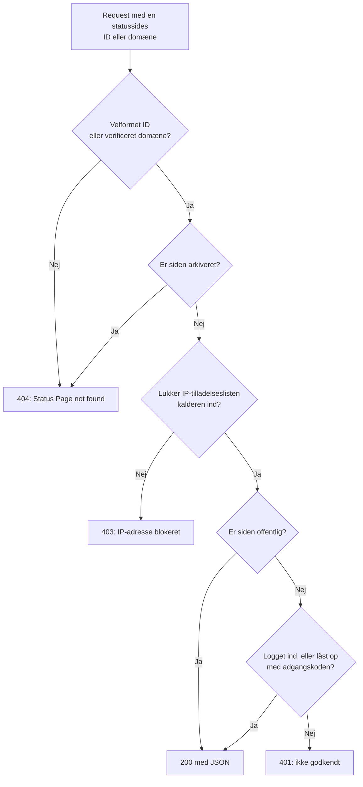

# Offentlig API

Hver statusside svarer på et lille sæt JSON-endpoints, der kun læser: dens oversigt, oppetid, hændelser, episoder, planlagte vedligeholdelsesbegivenheder og meddelelser. Det er de endpoints, statussiden selv indlæser, så de returnerer præcis det, en besøgende ser, og en offentlig side kræver ingen API-nøgle. Brug dem til at vise din status i din egen app, en chatbot eller på en vægskærm.

:::cards
- [Endpoints](#endpoints): Ét endpoint for hver ting, siden viser.
- [Læs oversigten](#læs-oversigten): Hele siden i én request, med curl, Node.js og Python.
- [Oppetid for et datointerval](#oppetid-for-et-datointerval): Oppetid pr. ressource og gruppe, for op til 90 dage.
- [Fejl](#fejl): Hvad hver statuskode betyder.
:::

## Sådan besvares en request

Hver request angiver statussiden ved dens ID eller ved et af dens brugerdefinerede domæner. OneUptime finder siden, anvender de samme adgangsregler, som en besøgende møder, og svarer med JSON.



En privat side svarer kun en browser, der er logget ind på den eller har låst den op med dens adgangskode: API'et læser den samme session som siden. Brug en offentlig side til et script. Se [At begrænse hvem der må se siden](/docs/status-pages/index#at-begrænse-hvem-der-må-se-siden).

Et velformet ID, som ingen statusside har, går samme vej som en privat side og besvares med `401`. Svarer en offentlig side med `401`, så tjek ID'et.

## Før du begynder

- **Statussidens ID.** Åbn siden i dashboardet (**Statussider → Alle statussider**, derefter siden). Kortet **Statussidedetaljer** på dens **Oversigt** viser **Statusside-ID**.
- **Basis-URL'en.** Alle endpoints nedenfor ligger under `/status-page-api`:

| Hvor siden kører | Basis-URL |
| ------------------- | -------- |
| OneUptime Cloud | `https://oneuptime.com/status-page-api` |
| Selvhostet OneUptime | `https://<your-oneuptime-host>/status-page-api` |
| Et brugerdefineret domæne for siden | `https://status.example.com/status-page-api` |

Hvor en sti nedenfor siger `{statusPageIdOrDomain}`, kan du sende sidens ID eller et af dens verificerede brugerdefinerede domæner, f.eks. `status.example.com`. Oppetids-endpointet tager kun ID'et og svarer på et domæne med `401`.

## Endpoints

| Endpoint | Metoder | Returnerer |
| -------- | ------- | ------- |
| `/overview/{statusPageIdOrDomain}` | `GET`, `POST` | Alt, hvad oversigten viser: den samlede status, ressourcer og grupper, aktive hændelser og episoder, planlagt vedligeholdelse, aktuelle meddelelser og dataene bag oppetidsbjælkerne. |
| `/uptime/{statusPageId}` | `POST` | Oppetidsprocenter pr. ressource og pr. gruppe for et datointerval. |
| `/incidents/{statusPageIdOrDomain}` | `GET`, `POST` | De hændelser, siden viser, med deres offentlige noter og tilstandsskift. |
| `/incidents/{statusPageIdOrDomain}/{incidentId}` | `POST` | Én hændelse. |
| `/episodes/{statusPageIdOrDomain}` | `POST` | De hændelsesepisoder, siden viser. |
| `/episodes/{statusPageIdOrDomain}/{episodeId}` | `POST` | Én episode. |
| `/scheduled-maintenance-events/{statusPageIdOrDomain}` | `GET`, `POST` | De planlagte vedligeholdelsesbegivenheder, siden viser, med deres offentlige noter og tilstandsskift. |
| `/scheduled-maintenance-events/{statusPageIdOrDomain}/{scheduledMaintenanceId}` | `POST` | Én planlagt vedligeholdelsesbegivenhed. |
| `/announcements/{statusPageIdOrDomain}` | `GET`, `POST` | De meddelelser, siden viser. |
| `/announcements/{statusPageIdOrDomain}/{announcementId}` | `POST` | Én meddelelse. |

Endpointene følger sidens egne indstillinger i kortet **Hvad din statusside viser** (se [At vælge hvad der vises på siden](/docs/status-pages/index#at-vælge-hvad-der-vises-på-siden)):

- En liste, der er slået fra, afviser sit endpoint, for eksempel med `Incidents are not enabled on this status page.`
- Hver liste rækker så langt tilbage som sin indstilling **Vis de seneste … dage** (som standard 14). Hændelseslisten omfatter desuden alle hændelser, der endnu ikke er løst, og listen over planlagt vedligeholdelse alle begivenheder, der endnu ikke er begyndt eller er i gang.
- Ved sit ID returneres en hændelse, episode, begivenhed eller meddelelse, uanset hvor gammel den er, så et link til en ældre bliver ved med at virke. En, som siden slet ikke viser, for eksempel en hændelse på en monitor, der ikke er på siden, kommer tilbage som en tom liste, og en episode som `404`.

**Hvilke hændelser en side returnerer.** Hændelses-endpointet returnerer hændelserne på sidens monitorer, minus dem, der er begrænset til andre statussider, og minus alle hændelser, der ikke er begrænset til denne side, hvis siden kun viser hændelser, der er begrænset til den (se [Én statusside pr. målgruppe](/docs/status-pages/one-status-page-per-audience)). Hvilke sider en hændelse er begrænset til, er aldrig en del af svaret.

## Læs oversigten

Oversigten er én request for hele siden. Det er de samme data, som statussiden tegner, og de er højst 15 sekunder gamle.

:::tabs
@tab curl
```bash
curl https://oneuptime.com/status-page-api/overview/YOUR_STATUS_PAGE_ID
```
@tab Node.js
```javascript title="status.mjs"
// Node.js 18 or later: fetch is built in. Run with `node status.mjs`.
const statusPageId = "YOUR_STATUS_PAGE_ID";

const response = await fetch(
  `https://oneuptime.com/status-page-api/overview/${statusPageId}`,
);
const body = await response.json();

if (!response.ok) {
  throw new Error(`${response.status}: ${body.error}`);
}

console.log(body.overallStatus?.name); // "Operational"
```
@tab Python
```python title="status.py"
# Python 3, standard library only. Run with `python3 status.py`.
import json
import urllib.request

STATUS_PAGE_ID = "YOUR_STATUS_PAGE_ID"
url = f"https://oneuptime.com/status-page-api/overview/{STATUS_PAGE_ID}"

with urllib.request.urlopen(url, timeout=10) as response:
    overview = json.load(response)

print((overview.get("overallStatus") or {}).get("name"))  # Operational
```
:::

Den samlede status er den værste aktuelle status blandt sidens monitorer og monitorgrupper, den med den højeste prioritet. En monitorstatus ser sådan ud:

```json
{
  "_id": "cc80b385-4190-42a3-ae8b-9b391e90d79f",
  "name": "Operational",
  "color": { "_type": "Color", "value": "#2ab57d" },
  "isOperationalState": true,
  "priority": 1
}
```

### Hvad oversigten returnerer

| Nøgle | Hvad den indeholder |
| --- | ------------- |
| `overallStatus` | Sidens samlede status, en monitorstatus som ovenfor. En side uden noget på får projektets status med den laveste prioritet. |
| `statusPage` | Sidens offentlige indstillinger: titel, beskrivelse, branding og hvad den viser. |
| `statusPageResources` | Hver ressource: visningsnavn, beskrivelse, gruppe, monitor eller monitorgruppe og visningsindstillinger. |
| `resourceGroups` | Grupperne, med `parentStatusPageGroupId` for indlejrede grupper. |
| `monitorStatuses` | Alle projektets monitorstatusser, fra den laveste prioritet til den højeste. |
| `monitorGroupCurrentStatuses`, `monitorsInGroup` | Den aktuelle status for hver monitorgruppe på siden og monitorerne i den. |
| `monitorStatusTimelines`, `uptimeDailyAggregate`, `monitorGroupMergedDowntime`, `statusPageHistoryChartBarColorRules` | Det, oppetidsbjælkerne tegnes ud fra, og sidens farveregler for bjælkerne. |
| `activeIncidents`, `incidentPublicNotes`, `incidentStateTimelines`, `incidentStates` | De uløste hændelser, siden viser, deres offentlige noter og tilstandsskift samt projektets hændelsestilstande. |
| `timelineIncidents` | Hændelserne i oppetidsbjælkernes tidsvindue, løste hændelser medregnet, til bjælkernes værktøjstip. |
| `activeEpisodes`, `episodePublicNotes`, `episodeStateTimelines` | Det samme for hændelsesepisoder. |
| `scheduledMaintenanceEvents`, `scheduledMaintenanceEventsPublicNotes`, `scheduledMaintenanceStateTimelines`, `scheduledMaintenanceStates` | De planlagte vedligeholdelsesbegivenheder, der endnu ikke er begyndt eller er i gang, deres offentlige noter og tilstandsskift. |
| `activeAnnouncements` | De meddelelser, der vises nu: startet og ikke afsluttet. |

## Oppetid for et datointerval

`POST /uptime/{statusPageId}` returnerer oppetiden for hver ressource og gruppe på siden mellem to datoer. Begge datoer er valgfrie:

| Felt | Standard | Bemærkninger |
| ----- | ------- | ----- |
| `startDate` | For 14 dage siden | En dato og et klokkeslæt efter ISO 8601. |
| `endDate` | Nu | Må ikke ligge før `startDate`. Intervallet må højst dække 90 dage. |

:::tabs
@tab curl
```bash
curl -X POST https://oneuptime.com/status-page-api/uptime/YOUR_STATUS_PAGE_ID \
  -H "Content-Type: application/json" \
  -d '{"startDate": "2026-09-01T00:00:00Z", "endDate": "2026-09-30T23:59:59Z"}'
```
@tab Node.js
```javascript title="uptime.mjs"
// Node.js 18 or later. Run with `node uptime.mjs`.
const statusPageId = "YOUR_STATUS_PAGE_ID";

const response = await fetch(
  `https://oneuptime.com/status-page-api/uptime/${statusPageId}`,
  {
    method: "POST",
    headers: { "Content-Type": "application/json" },
    body: JSON.stringify({
      startDate: "2026-09-01T00:00:00Z",
      endDate: "2026-09-30T23:59:59Z",
    }),
  },
);
const uptime = await response.json();

for (const group of uptime.groupUptimes) {
  console.log(group.statusPageGroupName, group.uptimePercent);
}
```
@tab Python
```python title="uptime.py"
# Python 3, standard library only. Run with `python3 uptime.py`.
import json
import urllib.request

STATUS_PAGE_ID = "YOUR_STATUS_PAGE_ID"

request = urllib.request.Request(
    f"https://oneuptime.com/status-page-api/uptime/{STATUS_PAGE_ID}",
    data=json.dumps(
        {"startDate": "2026-09-01T00:00:00Z", "endDate": "2026-09-30T23:59:59Z"}
    ).encode(),
    headers={"Content-Type": "application/json"},
    method="POST",
)

with urllib.request.urlopen(request, timeout=10) as response:
    uptime = json.load(response)

for group in uptime["groupUptimes"]:
    print(group["statusPageGroupName"], group["uptimePercent"])
```
:::

Svaret:

```json
{
  "statusPageResourceUptimes": [
    {
      "statusPageResourceId": {
        "_type": "ObjectID",
        "value": "cfffa3c3-fdf3-4cd7-9585-d6d408a14663"
      },
      "uptimePercent": 99.98,
      "statusPageResourceName": "Checkout API",
      "currentStatus": {
        "_id": "cc80b385-4190-42a3-ae8b-9b391e90d79f",
        "name": "Operational",
        "color": { "_type": "Color", "value": "#2ab57d" },
        "isOperationalState": true,
        "priority": 1
      }
    }
  ],
  "groupUptimes": [
    {
      "statusPageGroupId": {
        "_type": "ObjectID",
        "value": "df7632c4-c5c0-453c-88bf-9ee3d68d45f2"
      },
      "parentStatusPageGroupId": null,
      "uptimePercent": 99.98,
      "statusPageResourceUptimes": [
        {
          "statusPageResourceId": {
            "_type": "ObjectID",
            "value": "8175534f-aa77-456c-ad5b-b8e7b85876aa"
          },
          "uptimePercent": 99.98,
          "statusPageResourceName": "Web app",
          "currentStatus": {
            "_id": "cc80b385-4190-42a3-ae8b-9b391e90d79f",
            "name": "Operational",
            "color": { "_type": "Color", "value": "#2ab57d" },
            "isOperationalState": true,
            "priority": 1
          }
        }
      ],
      "statusPageGroupName": "Web",
      "currentStatus": {
        "_id": "cc80b385-4190-42a3-ae8b-9b391e90d79f",
        "name": "Operational",
        "color": { "_type": "Color", "value": "#2ab57d" },
        "isOperationalState": true,
        "priority": 1
      }
    }
  ],
  "startDate": "2026-09-01T00:00:00.000Z",
  "endDate": "2026-09-30T23:59:59.000Z"
}
```

| Nøgle | Hvad den indeholder |
| --- | ------------- |
| `statusPageResourceUptimes` | Ressourcerne uden for enhver gruppe, dem besøgende ser øverst på siden. |
| `groupUptimes` | Én post pr. gruppe. En gruppes `uptimePercent` og `currentStatus` dækker alle ressourcer under den, indlejrede grupper medregnet; dens `statusPageResourceUptimes` viser kun de ressourcer, der ligger direkte i den. Genopbyg træet med `parentStatusPageGroupId`. |
| `uptimePercent` | Afrundet til ressourcens eller gruppens egen præcision. `null`, når ressourcen eller gruppen ikke viser en oppetidsprocent. |
| `currentStatus` | `null`, når ressourcen eller gruppen ikke viser sin aktuelle status. |

Tid tæller som nedetid, når dens monitorstatus er en af sidens statusser under **Tæller som nedetid**.

## Hændelser, episoder, vedligeholdelse og meddelelser

Liste-endpointene svarer på `GET` såvel som `POST`; endpointene for enkelte elementer og episode-endpointene svarer på `POST`.

:::tabs
@tab curl
```bash
# The incidents the page lists
curl https://oneuptime.com/status-page-api/incidents/YOUR_STATUS_PAGE_ID

# One scheduled maintenance event
curl -X POST https://oneuptime.com/status-page-api/scheduled-maintenance-events/YOUR_STATUS_PAGE_ID/EVENT_ID
```
@tab Node.js
```javascript title="incidents.mjs"
// Node.js 18 or later. Run with `node incidents.mjs`.
const statusPageId = "YOUR_STATUS_PAGE_ID";

const response = await fetch(
  `https://oneuptime.com/status-page-api/incidents/${statusPageId}`,
);
const { incidents } = await response.json();

for (const incident of incidents) {
  console.log(incident.title, incident.currentIncidentState?.name);
}
```
@tab Python
```python title="incidents.py"
# Python 3, standard library only. Run with `python3 incidents.py`.
import json
import urllib.request

STATUS_PAGE_ID = "YOUR_STATUS_PAGE_ID"
url = f"https://oneuptime.com/status-page-api/incidents/{STATUS_PAGE_ID}"

with urllib.request.urlopen(url, timeout=10) as response:
    incidents = json.load(response)["incidents"]

for incident in incidents:
    print(incident["title"], (incident.get("currentIncidentState") or {}).get("name"))
```
:::

| Endpoint | Nøgler i svaret |
| -------- | -------------------- |
| Hændelser | `incidents`, `incidentPublicNotes`, `incidentStateTimelines`, `incidentStates`, `statusPageResources`, `monitorsInGroup` |
| Episoder | `episodes`, `episodePublicNotes`, `episodeStateTimelines`, `incidentStates`, `statusPageResources`, `monitorsInGroup` |
| Planlagte vedligeholdelsesbegivenheder | `scheduledMaintenanceEvents`, `scheduledMaintenanceEventsPublicNotes`, `scheduledMaintenanceStateTimelines`, `scheduledMaintenanceStates`, `statusPageResources`, `monitorsInGroup` |
| Meddelelser | `announcements`, `statusPageResources`, `monitorsInGroup` |

En request efter ét element svarer med de samme nøgler, som rummer den ene post.

## Fejl

En fejl svarer med en statuskode og JSON-indhold, der fortæller hvorfor:

```json
{ "error": "You can only get uptime for 90 days. Please select a date range within 90 days." }
```

| Status | Hvornår |
| ------ | ---- |
| `400` | Requesten beder om noget, siden ikke viser, for eksempel en liste, der er slået fra, eller oppetidsintervallet er længere end 90 dage eller slutter, før det begynder. |
| `401` | Siden er privat, og requesten har hverken en logget-ind-session eller adgangskoden til den. Et velformet ID, som ingen statusside har, besvares også med `401`. |
| `403` | Sidens IP-tilladelsesliste indeholder ikke kalderens adresse. |
| `404` | ID'et er ikke velformet, intet verificeret brugerdefineret domæne passer, eller siden er arkiveret. En episode, siden ikke viser, besvares også med `404`. |

## Andre måder at læse en statusside på

- **RSS.** Hver statusside leverer `/rss`, et feed med dens hændelser, meddelelser og planlagte vedligeholdelsesbegivenheder. Se [Det indlejrbare mærke og RSS-feedet](/docs/status-pages/index#det-indlejrbare-mærke-og-rss-feedet).
- **llms.txt.** Ved siden af `/rss` leverer hver statusside `/llms.txt`, som viser AI-agenter vej til RSS-feedet og oversigtens JSON.
- **MCP.** AI-agenter kan læse siden gennem OneUptimes MCP-server på `https://oneuptime.com/mcp`, uden API-nøgle, ved at angive sidens ID eller domæne som `statusPageIdOrDomain`. Den er slået til som standard; slå den fra med **Aktivér MCP-server** under **AI → MCP** i sidens sidemenu. Se [MCP-server](/docs/ai/mcp-server).
- **REST API'et.** Brug [OneUptime API'et](/docs/api-reference/api-reference) med en API-nøgle til at oprette eller ændre statussider, ressourcer, abonnenter og meddelelser.

## Næste trin

:::cards
- [Statussider – Oversigt](/docs/status-pages/index): Hvad en statusside viser, og hvem der må se den.
- [Statusside – ressourcer og grupper](/docs/status-pages/resources-and-groups): De ressourcer og grupper, disse endpoints returnerer.
- [Én statusside pr. målgruppe](/docs/status-pages/one-status-page-per-audience): Hvorfor én side viser en hændelse, som en anden ikke viser.
- [Statusside – branding og domæner](/docs/status-pages/branding-and-domains): Lever siden, og disse endpoints, på dit eget domæne.
:::
