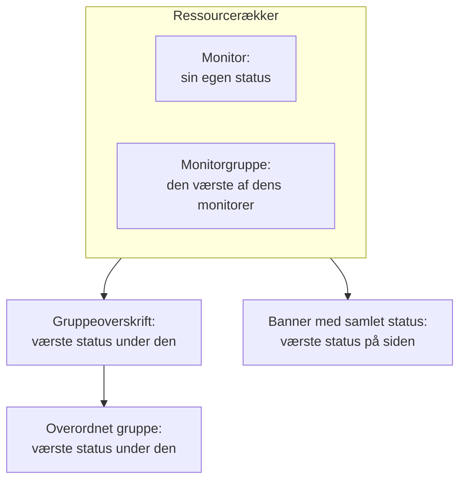

# Statusside – ressourcer og grupper

En ressource er én række på din statusside: en monitor eller en monitorgruppe, med et navn dine kunder forstår, dens aktuelle status og, hvis du vil, dens oppetid og historik. Grupper er sektioner, der indeholder ressourcer, så en side med fyrre monitorer læses som "API", "Webapp" og "Datapipeline" i stedet for én endeløs liste. Du bygger begge dele på én skærm: åbn en statusside, og vælg **Ressourcer** i dens sidemenu.

:::cards
- [Tilføj en monitor](#tilføj-en-monitor): Sæt en monitor på siden med det navn, besøgende læser.
- [Grupper](#grupper): Del siden op i sektioner, og indlejr dem.
- [Monitorregler](#tilføj-monitorer-automatisk-med-monitorregler): Lad en regel tilføje alle matchende monitorer for dig.
- [Importér grupper fra CSV](#import-af-grupper-fra-csv): Byg et dybt hierarki på én gang.
:::

Besøgende vurderer ud fra disse rækker, om "det er mig eller dem", så giv dem de navne, kunderne bruger om dit produkt: **Checkout API**, ikke `prod-checkout-lb-healthcheck-us-east-1`.

## Sådan bevæger en status sig op ad siden

Hver række viser den aktuelle status for sin monitor. Hvert niveau over den viser den værste status af alt under det, hvor den værste status er den med den højeste prioritet blandt dit projekts monitorstatusser.

En ressource afgør mere end farven på sin række:

- **Arkiverede monitorer vises ikke.** En arkiveret monitor tjekkes ikke længere, så dens seneste status er frosset; siden udelader dens række (og udelader den fra en monitorgruppes status) i stedet for at vise den frosne status, som om den var aktuel. Rækken bevares, så når monitoren tages ud af arkivet, kommer den straks tilbage.
- **Ressourcer afgør, hvilke hændelser siden viser.** En hændelse vises her, og sidens abonnenter hører om den, når en af hændelsens monitorer er en ressource på siden, direkte eller via en monitorgruppe. Sæt den samme monitor på flere sider, og dens hændelser når dem alle, medmindre en hændelse er begrænset til nogle af de sider. Se [Én statusside pr. målgruppe](/docs/status-pages/one-status-page-per-audience).
- **En monitorgruppes række står for alle monitorer i den, også for abonnenter.** På en side, der lader abonnenter vælge ressourcer, hører den, der abonnerer på en monitorgruppe, om hændelser, planlagt vedligeholdelse og meddelelser for enhver monitor i gruppen, som om vedkommende havde valgt den monitor. Se [Abonnenter og meddelelser](/docs/status-pages/subscribers#lad-abonnenter-vælge-ressourcer-og-hændelsestyper).

## Skærmen Ressourcer

Punktet hedder **Ressourcer** i projekter, hvor monitorgrupper er slået til, og **Monitorer** i de andre; det er den samme skærm. Grupper havde tidligere deres egen side, og den gamle adresse `/groups` åbner nu denne skærm.

Skærmen er delt i to:

| Del | Hvad den indeholder |
| ---- | ------------- |
| **Gruppenavigator** (til venstre) | Alle sidens grupper som et træ, med feltet **Search groups...** over og en optælling under, såsom `3 groups · 12 resources`. En lang liste slutter med knappen **Show N more of M**. |
| **Top of page** | Navigatorens første række: ressourcer uden gruppe, som besøgende ser først, over alle grupper. På en side uden grupper hedder det højre panel i stedet **All resources**. |
| **Ressourcepanel** (til højre) | Den valgte gruppes ressourcer. Dets overskrift indeholder **Edit Group**, den primære knap **Tilføj monitor** og menuen **More actions**. |
| Kortets overskrift | **New Group** og en menu med tre prikker med **Import groups from CSV** og **Opdater**. |

**Tomme tilstande fortæller dig, hvad du skal gøre.** En tom gruppe viser **No monitors here yet** med **Tilføj monitor**, **Add Multiple** og, kun så længe siden slet ingen grupper har, **Create a Group**. En søgning uden resultater viser **No resources match your search**.

## Tilføj en monitor

:::steps
### Vælg, hvor rækken skal stå

Vælg i gruppenavigatoren den gruppe, ressourcen hører til, eller **Top of page** for en række uden gruppe.

### Klik på Tilføj monitor

Dialogen **Add a monitor to {group}** åbner. Den består af én side.

### Vælg monitoren

Vælg den i **Overvågning** (pladsholder **Vælg overvågning**). **Visningsnavn**, den tekst, besøgende læser, udfyldes med monitorens navn og følger med, når du vælger en anden monitor, indtil du selv skriver et navn. Det gemmes adskilt fra monitorens eget navn, så at omdøbe det her ændrer intet i overvågningen.

### Angiv visningsindstillingerne, hvis du vil

**Flere felter** er foldet sammen. Det indeholder **Beskrivelse** (valgfri markdown vist under rækken, god til en sætning, der forklarer, hvad tjenesten faktisk gør; et billede i den vises for alle besøgende) og [visningsindstillingerne](#visningsindstillinger-for-en-ressource). Lad det være lukket, og ressourcen får deres standardværdier.

### Gem ressourcen

Klik på **Tilføj monitor**. Rækken vises i gruppen og på statussiden.
:::

I en gittergruppe beder dialogen også om den række og kolonne, monitoren skal stå i, over **Flere felter**; se [Listelayout eller gitterlayout](#listelayout-eller-gitterlayout).

> [!TIP]
> For at vise flere tjek som én række tilføjer du en monitorgruppe. Med kontakten **Monitorgrupper** slået til (**Projektindstillinger** > **Avanceret** > **Funktionsflag**, som gemmes, så snart du slår den om) står der et link under rullelisten: **Add a Monitor Group instead.** Klik på det, og **Overvågning** bliver til **Monitor Gruppe** (**Vælg overvågningsgruppe**); **Add a Monitor instead.** skifter tilbage.

### Tilføj flere på én gang

**Add Multiple** (også **Add multiple monitors** i menuen **More actions**) åbner **Add Multiple Monitors**. Den er også én side: en flervalgsliste **Monitorer**, derefter de samme sammenfoldede **Flere felter**, hvis visningsindstillinger gælder for hver monitor, du vælger. Hver ressource får sit visningsnavn og sin beskrivelse fra sin monitor, og **Add Monitors** tilføjer dem alle. Det er den hurtigste måde at fylde en ny side på.

Flervalgslisten har fanen **Etiketter**: klik på en etiket, og alle monitorer med den vælges på én gang.

### Det er sikkert at tilføje efter etiket to gange

En statusside viser en monitor én gang. Tilføjelse er idempotent, så når du vælger den samme etiket igen efter at have givet nogle nye monitorer den, tilføjes kun de nye: de monitorer, der allerede er på siden, forbliver præcis, som de er, med det visningsnavn og de indstillinger, du gav dem.

Oversigten efter tilføjelsen af flere siger det samme: tilføjede monitorer står under **Tilføjet**, og dem, der allerede var der, under **Already Added**. Intet rapporteres som en fejl, og intet skrives for dem.

Den samme regel gælder alle andre steder, hvor en ressource oprettes. At tilføje en monitor, der allerede er på siden, fra formularen til én monitor, eller at lade en eksisterende ressource pege på den fra redigeringsformularen, afvises med *"This monitor is already added to this status page"*, også når den eksisterende ressource står i en anden gruppe, for en besøgende ville stadig se monitoren to gange. For at vise en monitor i en anden gruppe sletter du den ressource, den allerede har, og tilføjer den, hvor du vil have den.

## Visningsindstillinger for en ressource

Sektionen **Flere felter** er den samme i formularen til én monitor og i dialogen til flere. Den starter sammenfoldet i begge og også i **Rediger ressource**, hvor dens sammenfoldede overskrift viser, hvad der ikke står på standardværdien. Alt her gælder pr. ressource: to rækker i samme gruppe kan være sat forskelligt op.

| Felt | Standard | Hvad det gør |
| ----- | ------- | ------------ |
| **Værktøjstip** (`displayTooltip`) | Tom | Vises som værktøjstip ved siden af ressourcen på din statusside. Brug det til omfanget: "Kunder i USA og EU". |
| **Vis aktuel ressourcestatus** (`showCurrentStatus`) | Til | Viser den aktuelle status, såsom i drift, forringet eller offline, ved siden af rækken. |
| **Vis oppetid %** (`showUptimePercent`) | Fra | Viser en oppetidsprocent ved siden af ressourcen. |
| **Vælg oppetidspræcision** (`uptimePercentPrecision`) | Én decimal | Vises, når **Vis oppetid %** er slået til, og er da påkrævet. |
| **Vis statushistorikdiagram** (`showStatusHistoryChart`) | Til | Viser ressourcens daglige søjler med oppetidshistorik. |

**Visningsnavn** (`displayName`) og **Beskrivelse** (`displayDescription`) er også kun til visning: de ændrer aldrig selve monitoren.

## Oppetidsprocenter og historikdiagrammer

**Vis oppetid %** og **Vis statushistorikdiagram** læser begge én indstilling for hele siden: hvor mange dage de dækker. Det er **Oppetidshistorik** på kortet **Hvad din statusside viser** under **Statussider → din side → Avanceret → Avancerede indstillinger**. Den accepterer 1 til 90 dage og er som standard 90. Slå altså kontakterne til pr. ressource, og angiv vinduet én gang for hele siden.

**Præcision er en vurderingssag.** **Vælg oppetidspræcision** tilbyder `99% (No Decimal)`, `99.9% (One Decimal)`, `99.99% (Two Decimal)` og `99.999% (Three Decimal)`. Flere decimaler ser præcise ud og indbyder til diskussioner om den tredje; offentliggør du en SLA på tre nitaller, så match den og ikke mere.

Grupper har deres egne udgaver af disse kontakter (se nedenfor), så en gruppe kan vise en samlet procent, mens monitorerne i den holder sig stille, eller omvendt.

Farverne på historikdiagrammets søjler angives under **Yderligere indstillinger** på siden **Branding**, og hvilke monitorstatusser der tæller som "nede" under **Tæller som nedetid** på kortet **Hvad din statusside viser** under **Avancerede indstillinger**; begge dele er beskrevet i [Statusside – branding og domæner](/docs/status-pages/branding-and-domains).

## Grupper

De fleste grupper behøver kun et navn.

:::steps
### Klik på New Group

**Create New Status Page Group** åbner: to felter og derefter to sammenfoldede sektioner.

### Navngiv gruppen

Skriv **Gruppenavn**: den sektionsoverskrift, besøgende ser.

### Indlejr den, hvis den hører til i en anden gruppe

Vælg en **Parent Group**, eller lad den stå på **No parent group (top level)**. **Add a sub group** i en gruppes menuer udfylder dette for dig.

### Opret gruppen

Klik på **Create Status Page Group**. Gruppen vises i navigatoren, klar til monitorer.
:::

De to felter er **Gruppenavn** (`name`) og **Parent Group** (`parentStatusPageGroupId`). De to sammenfoldede sektioner indeholder resten:

- **Layout**: dens sammenfoldede overskrift siger **List** eller **Grid**. Den indeholder **Visningstilstand** og et gitters akser (se [Listelayout eller gitterlayout](#listelayout-eller-gitterlayout)), og den åbner af sig selv på en gittergruppe.
- **Flere felter**: gruppeniveauets udgaver af ressourceindstillingerne:
  - **Gruppebeskrivelse** (`description`): valgfri markdown, vist under overskriften. Et billede i den vises for alle besøgende.
  - **Udvid på statusside som standard** (`isExpandedByDefault`): til som standard; afgør, om sektionen starter åben eller sammenfoldet for besøgende.
  - **Vis aktuel gruppestatus** (`showCurrentStatus`): til som standard. Viser en status ved siden af gruppeoverskriften.
  - **Vis oppetid %** (`showUptimePercent`): fra som standard, med **Vælg oppetidspræcision**, når den er slået til.

For at ændre en gruppe bruger du **Edit Group** i panelets overskrift eller **Edit group** i navigatorens rækkemenu: **Edit Status Page Group** åbner med knappen **Gem ændringer**. Panelets overskrift viser mærker for de indstillinger, der er slået til (**Grid**, **Collapsed by default**, **Uptime %**), så du kan se, hvordan en gruppe er sat op, uden at åbne formularen.

### Administrer en gruppe

| Hvor | Handlinger |
| ----- | ------- |
| Navigatorens rækkemenu | **Edit group**, **Move up**, **Move down**, **Vis ID**, **Delete group** |
| Panelets menu **More actions** | **Edit this group**, **Add a sub group**, **Move group up**, **Move group down**, **Show group ID**, **Opdater**, **Delete this group** |

En gruppe, der er gemt uden navn, vises som **Untitled group**, et godt tegn på, at du ville skrive noget.

## Indlejring af grupper

Grupper kan indlejres: angiv **Parent Group** på undergruppen, eller brug **Add a sub group inside this group** i navigatoren. Formularens hjælpetekst beskriver den form, den er bygget til (noget i retning af Forretningsenheder › Region › Marked), og hvert niveau viser den samlede status og oppetid for alt under det.

Når en gruppe har undergrupper, viser ressourcepanelet en række mærker **Sub groups**, der linker direkte til hver undergruppe, så du kan gå gennem hierarkiet uden at vende tilbage til navigatoren.

Indlejring betaler sig på store sider: en hostingudbyder med regioner inde i produkter eller en detailhandel med markeder inde i forretningsenheder. På en side med tolv monitorer er ét fladt niveau venligere.

## Listelayout eller gitterlayout

Sektionen **Layout** i gruppeformularen angiver gruppens **Visningstilstand** (`viewMode`), som ændrer, hvordan gruppen vises på statussiden.

| Hvis du vil… | Vælg |
| --------------- | ---- |
| Vise en enkel lodret liste over tjenester, én pr. række | **List** (standard) |
| Vise den samme tjeneste i flere regioner eller lejere som en matrix | **Grid** |

Vælg **Grid**, og der vises fire felter mere:

| Felt | Hvad du skal angive |
| ----- | ------------- |
| **Etiket for rækkeakse** | Navnet på rækkedimensionen, pladsholder `Service`. |
| **Værdier for rækkeakse** | Rækkerne, tilføjet én ad gangen med **Add Row** (pladsholder `e.g. Auth`). |
| **Etiket for kolonneakse** | Kolonnedimensionen, pladsholder `Region`. |
| **Værdier for kolonneakse** | Kolonnerne, tilføjet med **Add Column** (pladsholder `e.g. US-East`). |

Hver monitor i en gittergruppe står i en celle, så **Tilføj monitor** og dialogen til flere beder om rækken og kolonnen sammen med monitoren og bruger dine egne aksenavne.

> [!IMPORTANT]
> Opsæt akserne, før du tilføjer monitorer. En gittergruppe uden rækker eller kolonner viser en besked om, at der endnu ikke er noget sted at sætte en monitor, med knappen **Set up the grid**, der åbner gruppens formular på sektionen **Layout**, og gruppens knap **Tilføj monitor** er væk, indtil du har gjort det.

## Rækkefølgen af det, besøgende ser

Rækkefølgen bestemmer du selv, ikke alfabetet:

| Hvad | Sådan ændrer du rækkefølgen |
| ---- | ----------------- |
| Ressourcer i en gruppe | Træk en række. Panelet siger det: **Drag a row to change the order visitors see**. |
| Grupper i forhold til hinanden | **Move up** / **Move down** i navigatorens rækkemenu eller **Move group up** / **Move group down** i **More actions**. |
| Ressourcer uden gruppe | De står i **Top of page** og vises altid over alle grupper, så sæt det, som alle tjekker først, dér. |

**To tilfælde, hvor træk er slået fra.** En søgning i feltet **Search in {group}...** slår omrokering fra (panelet siger `N of M shown · drag to reorder is off while filtering`), så ryd søgningen først. Og gittergrupper omrokeres aldrig ved at trække, fordi en monitors plads kommer fra dens række og kolonne.

Sæt den tjeneste, der oftest bliver spurgt om, øverst. Besøgende, der kommer til siden under et nedbrud, holder som regel op med at læse efter første skærmbillede.

## Tilføj monitorer automatisk med monitorregler

En monitorregel tilføjer monitorer til siden for dig: beskriv monitorerne én gang, og hver monitor, der matcher, havner i den gruppe, du har valgt. Regler findes under **Ressourcer → Monitor Rules** ved siden af skærmen Ressourcer.

:::steps
### Åbn Monitor Rules

Åbn statussiden, vælg **Monitor Rules** i sektionen **Ressourcer** i dens sidemenu, og klik på **Opret Status Page Monitor Rule**.

### Navngiv reglen

Angiv et **Navn** under **Grundlæggende oplysninger**. **Aktiveret** er slået til som standard.

### Angiv, hvilke monitorer den matcher

Under **Matchkriterier** udfylder du mindst ét af **Overvågningsetiketter** (en monitor med en hvilken som helst af dem matcher), **Overvågningsnavn** og **Overvågningsbeskrivelse**. En monitor skal opfylde hvert kriterium, du udfylder. De to mønstre accepterer et regulært udtryk uden forskel på store og små bogstaver (`^api-.*`) eller et jokertegn `*` (`*checkout*`); `.*` matcher alle monitorer.

### Vælg gruppen

Under **Gruppe** vælger du **Add Monitors To Group**, eller du lader den stå tom for at tilføje monitorerne uden gruppe. Derefter følger de samme visningsindstillinger som for en ressource; på en regel starter **Vis oppetid %** slået til.

### Gem reglen

Reglen kører med det samme mod alle monitorer, der allerede findes, og listen viser under **Adds Monitors To** den gruppe, den tilføjer monitorer til.
:::

Derefter kører en regel igen for en monitor, hver gang en oprettes, eller når dens etiketter, navn eller beskrivelse ændres. En regel fjerner kun de ressourcer, den selv har tilføjet: at slå den fra eller slette den fjerner dem fra siden, og en monitor, du har tilføjet i hånden, røres aldrig. En monitor, der allerede er på siden, tilføjes aldrig to gange.

## Import af grupper fra CSV

Det er besværligt at bygge et dybt hierarki i hånden. **Import groups from CSV** i kortoverskriftens menu med tre prikker åbner dialogen **Import Groups from CSV**.

:::steps
### Download skabelonen

Klik på **Download CSV Template** for at hente `status-page-groups-template.csv`.

### Udfyld den

Én række pr. gruppe. Kun `name` er påkrævet; kolonnerne er vist nedenfor.

### Upload, og se forhåndsvisningen

Klik på **Choose CSV File**, vælg din fil, og derefter **Preview Import** for at tjekke, hvad der bliver oprettet, før noget skrives.

### Importér

Kør importen. Tabellen **Import results** viser hver række som **Oprettet**, **Mislykkedes** eller **Sprunget over** med årsagen, så en forkert række aldrig forsvinder i stilhed.
:::

| Kolonne | Hvad den angiver |
| ------ | ------------ |
| `name` | Gruppens navn. Påkrævet. |
| `parentName` | Navnet på den gruppe, denne er indlejret i. |
| `description` | Gruppens beskrivelse. |
| `isExpandedByDefault` | Om sektionen starter åben for besøgende. |
| `showCurrentStatus` | Om der vises en status ved siden af gruppeoverskriften. |
| `showUptimePercent` | Om der vises en oppetidsprocent ved siden af gruppen. |
| `uptimePercentPrecision` | Hvor mange decimaler den procent bruger. |
| `viewMode` | `List` eller `Grid`. |
| `rowAxisLabel` | Rækkedimensionens navn for en gittergruppe. |
| `rowAxisValues` | Rækkeværdierne for en gittergruppe. |
| `columnAxisLabel` | Kolonnedimensionens navn for en gittergruppe. |
| `columnAxisValues` | Kolonneværdierne for en gittergruppe. |

Importen opretter grupper, ikke ressourcer: tilføj monitorer bagefter med **Tilføj monitor**, **Add Multiple** eller en monitorregel.

## Fejlfinding

:::details "This monitor is already added to this status page"
En side viser hver monitor én gang, også på tværs af grupper. Monitoren har allerede en ressource, måske i en anden gruppe eller tilføjet af en monitorregel. Søg efter den i navigatoren, slet den ressource, og tilføj monitoren, hvor du vil have den.
:::

:::details En monitor, jeg har tilføjet, vises ikke på statussiden
Tjek, om monitoren er arkiveret: en arkiveret monitors række udelades, indtil du tager den ud af arkivet. Tjek også gruppen: en gruppe, der er sat til at starte sammenfoldet (**Udvid på statusside som standard** slået fra), skjuler sine rækker, indtil en besøgende åbner den.
:::

:::details Der er ingen knap Tilføj monitor i en gittergruppe
Gitteret har endnu ingen rækker eller kolonner. Klik på **Set up the grid**, tilføj akseværdierne i sektionen **Layout**, og **Tilføj monitor** kommer tilbage.
:::

:::details Jeg kan ikke trække rækker
Ryd feltet **Search in {group}...**: omrokering er slået fra, mens panelet er filtreret. Gittergrupper omrokeres aldrig ved at trække.
:::

## Næste skridt

:::cards
- [Statusside – branding og domæner](/docs/status-pages/branding-and-domains): Logo, favicon, historikdiagrammets farver og dit eget domæne.
- [Abonnenter og meddelelser](/docs/status-pages/subscribers): Hvem der får besked, når disse ressourcer ændrer sig.
- [Én statusside pr. målgruppe](/docs/status-pages/one-status-page-per-audience): Den samme monitor på mange sider og en hændelse, der kun når nogle af dem.
- [Offentlig API](/docs/status-pages/public-api): Læs ressourcer, grupper og oppetid som JSON.
:::
