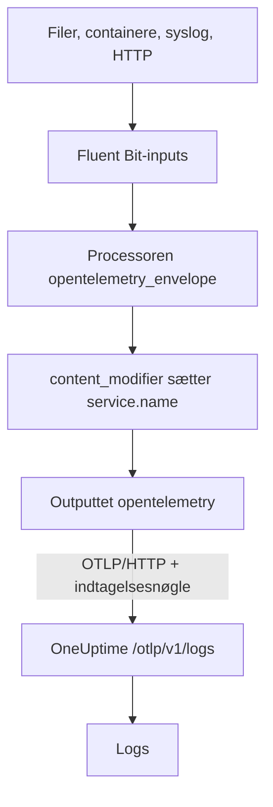

# Fluent Bit

[Fluent Bit](https://docs.fluentbit.io/manual) er en let agent, der indsamler logs fra filer, systemd, containere, syslog, HTTP og mange andre kilder. Dens [OpenTelemetry-output](https://docs.fluentbit.io/manual/pipeline/outputs/opentelemetry) sender det indsamlede til OneUptimes OpenTelemetry-endpoint (OTLP), hvor loggene bliver søgbare under **Produkter → Protokoller**.

:::cards
- [Konfigurér Fluent Bit](#konfigurér-fluent-bit): Tilføj OpenTelemetry-outputtet, og navngiv din tjeneste.
- [Komplet eksempel](#komplet-eksempel): En hel konfigurationsfil at starte fra.
- [Selvhostet OneUptime](#selvhostet-oneuptime): Peg Fluent Bit på din egen instans.
:::

## Sådan virker det



Fluent Bit pakker hver post ind i en OpenTelemetry-konvolut, så den kan bære ressourceattributter som `service.name`. OpenTelemetry-outputtet sender derefter posterne til OneUptime med din indtagelsesnøgle i headeren `x-oneuptime-token`. OneUptime gemmer dem under den tjeneste, `service.name` angiver, og opretter tjenesten første gang, den sender.

## Før du begynder

- **Installér Fluent Bit** – se [installationsvejledningen](https://docs.fluentbit.io/manual/installation/getting-started-with-fluent-bit). Konfigurationen på denne side bruger Fluent Bits YAML-format og processoren `opentelemetry_envelope`, så brug en aktuel version.
- **Et OneUptime-projekt.** I OneUptime Cloud afregnes telemetri pr. indtaget GB – se [priser](https://oneuptime.com/pricing) – og et projekt på Free-planen skal have en betalingsmetode, før det kan sende telemetri.
- **En indtagelsesnøgle til telemetri.** Hvis du ikke har en:

:::steps
### Åbn indtagelsesnøglerne

Gå til **Produkter → Projektindstillinger**, åbn **Telemetri og APM** i sidemenuen, og vælg **Indtagelsesnøgler**.


### Opret en nøgle

Klik på **Opret ingestion-nøgle**. Dialogen har allerede udfyldt nøglens navn og valgt **Server** – den slags nøgle, en applikation eller en collector sender med – så klik på **Opret ingestion-nøgle** for at oprette den, eller omdøb den først.

### Kopiér hemmeligheden

Den nye nøgle åbner på sin egen side. Kopiér dens **Hemmelig nøgle**: Det er `YOUR_TELEMETRY_INGESTION_TOKEN` i konfigurationen nedenfor.


:::

## Konfigurér Fluent Bit

Fluent Bit læser sin YAML-konfiguration fra en fil som `/etc/fluent-bit/fluent-bit.yaml`.

:::steps
### Tilføj OpenTelemetry-outputtet

Tilføj et `opentelemetry`-output, der sender til OneUptime. Behold `stdout`-outputtet, mens du tester, hvis du vil se posterne lokalt:

```yaml title="fluent-bit.yaml"
pipeline:
  outputs:
    - name: stdout
      match: "*"
    - name: opentelemetry
      match: "*"
      host: "oneuptime.com"
      port: 443
      metrics_uri: "/otlp/v1/metrics"
      logs_uri: "/otlp/v1/logs"
      traces_uri: "/otlp/v1/traces"
      tls: On
      header:
        - x-oneuptime-token YOUR_TELEMETRY_INGESTION_TOKEN
```

### Pak logs ind i en OpenTelemetry-konvolut, og navngiv tjenesten

Tilføj processoren `opentelemetry_envelope` til hvert input, efterfulgt af en `content_modifier`, der sætter `service.name`. Erstat `YOUR_SERVICE_NAME` med det navn, loggene skal vises under i OneUptime:

```yaml title="fluent-bit.yaml"
pipeline:
  inputs:
    - name: tail # or any other input
      path: /var/log/my-app/*.log

      processors:
        logs:
          - name: opentelemetry_envelope

          - name: content_modifier
            context: otel_resource_attributes
            action: upsert
            key: service.name
            value: YOUR_SERVICE_NAME
```

### Genstart Fluent Bit

Genstart Fluent Bit-tjenesten, eller start den med `fluent-bit -c /etc/fluent-bit/fluent-bit.yaml`. Efter få sekunder vises loggene under **Produkter → Protokoller**, og tjenesten står under **Produkter → Tjenester**.
:::

## Komplet eksempel

Denne konfiguration modtager logs over HTTP på port `8888` og sender dem videre til OneUptime:

```yaml title="fluent-bit.yaml"
service:
  flush: 1
  log_level: info

pipeline:
  inputs:
    - name: http
      listen: 0.0.0.0
      port: 8888

      processors:
        logs:
          - name: opentelemetry_envelope

          - name: content_modifier
            context: otel_resource_attributes
            action: upsert
            key: service.name
            value: YOUR_SERVICE_NAME

  outputs:
    - name: stdout
      match: "*"
    - name: opentelemetry
      match: "*"
      host: "oneuptime.com"
      port: 443
      metrics_uri: "/otlp/v1/metrics"
      logs_uri: "/otlp/v1/logs"
      traces_uri: "/otlp/v1/traces"
      tls: On
      header:
        - x-oneuptime-token YOUR_TELEMETRY_INGESTION_TOKEN
```

Erstat `http`-inputtet med de inputs, du har brug for – for eksempel `tail` til logfiler eller `systemd` til journalen – og behold de to processorer på hvert af dem.

## Selvhostet OneUptime

Sæt `host` til værten for din OneUptime-instans. Hvis den betjenes over almindelig HTTP i stedet for HTTPS, skal du også sætte `port` til den port, den lytter på (normalt `80`), og fjerne `tls`:

```yaml title="fluent-bit.yaml"
pipeline:
  outputs:
    - name: stdout
      match: "*"
    - name: opentelemetry
      match: "*"
      host: "your-oneuptime-instance.com"
      port: 80
      metrics_uri: "/otlp/v1/metrics"
      logs_uri: "/otlp/v1/logs"
      traces_uri: "/otlp/v1/traces"
      header:
        - x-oneuptime-token YOUR_TELEMETRY_INGESTION_TOKEN
```

## Fejlfinding

:::details Fluent Bit logger `401` fra OpenTelemetry-outputtet
Indtagelsesnøglen mangler, er ukendt eller udløbet. Tjek `header`-linjen: Den er `x-oneuptime-token`, et mellemrum og derefter nøglens **Hemmelig nøgle**.
:::

:::details Fluent Bit logger `402` eller `422`
`402`: I OneUptime Cloud er projektet på Free-planen og har ingen betalingsmetode. Tilføj en under **Projektindstillinger → Fakturering og fakturaer → Fakturering**. `422`: Nøglen er deaktiveret, eller det er en browsernøgle. Slå **Aktiveret** til igen i nøglens indstillinger, eller opret en **Server**-nøgle.
:::

:::details Logs ankommer under en uventet tjeneste
Tjenesten kommer fra `service.name`. Tjek, at hvert input har processoren `opentelemetry_envelope` efterfulgt af den `content_modifier`, der sætter den.
:::

:::details Intet ankommer, og Fluent Bit logger forbindelsesfejl
Tjek, at `tls: On` og `port: 443` er sat for et HTTPS-endpoint, og at værten, der kører Fluent Bit, kan nå din OneUptime-vært på den port.
:::

Har du spørgsmål eller brug for hjælp med konfigurationen, så skriv til os på support@oneuptime.com.

## Næste trin

:::cards
- [Logpipelines](/docs/telemetry/log-pipelines): Fortolk og berig de logs, Fluent Bit sender.
- [Søgesyntaks](/docs/telemetry/search-syntax): Find loggene i log-exploreren.
- [OpenTelemetry](/docs/telemetry/open-telemetry): Endpoints, nøgler og grænser for al telemetri.
- [Fluentd](/docs/telemetry/fluentd): Brug Fluentd i stedet.
:::
