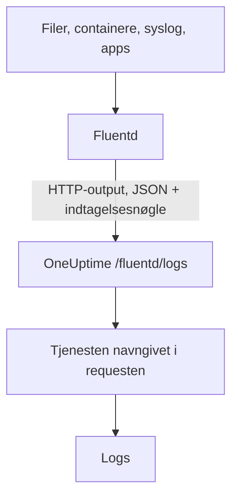

# Fluentd

[Fluentd](https://www.fluentd.org/) indsamler logs fra filer, containere, syslog, applikationer og [mange andre kilder](https://www.fluentd.org/datasources). Dens indbyggede [HTTP-output](https://docs.fluentd.org/output/http) sender dem til OneUptimes Fluentd-endpoint, hvor de bliver søgbare under **Produkter → Protokoller**.

:::cards
- [Konfigurér Fluentd](#konfigurér-fluentd): Tilføj et HTTP-output, der peger på OneUptime.
- [Sådan læses poster](#sådan-læses-poster): Hvilke felter der bliver til beskeden, alvorsgraden og attributter.
- [Selvhostet OneUptime](#selvhostet-oneuptime): Peg Fluentd på din egen instans.
:::

## Sådan virker det



Fluentd sender poster i batches som JSON med din indtagelsesnøgle i headeren `x-oneuptime-token` og tjenestenavnet i `x-oneuptime-service-name`. OneUptime gør hver post til en log for den tjeneste og opretter tjenesten første gang, den sender.

## Før du begynder

- **Installér Fluentd** – se [installationsvejledningen](https://docs.fluentd.org/installation).
- **Et OneUptime-projekt.** I OneUptime Cloud afregnes telemetri pr. indtaget GB – se [priser](https://oneuptime.com/pricing) – og et projekt på Free-planen skal have en betalingsmetode, før det kan sende telemetri.
- **En indtagelsesnøgle til telemetri.** Hvis du ikke har en:

:::steps
### Åbn indtagelsesnøglerne

Gå til **Produkter → Projektindstillinger**, åbn **Telemetri og APM** i sidemenuen, og vælg **Indtagelsesnøgler**.


### Opret en nøgle

Klik på **Opret ingestion-nøgle**. Dialogen har allerede udfyldt nøglens navn og valgt **Server** – den slags nøgle, en applikation eller en collector sender med – så klik på **Opret ingestion-nøgle** for at oprette den, eller omdøb den først.

### Kopiér hemmeligheden

Den nye nøgle åbner på sin egen side. Kopiér dens **Hemmelig nøgle**: Det er `YOUR_SERVICE_TOKEN` i konfigurationen nedenfor.


:::

## Konfigurér Fluentd

Fluentds konfigurationsfil er normalt `/etc/fluent/fluentd.conf`, eller `/etc/td-agent/td-agent.conf` for den ældre td-agent-pakke.

:::steps
### Tilføj et HTTP-output

Tilføj en `<match>`-sektion, der sender poster til OneUptime. Erstat `YOUR_SERVICE_TOKEN` med din indtagelsesnøgle og `YOUR_SERVICE_NAME` med det navn, loggene skal vises under – et hvilket som helst navn:

```text title="fluentd.conf"
# Match all patterns
<match **>
  @type http

  endpoint https://oneuptime.com/fluentd/logs
  open_timeout 2

  headers {"x-oneuptime-token":"YOUR_SERVICE_TOKEN", "x-oneuptime-service-name":"YOUR_SERVICE_NAME"}

  content_type application/json
  json_array true

  <format>
    @type json
  </format>
  <buffer>
    flush_interval 10s
  </buffer>
</match>
```

`json_array true` sender hver tømning af bufferen som ét JSON-array, og `flush_interval 10s` sender en batch hvert 10. sekund.

### Genstart Fluentd

Genstart Fluentd-tjenesten, så den indlæser det nye output.

### Tjek, at logs ankommer

Få sekunder efter næste tømning vises loggene under **Produkter → Protokoller**. Tjenesten står under **Produkter → Tjenester** – fandtes den ikke i forvejen, opretter OneUptime den.
:::

## Komplet eksempel

Denne konfiguration modtager poster over Fluentds forward-protokol på port `24224` og sender dem alle til OneUptime:

```text title="fluentd.conf"
####
## Source descriptions:
##

## built-in TCP input
## @see https://docs.fluentd.org/input/forward
<source>
  @type forward
  port 24224
  bind 0.0.0.0
</source>

<match **>
  @type http

  endpoint https://oneuptime.com/fluentd/logs
  open_timeout 2

  headers {"x-oneuptime-token":"YOUR_SERVICE_TOKEN", "x-oneuptime-service-name":"YOUR_SERVICE_NAME"}

  content_type application/json
  json_array true

  <format>
    @type json
  </format>
  <buffer>
    flush_interval 10s
  </buffer>
</match>
```

Vil du sende forskellige kilder som forskellige tjenester, så brug én `<match>`-sektion pr. tag, hver med sit eget `x-oneuptime-service-name`.

## Sådan læses poster

OneUptime læser disse felter fra hver post:

| Logfelt | Læses fra postens første tilstedeværende felt af | Bemærkninger |
| --- | --- | --- |
| Indhold | `message`, `log`, `msg`, `body`, `text` | Loglinjen. En post uden nogen af dem gemmes hel, som JSON. |
| Alvorsgrad | `level`, `severity`, `loglevel`, `log_level`, `priority`, `severityText`, `severity_text` | Navne som `trace`, `debug`, `info`, `notice`, `warn`, `error`, `critical` og `fatal`, med store eller små bogstaver. Enhver anden værdi gemmes som `Unspecified`. |
| Trace-ID | `trace_id`, `traceId`, `traceid` | Kobler loggen til dens trace. |
| Span-ID | `span_id`, `spanId`, `spanid` | Kobler loggen til dens span. |
| Tjeneste | headeren `x-oneuptime-service-name` | `Fluentd`, når headeren ikke er sat. |
| Tid | — | Det tidspunkt, hvor OneUptime modtager posten. |

Alle andre felter bliver til en attribut med navnet `fluentd.` efterfulgt af feltets navn, som du kan søge og filtrere på: Et felt `container_name` er `@fluentd.container_name` i log-exploreren. Et indlejret objekt bliver fladet ud med punktummer, f.eks. `fluentd.kubernetes.pod_name`, og en liste gemmes som JSON.

Fluentd-logs går gennem dine [logpipelines](/docs/telemetry/log-pipelines), drop-filtre og maskeringsregler som enhver anden log.

## Selvhostet OneUptime

Erstat `https://oneuptime.com` i `endpoint` med URL'en til din OneUptime-instans: `http(s)://YOUR_ONEUPTIME_HOST/fluentd/logs`.

## Fejlfinding

:::details Fluentd logger `401` fra HTTP-outputtet
Indtagelsesnøglen mangler, er ukendt eller udløbet. Tjek værdien af `x-oneuptime-token` i `headers`.
:::

:::details Fluentd logger `402` eller `422`
`402`: I OneUptime Cloud er projektet på Free-planen og har ingen betalingsmetode. Tilføj en under **Projektindstillinger → Fakturering og fakturaer → Fakturering**. `422`: Nøglen er deaktiveret, eller det er en browsernøgle. Slå **Aktiveret** til igen i nøglens indstillinger, eller opret en **Server**-nøgle.
:::

:::details Logs ankommer under tjenesten `Fluentd`
Headeren `x-oneuptime-service-name` mangler. Tilføj den til `headers` i hver `<match>`-sektion.
:::

:::details Logindholdet viser hele posten som JSON
OneUptime tager indholdet fra det første tilstedeværende felt af `message`, `log`, `msg`, `body` eller `text` og gemmer hele posten, når den ikke har nogen af dem. Omdøb feltet med din loglinje til et af dem, for eksempel med Fluentds filter `record_transformer`.
:::

Har du spørgsmål eller brug for hjælp med konfigurationen, så skriv til os på support@oneuptime.com.

## Næste trin

:::cards
- [Logpipelines](/docs/telemetry/log-pipelines): Fortolk og berig de logs, Fluentd sender.
- [Søgesyntaks](/docs/telemetry/search-syntax): Find loggene i log-exploreren.
- [Fluent Bit](/docs/telemetry/fluentbit): En lettere agent, der sender over OpenTelemetry.
- [Log-monitor](/docs/monitor/logs-monitor): Få besked, når matchende logs dukker op.
:::
