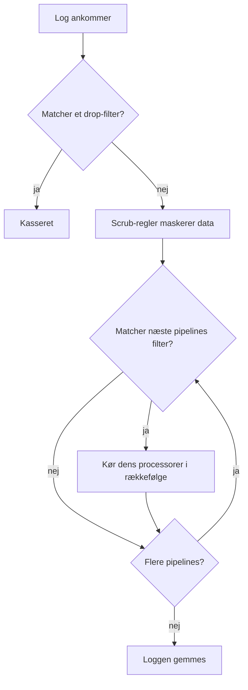

# Logpipelines

Logpipelines ændrer logs, mens OneUptime indlæser dem, før de gemmes. En pipeline har et **filter**, der afgør, hvilke logs den gælder for, og en ordnet liste af **processorer**, der hver ændrer de logs: trækker felter ud af beskeden, retter alvorligheden, omdøber en attribut eller mærker loggen med en kategori.

Pipelines findes under **Protokoller → Indstillinger → Pipelines**.

:::cards
- [Sådan kører en pipeline](#sådan-kører-en-pipeline): Hvor pipelines sidder i indlæsningen, og i hvilken rækkefølge de kører.
- [Opret en pipeline](#opret-en-pipeline): Vælg nogle logs, og tilføj processorer til dem.
- [Key=Value Parser](#keyvalue-parser): Gør firewall- og logfmt-linjer til attributter.
- [Eksempel: Sophos XGS-firewall](#eksempel-sophos-xgs-firewall): Fortolk firewall-syslog fra start til slut.
:::

## Sådan kører en pipeline

Pipelines kører på hver log, OneUptime indlæser, uanset om det er OpenTelemetry-logs, syslog eller Fluentd, efter drop-filtre og scrub-regler og før loggen gemmes:



- **Pipelines kører i rækkefølge**: listens rækkefølge, som du ændrer ved at trække rækkerne. En pipeline rører kun de logs, dens filter matcher, og alle pipelines, hvis filter matcher, kører, ikke kun den første.
- **Processorer kører også i rækkefølge**, og hver af dem ser, hvad den forrige har lavet, så en parser skal komme før en processor, der læser de felter, den trækker ud. En senere pipelines filter ser også, hvad tidligere pipelines har ændret.
- **Behandlingen sker ved indlæsning.** En ændring af en pipeline påvirker de logs, der ankommer bagefter, inden for cirka et minut; allerede gemte logs behandles ikke igen.
- **En processor kasserer eller tømmer aldrig en log.** En linje, som en parser ikke kan læse, går uændret igennem. Brug **Protokoller → Indstillinger → Drop-filtre** til at kassere logs.
- **Kun aktiverede pipelines og processorer kører.** Slå en fra på dens side for at sætte den på pause uden at miste dens opsætning.

## Processortyper

| Processor | Hvad den gør |
| --- | --- |
| Grok Parser | Trækker felter ud af en linje med fast form (en nginx-adgangslinje) med et navngivet mønster. |
| Key=Value Parser | Deler en linje af `key=value`-par (Sophos XGS, Fortinet, logfmt) op i attributter, i vilkårlig rækkefølge. |
| Alvorlighedsremapper | Oversætter et rå niveau som `warn` fra en attribut til loggens standardalvorlighed. |
| Attribut-genkortlægning | Omdøber eller kopierer en attribut, for eksempel `src_ip` til `source_ip`. |
| Kategoriprocessor | Mærker en log med et kategorinavn, når den matcher et filter, for eksempel "Payment Error". |

## Før du begynder

- Logs, der ankommer til OneUptime, via [OpenTelemetry](/docs/telemetry/open-telemetry), [syslog](/docs/telemetry/syslog), [Fluentd](/docs/telemetry/fluentd) eller en probe.
- Tilladelse til at ændre pipelines. Projektejere og administratorer har den; alle andre skal have tilladelserne **Create Log Pipeline** og **Create Log Pipeline Processor**.

## Opret en pipeline

:::steps
### Opret pipelinen

Gå til **Protokoller → Indstillinger → Pipelines**, og klik på **Opret Logpipeline**. Giv den et **Navn**, for eksempel *Fortolk firewall-logs*, og opret den. Pipelinens side åbner.

### Vælg, hvilke logs den gælder for

Klik på **Rediger** under **Filterbetingelser**, og tilføj betingelser på **Alvorlighed**, **Logindhold**, **Tjeneste-ID** eller en brugerdefineret attribut. Forbind dem med **Alle betingelser** eller **Enhver betingelse**, og klik derefter på **Gem ændringer**. En pipeline uden betingelser gælder for alle logs.

### Tilføj processorer

Klik på **Tilføj processor** under **Processorer**, skriv et **Processornavn**, vælg en **Processortype**, og udfyld dens indstillinger. Grok- og Key=Value-parserne har en tester: indsæt en eksempellinje for at se, hvad de ville trække ud. Klik på **Opret processor**.

### Sæt dem i rækkefølge

Træk processorer for at ændre den rækkefølge, de kører i, og træk pipelines på listen **Pipelines** på samme måde. Nye logs behandles inden for cirka et minut.
:::

### Filterbetingelser

Hver betingelse sammenligner et felt med en værdi. Bag byggeren er filteret en forespørgsel som `severityText = 'Error' AND body LIKE 'timeout'`, som **Preview query** viser.

| Operator | I forespørgslen | Bemærkninger |
| --- | --- | --- |
| er lig med | `=` | Præcis og skelner mellem store og små bogstaver. |
| er ikke lig med | `!=` | Præcis og skelner mellem store og små bogstaver. |
| indeholder | `LIKE` | Ignorerer store og små bogstaver. `%` i værdien er et jokertegn. |
| er en af | `IN` | En kommasepareret liste af præcise værdier. |

Alvorlighedsværdierne er `Fatal`, `Error`, `Warning`, `Information`, `Debug`, `Trace` og `Unspecified`, så `severityText = 'Error'` matcher, og `'ERROR'` gør det aldrig. En brugerdefineret attribut skrives `attributes.<key>`, for eksempel `attributes.networkDevice.name = 'hq-firewall'`.

## Key=Value Parser

Firewalls og andre netværksenheder logger hver hændelse som én linje af `key=value`-par. Hvilke felter en linje har, og i hvilken rækkefølge, afhænger af hændelsen, så intet enkelt grok-mønster kan beskrive dem. Key=Value Parser har ikke brug for et: den gennemgår linjen og gør hvert par, den finder, til en logattribut, uanset rækkefølgen. Som attributter kan du søge og filtrere på dem, bruge dem i en [log-monitor](/docs/monitor/logs-monitor) og få én alarm pr. tunnel, interface eller bruger med [Gruppér efter](/docs/monitor/logs-monitor).

### Konfiguration

| Indstilling | Standard | Beskrivelse |
| --- | --- | --- |
| Source Field | `body` | Feltet, der skal fortolkes: `body` for logbeskeden eller en attribut som `attributes.raw_line`. |
| Target Prefix | ingen | Et navnerum til de udtrukne nøgler. `sophos` gemmer `con_name` som `sophos.con_name`. Der tilføjes en separator, medmindre præfikset allerede slutter med `.`, `_`, `-` eller `:`. |
| Pair Delimiter | vilkårligt mellemrum | Det, der adskiller et par fra det næste. Lad det være tomt for Sophos, Fortinet og logfmt; brug `,`, `;` eller `\|` til andre formater. |
| Key-Value Delimiter | `=` | Det, der adskiller en nøgle fra dens værdi, for eksempel `:` for `status:up`. |
| Tilsidesæt ved konflikt | fra | Om en nøgle må erstatte en attribut, loggen allerede har. Fra som standard: nøglerne kommer fra selve linjen, så ellers kunne en linje overskrive attributter, der blev sat ved indlæsningen, som den enhed, den kom fra. |

De to skilletegn skal være forskellige, må ikke indeholde hinanden og må ikke indeholde anførselstegn eller omvendte skråstreger; hvert er højst 8 tegn langt. Processorformularen tjekker det, før der gemmes, og dens tester, **Test With a Sample Line**, viser præcis de attributter, en eksempellinje ville give.

### Fortolkningsregler

- **Værdier i anførselstegn** beholder deres mellemrum og skilletegn: `message="IPSec Connection HQ-Branch1 terminated"` er én værdi. Både dobbelte og enkelte anførselstegn virker, og `\"` inde i en værdi er et bogstaveligt anførselstegn. Et anførselstegn, der aldrig lukkes (en linje, der er skåret af ved en syslog-størrelsesgrænse), løber til slutningen af linjen.
- **Værdier uden anførselstegn** løber til næste parskilletegn, så `url=https://example.com/?a=b` beholder sit `=`.
- **Tomme værdier** (`key=` og `key=""`) gemmes som tomme strenge.
- **Værdier er altid tekst.** `latency=11` gemmes som `"11"`, ligesom en grok-fangst uden type.
- **Nøgler** begynder med et bogstav eller en understregning og indeholder bogstaver, cifre og `. _ - @`. Tekst før det første par, som en syslog-header efter RFC 3164, og løse ord uden skilletegn springes over. En syslog-prioritet, der sidder fast på den første nøgle (`<30>device_name="SFW"`), fjernes, og nøglen beholdes.
- **En gentaget nøgle beholder sin første værdi**; senere ignoreres.
- **Grænser:** en linje på mere end 32 KiB fortolkes ikke, højst 100 par tages fra én linje, nøgler på mere end 256 tegn springes over, og værdier på mere end 4.096 tegn afkortes.

### Eksempel: Sophos XGS-firewall

Når en Sophos XGS-firewall sender syslog til en [probe](/docs/monitor/network-device-monitor), gemmes hver besked som en log for netværksenheden med syslog-beskeden som indhold. Sådan fortolker du den:

:::steps
#### Opret en pipeline til firewallen

Gå til **Protokoller → Indstillinger → Pipelines**, og opret en pipeline. Giv den et filter, der matcher firewallens logs, for eksempel den brugerdefinerede attribut `networkDevice.name` er lig med `hq-firewall` (`attributes.networkDevice.name = 'hq-firewall'`), eller **Logindhold** indeholder `log_component=` for at fange alle Sophos-linjer.

#### Tilføj parseren

Åbn pipelinen, og klik på **Tilføj processor**. Vælg **Key=Value Parser**, behold **Source Field** som `body`, og sæt **Target Prefix** til `sophos` (valgfrit, men det holder firewallens felter samlet).

#### Test den, og gem

Indsæt en linje fra firewallen i **Test With a Sample Line** for at tjekke resultatet, og klik derefter på **Opret processor**.
:::

En Sophos IPsec-hændelse:

```text
device_name="SFW" timestamp="2024-05-02T11:03:12+0200" device_model="XGS2100" device_serial_id="X1234" log_id="010101600001" log_type="Event" log_component="IPSec" log_subtype="System" severity="Information" con_name="HQ-Branch1" src_ip="10.171.4.117" dst_ip="10.171.4.118" status="Terminated" message="IPSec Connection HQ-Branch1 between 10.171.4.117 and 10.171.4.118 for Child HQ-Branch1 terminated."
```

bliver til disse attributter (blandt andre):

| Attribut | Værdi |
| --- | --- |
| `sophos.log_component` | `IPSec` |
| `sophos.con_name` | `HQ-Branch1` |
| `sophos.status` | `Terminated` |
| `sophos.src_ip` | `10.171.4.117` |
| `sophos.message` | `IPSec Connection HQ-Branch1 between 10.171.4.117 and 10.171.4.118 for Child HQ-Branch1 terminated.` |

En SD-WAN SLA-linje har andre felter i en anden rækkefølge, og den samme processor klarer den:

```text
log_id=158825619025 log_type="SD-WAN" log_component="SLA" profile_name="Branch-Internet" gw_name="WAN2" latency=11 jitter=2 packet_loss=0 gw_status="up" sla_status="SLA met"
```

giver `sophos.gw_name = WAN2`, `sophos.latency = 11`, `sophos.packet_loss = 0`, `sophos.gw_status = up` og `sophos.sla_status = SLA met`. Ældre SFOS-versioner logger et ældre format (`device="SFW" date=2017-01-31 time=18:02:03 timezone="IST" ... connectionname="Tunnel A"`); det fortolkes på samme måde, med tunnelnavnet i `connectionname` i stedet for `con_name`.

Hvordan du gør de SLA-linjer til metrikker for latens, jitter og pakketab pr. gateway, ser du i eksemplet under [Optagelsesregler for logs](/docs/telemetry/log-recording-rules).

### Eksempel: Fortinet FortiGate

FortiGate-logs følger samme stil:

```text
date=2024-01-01 time=10:00:00 devname="FG100" logid="0100032001" type="event" subtype="vpn" level="notice" action="tunnel-down" vpntunnel="HQ-to-Branch2" msg="IPsec tunnel down"
```

Med standardindstillingerne og et præfiks `fortigate` giver det `fortigate.devname = FG100`, `fortigate.subtype = vpn`, `fortigate.action = tunnel-down`, `fortigate.vpntunnel = HQ-to-Branch2` og `fortigate.time = 10:00:00`: kolonerne i et klokkeslæt er en del af værdien, ikke et skilletegn.

### Én alarm pr. tunnel

Med felterne fortolket kan en [log-monitor](/docs/monitor/logs-monitor) tælle fejlene og udløse en separat alarm for hver tunnel: filtrér på `sophos.log_component` = `IPSec` med et indhold, der indeholder `terminated`, og gruppér efter `sophos.con_name`. Se [Alarmer pr. gruppe](/docs/monitor/logs-monitor).

## Grok Parser

Trækker strukturerede felter ud af en linje med fast form. Et grok-mønster er et regulært udtryk med navngivne referencer: `%{IPV4:client_ip}` betyder "find en IPv4-adresse, og gem den som `client_ip`". Mønsteret behøver ikke dække hele linjen, og en linje, der ikke matcher, forbliver uændret.

| Indstilling | Standard | Beskrivelse |
| --- | --- | --- |
| **Source Field** | `body` | Feltet, der skal fortolkes, som ved Key=Value Parser. |
| **Target Prefix** | ingen | Et navnerum til de udtrukne felter, tilføjet på samme måde. |
| **Grok Pattern** | — | Mønsteret. Formularen viser de tilgængelige navngivne mønstre. |

En fangst gemmes som tekst, medmindre du giver den en type: `%{NUMBER:status:int}` gemmer den som et tal. Typerne er `int`, `long`, `float`, `double`, `boolean` og `string`. Tjek et mønster mod en eksempellinje i **Test Your Pattern**, før du gemmer det.

| Logindhold | Mønster | Tilføjede attributter |
| --- | --- | --- |
| `10.0.1.5 - GET /health 200` | `%{IPV4:client_ip} - %{WORD:method} %{NOTSPACE:path} %{NUMBER:status:int}` | client_ip, method, path, status |

Brug i stedet Key=Value Parser, når linjen består af `key=value`-par, hvis rækkefølge skifter.

## Alvorlighedsremapper

Læser en rå værdi fra en attribut og oversætter den til en standardalvorlighed. Sæt **Kildeattribut** til den attribut, der indeholder niveauet (`level` som standard), og tilføj derefter **Tilknytninger**: hver parrer en værdi, som din applikation udsender, for eksempel `warn`, med en alvorlighed, for eksempel Warning. Matchningen ignorerer store og små bogstaver. En værdi uden tilknytning lader loggens alvorlighed være som før.

## Attribut-genkortlægning

Flytter værdien fra én attribut (**Kildenøgle**) til en anden (**Målnøgle**), for eksempel `src_ip` til `source_ip`.

| Indstilling | Standard | Virkning |
| --- | --- | --- |
| **Bevar kilde** | fra | Fra omdøber attributten: kildenøglen fjernes. Til kopierer den og beholder kildenøglen. |
| **Tilsidesæt ved konflikt** | til | Til erstatter målet, når det allerede findes. Fra lader målet være og springer genkortlægningen over. |

## Kategoriprocessor

Evaluerer en liste af regler i rækkefølge og gemmer navnet på den første regel, hvis filter matcher, i en målattribut, så du kan finde alle "Payment Error"-logs på én gang. Sæt **Målattribut** (`category` som standard), og tilføj derefter **Kategoriregler**: et **Category name** og betingelserne under **When logs match**. Den første regel, der matcher, vinder; en log, der ikke matcher nogen, forbliver uændret.

## Næste trin

:::cards
- [Log-monitor](/docs/monitor/logs-monitor): Få alarmer på de attributter, dine pipelines trækker ud.
- [Optagelsesregler for logs](/docs/telemetry/log-recording-rules): Gør fortolkede logfelter til metrikker.
- [Syslog](/docs/telemetry/syslog): Send syslog fra firewalls og servere til OneUptime.
- [Søgesyntaks](/docs/telemetry/search-syntax): Søg på de nye attributter i logudforskeren.
:::
