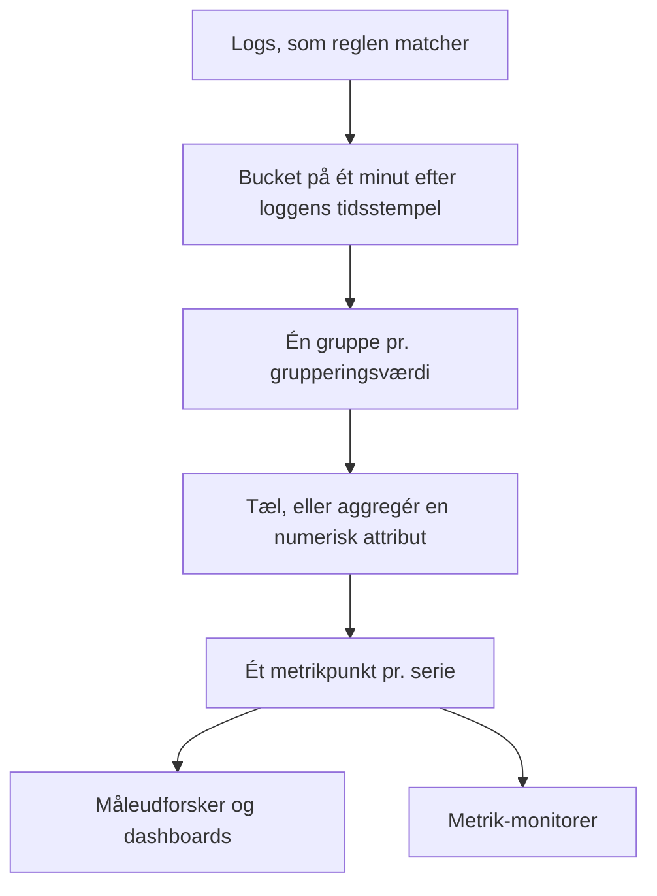
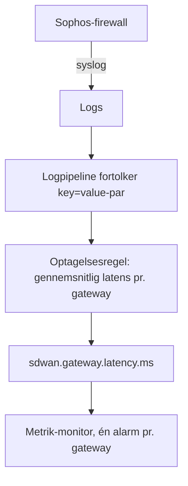

# Optagelsesregler for logs

En **Log Recording Rule** gør logs til en metrik. Hvert minut tager den de logs, dens filter matcher, og skriver ét tal pr. minut til metriklageret: hvor mange logs der matchede, eller summen, gennemsnittet, minimum, maksimum eller en percentil af en numerisk attribut i de logs. Del resultatet op efter op til fem logattributter, så får du én serie pr. værdi: én pr. gateway, pr. vært, pr. kunde.

:::cards
- [Sådan virker en regel](#sådan-virker-en-regel): Buckets, timing, indhentning og huller.
- [Opret en regel](#opret-en-regel): Felterne i regeleditoren.
- [Eksempel: latens for SD-WAN-gateways](#eksempel-latens-for-sd-wan-gateways-fra-en-sophos-firewall): Fra firewall-syslog til en alarm pr. gateway.
- [Tilladelser](#tilladelser): Hvem der kan oprette, ændre og læse regler.
:::

## Overblik

Resultatet er en almindelig metrik. Vis den i **Måleudforsker** og på dashboards, og få alarmer på den med en monitor af typen **Metrikker**, også alarmer pr. serie med **Gruppér efter**.

Brug en optagelsesregel for logs, når det tal, du interesserer dig for, kun findes i dine logs: en firewalls SLA-opsummeringer, et batchjob, der logger, hvor lang tid det tog, svarstørrelserne i en adgangslog, eller bare hvor mange fejllogs en tjeneste skriver hvert minut.

Optagelsesregler for logs findes under **Protokoller → Indstillinger → Optagelsesregler**. Deres modstykker til metrikker og spans findes under **Metrikker → Indstillinger → Optagelsesregler** og **Spor → Indstillinger → Optagelsesregler**.

## Sådan virker en regel



- **Ét punkt pr. minut pr. serie.** Logs grupperes i buckets på 1 minut efter deres tidsstempel. Hver bucket giver ét punkt for hver særskilt kombination af værdierne i grupperingsattributterne.
- **Beregnes 30 sekunder efter minuttets afslutning.** Den korte ventetid lader logs, der ankommer lidt for sent, stadig lande i deres minut. En log, der ankommer senere end det, tælles ikke med.
- **Ingen huller, ingen dobbelttælling.** Hver regel husker det sidste minut, den skrev (vist som **Computed Until** i reglelisten). Efter en genstart af workeren eller anden nedetid indhenter den de minutter, den gik glip af, op til 60 minutter tilbage, og den skriver aldrig det samme minut to gange.
- **En optælling uden gruppering har aldrig huller.** Et minut uden matchende logs skrives som `0`. Enhver anden regel skriver intet for et minut uden noget at aggregere, så grafer og monitorer ser manglende data i stedet for et opdigtet nul.
- **Skrives som enhver anden afledt metrik.** Punkterne er Gauge-datapunkter med reglens **Navn på outputmåling**, de bærer grupperingsattributterne og `oneuptime.derived.log_rule_id` (reglens ID) og følger samme opbevaring som punkterne fra optagelsesreglerne for metrikker og spor: 15 dage.

En ændring af en regels definition gælder fra det næste minut, den skriver; allerede skrevne punkter skrives ikke om. Slås en regel fra, stopper den; slås den til igen, indhenter den de minutter, den gik glip af, mens den var slået fra, op til de samme 60 minutter.

## Opret en regel

:::steps
### Åbn optagelsesreglerne

Gå til **Protokoller → Indstillinger → Optagelsesregler**, og vælg **Opret Log Recording Rule**.

### Navngiv reglen

Skriv et **Navn**. **Navn på outputmåling** nedenunder dannes ud fra navnet, mens du skriver; vælg **Rediger** ved siden af for at skrive dit eget.

### Vælg logs, og hvad der skal beregnes

Indsnævr reglen under **Which Logs** med telemetritjenester, alvorligheder, brødtekst og attributfiltre. Vælg en **Aggregering** og, for alt andet end en optælling, den **Numeric Attribute**, der skal aggregeres.

### Del resultatet op, og gem

Tilføj eventuelt attributter under **Gruppér efter** og en **Unit**. Tjek linjen nederst i editoren, og gem derefter. Inden for få minutter viser reglelisten et tidspunkt under **Computed Until**.
:::

| Felt | Hvad det gør |
| --- | --- |
| Navn | Hvad reglen beregner, f.eks. *SD-WAN gateway latency*. |
| Navn på outputmåling | Den metrik, reglen skriver. Dannes ud fra navnet (*SD-WAN gateway latency* skriver `sd_wan_gateway_latency`), medmindre du vælger **Rediger** og skriver dit eget. Det skal være unikt blandt projektets optagelsesregler. |
| Which Logs | Valgfrie filtre, alle kombineret med AND: telemetritjenester, alvorligheder, tekst, som brødteksten indeholder, og attributfiltre (en attribut lig med en værdi). |
| Aggregering | `Count of logs` eller en aggregering af en numerisk attribut (se nedenfor). |
| Numeric Attribute | For enhver aggregering undtagen optælling: den attribut, hvis værdier aggregeres, f.eks. `latency`. |
| Gruppér efter | Valgfrit: op til 5 attributnøgler. Én serie pr. særskilt kombination af deres værdier. |
| Unit | Valgfrit: outputmetrikkens enhed, f.eks. `ms`. Vises overalt, hvor metrikken vises i en graf. |
| Beskrivelse | Under **Flere felter**: hvad reglen er til. |
| Aktiveret | Under **Flere felter**: slået til som standard. Kun aktiverede regler beregnes. |

Linjen nederst i editoren fortæller, hvad reglen vil skrive, f.eks. `avg(latency) by gw_name, profile_name`.

En regel kan filtrere på højst 10 attributter og 100 telemetritjenester.

### Aggregeringer

| Aggregering | Hvert minuts punkt |
| --- | --- |
| Count of logs | Hvor mange logs der matchede filteret. |
| Gennemsnit | Gennemsnittet af den numeriske attributs værdier. |
| Sum | Attributtens værdier lagt sammen. |
| Minimum | Den mindste værdi. |
| Maksimum | Den største værdi. |
| p50 (median) | Medianen. |
| p75 | 75-percentilen. |
| p90 | 90-percentilen. |
| p95 | 95-percentilen. |
| p99 | 99-percentilen. |

### Numeriske attributter

Den numeriske attributs værdi skal være et almindeligt tal. Den kan ankomme som et tal (`latency=11` fortolket som tal) eller som tekst (`"11"`, `"11.5"`, `"1e3"`). En log, hvis værdi mangler eller ikke er et tal (`"11ms"`, `"n/a"`, en tom streng), **springes over**. Den tælles aldrig som `0`, så en fejlformateret log kan ikke trække et gennemsnit ned.

### Attributnøgler

Nøgler i attributfiltre matcher uanset store og små bogstaver, ligesom filtrene i logudforskeren. Den numeriske attribut og grupperingsnøglerne skal skrives præcis, som dine logs bærer dem, inklusive et præfiks, som en logpipeline tilføjer. Nøglefelterne foreslår de nøgler, dit projekts logs bærer, så vælg fra listen i stedet for at skrive en nøgle i hånden.

Nøgler må indeholde bogstaver, cifre og `. _ : / -`.

### Gruppering og loftet for serier

Hver grupperingsnøgle ganger antallet af serier, en regel skriver, så gruppér efter attributter, der identificerer noget, du vil se eller have alarmer på hver for sig (en gateway, en vært, en kunde), ikke efter attributter, der er forskellige i hver log, såsom et anmodnings-ID eller en klients IP-adresse.

En regel skriver højst 1.000 serier pr. minut. Derudover beholdes de serier, der har flest matchende logs, og resten af det minut droppes. En log, der ikke bærer en af grupperingsattributterne, tæller stadig med; dens serie skrives uden den attribut.

## Eksempel: latens for SD-WAN-gateways fra en Sophos-firewall

En Sophos XGS-firewall med SD-WAN-logning slået til sender med få minutters mellemrum en SLA-opsummering pr. SD-WAN-profil og gateway:

```text
log_type="SD-WAN" log_component="SLA" profile_name="Branch-Internet" gw_name="WAN2" latency=11 jitter=2 packet_loss=0 gw_status="up" sla_status="SLA met"
```

Dette eksempel gør de opsummeringer til en latensmetrik pr. gateway og giver en alarm, når én gateways latens bliver ved med at være høj.



:::steps
### Få logs ind med deres felter som attributter

1. Send firewallens syslog til OneUptime: se [Syslog](/docs/telemetry/syslog).
2. Tilføj under **Protokoller → Indstillinger → Pipelines** en pipeline med en processor, der deler brødtekstens `key=value`-par op i logattributter, så hver opsummering bærer `log_type`, `log_component`, `profile_name`, `gw_name`, `latency`, `jitter` og `packet_loss` som attributter. [Key=Value Parser](/docs/telemetry/log-pipelines#keyvalue-parser) gør dette.
3. Åbn udforskeren **Protokoller**, og tjek attributnavnene på en SLA-log. Hvis din pipeline tilføjer et præfiks, så brug navnene med præfiks nedenfor.

### Opret optagelsesreglen

Opret en regel under **Protokoller → Indstillinger → Optagelsesregler**:

- **Navn:** SD-WAN gateway latency
- **Navn på outputmåling:** vælg **Rediger**, og skriv `sdwan.gateway.latency.ms`
- **Which Logs:** attributfiltre `log_type` = `SD-WAN` og `log_component` = `SLA`
- **Aggregering:** Gennemsnit, **Numeric Attribute:** `latency`
- **Gruppér efter:** `gw_name` og `profile_name`
- **Unit:** `ms`

Via API'et, MCP eller Terraform er den samme regels **definition**:

```json
{
  "filter": {
    "attributeFilters": [
      { "key": "log_type", "value": "SD-WAN" },
      { "key": "log_component", "value": "SLA" }
    ]
  },
  "aggregationType": "Avg",
  "valueAttribute": "latency",
  "groupByAttributes": ["gw_name", "profile_name"],
  "unit": "ms"
}
```

Gentag med `jitter` (`sdwan.gateway.jitter.ms`, enhed `ms`) og `packet_loss` (`sdwan.gateway.packet_loss.percent`, enhed `%`) for de to andre SLA-målinger. En regel **Count of logs**, der er filtreret på `gw_status` = `down` og grupperet efter `gw_name`, tæller meldinger om nedlagte gateways pr. gateway.

Inden for få minutter viser reglelisten et tidspunkt under **Computed Until**, og `sdwan.gateway.latency.ms` dukker op i måleudforskeren: vælg den, gruppér efter `gw_name`, og du har én latenslinje pr. gateway.

### Få en alarm, når én gateways latens bliver ved med at være høj

Opret en monitor af typen **Metrikker** (se [Metrik-monitor](/docs/monitor/metrics-monitor)):

1. **Metrikforespørgsel:** `sdwan.gateway.latency.ms`, aggregering **Gennemsnit**, **Gruppér efter** `gw_name` og `profile_name`.
2. **Rullende tidsvindue:** Past 15 Minutes. Firewallen rapporterer med få minutters mellemrum, så vinduet rummer flere punkter pr. gateway.
3. **Aggregeringsstrategi:** **All Values**: hvert punkt i vinduet skal overskride grænsen, så én langsom opsummering ikke vækker nogen. Brug i stedet **Gennemsnit** for at få en alarm ved et højt gennemsnit.
4. **Kriterier:** Metric value **Greater Than** `150` åbner en alarm.
5. Brug eventuelt grupperingsværdierne i alarmens titel, f.eks. `SD-WAN latency high on {{gw_name}} ({{profile_name}})`.

Med gruppering sat er hver gateway sin egen serie: bliver WAN2 langsom, åbnes en alarm alene for WAN2, og den løses af sig selv, når WAN2 kommer sig. Se [Alarmer pr. serie](/docs/monitor/metrics-monitor).
:::

## Godt at vide

- **Tidsstempler kommer fra loggene.** En log lander i minuttet for sit eget tidsstempel. En enhed, hvis ur går mere end en smule forkert, lægger sine logs i det forkerte minut eller helt uden for vinduet.
- **Ingen bagudberegning.** En ny regel starter med minuttet før sin første kørsel; ældre logs beregnes ikke.
- **Sletning af en regel** stopper den. De punkter, den allerede har skrevet, bliver, indtil de udløber.
- **Optagelsesregler ser alle projektets logs.** Alle, der kan læse outputmetrikken, ser tal, der er beregnet ud fra hver log, som reglens filter matcher, så oprettelse og redigering af optagelsesregler for logs er forbeholdt projektejere, administratorer og tilladelserne **Create / Edit Log Recording Rule**.

## Tilladelser

| Tilladelse | Giver lov til |
| --- | --- |
| Create Log Recording Rule | At oprette regler. |
| Edit Log Recording Rule | At ændre regler og slå dem fra. |
| Delete Log Recording Rule | At slette regler. |
| Read Log Recording Rule | At se regler, og hvad de beregner. |

Projektejere og administratorer kan alt dette. Projektmedlemmer, læsere og telemetrirollerne kan læse regler.

## Næste trin

:::cards
- [Metrik-monitor](/docs/monitor/metrics-monitor): Få alarmer på de metrikker, dine regler skriver.
- [Logpipelines](/docs/telemetry/log-pipelines): Træk de attributter ud, som en regel aggregerer.
- [Syslog](/docs/telemetry/syslog): Send logs fra firewalls og servere til OneUptime.
:::
