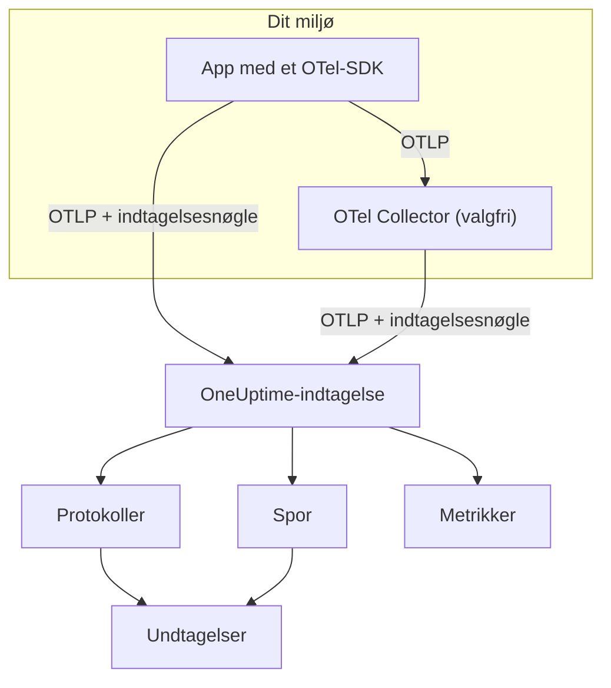

# OpenTelemetry

OneUptime modtager logs, metrikker og traces via OpenTelemetry Protocol (OTLP). Peg et hvilket som helst OpenTelemetry-SDK, eller en OpenTelemetry Collector, på OneUptime med en indtagelsesnøgle, så dukker dine data op under **Protokoller**, **Spor**, **Metrikker** og **Undtagelser**. Denne side får en tjeneste til at sende data på få minutter og gennemgår derefter de endpoints, grænser og fejl, du skal kende i produktion.

:::cards
- [Kom hurtigt i gang](#kom-hurtigt-i-gang): Opret en nøgle, sæt fire miljøvariabler og tilføj SDK'et.
- [Brug en Collector](#send-via-en-opentelemetry-collector): Tilføj OneUptime som exporter i en collector, du allerede kører.
- [Endpoints og grænser](#endpoints-og-grænser): URL'er, porte, kodninger, størrelsesgrænser og statuskoder.
- [Fejlfinding](#fejlfinding): Hvad du skal tjekke, når der ikke kommer data.
:::

## Sådan virker det

Din applikation eksporterer OTLP direkte til OneUptime eller til en OpenTelemetry Collector, der sender det videre. Hver forespørgsel har din indtagelsesnøgle med i headeren `x-oneuptime-token`, og OneUptime bruger nøglen til at finde dit projekt.



- **Tjenester oprettes for dig.** Ressourceattributten `service.name` (sat med `OTEL_SERVICE_NAME`) navngiver den tjeneste, dine data hører til. OneUptime opretter tjenesten første gang, den sender, og viser den under **Produkter → Tjenester**.
- **Fejl bliver til undtagelser.** Undtagelseshændelser på spans og undtagelser, der er registreret i logs, grupperes i issues under **Undtagelser** — se [Undtagelser fra logs](#undtagelser-fra-logs).

## Før du begynder

- Et OneUptime-projekt, hvor du kan oprette indtagelsesnøgler: projektejere og -administratorer kan, og det kan alle med tilladelsen **Create Telemetry Ingestion Key** også.
- En applikation, du kan føje et OpenTelemetry-SDK til, eller en OpenTelemetry Collector.
- Udgående HTTPS (port 443) fra din applikation eller collector til `oneuptime.com` eller til din egen OneUptime-vært.

> [!NOTE]
> På OneUptime Cloud faktureres telemetri pr. indtaget GB. Et projekt på Free-planen skal have en betalingsmetode, før det kan sende telemetri — dialogen, der opretter nøglen, viser priserne.

## Kom hurtigt i gang

:::steps
### Opret en indtagelsesnøgle

1. Gå til **Produkter → Projektindstillinger**.
2. Åbn **Telemetri og APM** i sidemenuen, og vælg **Indtagelsesnøgler**.
3. Klik på **Opret ingestion-nøgle**. Dialogen udfylder et navn og vælger nøgletypen **Server**, som en applikation eller en collector sender med. Omdøb den, hvis du vil, og klik derefter på **Opret ingestion-nøgle**.


Den nye nøgle åbner på sin egen side. Kopiér dens **Hemmelig nøgle** — det er det token, du sender som `x-oneuptime-token`.


### Sæt OpenTelemetry-miljøvariablerne

Alle OpenTelemetry-SDK'er læser de samme standardmiljøvariabler, så dette trin er det samme i alle sprog.

| Miljøvariabel | Værdi | Hvad den gør |
| --- | --- | --- |
| `OTEL_EXPORTER_OTLP_ENDPOINT` | `https://oneuptime.com/otlp` | Hvor der sendes til. SDK'et tilføjer selv `/v1/traces`, `/v1/metrics` og `/v1/logs`. |
| `OTEL_EXPORTER_OTLP_HEADERS` | `x-oneuptime-token=YOUR_ONEUPTIME_INGESTION_KEY` | Sender din indtagelsesnøgle med hver forespørgsel. |
| `OTEL_EXPORTER_OTLP_PROTOCOL` | `http/protobuf` | OTLP over HTTP. Nogle SDK'er bruger gRPC som standard, der bruger et andet endpoint. |
| `OTEL_SERVICE_NAME` | `my-service` | Den tjeneste, dine data vises under i OneUptime. |

```bash
export OTEL_EXPORTER_OTLP_ENDPOINT="https://oneuptime.com/otlp"
export OTEL_EXPORTER_OTLP_HEADERS="x-oneuptime-token=YOUR_ONEUPTIME_INGESTION_KEY"
export OTEL_EXPORTER_OTLP_PROTOCOL="http/protobuf"
export OTEL_SERVICE_NAME="my-service"
```

Selvhostet? Erstat `https://oneuptime.com` med URL'en til din OneUptime-instans, for eksempel `https://oneuptime.example.com/otlp`. For at mærke undtagelser med et miljø sætter du også `OTEL_RESOURCE_ATTRIBUTES` til `deployment.environment=production`.

### Tilføj OpenTelemetry til din app

Vælg dit sprog. Hver opsætning læser miljøvariablerne ovenfor, så hverken endpoint eller nøgle står i din kode.

:::tabs
@tab Node.js
Installér SDK'et, de automatiske instrumenteringer og OTLP/HTTP-exporterne:

```bash
npm install @opentelemetry/sdk-node @opentelemetry/auto-instrumentations-node \
  @opentelemetry/exporter-trace-otlp-proto @opentelemetry/exporter-metrics-otlp-proto \
  @opentelemetry/exporter-logs-otlp-proto @opentelemetry/sdk-metrics @opentelemetry/sdk-logs
```

Opret SDK'et i sin egen fil:

```javascript title="instrumentation.js"
const { NodeSDK } = require("@opentelemetry/sdk-node");
const { getNodeAutoInstrumentations } = require("@opentelemetry/auto-instrumentations-node");
const { OTLPTraceExporter } = require("@opentelemetry/exporter-trace-otlp-proto");
const { OTLPMetricExporter } = require("@opentelemetry/exporter-metrics-otlp-proto");
const { OTLPLogExporter } = require("@opentelemetry/exporter-logs-otlp-proto");
const { PeriodicExportingMetricReader } = require("@opentelemetry/sdk-metrics");
const { BatchLogRecordProcessor } = require("@opentelemetry/sdk-logs");

// The exporters read OTEL_EXPORTER_OTLP_ENDPOINT and OTEL_EXPORTER_OTLP_HEADERS.
const sdk = new NodeSDK({
  traceExporter: new OTLPTraceExporter(),
  metricReader: new PeriodicExportingMetricReader({
    exporter: new OTLPMetricExporter(),
  }),
  logRecordProcessors: [new BatchLogRecordProcessor(new OTLPLogExporter())],
  instrumentations: [getNodeAutoInstrumentations()],
});

sdk.start();
```

Indlæs den før din applikationskode:

```bash
node --require ./instrumentation.js app.js
```
@tab Python
Installér OpenTelemetry-distributionen og exporteren og derefter instrumenteringerne til de biblioteker, din app bruger:

```bash
pip install opentelemetry-distro opentelemetry-exporter-otlp
opentelemetry-bootstrap -a install
```

Start din app via `opentelemetry-instrument`. Den eksporterer traces, metrikker og logs; logging-variablen sender også poster, der er skrevet med Pythons `logging`-modul:

```bash
OTEL_PYTHON_LOGGING_AUTO_INSTRUMENTATION_ENABLED=true opentelemetry-instrument python app.py
```
@tab Go
Tilføj SDK'et og OTLP/HTTP-exporterne:

```bash
go get go.opentelemetry.io/otel go.opentelemetry.io/otel/sdk go.opentelemetry.io/otel/sdk/metric \
  go.opentelemetry.io/otel/exporters/otlp/otlptrace/otlptracehttp \
  go.opentelemetry.io/otel/exporters/otlp/otlpmetric/otlpmetrichttp
```

Opret tracer- og meter-providerne, når dit program starter:

```go title="main.go"
package main

import (
	"context"
	"log"

	"go.opentelemetry.io/otel"
	"go.opentelemetry.io/otel/exporters/otlp/otlpmetric/otlpmetrichttp"
	"go.opentelemetry.io/otel/exporters/otlp/otlptrace/otlptracehttp"
	sdkmetric "go.opentelemetry.io/otel/sdk/metric"
	sdktrace "go.opentelemetry.io/otel/sdk/trace"
)

func main() {
	ctx := context.Background()

	// Both exporters read OTEL_EXPORTER_OTLP_ENDPOINT and OTEL_EXPORTER_OTLP_HEADERS.
	traceExporter, err := otlptracehttp.New(ctx)
	if err != nil {
		log.Fatal(err)
	}
	tracerProvider := sdktrace.NewTracerProvider(sdktrace.WithBatcher(traceExporter))
	defer tracerProvider.Shutdown(ctx)
	otel.SetTracerProvider(tracerProvider)

	metricExporter, err := otlpmetrichttp.New(ctx)
	if err != nil {
		log.Fatal(err)
	}
	meterProvider := sdkmetric.NewMeterProvider(
		sdkmetric.WithReader(sdkmetric.NewPeriodicReader(metricExporter)),
	)
	defer meterProvider.Shutdown(ctx)
	otel.SetMeterProvider(meterProvider)

	// Your application code.
}
```

Providerne henter `OTEL_SERVICE_NAME` fra miljøet. Til logs tilføjer du `otlploghttp` med en log-bridge som `otelslog`; den læser de samme variabler.
@tab Java
Download OpenTelemetrys Java-agent, og tilknyt den til din applikation. Det kræver ingen kodeændringer:

```bash
curl -L -O https://github.com/open-telemetry/opentelemetry-java-instrumentation/releases/latest/download/opentelemetry-javaagent.jar
java -javaagent:opentelemetry-javaagent.jar -jar my-app.jar
```

Agenten instrumenterer almindelige frameworks og biblioteker og eksporterer traces, metrikker og logs, der skrives via Logback eller Log4j.
@tab .NET
Tilføj OpenTelemetry-pakkerne til ASP.NET Core:

```bash
dotnet add package OpenTelemetry.Extensions.Hosting
dotnet add package OpenTelemetry.Exporter.OpenTelemetryProtocol
dotnet add package OpenTelemetry.Instrumentation.AspNetCore
dotnet add package OpenTelemetry.Instrumentation.Http
```

Registrér OpenTelemetry ved opstart. `UseOtlpExporter()` sender traces, metrikker og logs og læser variablerne `OTEL_EXPORTER_OTLP_*`:

```csharp title="Program.cs"
using OpenTelemetry;
using OpenTelemetry.Metrics;
using OpenTelemetry.Trace;

var builder = WebApplication.CreateBuilder(args);

builder.Services.AddOpenTelemetry()
    .WithTracing(tracing => tracing
        .AddAspNetCoreInstrumentation()
        .AddHttpClientInstrumentation())
    .WithMetrics(metrics => metrics
        .AddAspNetCoreInstrumentation()
        .AddHttpClientInstrumentation())
    .WithLogging()
    .UseOtlpExporter();

var app = builder.Build();
app.Run();
```

Bruger du Serilog? Se [Serilog](/docs/telemetry/serilog) for at sende dens logs til OneUptime.
:::

### Tjek, at data kommer frem

Spørg OneUptime, om den accepterer din nøgle:

```bash
curl -i -H "x-oneuptime-token: YOUR_ONEUPTIME_INGESTION_KEY" \
  https://oneuptime.com/otlp/v1/validate
```

En nøgle, der virker, returnerer `200` med `"valid": true`. Alt andet returnerer `401` med en besked om, hvad der er galt — ukendt, deaktiveret eller udløbet.

Kør derefter din app, og brug den i et minut. Åbn **Produkter → Tjenester**: Din tjeneste står der under det navn, du satte i `OTEL_SERVICE_NAME`, med dens logs, traces, metrikker og undtagelser. **Produkter → Protokoller**, **Produkter → Spor** og **Produkter → Metrikker** viser de samme data på tværs af alle tjenester.
:::

:::details Send en testlog uden SDK
OTLP/HTTP accepterer også JSON, så du kan sende en log med `curl`. `severityNumber` med værdien `9` gør den til en informationslog:

```bash
curl -i https://oneuptime.com/otlp/v1/logs \
  -H "Content-Type: application/json" \
  -H "x-oneuptime-token: YOUR_ONEUPTIME_INGESTION_KEY" \
  -d '{
    "resourceLogs": [{
      "resource": {
        "attributes": [
          { "key": "service.name", "value": { "stringValue": "my-service" } }
        ]
      },
      "scopeLogs": [{
        "logRecords": [{
          "severityNumber": 9,
          "body": { "stringValue": "Hello from curl" }
        }]
      }]
    }]
  }'
```

Et `200` betyder, at loggen blev accepteret. Den vises under **Produkter → Protokoller** inden for få sekunder i tjenesten `my-service`.
:::

## Send via en OpenTelemetry Collector

Kør en collector, når du allerede har en, når du vil samle, filtrere eller berige data ét sted, eller for at holde indtagelsesnøglen ude af dine applikationer. Dine apps eksporterer til collectoren, og kun collectoren taler med OneUptime.

:::steps
### Tilføj OneUptime som exporter

Tilføj en `otlphttp`-exporter, der peger på OneUptime, og send hver pipeline gennem den:

```yaml title="otel-collector-config.yaml"
receivers:
  otlp:
    protocols:
      grpc:
        endpoint: 0.0.0.0:4317
      http:
        endpoint: 0.0.0.0:4318

processors:
  batch: {}

exporters:
  otlphttp:
    endpoint: https://oneuptime.com/otlp
    headers:
      x-oneuptime-token: YOUR_ONEUPTIME_INGESTION_KEY

service:
  pipelines:
    traces:
      receivers: [otlp]
      processors: [batch]
      exporters: [otlphttp]
    metrics:
      receivers: [otlp]
      processors: [batch]
      exporters: [otlphttp]
    logs:
      receivers: [otlp]
      processors: [batch]
      exporters: [otlphttp]
```

Behold exporterens standardindstillinger: Den sender protobuf komprimeret med gzip, og OneUptime accepterer begge dele. Sæt ikke en `Content-Type`-header på exporteren — OneUptime vælger sin dekoder ud fra den header, så en JSON-indholdstype foran protobuf-bytes ødelægger indtagelsen.

### Kør collectoren

:::tabs
@tab Docker
```bash
docker run -d --name otel-collector \
  -p 4317:4317 -p 4318:4318 \
  -v "$(pwd)/otel-collector-config.yaml:/etc/otelcol-contrib/config.yaml" \
  otel/opentelemetry-collector-contrib:latest
```
@tab Linux
```bash
otelcol-contrib --config otel-collector-config.yaml
```
:::

Collectoren lytter efter OTLP på port `4317` (gRPC) og `4318` (HTTP), de porte, SDK'er som standard sender til.

### Peg dine apps på collectoren

Sæt i dine applikationer `OTEL_EXPORTER_OTLP_ENDPOINT` til collectoren, for eksempel `http://localhost:4318`, og fjern `OTEL_EXPORTER_OTLP_HEADERS` — collectoren tilføjer nøglen. Behold `OTEL_SERVICE_NAME` i hver applikation.

Data kommer frem i OneUptime præcis som i kom hurtigt i gang. Hvis ikke, står det i collectorens egen log hvorfor — se [Fejlfinding](#fejlfinding).
:::

Eksporterer du allerede til en anden leverandør? Tilføj `otlphttp`-exporteren ved siden af den eksisterende, og angiv begge i `exporters` for hver pipeline for at sende til begge, mens du sammenligner. Se vejledningen [Host OpenTelemetry Collector](/docs/telemetry/host-otel-collector) for også at indsamle værtsmetrikker og logfiler.

## Endpoints og grænser

| Indstilling | OTLP/HTTP (anbefalet) | OTLP/gRPC |
| --- | --- | --- |
| Endpoint | `https://oneuptime.com/otlp` | `https://oneuptime.com:443` |
| Godkendelse | Headeren `x-oneuptime-token` | Metadata `x-oneuptime-token` |
| Kodning | Protobuf (`application/x-protobuf`) eller JSON (`application/json`) | Protobuf |
| Komprimering | Ingen, `gzip`, `deflate` eller `zstd` | Ingen eller `gzip` |
| Forespørgselsstørrelse | Op til 4 MB pr. forespørgsel på `/otlp` | Op til 4 MB pr. besked |

Over HTTP har hvert signal sin egen sti under endpointet. SDK'er og collectoren tilføjer den for dig; sæt den kun selv, når et værktøj beder om en fuld URL.

| Signal | OTLP/HTTP-URL |
| --- | --- |
| Traces | `https://oneuptime.com/otlp/v1/traces` |
| Metrikker | `https://oneuptime.com/otlp/v1/metrics` |
| Logs | `https://oneuptime.com/otlp/v1/logs` |
| Profiler | `https://oneuptime.com/otlp/v1/profiles` |

Til kontinuerlig profilering sender de fleste profilere i stedet til det Pyroscope-kompatible endpoint — se [Kontinuerlig profilering](/docs/telemetry/profiles). En collector, der eksporterer OTLP-profiler, skal sætte exporterens `profiles_endpoint` til `https://oneuptime.com/otlp/v1/profiles`, fordi den som standard sender profiler til en udviklingssti, som OneUptime ikke betjener.

### OTLP over gRPC

OneUptime leverer OTLP/gRPC på samme vært som webappen, på port 443 over TLS. Sæt `OTEL_EXPORTER_OTLP_PROTOCOL` til `grpc` og `OTEL_EXPORTER_OTLP_ENDPOINT` til `https://oneuptime.com:443`, og send den samme header `x-oneuptime-token`. I en collector bruger du exporteren `otlp` med `endpoint: oneuptime.com:443` og de samme `headers`.

På en selvhostet installation når gRPC kun OneUptime over HTTPS: En ukrypteret HTTP-forbindelse (h2c) afvises. Hvis din instans leveres over almindelig HTTP, så brug OTLP/HTTP.

To af en nøgles indstillinger gælder kun for OTLP/HTTP: dens **Requests Per Minute Limit** og dens **Pinned Service Name**. Data sendt over gRPC beholder den `service.name`, de blev sendt med, og tælles ikke med i grænsen.

### Svar

OneUptime svarer på en eksport, så snart dataene står i kø, og dataene vises nogle sekunder senere.

| Svar | gRPC-status | Betydning | Hvad du gør |
| --- | --- | --- | --- |
| `200` | `OK` | Accepteret. | Intet. |
| `401` | `UNAUTHENTICATED` | Nøglen mangler, er ukendt eller udløbet. | Sammenlign værdien af `x-oneuptime-token` med nøglens **Hemmelig nøgle**. |
| `402` | `PERMISSION_DENIED` | Kun OneUptime Cloud: Projektet er på Free-planen og har ingen betalingsmetode. | Tilføj en under **Projektindstillinger → Fakturering og fakturaer → Fakturering**. |
| `413` | — | Forespørgslen er større end størrelsesgrænsen. | Send mindre batches. |
| `415` | — | `Content-Encoding` understøttes ikke. | Brug `gzip`, `deflate` eller `zstd`, eller ingen komprimering. |
| `422` | `PERMISSION_DENIED` | Nøglen er deaktiveret, eller det er en browsernøgle, der bruges uden for dens tilladte origins. | Aktivér nøglen igen, eller send med en servernøgle. |
| `429` | — | Nøglens **Requests Per Minute Limit** er nået. | Først intet: Exportere prøver igen efter `Retry-After`-tiden. Hæv grænsen, hvis det bliver ved med at ske. |
| `503` | `UNAVAILABLE` | OneUptime starter op, eller indtagelseskøen er utilgængelig. | Intet: OTLP-exportere prøver selv igen ved `503`. |

`401`, `402`, `413`, `415` og `422` er permanente fejl for OTLP-exportere: Exporteren kasserer batchen og logger fejlen i stedet for at prøve igen.

### Genstarter og opgraderinger

Mens OneUptime genstarter eller opgraderes, svarer den på eksporter med `503` og `Retry-After: 5`, indtil den er klar, og exporterne sender dem igen. En collectors exporter bliver som standard ved med at prøve igen i fem minutter (`retry_on_failure`) og holder det, den ikke kunne sende, i sin `sending_queue`, så lad begge være slået til. Den tid, hvor OneUptime ikke modtog data, bliver aldrig holdt imod dine servere, værter eller andre ressourcer: se [Når OneUptime ikke modtager data](/docs/monitor/when-oneuptime-is-not-receiving#ved-opstart).

### Indtagelsesnøgler

Hver nøgles side under **Projektindstillinger → Telemetri og APM → Indtagelsesnøgler** har disse indstillinger:

| Indstilling | Hvad den gør |
| --- | --- |
| **Nøgletype** | **Server** (standard) til applikationer, collectors og agenter. **Browser** til nøgler, der leveres i en webside: kun skrivning, og accepteres kun fra dens **Allowed Origins**. Den kan ikke ændres, efter nøglen er oprettet. |
| **Allowed Origins** | De web-origins, en browsernøgle virker fra, for eksempel `https://app.example.com`. Ignoreres på en servernøgle. |
| **Pinned Service Name** | Når den er sat, erstatter den `service.name` på alt, der sendes med denne nøgle over OTLP/HTTP. |
| **Aktiveret** | Slå den fra for straks at holde op med at acceptere data, der sendes med nøglen, uden at slette den. |
| **Udløber den** | Efter denne dato afvises nøglen. Tom betyder, at den aldrig udløber. |
| **Requests Per Minute Limit** | Det højeste antal OTLP/HTTP-forespørgsler pr. minut, nøglen accepteres for, på tværs af alle klienter, der bruger den. Tom betyder ingen grænse på en servernøgle og 6.000 på en browsernøgle. |
| **Last Used At** | Hvornår der sidst blev accepteret data med nøglen. Brug den til at finde nøgler, der trygt kan roteres eller slettes. |

**Nulstil hemmelig nøgle** på nøglens side erstatter hemmeligheden. Alle applikationer og collectors, der sender med den gamle, afvises, indtil du opdaterer dem.

## Selvhostet OneUptime

Alt på denne side virker på samme måde med din egen installation. Brug din OneUptime-URL overalt, hvor denne side skriver `https://oneuptime.com`:

- `OTEL_EXPORTER_OTLP_ENDPOINT` er `https://YOUR-ONEUPTIME-HOST/otlp`, eller `http://YOUR-ONEUPTIME-HOST/otlp`, hvis du leverer OneUptime over almindelig HTTP.
- Den medfølgende ingress accepterer forespørgsler på op til 4 MB på `/otlp`. En proxy, du kører foran OneUptime, kan have en lavere grænse — ingress-nginx sætter `proxy-body-size` til 1 MB som standard —, så hæv den også for `/otlp`, ellers får exportere `413`.
- Hvis `DISABLE_TELEMETRY_INGESTION=true` er sat, accepterer OneUptime alle eksporter og gemmer ingenting. Tjek det først, når en selvhostet instans slet ikke viser nogen data.

## Undtagelser fra logs

OneUptime finder undtagelser i dine **logs** og samler dem i den samme visning **Undtagelser**, som fejl fra traces fodrer. Hver log hører allerede til en tjeneste eller vært, så undtagelsen henføres dertil. Undtagelser fra logs og traces deler gruppering efter fingeraftryk, så en fejl, der rapporteres af både en trace og en log, bliver til ét issue.

En log kan blive til en undtagelse på to måder:

| Registrering | Logs, det gælder for | Sådan virker det |
| --- | --- | --- |
| **Undtagelsesattributter** (anbefalet) | Alle logs | En logpost med OpenTelemetry-attributten `exception.type`, `exception.message` eller `exception.stacktrace` bliver direkte til en undtagelse. De fleste logging-integrationer sætter dem, når du logger en undtagelse: Logback- og Log4j-appendere, Serilog, Pythons logging-instrumentering. Det er præcist og virker i alle sprog. |
| **Stacktrace i brødteksten** | Error- og fatal-logs uden trace-id og span-id | OneUptime gennemsøger de første 16 KB af brødteksten efter en JavaScript-, Python-, Java-, Go-, Ruby-, C#/.NET- eller PHP-stacktrace og henter type, besked og frames fra den. En log, der er skrevet inde i et span, springes over, fordi spannet selv rapporterer undtagelsen. |

Gennemsøgningen af brødteksten passer til logs i ren tekst som rå stdout, journald eller syslog, som en collector læser. En stacktrace over flere linjer skal ankomme som én logpost, så slå sammenføjning af flere linjer til i collectoren — se vejledningen [Host OpenTelemetry Collector](/docs/telemetry/host-otel-collector).

Registreringen er slået til som standard. På en selvhostet installation slår du den fra ved at sætte `TELEMETRY_LOG_EXCEPTION_EXTRACTION_ENABLED=false` på tjenesten `app` — og også på `worker`, hvis du kører Helm-chartets dedikerede worker.

## Fejlfinding

:::details Der vises ingen data, og exporteren logger `401`
Nøglen mangler, er ukendt eller udløbet. Tjek, at `OTEL_EXPORTER_OTLP_HEADERS` er `x-oneuptime-token=` efterfulgt af nøglens **Hemmelig nøgle**, uden anførselstegn eller mellemrum i værdien, og at nøglen hører til det projekt, du kigger på. Valideringsforespørgslen i [Tjek, at data kommer frem](#tjek-at-data-kommer-frem) fortæller, hvilket tilfælde det er.
:::

:::details Exporteren logger `422`
Nøglen er deaktiveret, eller det er en browsernøgle. Slå **Aktiveret** til igen i nøglens indstillinger, eller opret en **Server**-nøgle: En browsernøgle accepteres kun fra en webside på en af dens tilladte origins.
:::

:::details Exporteren logger `402`
Projektet er på OneUptime Clouds Free-plan og har ingen betalingsmetode, og telemetri faktureres efter forbrug. Tilføj en betalingsmetode under **Projektindstillinger → Fakturering og fakturaer → Fakturering**, så accepteres eksporter igen.
:::

:::details Exporteren logger `404`
SDK'et sender til den forkerte sti. `OTEL_EXPORTER_OTLP_ENDPOINT` skal slutte på `/otlp` uden skråstreg til sidst og uden `/v1/...` — det tilføjer SDK'et. Hvis du sætter en signalspecifik variabel som `OTEL_EXPORTER_OTLP_TRACES_ENDPOINT`, forventer den den fulde URL, for eksempel `https://oneuptime.com/otlp/v1/traces`.
:::

:::details Der sker slet ingenting, og SDK'et logger forbindelsesfejl
SDK'et eksporterer sandsynligvis over gRPC til et HTTP-endpoint eller til `localhost`. Sæt `OTEL_EXPORTER_OTLP_PROTOCOL=http/protobuf`, eller brug gRPC-endpointet beskrevet i [OTLP over gRPC](#otlp-over-grpc). Tjek også, at processen faktisk ser miljøvariablerne — i en container skal du sætte dem på containeren, ikke i din shell.
:::

:::details Collectoren logger `Exporting failed` med `413`
En batch er større end størrelsesgrænsen. Gør batches mindre, for eksempel med `send_batch_max_size: 1000` på processoren `batch`. Hvis du selvhoster bag din egen proxy, så tjek også proxyens grænse for body-størrelse.
:::

:::details Data lander under den forkerte tjeneste eller under Unknown Service
Tjenesten kommer fra ressourceattributten `service.name`. Sæt `OTEL_SERVICE_NAME` i hver applikation. Hvis nøglen har en **Pinned Service Name**, arkiveres hver OTLP/HTTP-eksport med den nøgle i stedet under det navn.
:::

## Næste trin

:::cards
- [Søgesyntaks](/docs/telemetry/search-syntax): Filtrér logs, traces, metrikker og undtagelser i explorerne.
- [Log-pipelines](/docs/telemetry/log-pipelines): Fortolk og berig logs, mens de ankommer.
- [Log-monitor](/docs/monitor/logs-monitor): Få en alarm, når matchende logs dukker op.
- [Host OpenTelemetry Collector](/docs/telemetry/host-otel-collector): Indsaml værtsmetrikker og logfiler med en collector.
:::
