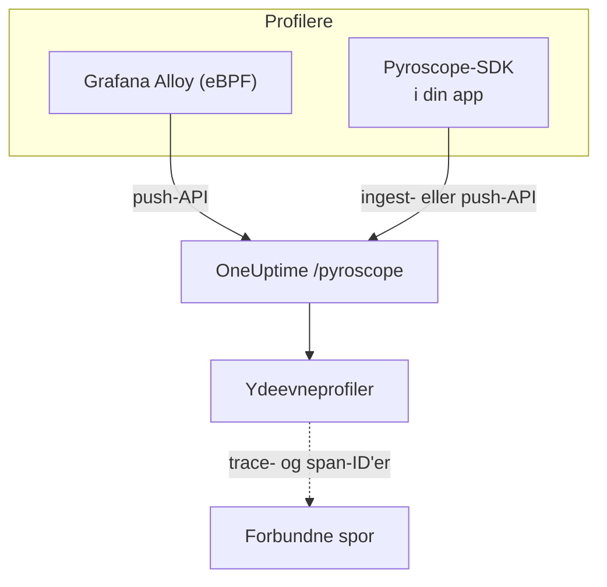

# Kontinuerlig profilering

Kontinuerlig profilering viser, hvad din applikation bruger CPU-tid og hukommelse på, funktion for funktion. OneUptime stiller et **Pyroscope-kompatibelt indlæsnings-API** til rådighed, så alt, der kan sende til en Pyroscope-server (Grafana Alloys eBPF-profiler eller et Pyroscope-SDK til dit sprog), kan sende til OneUptime, og du aflæser resultatet som flammegrafer ved siden af dine logs, metrikker og spor.

:::cards
- [Send profiler](#send-profiler): Grafana Alloy med eBPF, eller et Pyroscope-SDK i din app.
- [Indlæsnings-endpoint](#indlæsnings-endpoint): Basis-URL'en og de tre måder at give nøglen på.
- [Kontrollér, at det virker](#kontrollér-at-det-virker): Tjek nøglen, siden og upload-status.
- [Udforsk profiler](#udforsk-profiler-i-oneuptime): Flammegrafer, topfunktioner, sammenligninger og links til spor.
:::

## Sådan virker det

En profiler tager stikprøver af dine processer og uploader en profil med få sekunders mellemrum til OneUptimes endpoint `/pyroscope` med din indtagelsesnøgle. OneUptime gemmer hver profil under den tjeneste, den nævner, og tegner den som en flammegraf under **Ydeevneprofiler**.



## Før du begynder

Du skal bruge en telemetri-indtagelsesnøgle af typen **Server**. Hvis du ikke har en endnu:

:::steps
### Åbn indtagelsesnøglerne

Gå til **Produkter → Projektindstillinger**, åbn **Telemetri og APM** i sidemenuen, og vælg **Indtagelsesnøgler**.


### Opret en nøgle

Klik på **Opret ingestion-nøgle**. Dialogen har allerede nøglens navn udfyldt og **Server** valgt (den slags nøgle, en applikation eller en collector sender med), så klik på **Opret ingestion-nøgle** for at oprette den, eller omdøb den først.

### Kopiér hemmeligheden

Den nye nøgle åbner på sin egen side. Kopiér dens **Hemmelig nøgle**: det er det indtagelsestoken, som eksemplerne nedenfor kalder `YOUR_ONEUPTIME_INGESTION_TOKEN`.


:::

## Indlæsnings-endpoint

| Indstilling | Værdi |
| --- | --- |
| Basis-URL (Pyroscope-serverens adresse) | `https://oneuptime.com/pyroscope` |
| Godkendelses-header | `x-oneuptime-token: YOUR_ONEUPTIME_INGESTION_TOKEN` |

Klienter føjer deres egen sti til basis-URL'en (`/ingest` for de fleste Pyroscope-SDK'er, `/push.v1.PusherService/Push` for Grafana Alloy og .NET-SDK'et fra v0.14), så du konfigurerer altid kun basis-URL'en uden afsluttende skråstreg.

OneUptime læser indtagelsestokenet fra en hvilken som helst af disse; brug den, din klient understøtter:

| Metode | Hvornår du bruger den |
| --- | --- |
| Header `x-oneuptime-token` | Klienter, der lader dig tilføje egne headers. |
| `Authorization: Bearer <token>` | SDK'er med en indstilling `authToken` / `auth_token`: det er det, de sender. |
| HTTP Basic-godkendelse med tokenet som **adgangskode** (vilkårligt brugernavn) | Klienter, der kun tilbyder bruger og adgangskode til Basic-godkendelse. |

> [!NOTE]
> Hoster du selv OneUptime? Erstat `https://oneuptime.com` med din egen vært, for eksempel `https://YOUR-ONEUPTIME-HOST/pyroscope`.

## Understøttede profilformater

| Format | Sendes af | Understøttet |
| --- | --- | --- |
| pprof (binær protobuf, eventuelt gzip-komprimeret) | Pyroscope-SDK'er til Go, Node.js og .NET; Grafana Alloy | Ja |
| Folded / collapsed tekst | Pyroscope-SDK'er til Python, Ruby og Rust (deres standard-uploadformat) | Ja |
| JFR (Java Flight Recorder) | Pyroscope Java-agent | Endnu ikke: brug Grafana Alloy til Java-tjenester |

## Send profiler

Grafana Alloy profilerer hver proces på en vært uden kodeændringer og er den anbefalede måde at starte på. Et Pyroscope-SDK kører i stedet inde i din applikation.

:::tabs
@tab Grafana Alloy
[Grafana Alloy](https://grafana.com/docs/alloy/latest/) indsamler med eBPF CPU-profiler fra hver proces på en Linux-vært: ingen agent i din applikation og ingen kodeændringer. Det virker for Go, Rust, C/C++, Java, Python, Ruby, PHP, Node.js og .NET.

Opret Alloy-konfigurationen:

```hcl title="alloy-config.alloy"
discovery.process "all" {
  refresh_interval = "60s"
}

discovery.relabel "alloy_profiles" {
  targets = discovery.process.all.targets

  rule {
    action       = "replace"
    source_labels = ["__meta_process_exe"]
    target_label  = "service_name"
  }
}

pyroscope.ebpf "default" {
  targets    = discovery.relabel.alloy_profiles.output
  forward_to = [pyroscope.write.oneuptime.receiver]

  collect_interval = "15s"
  sample_rate      = 97
}

pyroscope.write "oneuptime" {
  endpoint {
    url = "https://oneuptime.com/pyroscope"
    headers = {
      "x-oneuptime-token" = "YOUR_ONEUPTIME_INGESTION_TOKEN",
    }
  }
}
```

Kør det med Docker. eBPF kræver en privilegeret container med værtens PID-navnerum:

```yaml title="docker-compose.yml"
services:
  alloy:
    image: grafana/alloy:latest
    privileged: true
    pid: host
    volumes:
      - ./alloy-config.alloy:/etc/alloy/config.alloy
      - /proc:/proc:ro
      - /sys:/sys:ro
    command:
      - run
      - /etc/alloy/config.alloy
```

Eller kør det direkte på værten:

```bash
alloy run alloy-config.alloy
```

Relabel-reglen navngiver hver profils tjeneste efter processens eksekverbare fil.
@tab Go
Go-SDK'et uploader pprof. Peg dets serveradresse på OneUptimes basis-URL, og giv dit indtagelsestoken som auth-token:

```go
import "github.com/grafana/pyroscope-go"

pyroscope.Start(pyroscope.Config{
    ApplicationName: "my-service",
    ServerAddress:   "https://oneuptime.com/pyroscope",
    AuthToken:       "YOUR_ONEUPTIME_INGESTION_TOKEN",
    ProfileTypes: []pyroscope.ProfileType{
        pyroscope.ProfileCPU,
        pyroscope.ProfileAllocObjects,
        pyroscope.ProfileAllocSpace,
        pyroscope.ProfileInuseObjects,
        pyroscope.ProfileInuseSpace,
        pyroscope.ProfileGoroutines,
    },
})
```
@tab Node.js
Node.js-SDK'et uploader pprof:

```javascript
const Pyroscope = require("@pyroscope/nodejs");

Pyroscope.init({
  serverAddress: "https://oneuptime.com/pyroscope",
  appName: "my-service",
  authToken: "YOUR_ONEUPTIME_INGESTION_TOKEN",
});

Pyroscope.start();
```
@tab Python
Python-SDK'et uploader folded tekst:

```python
import pyroscope

pyroscope.configure(
    application_name="my-service",
    server_address="https://oneuptime.com/pyroscope",
    auth_token="YOUR_ONEUPTIME_INGESTION_TOKEN",
)
```
@tab .NET
Pyroscope .NET-profileren er en indbygget CLR-profiler: den kræver ingen kodeændringer og slås helt til via miljøvariabler. Hent udgivelsen til dit image fra [pyroscope-dotnet releases](https://github.com/grafana/pyroscope-dotnet/releases) (`glibc` eller `musl` til Alpine, `x86_64` eller `aarch64`), og indlæs den i runtimen:

```dockerfile title="Dockerfile"
FROM alpine:3.20 AS pyroscope-profiler
ARG PYROSCOPE_DOTNET_VERSION=1.5.1
ADD https://github.com/grafana/pyroscope-dotnet/releases/download/pyroscope-${PYROSCOPE_DOTNET_VERSION}/pyroscope.${PYROSCOPE_DOTNET_VERSION}-glibc-x86_64.tar.gz /tmp/pyroscope.tar.gz
RUN mkdir -p /pyroscope && tar -xzf /tmp/pyroscope.tar.gz -C /pyroscope

FROM mcr.microsoft.com/dotnet/aspnet:10.0
# ... your application ...
COPY --from=pyroscope-profiler /pyroscope /pyroscope
ENV CORECLR_ENABLE_PROFILING=1
ENV CORECLR_PROFILER={BD1A650D-AC5D-4896-B64F-D6FA25D6B26A}
ENV CORECLR_PROFILER_PATH=/pyroscope/Pyroscope.Profiler.Native.so
ENV LD_PRELOAD=/pyroscope/Pyroscope.Linux.ApiWrapper.x64.so
ENV LD_LIBRARY_PATH=/pyroscope
```

Peg den derefter på OneUptime, for eksempel i dit Kubernetes- / Helm-miljø:

```bash
PYROSCOPE_APPLICATION_NAME=my-service
PYROSCOPE_PROFILING_ENABLED=1
PYROSCOPE_SERVER_ADDRESS=https://oneuptime.com/pyroscope
PYROSCOPE_BASIC_AUTH_USER=oneuptime
PYROSCOPE_BASIC_AUTH_PASSWORD=YOUR_ONEUPTIME_INGESTION_TOKEN
```

Indtagelsestokenet skal i Basic-godkendelsens adgangskode. Brugernavnet kan være en hvilken som helst ikke-tom værdi, men profileren sender slet ingen legitimationsoplysninger, medmindre begge er sat. For i stedet at sende tokenet som header skal du sætte `PYROSCOPE_HTTP_HEADERS={"x-oneuptime-token":"YOUR_ONEUPTIME_INGESTION_TOKEN"}`.

Hvordan tokenet gives, afhænger af profilerens udgivelse. 1.5 og nyere ignorerer `PYROSCOPE_AUTH_TOKEN`, så hvis du opgraderer fra en ældre udgivelse og beholder den indstilling, afvises hver upload med `401`:

| pyroscope-dotnet-udgivelse | Uploader til | Tokenindstilling |
| --- | --- | --- |
| v0.13 og ældre | `/pyroscope/ingest` | `PYROSCOPE_AUTH_TOKEN` |
| v0.14 til 1.4 | `/pyroscope/push.v1.PusherService/Push` | `PYROSCOPE_AUTH_TOKEN` |
| 1.5 og nyere | `/pyroscope/push.v1.PusherService/Push` | `PYROSCOPE_BASIC_AUTH_USER=oneuptime` og `PYROSCOPE_BASIC_AUTH_PASSWORD=<token>` (begge skal være sat), eller `PYROSCOPE_HTTP_HEADERS={"x-oneuptime-token":"<token>"}` |

Udgivelser før 1.0 er tagget `v<version>-pyroscope` i stedet for `pyroscope-<version>` (for eksempel `https://github.com/grafana/pyroscope-dotnet/releases/download/v0.13.0-pyroscope/pyroscope.0.13.0-glibc-x86_64.tar.gz`); profilerens GUID og filnavnene er de samme i alle udgivelser.

CPU-profilering er slået til som standard. Profilering af vægur-tid, allokeringer, exceptions og låsekonflikter er valgfri: sæt `PYROSCOPE_PROFILING_WALLTIME_ENABLED`, `PYROSCOPE_PROFILING_ALLOCATION_ENABLED`, `PYROSCOPE_PROFILING_EXCEPTION_ENABLED` eller `PYROSCOPE_PROFILING_LOCK_ENABLED` til `true`. Statiske labels skal i `PYROSCOPE_LABELS` (`key:value,key:value`).

Profileren uploader hvert 15. sekund og komprimerer **ikke** sine uploads, så en travl tjeneste kan sende flere MB pr. upload. OneUptimes egen ingress accepterer op til 16 MB på `/pyroscope`; hvis en anden proxy står foran OneUptime (for eksempel ingress-nginx, hvis standard for `proxy-body-size` er 1 MB), skal du også hæve dens størrelsesgrænse for `/pyroscope`, ellers afvises store uploads med `413`, før de når OneUptime.
@tab Java
Pyroscope Java-agenten uploader profiler i JFR-format, som OneUptime endnu ikke indlæser. Profilér i stedet Java-tjenester med Grafana Alloy (fanen **Grafana Alloy**): det opfanger JVM-CPU-profiler uden agent eller kodeændringer.
:::

**Ruby** og **Rust** virker som Go, Node.js og Python: installér [Pyroscope-SDK'et til dit sprog](https://grafana.com/docs/pyroscope/latest/configure-client/), og sæt serveradressen til `https://oneuptime.com/pyroscope` med dit indtagelsestoken som auth-token (eller, hvis din SDK-version kun tilbyder Basic-godkendelse, som adgangskode til Basic-godkendelse).

## Understøttede profiltyper

En pprof kan erklære flere sampletyper; hver uploadet profil gemmes under én af dem: CPU-tid (`cpu` i nanosekunder), hvis den har det, ellers vægur-tid, ellers bytes i brug og derefter allokerede bytes, ellers den første type, den erklærer. Enhver type gemmes og kan ses; typerne nedenfor får egen gruppering, enheder og betegnelser i OneUptime:

| Profiltype | Vises som | Enhed |
| --- | --- | --- |
| `cpu`, `samples` | CPU-tid | nanosekunder |
| `wall` | Vægur-tid | nanosekunder |
| `inuse_space`, `alloc_space`, `heap` | Hukommelse (bytes) | bytes |
| `inuse_objects`, `alloc_objects` | Hukommelse (antal objekter) | antal |
| `mutex`, `contention`, `block` | Lås-strid | nanosekunder |
| `goroutine` | Goroutines (Go) | antal |

Alt andet (for eksempel en brugerdefineret sampletype) vises under "Andet" med sit rå navn.

## Kontrollér, at det virker

:::steps
### Tjek dit token

Indlæsnings-endpointene svarer `401` på et manglende eller ugyldigt token, men de fleste profilere viser det ikke noget sted, hvor du ser det (.NET-profileren logger for eksempel kun HTTP-svar på debug-niveau). Spørg validerings-endpointet direkte:

```bash
curl -i -H "x-oneuptime-token: YOUR_ONEUPTIME_INGESTION_TOKEN" \
  https://oneuptime.com/otlp/v1/validate
```

Et gyldigt token giver `200` med `{"valid": true, ...}`, og dets `keyType` skal være `Server`: en browsernøgle er også gyldig, men kan ikke sende profiler. Et ukendt, tilbagekaldt, deaktiveret eller udløbet token giver `401`.

### Åbn profilsiden

Gå i OneUptime-dashboardet til **Produkter → Ydeevneprofiler**. Med Alloys indsamlingsinterval på 15 sekunder (eller SDK'ernes uploadinterval på 10 til 15 sekunder) vises de første profiler og deres flammegrafer inden for et minut eller to, efter at agenten er startet.

### Tjek tjenesten

Profiler knyttes til den telemetritjeneste, som SDK'ets `application_name` / `appName` / `PYROSCOPE_APPLICATION_NAME` nævner (eller processens eksekverbare filnavn med Alloys relabel-regel ovenfor).

### Stadig intet? Se på upload-status

For .NET-profileren skal du sætte `DD_TRACE_DEBUG=1` på applikationen i et minut: så logger den en linje `PyroscopePprofSink <status>` for hver upload. `200` betyder, at OneUptime accepterede den; `401` er tokenet; `404` betyder som regel, at `PYROSCOPE_SERVER_ADDRESS` mangler suffikset `/pyroscope`; `413` betyder, at en proxy foran OneUptime afviste uploaden på grund af størrelsen (se fanen **.NET** under [Send profiler](#send-profiler)). Hvis du selv kører OneUptime, registrerer ingressens (nginx) adgangslog den samme status for hver anmodning til `/pyroscope`.
:::

## Udforsk profiler i OneUptime

**Produkter → Ydeevneprofiler** åbner et overblik over, hvor tiden går i dine tjenester, og **Alle profiler** viser hver upload. Vælg, hvad du vil analysere: **Alt**, **CPU-tid**, **Hukommelse** eller **Låse**, eller en bestemt type som **Vægur-tid** eller **Goroutines**.

En profils side har tre visninger:

| Visning | Hvad den viser |
| --- | --- |
| **Flammegraf** | Hver bjælke er en funktion i kaldstakken, og dens bredde er proportional med den tid eller de ressourcer, den brugte. Klik på en funktion for at zoome ind og se dens kaldere og kaldte funktioner. |
| **Top functions** | Profilens funktioner, sorteret efter egen eller samlet tid. **Only my code** skjuler biblioteksframes. |
| **Diff vs. baseline** | Profilen sammenlignet med en tidligere periode (**vs. for 1 time siden**, **vs. i går** eller **vs. sidste uge**), med funktionerne under **Most regressed** og **Most improved**. |

**Download pprof** gemmer profilen til lokale værktøjer som `go tool pprof`.

### Sammenkædning med spor

Når en profil bærer trace- og span-ID'er (for eksempel som sample-labels `trace_id` / `span_id`), kan du gå direkte fra et langsomt span i et spor til den tilsvarende CPU- eller hukommelsesprofil for at forstå præcis, hvilken kode der kørte, og **Open linked trace** går den anden vej.

Et spans fane **Profil** indeholder også de samples, der er knyttet til de spans, der ligger under det, fordi profilere ofte tilskriver en anmodnings CPU-tid et underordnet span frem for selve anmodningens span.

## Dataopbevaring

Profiler gemmes lige så længe som dit projekts telemetri: **Projektindstillinger → Telemetri og APM → Dataopbevaring** sætter **Standardopbevaring (dage)**, 15 dage, medmindre du ændrer det. Data slettes automatisk, når opbevaringsperioden udløber. Abonnementer med opbevaringsundtagelser kan også beholde profiler længere eller kortere end anden telemetri eller sætte opbevaring pr. tjeneste på tjenestens side **Indstillinger**.

## Næste trin

:::cards
- [Profil-monitor](/docs/monitor/profiles-monitor): Få alarmer på de profiler, dine tjenester sender, efter antal og type.
- [OpenTelemetry](/docs/telemetry/open-telemetry): Send de spor, dine profiler forbindes med.
- [Kubernetes-agent](/docs/telemetry/kubernetes-agent): Profilér en hel klynge med agentens eBPF-profiler.
:::
