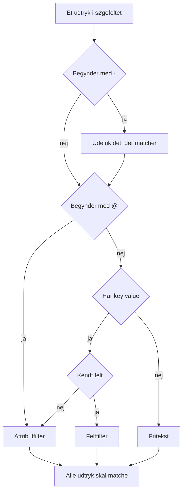

# Søgesyntaks

Søgefeltet over udforskerne for logs, spor, metrikker og undtagelser taler ét forespørgselssprog. En forespørgsel er en liste af filtre adskilt af mellemrum, og **alle filtre skal matche**: der er ingen underforstået OR mellem filtre. Brug denne side som opslagsværk, mens du søger.

:::cards
- [De to slags filtre](#de-to-slags-filtre): Indbyggede felter, attributter og fritekst.
- [Matchning af værdier](#matchning-af-værdier): Jokertegn, "indeholder", sammenligninger og lister.
- [Udelukkelse](#udelukkelse): Vend ethvert filter om med et `-` foran.
- [Felter pr. signal](#felter-pr-signal): Hvad du kan filtrere på i hver udforsker.
:::

## Sådan læses en forespørgsel

```text
severity:error @platform.team:a* -@http.method:GET timeout
```

Det læses som: logs på niveau error, hvis attribut `platform.team` begynder med `a`, hvis attribut `http.method` ikke er `GET`, og hvis besked nævner `timeout`.

| Udtryk | Slags | Matcher |
| --- | --- | --- |
| `severity:error` | Felt | Loggens alvorlighed er Error. |
| `@platform.team:a*` | Attribut | Attributten `platform.team` begynder med `a`. |
| `-@http.method:GET` | Udelukket attribut | Attributten `http.method` er alt andet end `GET`. |
| `timeout` | Fritekst | Beskeden indeholder `timeout`. |

Hvert udtryk adskilt af mellemrum læses for sig, og derefter kombineres de alle med AND:



## De to slags filtre

| Form | Filtrerer | Eksempel |
| --- | --- | --- |
| `field:value` | Et indbygget felt i signalet | `severity:error` |
| `@attribute:value` | En OpenTelemetry-attribut på rækken | `@http.status_code:500` |
| løse ord | Beskeden (logs), span-navnet (spor), metriknavnet (metrikker) eller undtagelsesbeskeden (undtagelser) | `connection refused` |

Et løst `key:value`, hvis nøgle ikke er et kendt felt, behandles som en attribut, så `k8s.pod:api-0` og `@k8s.pod:api-0` betyder det samme. Præfikset `@` betyder altid "søg i attributterne", med én undtagelse: i udforskeren for undtagelser filtrerer `@type:`, `@service:`, `@env:` og `@class:` stadig de felter.

Tekst, der blot indeholder et kolon, forbliver tekst: `https://example.com` og `12:30` søges som ord og læses ikke som filtre.

## Matchning af værdier

Alt i denne tabel virker på enhver attribut og på de fleste indbyggede felter; [Felter pr. signal](#felter-pr-signal) nævner de felter, der læser en værdi enklere.

| Du skriver | Matcher |
| --- | --- |
| `@k:abc` | præcis `abc` |
| `@k:a*` | alt, der begynder med `a`: `abc`, `alpha` |
| `@k:*c` | alt, der slutter med `c` |
| `@k:a*c` | begynder med `a` og slutter med `c` |
| `@k:a?c` | `?` er præcis ét tegn: `abc`, `axc`, men ikke `ac` |
| `@k:*` | attributten findes og er ikke tom |
| `@k:~abc` | indeholder `abc` et vilkårligt sted |
| `@k:!abc` | alt undtagen `abc` |
| `@k:>100` | større end 100. Også `>=`, `<`, `<=` |
| `@k:(a OR b)` | en af de to værdier. `@k:[a, b]` er det samme |
| `@k:(a* OR b*)` | et af de to mønstre |

Matchning med jokertegn og "indeholder" ignorerer store og små bogstaver; præcis matchning gør ikke, fordi den sammenligner med værdien, præcis som den blev gemt.

### Værdier med mellemrum

Sæt værdien i dobbelte anførselstegn:

```text
name:"SELECT wp_options"
@k8s.container.name:"my container"
```

Anførselstegn beskytter **mellemrum**, ikke jokertegn: `@k:"a b*"` matcher stadig alt, der begynder med `a b`.

### `*`, `?` og andre tegn bogstaveligt

En omvendt skråstreg gør det næste tegn bogstaveligt:

| Du skriver | Matcher |
| --- | --- |
| `@k:a\*b` | præcis `a*b` |
| `@k:\~abc` | præcis `~abc` |
| `@k:\>5` | præcis `>5` |

Værdier med `%` eller `_` skal ikke escapes: de er altid bogstavelige.

## Udelukkelse

Et `-` foran vender ethvert filter om, også dem ovenfor:

| Du skriver | Matcher |
| --- | --- |
| `-severity:debug` | alt undtagen debug |
| `-@platform.team:a*` | alt, hvis `platform.team` **ikke** begynder med `a`, også rækker helt uden `platform.team` |
| `-@k:*` | attributten mangler eller er tom |
| `-@k:(a OR b)` | ingen af de to værdier |
| `-@k:>100` | 100 eller mindre |
| `-@k:~abc` | indeholder ikke `abc` |

I udforskeren for spor udelukker `-` kun attributter. `-status:error` læses som tekst, der søges efter i span-navne, og finder intet; spørg i stedet efter de værdier, du vil have, for eksempel `status:(ok OR unset)`.

## Felter pr. signal

Feltnavne skelner ikke mellem store og små bogstaver: `statusMessage:` og `statusmessage:` er det samme felt.

### Logs

| Felt | Aliasser | Bemærkninger |
| --- | --- | --- |
| `severity` | `level` | `fatal`, `error`, `warning` (eller `warn`), `info` (eller `information`), `debug`, `trace`, `unspecified`, med vilkårlige store og små bogstaver |
| `service` | | Tjenestenavn, skrevet fuldt ud, med vilkårlige store og små bogstaver |
| `trace` | | Trace-ID |
| `span` | | Span-ID |
| `message` | `msg`, `log`, `body` | Loglinjen. Løse ord søger også i den |

### Spor

Sporfelter tager en almindelig værdi eller en liste som `status:(ok OR unset)`, og `duration` tager også `>` og `<`. Jokertegn, `~`, `!` og et `-` foran virker her kun på attributter.

| Felt | Bemærkninger |
| --- | --- |
| `service` | Tjenestenavn |
| `name` | Span-navn. En enkelt værdi matcher en vilkårlig del af det. Løse ord søger også i det |
| `status` | `ok`, `error`, `unset` (unset = Ingen fejlstatus angivet, OpenTelemetry-standarden) |
| `kind` | `server`, `client`, `producer`, `consumer`, `internal` |
| `duration` | Millisekunder: `duration:>500`, `duration:<200` eller en præcis værdi |
| `statusMessage` | Statusbeskedens tekst. En enkelt værdi matcher en vilkårlig del af den |
| `hasException` | `true` eller `false` |
| `trace`, `span` | ID'er |

### Metrikker

| Felt | Bemærkninger |
| --- | --- |
| `name` | Metriknavn. En almindelig værdi matcher en vilkårlig del af det, så `name:http.server` finder `http.server.request.duration`. Løse ord søger også i det |
| `service` | Tjenestenavn. En almindelig værdi matcher en vilkårlig del af det |

### Undtagelser

| Felt | Aliasser | Bemærkninger |
| --- | --- | --- |
| `type` | `exceptionType` | Undtagelsestype, f.eks. `type:TypeError` |
| `env` | `environment` | Miljø, fra ressourceattributten `deployment.environment` |
| `service` | | Tjenestenavn. En almindelig værdi matcher en vilkårlig del af det |
| `class` | `errorClass` | Hvis fejl det er: `code-fault`, `user-error`, `expected-denial`, `infrastructure` eller `unknown` |

Løse ord søger i undtagelsesbeskeden.

Udforskeren **Security Events** bruger samme sprog med sine egne felter, såsom `severity`, `tactic` og `user`: se [Security Events](/docs/telemetry/security-events).

## Kombination af filtre

Filtre kombineres med AND. Du må skrive `AND` imellem dem, og det ændrer intet:

```text
severity:error service:api          # both must hold
severity:error AND service:api      # identical
```

Der er ingen OR og ingen NOT **mellem** filtre: `OR` og `NOT`, der står der, springes over, så `NOT severity:debug` betyder det samme som `severity:debug`. Udeluk med et `-` foran (`-severity:debug`), og brug listeformen til at matche en af to værdier for samme nøgle:

```text
@http.method:(GET OR POST)
```

To filtre på samme nøgle kombineres med AND; sådan skriver man et interval eller et mønster med to ender:

```text
@http.status_code:>=500 @http.status_code:<=599
@k:a* @k:*z
```

## Chips og søgefeltet

Tryk på Enter ved et udtryk `key:value` anvender det, som regel som en chip over resultaterne. En chip bærer værdien præcis, som den blev skrevet, så et jokertegn forbliver et jokertegn. Et udtryk, som en chip ikke kan bære, f.eks. et udelukket `-key:value`, bliver i søgefeltet og filtrerer derfra. Et klik på en værdi i facetsidepanelet tilføjer samme slags chip med værdien escapet: en gemt værdi, der tilfældigvis indeholder `*`, filtrerer på netop den værdi, ikke som et mønster.

Chips er en del af den gemte visning og af sidens URL, så et filter overlever en genindlæsning, et bogmærke og et delt link.

## Godt at vide

- Attribut**nøgler** sammenlignes uden hensyn til store og små bogstaver ved filtre med jokertegn, "indeholder", præfiks og suffiks, så du behøver ikke huske, om den blev indlæst som `requestId` eller `requestid`.
- Et filter `-@k:...` matcher også rækker, der aldrig har haft attributten: en række helt uden `platform.team` begynder naturligvis ikke med `a`.
- Numeriske sammenligninger virker på attributværdier, der er gemt som tekst; en værdi, der ikke er et tal, opfylder aldrig en sammenligning.

## Næste trin

:::cards
- [Zoom ind på et tidsinterval](/docs/telemetry/charts-and-time-ranges): Indsnævr udforskerne til det øjeblik, der betyder noget.
- [Logpipelines](/docs/telemetry/log-pipelines): Gør dele af en loglinje til søgbare attributter.
- [Log-monitor](/docs/monitor/logs-monitor): Få en alarm, når de logs, du søger efter, dukker op.
- [OpenTelemetry](/docs/telemetry/open-telemetry): Send logs, metrikker og spor, der kan søges i.
:::
