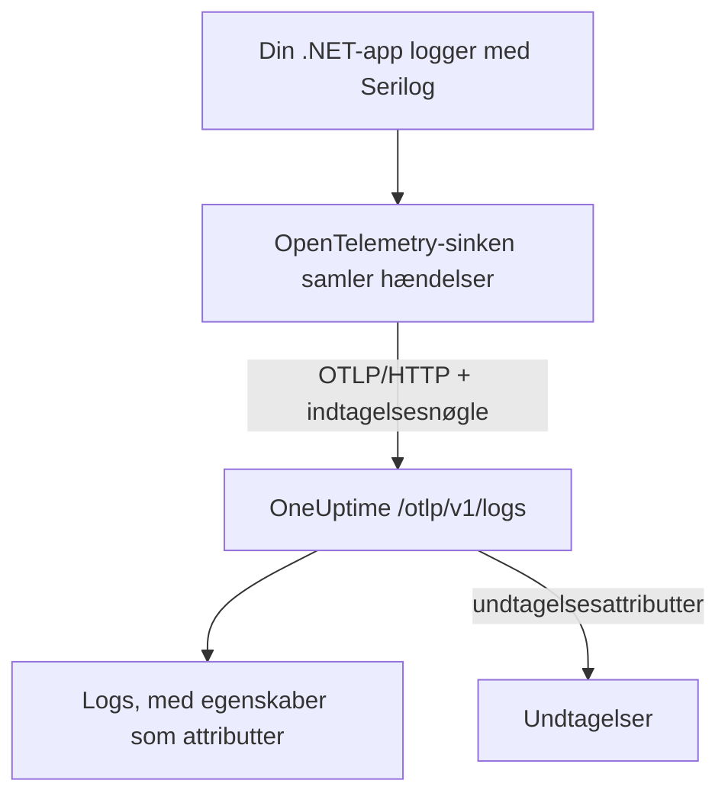

# Serilog (.NET)

[Serilog](https://serilog.net) er det mest udbredte bibliotek til struktureret logning i .NET. Med den officielle sink [`Serilog.Sinks.OpenTelemetry`](https://github.com/serilog/serilog-sinks-opentelemetry) sendes hver hændelse, som din applikation logger gennem Serilog, til OneUptime over OpenTelemetry Protocol (OTLP), og den bliver søgbar under **Produkter → Protokoller** med sine strukturerede egenskaber, sin alvorsgrad og sin kobling til traces.

Der er ingen OneUptime-specifik pakke at installere: Sinken taler med det samme OTLP-endpoint, som OneUptime stiller til rådighed for alle OpenTelemetry-data. Det virker for konsolapps, worker services, ASP.NET Core-apps og alt andet, der kører på .NET.

:::cards
- [Opsæt sinken](#opsæt-sinken): Installér to pakker, og konfigurér dem i kode eller i `appsettings.json`.
- [Undtagelser](#undtagelser): Loggede undtagelser bliver til issues under Undtagelser.
- [Fejlfinding](#fejlfinding): Hvad du skal tjekke, når der ikke kommer nogen logs.
:::

## Sådan virker det



Sinken samler loghændelser og sender dem i baggrunden. Hver navngiven egenskab bliver en attribut på loggen, og en undtagelse, der logges med Serilog, ankommer med de attributter, som OneUptime gør til et issue.

## Før du begynder

- Et OneUptime-projekt. I OneUptime Cloud afregnes telemetri pr. indtaget GB – se [priser](https://oneuptime.com/pricing) – og et projekt på Free-planen skal have en betalingsmetode, før det kan sende telemetri.
- En .NET-applikation, der bruger eller kan bruge Serilog.
- En indtagelsesnøgle til telemetri, som dine logs godkendes med. Hvis du ikke har en:

:::steps
### Åbn indtagelsesnøglerne

Gå til **Produkter → Projektindstillinger**, åbn **Telemetri og APM** i sidemenuen, og vælg **Indtagelsesnøgler**.


### Opret en nøgle

Klik på **Opret ingestion-nøgle**. Dialogen har allerede udfyldt nøglens navn og valgt **Server** – den slags nøgle, en applikation eller en collector sender med – så klik på **Opret ingestion-nøgle** for at oprette den, eller omdøb den først.

### Kopiér hemmeligheden

Den nye nøgle åbner på sin egen side. Kopiér dens **Hemmelig nøgle**: Det er `YOUR_TELEMETRY_INGESTION_TOKEN` i eksemplerne nedenfor.


:::

## Hvad du skal bruge fra OneUptime

| Indstilling | Værdi |
| ------------- | ------------------------------------------------------------ |
| OTLP-endpoint | `https://oneuptime.com/otlp` |
| Auth-header | `x-oneuptime-token: YOUR_TELEMETRY_INGESTION_TOKEN` |
| Tjenestenavn | Det navn, din tjeneste skal vises under, f.eks. `my-service` |

> [!NOTE]
> Hoster du selv OneUptime? Erstat `https://oneuptime.com/otlp` med `https://YOUR-ONEUPTIME-HOST/otlp` (eller `http://...`, hvis du ikke terminerer TLS). Alt andet er det samme.

Når protokollen er sat til `HttpProtobuf`, tilføjer sinken stien `/v1/logs` til endpointet, så den endelige URL, den sender til, er `https://oneuptime.com/otlp/v1/logs`. Du skal kun angive basis-endpointet `/otlp`.

## Opsæt sinken

:::steps
### Installér NuGet-pakkerne

Føj Serilog og OpenTelemetry-sinken til dit projekt:

```bash
dotnet add package Serilog
dotnet add package Serilog.Sinks.OpenTelemetry
```

Hvis du konfigurerer sinken fra `appsettings.json`, skal du også tilføje `Serilog.Settings.Configuration`. Til ASP.NET Core-apps tilføjer du `Serilog.AspNetCore`, som kobler Serilog til værten og request-pipelinen:

```bash
dotnet add package Serilog.Settings.Configuration
dotnet add package Serilog.AspNetCore
```

### Konfigurér sinken

Peg sinken på dit OneUptime-OTLP-endpoint, sæt protokollen til `HttpProtobuf`, send dit indtagelsestoken som header, og mærk loggene med et `service.name`. Konfigurér den i kode, i `appsettings.json` eller i ASP.NET Core-værten:

:::tabs
@tab I kode
```csharp title="Program.cs"
using Serilog;
using Serilog.Sinks.OpenTelemetry;

Log.Logger = new LoggerConfiguration()
    .MinimumLevel.Information()
    .Enrich.FromLogContext()
    .WriteTo.Console() // optional: keep local logs too
    .WriteTo.OpenTelemetry(options =>
    {
        // Base OTLP endpoint. The sink appends /v1/logs automatically.
        options.Endpoint = "https://oneuptime.com/otlp";
        options.Protocol = OtlpProtocol.HttpProtobuf;

        // Authenticate with your OneUptime telemetry ingestion token.
        options.Headers = new Dictionary<string, string>
        {
            ["x-oneuptime-token"] = "YOUR_TELEMETRY_INGESTION_TOKEN"
        };

        // Identify your service in OneUptime.
        options.ResourceAttributes = new Dictionary<string, object>
        {
            ["service.name"] = "my-service",
            ["deployment.environment"] = "production"
        };
    })
    .CreateLogger();

try
{
    Log.Information("Application starting up");
    // ... your application code ...
}
finally
{
    // Flush any buffered logs before the process exits.
    Log.CloseAndFlush();
}
```
@tab appsettings.json
Læg sinkens indstillinger i `appsettings.json`:

```json title="appsettings.json"
{
  "Serilog": {
    "Using": ["Serilog.Sinks.OpenTelemetry"],
    "MinimumLevel": "Information",
    "WriteTo": [
      {
        "Name": "OpenTelemetry",
        "Args": {
          "endpoint": "https://oneuptime.com/otlp",
          "protocol": "HttpProtobuf",
          "headers": {
            "x-oneuptime-token": "YOUR_TELEMETRY_INGESTION_TOKEN"
          },
          "resourceAttributes": {
            "service.name": "my-service",
            "deployment.environment": "production"
          }
        }
      }
    ]
  }
}
```

Byg derefter loggeren ud fra konfigurationen:

```csharp title="Program.cs"
using Serilog;
using Microsoft.Extensions.Configuration;

IConfiguration configuration = new ConfigurationBuilder()
    .AddJsonFile("appsettings.json")
    .Build();

Log.Logger = new LoggerConfiguration()
    .ReadFrom.Configuration(configuration)
    .CreateLogger();
```
@tab ASP.NET Core
Til ASP.NET Core (minimal hosting, .NET 6 og nyere) bruger du `Serilog.AspNetCore`, så Serilog erstatter standardloggeren og også opfanger framework- og request-logs:

```csharp title="Program.cs"
using Serilog;
using Serilog.Sinks.OpenTelemetry;

var builder = WebApplication.CreateBuilder(args);

builder.Host.UseSerilog((context, services, configuration) =>
{
    configuration
        .ReadFrom.Configuration(context.Configuration)
        .Enrich.FromLogContext()
        .WriteTo.OpenTelemetry(options =>
        {
            options.Endpoint = "https://oneuptime.com/otlp";
            options.Protocol = OtlpProtocol.HttpProtobuf;
            options.Headers = new Dictionary<string, string>
            {
                ["x-oneuptime-token"] = "YOUR_TELEMETRY_INGESTION_TOKEN"
            };
            options.ResourceAttributes = new Dictionary<string, object>
            {
                ["service.name"] = "my-service"
            };
        });
});

var app = builder.Build();

// Logs one summary event per HTTP request.
app.UseSerilogRequestLogging();

app.MapGet("/", () => "Hello World");
app.Run();
```
:::

> [!IMPORTANT]
> Sinken samler loghændelser og sender dem asynkront. Kald altid `Log.CloseAndFlush()` (eller frigiv loggeren), før din applikation afsluttes, ellers kan den sidste batch af logs gå tabt. I ASP.NET Core klarer `Serilog.AspNetCore` det for dig ved en ordentlig nedlukning.

> [!TIP]
> Hold tokenet uden for versionsstyringen. Hent det fra en miljøvariabel eller et secrets-lager, og indsæt det i konfigurationen ved opstart i stedet for at committe det til `appsettings.json`.

### Skriv logs

Brug Serilog, som du plejer. Strukturerede egenskaber bevares og bliver søgbare attributter i OneUptime:

```csharp
Log.Information("Order {OrderId} placed by {CustomerId} for {Amount:C}",
    orderId, customerId, amount);

Log.Warning("Payment gateway slow: {LatencyMs}ms", latencyMs);
```

Hver navngiven egenskab (`OrderId`, `CustomerId`, `Amount`, `LatencyMs`) sendes som en attribut på loggen, så du kan filtrere og søge på dem i explorer'en **Produkter → Protokoller**.

### Tjek, at logs ankommer

Kør din applikation, og skriv et par loghændelser. Efter få sekunder vises de under **Produkter → Protokoller** og på din tjenestes side under **Produkter → Tjenester** – tjenesten er opkaldt efter det `service.name`, du har sat (`my-service`). Deres strukturerede egenskaber er tilgængelige som filtre.
:::

## Undtagelser

Når du logger en undtagelse med Serilog, tilføjer sinken OpenTelemetry-attributterne `exception.type`, `exception.message` og `exception.stacktrace` til logposten:

```csharp
try
{
    ProcessPayment();
}
catch (Exception ex)
{
    Log.Error(ex, "Failed to process payment for order {OrderId}", orderId);
}
```

OneUptime genkender disse attributter og samler fejlen i et issue under **Undtagelser**, efter fingeraftryk og knyttet til den rigtige tjeneste. En fejl, som både et trace og en log rapporterer, slås sammen til ét issue. Se [Undtagelser fra logs](/docs/telemetry/open-telemetry#undtagelser-fra-logs) for, hvordan genkendelsen virker.

## Kobling til traces

Er din applikation også instrumenteret med OpenTelemetry .NET SDK til traces, får Serilog-hændelser, der udsendes inden for et aktivt span, automatisk det aktuelle `TraceId` og `SpanId` (det er en del af sinkens standard-`IncludedData`). Så kan OneUptime koble en loglinje direkte til det trace, den opstod i, og du kan springe fra en log til den omgivende request og tilbage.

Vil du også sende traces og metrikker, så se .NET-opsætningen under [Kom hurtigt i gang med OpenTelemetry](/docs/telemetry/open-telemetry#kom-hurtigt-i-gang).

## Fejlfinding

:::details Der vises ingen logs
Tjek værdien af `x-oneuptime-token`, og bekræft, at den hører til det projekt, du kigger på. Bekræft, at endpointet er `https://oneuptime.com/otlp` (kun basisstien – tilføj ikke selv `/v1/logs`). For at se, hvorfor sinken fejler, kan du slå Serilogs egen fejludskrift til ved opstart med `Serilog.Debugging.SelfLog.Enable(Console.Error)`: Den viser den statuskode, OneUptime svarer med.
:::

:::details Logs vises først, når appen afsluttes, eller de sidste logs mangler
Sørg for, at `Log.CloseAndFlush()` kører ved nedlukning. Sinken samler hændelser, så bufferede logs går tabt, hvis processen dræbes uden flush.
:::

:::details 401 Unauthorized, og intet bliver indtaget
Nøglen mangler, er ukendt eller udløbet. Bekræft, at headerens navn er præcis `x-oneuptime-token`, og at værdien er nøglens **Hemmelig nøgle**.
:::

:::details 402 eller 422, og intet bliver indtaget
`402`: I OneUptime Cloud er projektet på Free-planen og har ingen betalingsmetode. Tilføj en under **Projektindstillinger → Fakturering og fakturaer → Fakturering**. `422`: Nøglen er deaktiveret, eller det er en browsernøgle. Slå **Aktiveret** til igen i nøglens indstillinger, eller opret en **Server**-nøgle.
:::

:::details Logs ankommer under det forkerte tjenestenavn
Sæt `service.name` i `ResourceAttributes` (kode) eller `resourceAttributes` (appsettings.json). Uden det gemmes dine logs under det pladsholdernavn, sinken sender i stedet, og ikke under din tjenestes navn.
:::

:::details Forbindelsesfejl til en selvhostet instans
Sørg for, at protokollen passer til dit endpoints skema (`https://` eller `http://`), og at din OneUptime-vært kan nås fra applikationen.
:::

Har du spørgsmål eller brug for hjælp, så skriv til os på support@oneuptime.com.

## Næste trin

:::cards
- [OpenTelemetry](/docs/telemetry/open-telemetry): Send også traces og metrikker fra .NET.
- [Logpipelines](/docs/telemetry/log-pipelines): Fortolk og berig logs, når de ankommer.
- [Log-monitor](/docs/monitor/logs-monitor): Få besked, når matchende logs dukker op.
- [Søgesyntaks](/docs/telemetry/search-syntax): Filtrér på dine Serilog-egenskaber.
:::
