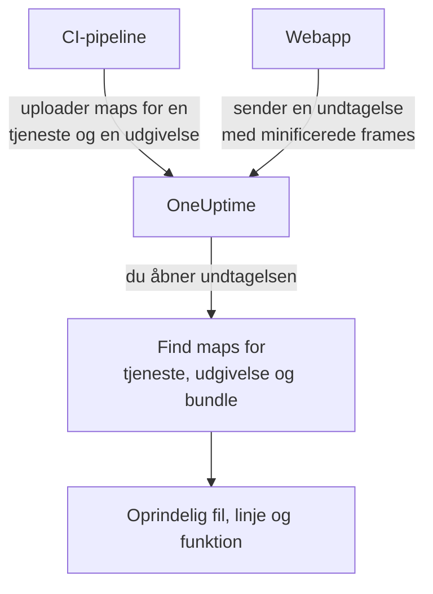

# Source maps

Upload dit frontend-builds source maps til OneUptime, så viser browserundtagelser under **Undtagelser** dine oprindelige filnavne, linjer og funktioner i stedet for de minificerede. Denne side er til frontend-udviklere, der allerede sender browsertelemetri til OneUptime.

:::cards
- [Sådan fungerer matchningen](#sådan-fungerer-matchningen): Tjenestenavn, udgivelse og bundlefil.
- [Upload source maps](#upload-source-maps): Én `curl`-anmodning fra CI.
- [Grænser](#grænser): Størrelser, antal og indstillingerne til selvhosting.
- [Se opløste stakspor](#se-opløste-stakspor): Sådan ser en opløst frame ud.
:::

## Overblik

Produktionsbundles til frontend er minificerede, så en browserundtagelse, der er opfanget via OpenTelemetry-web-SDK'et, ankommer med stakframes som disse:

```text
TypeError: Cannot read properties of undefined (reading 'id')
    at e.onSelect (https://app.example.com/assets/main.a8f1b2.js:1:48291)
```

Upload dit builds source maps til OneUptime, så opløser dashboardet for undtagelser de frames til den oprindelige fil, linje og funktionsnavn og, når map'en blev bygget med `sourcesContent`, til de omkringliggende linjer i din oprindelige kildekode.

Maps uploades til OneUptime via et godkendt API og **hentes aldrig fra dit websted**, så du kan (og bør) blive ved med at bygge med `hidden-source-map` (webpack) eller `sourcemap: 'hidden'` (Vite / Rollup) og aldrig offentliggøre `.map`-filerne ved siden af dine bundles.



## Sådan fungerer matchningen

En source map gemmes under tre nøgler:

| Nøgle | Skal matche |
|---|---|
| Tjenestenavn | OpenTelemetry-ressourceattributten `service.name`, som din webapp sender telemetri med |
| Tjenesteversion | Ressourceattributten `service.version` (din udgivelses-ID) |
| Bundlesti | Den minificerede fil, som map'en blev genereret til, f.eks. `main.a8f1b2.js` |

Når du åbner en undtagelse, slår OneUptime de maps op, der er uploadet til undtagelsens tjeneste og udgivelse, matcher hver stakframe med et bundle ud fra filnavnet (stisuffikser er fine: `main.a8f1b2.js` matcher `https://app.example.com/assets/main.a8f1b2.js`) og opløser den minificerede linje og kolonne via map'en. Opløsningen sker først, når undtagelsen vises, aldrig under indlæsningen, så en map, der uploades et par minutter *efter* den første fejl i en ny udgivelse, gælder alligevel med tilbagevirkende kraft.

## Før du begynder

- En telemetri-indtagelsesnøgle af typen **Server** fra **Projektindstillinger → Telemetri og APM → Indtagelsesnøgler**. Se [Opret en indtagelsesnøgle](/docs/telemetry/open-telemetry#opret-en-indtagelsesnøgle).
- En webapp, der allerede sender undtagelser til OneUptime med OpenTelemetry-web-SDK'et: se [Browseropsætning](/docs/rum/browser-setup).
- Et build, der skriver source maps, med `sourcesContent` (standard i de fleste bundlere), hvis du vil have kodeuddrag omkring hver frame.

## Upload source maps

:::steps
### Send `service.version` med din telemetri

Din webapp skal sende `service.version`, og det skal være den samme streng, som du uploader maps med:

```javascript
import { resourceFromAttributes } from "@opentelemetry/resources";

const resource = resourceFromAttributes({
  "service.name": "my-web-app",
  "service.version": "1.4.2", // same value you upload maps with
});
```

Enhver stabil udgivelses-ID virker (en semantisk version, en git-commit-SHA, et buildnummer), så længe den uploadede `serviceVersion` og ressourceattributten `service.version` er den samme streng.

### Upload maps efter hvert produktionsbuild

Upload fra CI med din indtagelsesnøgle i headeren `x-oneuptime-token`:

```bash
curl --fail -X POST "https://oneuptime.com/source-maps/v1/upload" \
  -H "x-oneuptime-token: YOUR_TELEMETRY_INGESTION_KEY" \
  -F "serviceName=my-web-app" \
  -F "serviceVersion=1.4.2" \
  -F "sourcemap=@dist/assets/main.a8f1b2.js.map" \
  -F "sourcemap=@dist/assets/vendor.9c3d4e.js.map"
```

Ved selvhostede installationer erstatter du `oneuptime.com` med din OneUptime-vært. `Authorization: Bearer YOUR_KEY` accepteres som alternativ til headeren `x-oneuptime-token`.

### Kontrollér uploaden

En vellykket upload returnerer en JSON-body med de gemte maps, så CI kan tjekke den. Maps står også på tjenestens side **Source Maps** i OneUptime.
:::

Et typisk CI-trin uploader alle maps, som buildet har lavet:

```bash
VERSION="$(git rev-parse --short HEAD)"

find dist -name "*.js.map" -print0 | while IFS= read -r -d '' map; do
  curl --fail -X POST "https://oneuptime.com/source-maps/v1/upload" \
    -H "x-oneuptime-token: $ONEUPTIME_INGESTION_KEY" \
    -F "serviceName=my-web-app" \
    -F "serviceVersion=$VERSION" \
    -F "sourcemap=@$map"
done
```

### Regler for upload

- Hver uploadet fils bundlesti er dens filnavn uden den afsluttende `.map`: `main.a8f1b2.js.map` bliver til `main.a8f1b2.js`. Hvis dit map-filnavn ikke følger den konvention, så upload én fil pr. anmodning, og send et eksplicit felt `bundlePath` med.
- En ny upload af samme bundle til samme tjeneste og version erstatter den tidligere map, så CI-genforsøg er ufarlige.
- Filerne skal være JSON efter [source map v3](https://tc39.es/ecma426/) (det, som enhver moderne bundler laver; indekserede maps med `sections` understøttes også).
- Hvis operatøren af din selvhostede installation har slået telemetri-indlæsning fra (`DISABLE_TELEMETRY_INGESTION`), returnerer uploads et tomt succes-svar, og intet gemmes, den samme opførsel som alle telemetri-indlæsnings-endpoints har i den tilstand. En rigtig upload returnerer altid en JSON-body med de gemte maps, så CI kan kende forskel.

## Grænser

Hver `.map`-fil må være op til 50 MB, men ingressen begrænser også **hele anmodningens body** til 50 MB, så upload store maps én pr. anmodning. Op til 50 filer accepteres pr. anmodning, og én udgivelse (tjeneste + version) kan i alt rumme højst 1.000 maps; en upload, der ville overskride det, afvises med en besked, der nævner grænsen. Et build, der laver flere maps, end én anmodning accepterer, sender bare flere anmodninger: uploads til samme udgivelse lægges sammen.

Selvhostede installationer kan ændre disse. Alle fem er almindelige miljøvariabler, og Helm-chartet stiller dem til rådighed under `sourceMaps` i `values.yaml`:

| `values.yaml` | Miljøvariabel | Standard |
| --- | --- | --- |
| `sourceMaps.maxMapsPerRelease` | `SOURCE_MAP_MAX_MAPS_PER_RELEASE` | `1000` |
| `sourceMaps.maxFilesPerRequest` | `SOURCE_MAP_MAX_FILES_PER_REQUEST` | `50` |
| `sourceMaps.maxFileSizeBytes` | `SOURCE_MAP_MAX_FILE_SIZE_BYTES` | `52428800` |
| `sourceMaps.maxBytesPerResolve` | `SOURCE_MAP_MAX_BYTES_PER_RESOLVE` | `536870912` |
| `sourceMaps.retentionDays` | `SOURCE_MAP_RETENTION_DAYS` | `90` |

`maxMapsPerRelease` er den, du hæver, hvis dit build vokser ud over standarden; den begrænser kun lagringens form, fordi opløsningen er begrænset af `maxBytesPerResolve` og ikke af, hvor mange maps en udgivelse rummer. `maxFilesPerRequest` og `maxFileSizeBytes` kan kun **sænkes**: multipart-bodyen fortolkes, før anmodningen er godkendt, så de fælles lofter over dem er det, en ikke-godkendt kalder holdes til, og en større værdi indsnævres i stedet for at blive anvendt.

## Se opløste stakspor

Åbn en vilkårlig undtagelse under **Undtagelser** i dashboardet. Frames, der er opløst via en source map, viser et mærkat **Source mapped** og det oprindelige funktionsnavn og filplacering; en udfoldet frame viser det oprindelige kodeuddrag (når map'en har `sourcesContent`) ved siden af den minificerede placering.

En tjenestes uploadede maps kan gennemses og slettes under **Produkter → Tjenester → din tjeneste → Source Maps**, som viser hver maps udgivelse, bundle, størrelse og uploadtidspunkt.

## Opbevaring

Source maps gemmes i 90 dage efter upload og slettes derefter automatisk. En map er kun nyttig, så længe undtagelser fra dens udgivelse ligger inden for din telemetri-opbevaringsperiode, så denne periode varer rigeligt længere end de undtagelser, den gør læsbare. Upload maps for en udgivelse igen, hvis du får brug for dem igen.

## Sikkerhed

- Maps uploades via et godkendt endpoint og gemmes i dit OneUptime-projekt: de hentes aldrig fra dit websted, så skjulte source maps forbliver skjulte.
- Det rå indhold af en map (som indeholder din oprindelige kildekode, når den er bygget med `sourcesContent`) kan kun læses tilbage af projektejere og administratorer og af alle med tilladelsen **Read Telemetry Source Map**. Andre teammedlemmer ser kun de opløste frames og de få kodelinjer omkring hvert nedbrudssted i undtagelser, de allerede har adgang til.
- Når en tjeneste slettes, slettes dens source maps.

## Fejlfinding

:::details Frames er stadig minificerede
Undtagelsens udgivelse har ingen matchende maps. Tjek, at den `service.version`, din app sender, er præcis den `serviceVersion`, du uploadede med, at `serviceName` matcher `service.name`, og at der er uploadet en map til den bundlefil: tjenestens side **Source Maps** viser udgivelse og bundle for hver map.
:::

:::details Uploaden afvises, fordi en map er for stor
En enkelt map må være op til 50 MB, og hele anmodningen også. Upload store maps én pr. anmodning, sådan som CI-løkken ovenfor gør.
:::

## Næste trin

:::cards
- [Browseropsætning](/docs/rum/browser-setup): Send browserspor og -undtagelser med OpenTelemetry-web-SDK'et.
- [Undtagelse-monitor](/docs/monitor/exceptions-monitor): Få en alarm, når nye undtagelser opstår.
- [OpenTelemetry](/docs/telemetry/open-telemetry): Endpoints, nøgler og grænser for al telemetri.
:::
