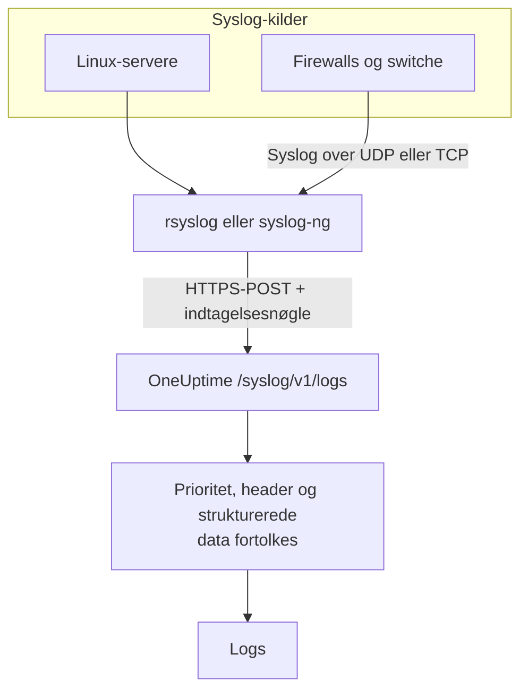

# Syslog

OneUptime tager imod syslog over HTTPS. Send RFC 5424- eller RFC 3164-beskeder til `/syslog/v1/logs` med din indtagelsesnøgle, og hver af dem bliver en søgbar log med prioritet, facility, alvorsgrad, vært, applikation og strukturerede data som attributter. Brug det til at videresende fra rsyslog, syslog-ng eller ethvert relay, der kan lave HTTP-requests.

:::cards
- [Send en testbesked](#send-en-testbesked): Én enkelt `curl`-request.
- [Videresend fra rsyslog](#videresend-fra-rsyslog): Send alt, hvad en server eller et relay modtager.
- [Udtrukne attributter](#udtrukne-attributter): Hvad OneUptime trækker ud af hver besked.
- [Fejlfinding](#fejlfinding): Afviste requests og uventede tjenester.
:::

## Sådan virker det



OneUptime svarer, så snart den har læst beskederne fra requesten, og fortolker og gemmer dem et øjeblik senere. Beskedteksten bliver i loggens indhold; alt andet bliver til attributter.

> [!TIP]
> Netværksenheder, som du overvåger med en OneUptime-probe, kan sende deres syslog direkte til proben over UDP uden relay – loggene vises så på enheden i OneUptime. Se [Vejledninger pr. netværksleverandør](/docs/monitor/network-vendor-guides).

## Før du begynder

- **Et OneUptime-projekt** – i OneUptime Cloud afregnes telemetri pr. indtaget GB, og et projekt på Free-planen skal have en betalingsmetode, før det kan sende telemetri.
- **Indtagelsesnøgle til telemetri** – opret en **Server**-nøgle under **Produkter → Projektindstillinger → Telemetri og APM → Indtagelsesnøgler**, og kopiér dens **Hemmelig nøgle**. Du sender den i headeren `x-oneuptime-token`.
- **Syslog-videresender** – ethvert værktøj, der kan sende HTTP POST-requests (for eksempel `curl`, `rsyslog` via `omhttp` eller `syslog-ng` med sin HTTP-destination).
- **Tjenestenavn (valgfrit)** – sæt headeren `x-oneuptime-service-name` for at samle indkommende logs under en bestemt telemetritjeneste. Udelader du den, falder OneUptime tilbage på syslog-`APP-NAME`, værtsnavnet eller `Syslog`.

## Endpoint

```http
POST https://oneuptime.com/syslog/v1/logs
```

| Header | Påkrævet | Værdi |
| --- | --- | --- |
| `x-oneuptime-token` | Ja | Din indtagelsesnøgle. |
| `Content-Type` | Ja, for JSON-indhold | `application/json` |
| `x-oneuptime-service-name` | Nej | Den tjeneste, loggene hører til. |
| `Content-Encoding` | Nej | `gzip`, for komprimeret indhold. |

Erstat `oneuptime.com` med din egen vært, hvis du selv hoster OneUptime.

## Requestens indhold

Send en JSON-nyttelast med et array `messages`. Både RFC 5424 og RFC 3164 (BSD) understøttes, og du kan blande dem i samme request:

```json
{
  "messages": [
    "<34>1 2025-03-02T14:48:05.003Z web-01 nginx 7421 ID47 [env@32473 host=\"web-01\"] 502 on /api/login",
    "<13>Feb  5 17:32:18 db-01 postgres[2419]: connection received from 10.0.0.12"
  ]
}
```

### Understøttede indholdsformater

| Indhold | Sådan sender du det |
| --- | --- |
| Et JSON-objekt med et array `messages` | `Content-Type: application/json` – anbefales. |
| Et JSON-array af beskeder | `Content-Type: application/json`. |
| Et JSON-objekt med én `message` | `Content-Type: application/json`. En værdi med flere linjer læses som flere beskeder. |
| Beskeder adskilt af linjeskift | Komprimeret med gzip og sendt med `Content-Encoding: gzip`. |

Ren tekst, der ikke er komprimeret med gzip, bliver ikke læst, og requesten afvises med `400`. Indhold, der er komprimeret med gzip, læses altid som beskeder adskilt af linjeskift, så komprimér ikke JSON-indhold. Hold hver request under 1 MB: OneUptimes ingress hæver ikke nginx' standardgrænse for requestindhold på dette endpoint.

## Send en testbesked

```bash
curl \
  -X POST https://oneuptime.com/syslog/v1/logs \
  -H "Content-Type: application/json" \
  -H "x-oneuptime-token: YOUR_TELEMETRY_KEY" \
  -H "x-oneuptime-service-name: production-web" \
  -d '{
    "messages": [
      "<34>1 2025-03-02T14:48:05.003Z web-01 nginx 7421 ID47 [env@32473 host=\"web-01\"] 502 on /api/login"
    ]
  }'
```

Et `200` betyder, at beskeden blev accepteret. Åbn **Produkter → Protokoller**: Loggen vises i tjenesten `production-web` med indholdet `502 on /api/login`, alvorsgraden `Error` og attributterne under [Udtrukne attributter](#udtrukne-attributter).

## Videresend fra rsyslog

rsyslog sender til OneUptime med sit HTTP-outputmodul, `omhttp`.

:::steps
### Sørg for, at `omhttp` er tilgængeligt

Konfigurationen nedenfor indlæser det med `module(load="omhttp")`. Hvis rsyslog melder, at modulet ikke kan indlæses, så installér den pakke, der leverer `omhttp` til din distribution.

### Tilføj OneUptime-destinationen

Opret `/etc/rsyslog.d/oneuptime.conf`. Skabelonen genopbygger hver besked som en RFC 5424-linje og pakker den ind i det JSON-indhold, OneUptime forventer:

```text title="/etc/rsyslog.d/oneuptime.conf"
module(load="omhttp")

template(name="OneUptimeJson" type="string"
         string="{\"messages\":[\"<%PRI%>1 %TIMESTAMP:::date-rfc3339% %HOSTNAME% %APP-NAME% %PROCID% %MSGID% - %msg:::json%\"]}")

action(
  type="omhttp"
  server="oneuptime.com"
  serverport="443"
  usehttps="on"
  restpath="syslog/v1/logs"
  httpheaders=[
    "x-oneuptime-token: YOUR_TELEMETRY_KEY",
    "x-oneuptime-service-name: rsyslog-demo"
  ]
  template="OneUptimeJson"
)
```

`restpath` tager stien uden den indledende skråstreg. `omhttp` sender som standard en JSON-`Content-Type`, og det er netop, hvad denne skabelon producerer.

### Tjek konfigurationen, og genstart rsyslog

```bash
sudo rsyslogd -N1
sudo systemctl restart rsyslog
```

`rsyslogd -N1` validerer konfigurationen uden at starte rsyslog. Efter genstarten vises nye beskeder under **Produkter → Protokoller** i tjenesten `rsyslog-demo`.
:::

Handlingen videresender hver besked, rsyslog håndterer – lokale programmer, systemd-journalen, når rsyslog læser den, og alt, hvad den modtager fra netværket.

### Videresend syslog fra netværksenheder

Firewalls, switche og andre appliances sender ofte kun syslog over UDP eller TCP. Peg dem på et rsyslog-relay, og lad relayet videresende over HTTPS. Tilføj en listener til relayets konfiguration før `action`:

```text title="/etc/rsyslog.d/oneuptime.conf"
module(load="imudp")
input(type="imudp" port="514")
```

Sæt `x-oneuptime-service-name` til et navn som `perimeter-firewall`, eller fjern headeren, så hver enheds logs grupperes efter dens værtsnavn. Mange appliances skriver deres besked som `key=value`-par; en [Key=Value Parser](/docs/telemetry/log-pipelines#keyvalue-parser) gør dem til attributter.

:::details Send i batches i stedet for én request pr. besked
rsyslog kan samle beskeder og komprimere dem med gzip, hvilket OneUptime læser som beskeder adskilt af linjeskift. Erstat skabelonen og handlingen med:

```text title="/etc/rsyslog.d/oneuptime.conf"
template(name="OneUptimeLine" type="string"
         string="<%PRI%>1 %TIMESTAMP:::date-rfc3339% %HOSTNAME% %APP-NAME% %PROCID% %MSGID% - %msg%")

action(
  type="omhttp"
  server="oneuptime.com"
  serverport="443"
  usehttps="on"
  restpath="syslog/v1/logs"
  httpheaders=["x-oneuptime-token: YOUR_TELEMETRY_KEY"]
  template="OneUptimeLine"
  batch="on"
  batch.format="newline"
  compress="on"
)
```

Behold `compress="on"`: OneUptime læser kun beskeder adskilt af linjeskift fra indhold, der er komprimeret med gzip.
:::

### Andre videresendere

- **syslog-ng** – brug dens HTTP-destination med samme URL, samme headere og samme JSON-indhold.
- **Fluent Bit** – modtag syslog med Fluent Bits `syslog`-input, og videresend det som enhver anden log. Se [Fluent Bit](/docs/telemetry/fluentbit).

## Udtrukne attributter

OneUptime føjer automatisk følgende attributter til hver logpost:

| Attribut | Værdi | Fra testbeskeden |
| --- | --- | --- |
| `syslog.priority` | Prioriteten, `<PRI>` | `34` |
| `syslog.facility.code`, `syslog.facility.name` | Facility, ud fra prioriteten | `4`, `security` |
| `syslog.severity.code`, `syslog.severity.name` | Alvorsgraden, ud fra prioriteten | `2`, `critical` |
| `syslog.version` | RFC 5424-versionen | `1` |
| `syslog.hostname` | `HOSTNAME` | `web-01` |
| `syslog.appName` | `APP-NAME`, eller RFC 3164-tagget | `nginx` |
| `syslog.processId` | `PROCID` | `7421` |
| `syslog.messageId` | `MSGID` | `ID47` |
| `syslog.structured.raw` | De strukturerede RFC 5424-data, som de blev sendt | `[env@32473 host="web-01"]` |
| `syslog.structured.*` | Hver parameter i de strukturerede data, fladet ud | `syslog.structured.env_32473.host` = `web-01` |
| `syslog.raw` | Den oprindelige besked, til sporbarhed | hele linjen |

Disse attributter bliver søgbare i explorer'en **Produkter → Protokoller** – for eksempel `@syslog.severity.name:error` eller `@syslog.hostname:web-01`. Se [Søgesyntaks](/docs/telemetry/search-syntax).

Selve beskeden bliver i loggens indhold. Firewalls som Sophos XGS og Fortinet FortiGate skriver den som `key=value`-par (`log_component="IPSec" con_name="HQ-Branch1" status="Terminated"`); tilføj en **Key=Value Parser**-processor i en [logpipeline](/docs/telemetry/log-pipelines#keyvalue-parser) for også at gøre de par til attributter.

### Alvorsgrad

| Syslog-alvorsgrad | Kode | Alvorsgrad i OneUptime |
| --- | --- | --- |
| Emergency, Alert | `0`, `1` | `Fatal` |
| Critical, Error | `2`, `3` | `Error` |
| Warning | `4` | `Warning` |
| Notice, Informational | `5`, `6` | `Information` |
| Debug | `7` | `Debug` |
| Ingen prioritet i beskeden | — | `Unspecified` |

En besked uden tidsstempel gemmes med det tidspunkt, hvor OneUptime modtog den.

### Tjeneste

Hver log gemmes under en telemetritjeneste, som OneUptime opretter første gang, den sender. Tjenesten er den første tilstedeværende af:

1. headeren `x-oneuptime-service-name`;
2. beskedens `APP-NAME` (eller tag);
3. beskedens værtsnavn;
4. `Syslog`.

## Fejlfinding

:::details HTTP 401
Nøglen mangler, er ukendt eller udløbet. Tjek, at headeren `x-oneuptime-token` bærer **Hemmelig nøgle** for en indtagelsesnøgle i det projekt, der skal modtage loggene.
:::

:::details HTTP 402 eller 422
`402`: I OneUptime Cloud er projektet på Free-planen og har ingen betalingsmetode. Tilføj en under **Projektindstillinger → Fakturering og fakturaer → Fakturering**. `422`: Nøglen er deaktiveret, eller det er en browsernøgle. Slå **Aktiveret** til igen i nøglens indstillinger, eller opret en **Server**-nøgle.
:::

:::details HTTP 400, eller der vises ingen logs
Bekræft, at requestens indhold faktisk indeholder syslog-linjer, som JSON med `Content-Type: application/json`. Tomt indhold – og ren tekst, der ikke er komprimeret med gzip – afvises med HTTP 400.
:::

:::details HTTP 413
Requesten er større, end ingressen accepterer. Send færre beskeder pr. request.
:::

:::details Logs ankommer under et uventet tjenestenavn
Sæt `x-oneuptime-service-name` for at tilsidesætte standardgenkendelsen, som bruger `APP-NAME` og derefter værtsnavnet.
:::

## Næste trin

:::cards
- [Logpipelines](/docs/telemetry/log-pipelines): Gør `key=value`-beskeder til attributter.
- [Optagelsesregler for logs](/docs/telemetry/log-recording-rules): Gør tallene i dit syslog til metrikker.
- [Log-monitor](/docs/monitor/logs-monitor): Få besked, når matchende syslog-beskeder ankommer.
:::
