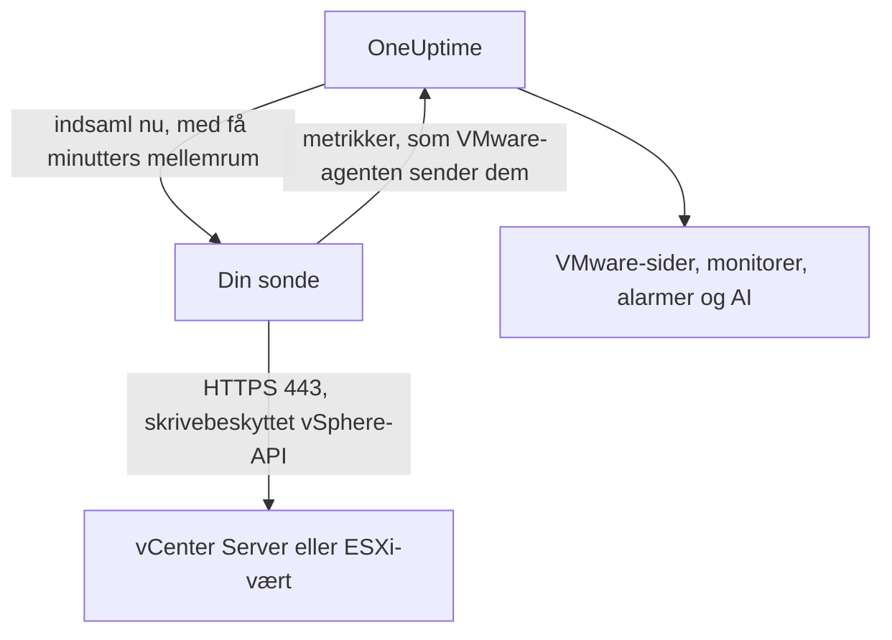

# VMware uden agent

Overvåg en vCenter Server, eller en selvstændig ESXi-vært, uden at installere noget: indtast vCenters adresse og en skrivebeskyttet konto i OneUptime, vælg den sonde, der kan nå den, og sonden indsamler de samme data som [VMware-agenten](/docs/telemetry/vmware). Der er ingen agent at installere, opgradere eller holde kørende, og ingen egen maskine at klargøre.

:::cards
- [Før du begynder](#før-du-begynder): En sonde, der kan nå vCenter, og en skrivebeskyttet konto.
- [Forbind en vCenter](#forbind-en-vcenter): Fire felter, en test og et navn.
- [Fejlfinding](#fejlfinding): Hvad hver meddelelse betyder, og hvad der løser den.
:::

## Sådan fungerer det

Med få minutters mellemrum logger sonden på vCenter med den konto, du har gemt, læser inventaret, ydelsestællerne og vSAN-statistikkerne og sender dem til OneUptime. De ankommer præcis som VMware-agentens, så hver VMware-side, hver [VMware-monitor](/docs/monitor/vmware-monitor), hver alarmskabelon og OneUptime AI læser dem på samme måde. Sonden beholder sin vCenter-session mellem indsamlingerne, så vCenters hændelseslog ikke fyldes med logins.

## Sonde eller agent?

| | En sonde (denne side) | VMware-agenten |
|---|---|---|
| Hvad du kører | En sonde, du allerede kører, eller en ny | Agenten, på sin egen maskine |
| Hvor kontoen opbevares | Krypteret i OneUptime, sendes kun til sonden | I agentens `.env`-fil |
| Hvad den skal kunne nå | vCenter på TCP 443, fra sonden | vCenter på TCP 443, fra agenten |
| Største vCenter | Omkring 48 MiB metrikker pr. indsamling | Ingen grænse |
| ESXi-syslog og AI-agenten | Ikke med | Med |

Begge sender de samme data. Du kan skifte en vCenter fra den ene til den anden når som helst på dens side **Indstillinger**.

## Før du begynder

- **En sonde, der kan nå vCenter på TCP 443.** Det er som regel en [brugerdefineret sonde](/docs/probe/custom-probe) i vCenters netværk. På OneUptime Cloud modtager de delte sonder aldrig en vCenter-adgangskode, så tilføj en sonde af dine egne. På en selvhostet instans kan instansens egne sonder også indsamle.
- **En vSphere-bruger med rollen Read-Only** på det øverste vCenter-objekt, med **Propagate to children** markeret. Følg [Opret den skrivebeskyttede vSphere-bruger](/docs/telemetry/vmware#create-the-read-only-vsphere-user): kontoen er den samme, som agenten bruger.

> [!IMPORTANT]
> Uden **Propagate to children** logger brugeren på, men ser intet, og sonden melder, at kontoen ikke kan læse vCenters inventar.

## Forbind en vCenter

:::steps
### Åbn vCenter-listen
Åbn **VMware → Alle vCenter** i OneUptime, og klik på **Forbind vCenter**.

### Indtast adressen og kontoen
Indtast den adresse, du åbner vSphere Client på, f.eks. `https://vcsa.example.com`, brugernavnet med dets domæne, f.eks. `oneuptime@vsphere.local`, og adgangskoden. Vælg den sonde, der kan nå vCenter.

### Test forbindelsen
Klik på **Test forbindelse** i næste trin. Sonden logger på, læser, hvad kontoen kan se, og logger af, og resultatet fortæller, hvor mange datacentre, klynger, værter, virtuelle maskiner og datastores den fandt.

### Stol på vCenters certifikat
vCenter bruger som standard et certifikat fra sin egen udsteder, som sonden ikke har tillid til. Testen viser så certifikatet: sammenlign dets fingeraftryk med vCenters eget, og klik så på **Stol på dette certifikat**.

### Navngiv og forbind
Navnet er som standard vCenters værtsnavn. Klik på **Forbind vCenter** for at gemme.
:::

vCenterens **Oversigt** viser et kort **Dataindsamling**. Det viser **Kontrollerer** indtil den første indsamling, som starter inden for et minut, derefter **Indsamler**, og inventaret fyldes ud.

## Certifikater

Sonden springer aldrig certifikatkontrollen over. Hver forbindelse gennemfører et fuldt TLS-handshake, og derefter:

- uden et betroet certifikat skal vCenters certifikat komme fra en udsteder, som sondens maskine har tillid til, for den adresse, du indtastede;
- med et betroet certifikat skal vCenter præsentere præcis det certifikat, kendt på dets SHA-256-fingeraftryk. Intet andet accepteres, heller ikke et offentligt betroet certifikat.

For at kontrollere et fingeraftryk skal du åbne vSphere Client under **Administration → Certificates → Certificate Management** eller køre `openssl s_client -connect vcsa.example.com:443 </dev/null | openssl x509 -noout -fingerprint -sha256` fra sondens maskine.

Når vCenters certifikat fornyes, stopper indsamlingen med **vCenters certifikat er ændret**, og det nye certifikat vises. Der sendes intet til vCenter, før du stoler på det, på vCenterens side **Oversigt** eller **Indstillinger**.

## Den gemte adgangskode

Adgangskoden er krypteret og kan kun skrives: ingen kan læse den igen, og API'et returnerer den aldrig. Den sendes kun til den sonde, der indsamler vCenteren, og som holder den i hukommelsen.

En gemt adgangskode sendes kun nogensinde til den adresse, gennem den sonde og til det certifikat, den blev indtastet til. Ændres adressen, sonden eller det betroede certifikat, skal adgangskoden indtastes igen, så ingen, der kan redigere vCenteren, kan sende den et andet sted hen. Stoler man på det certifikat, sonden fandt på den gemte adresse, beholdes den.

## Skift mellem agenten og en sonde

Åbn vCenterens side **Indstillinger**. Dens kort **Dataindsamling** tilbyder **Indsaml med en sonde** for en vCenter, som agenten sender, og **Brug VMware-agenten** for en, som en sonde indsamler. Skift til agenten glemmer den gemte adgangskode.

> [!WARNING]
> Stop VMware-agenten, så snart sondens første indsamling lykkes. Mens begge kører, ankommer hver metrik to gange.

## Reference

| Indstilling | Standard | Bemærkninger |
|---|---|---|
| Indsamlingsinterval | 2 minutter | Fra 1 til 60 minutter. Indsaml en stor vCenter sjældnere for at skåne den. |
| Samtidige indsamlinger | 4 pr. sonde | En indsamling, der er langsommere end sit interval, springes over og stables aldrig. |
| Største indsamling | Omkring 48 MiB | Større vCentre kræver VMware-agenten. |
| Forbindelsestest | 90 sekunder til start | En test, som ingen sonde tager i tide, eller som kører længere end 2 minutter, besvares som mislykket. |

## Fejlfinding

:::details vCenters certifikat er ikke betroet
vCenter præsenterer et certifikat fra sin egen udsteder. Sammenlign det viste fingeraftryk med vCenters certifikat, og klik så på **Stol på dette certifikat**.
:::

:::details vCenter afviste login
Brug det fulde brugernavn med dets domæne, f.eks. `oneuptime@vsphere.local`, og kontrollér adgangskoden, og at kontoen ikke er låst. Ret dem med **Rediger forbindelse** på vCenterens side **Indstillinger**.
:::

:::details Brugeren kan ikke læse vCenters inventar
Giv brugeren rollen Read-Only på det øverste vCenter-objekt, med **Propagate to children** markeret.
:::

:::details Sonden får intet svar fra vCenter
Sondens netværk kan ikke nå vCenter på TCP 443. Tillad trafikken gennem firewallen, eller vælg en sonde i vCenters netværk.
:::

:::details Sonden tog ikke imod dette
Sonden er offline eller kører en OneUptime-version, der er ældre end VMware-indsamling. Kontrollér, at den er forbundet i tabellen **Brugerdefinerede probes**, og opdater den.
:::

:::details Denne vCenter er for stor til at blive indsamlet af en sonde
Dens metrikker er større, end én upload fra en sonde må være. Brug [VMware-agenten](/docs/telemetry/vmware) til denne vCenter.
:::

## Næste trin

:::cards
- [VMware-monitor](/docs/monitor/vmware-monitor): Alarmer om værter, virtuelle maskiner, datastores og klynger.
- [Brugerdefineret sonde](/docs/probe/custom-probe): Kør en sonde i vCenters netværk.
- [VMware-agent](/docs/telemetry/vmware): Indsaml en vCenter med agenten i stedet.
:::
