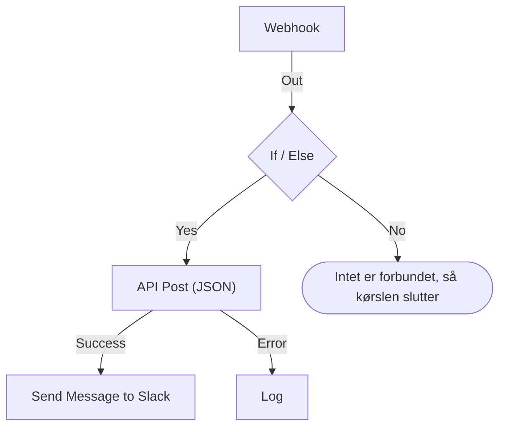

# Opret et workflow

Du bygger et workflow i dets **Bygger**: et lærred, hvor du tilføjer blokke, forbinder dem og udfylder deres indstillinger. Denne side viser, hvordan du opretter et workflow, [tilføjer blokke](#tilføj-blokke), [forbinder](#forbind-blokke) og [konfigurerer](#konfigurer-en-blok) dem, [sender værdier mellem dem](#brug-værdier-fra-tidligere-blokke) og [slår workflowet til](#slå-det-til).

For at oprette et workflow åbner du **Arbejdsgange** og klikker på **Opret arbejdsgang**. Dialogen **Opret en arbejdsgang** spørger først, hvordan du vil starte, og derefter om et navn. En skabelon, der har brug for sine egne indstillinger, som en Slack-webhook-URL, beder om dem i et ekstra trin og gemmer dem som workflowvariabler, så du kan ændre dem senere uden at redigere workflowet.

Vælg, hvordan du vil begynde:

- **Start fra bunden**, øverst i dialogen, giver dig et tomt lærred. De fleste workflows starter her.
- **Eller start fra en skabelon** viser nogle få **Anbefalet** skabeloner. For de andre vælger du en kategori ved siden af søgefeltet, som **Hændelser**, **Monitorer** eller **Jira**, eller **Alle skabeloner**, eller du skriver i **Søg i skabeloner…**. Hvert ord, du skriver, skal passe.

Klik på en skabelon for at se, hvad den gør: dens trigger, de blokke, den består af, og de indstillinger, den vil spørge om. Klik derefter på **Brug denne skabelon**, eller dobbeltklik på skabelonen. I søgefeltet vælger piletasterne en skabelon, og **Enter** bruger den. `/` fører dig tilbage til søgefeltet.

Workflows oprettes slået fra, så intet kører, før du slår dem til. Et nyt workflow åbner i **Bygger**, lærredet hvor du designer det.

## Lærredet

Et workflow fra bunden åbner med en enkelt stiplet blok med teksten **Choose what starts this workflow**. Den blok er udgangspunktet — klik på den for at vælge en trigger. Et workflow, der er oprettet fra en skabelon, åbner med sine blokke allerede på plads.

Hvert workflow har præcis én **trigger** øverst. Alt andet er en **komponent**, der gør noget. For at skifte triggeren sletter du den: den stiplede pladsholder kommer tilbage på dens plads, og et klik på den lader dig vælge en anden. Når du sletter en blok, slettes dens linjer også, så forbind den nye trigger til den første blok igen.

Ændringer gemmes automatisk. En pille i værktøjslinjen holder øje med det: **Gemmer…**, mens ændringen er på vej, derefter **Gemt**, eller **Kunne ikke gemme**, hvis det ikke lykkedes. Lærredet har ingen gem-knap og intet separat udgivelsestrin.

## Tilføj blokke

| For at tilføje         | Klik på                                                        | Panel, der åbner              |
| ---------------------- | -------------------------------------------------------------- | ----------------------------- |
| Triggeren              | Den stiplede pladsholderblok                                   | **Add Trigger**               |
| Enhver anden blok      | **Tilføj komponent**, i værktøjslinjen over lærredet           | **Tilføj komponent**          |

Begge paneler åbner på de blokke, de fleste workflows bruger, under **Popular**, efterfulgt af de øvrige indbyggede blokke. Under **OneUptime resources** klikker du på en ressource som **Hændelse** for at se, hvad du kan gøre med den; **Browse all resources** viser dem alle. Eller søg: skriv et par ord, som `create incident`, og det bedste match kommer først. Tryk på `/` for at hoppe til søgefeltet, på piletasterne for at gå gennem resultaterne og på **Enter** for at tilføje den fremhævede blok. Et klik på en blok tilføjer den.

En ny blok havner under den nederste blok på lærredet, og en ny trigger tager den stiplede bloks plads øverst. Den nye blok er markeret, og hvis den havner uden for synsfeltet, ruller lærredet lige nok til at vise den. Dens indstillinger åbner ikke af sig selv: klik på blokken, når du er klar til at konfigurere den. Indtil de påkrævede indstillinger er udfyldt, står der **Click to set up** på den.

Træk blokkene, hvorhen du vil; lærredet fæstner dem til et gitter undervejs. Blokkenes placeringer gemmes, så den næste person ser det samme layout, som du efterlod.

## Det, der er på en blok

| Felt                                  | Hvad det gør                                                                                                                                                                                                                                                                                                  |
| ------------------------------------- | ------------------------------------------------------------------------------------------------------------------------------------------------------------------------------------------------------------------------------------------------------------------------------------------------------------- |
| **Identifier** (under **ID**)         | Det korte ID, der vises på blokken, som `log-1`. Det er sådan, andre blokke henviser til denne, så hvis du omdøber det, går alle `{{local.components.…}}`-referencer, der peger på den, i stykker. Blokkens overskrift er komponentens eget navn og kan ikke ændres.                                              |
| **Indstillinger**                     | Det, blokken har brug for til sit arbejde — en URL, en Slack-kanal, en beskedtekst. Valgfrie felter er mærket **(Valgfrit)**; alt andet er påkrævet. En til/fra-kontakt har ingen af delene, fordi den altid har en værdi. Mindre brugte indstillinger er foldet sammen under **Flere felter**, hvis overskrift nævner dem og viser dem, der er udfyldt. |
| **Input**                             | Punktet på den øverste kant, hvor linjer fra tidligere blokke kommer ind. Triggere har ikke et — intet kører før dem.                                                                                                                                                                                         |
| **Outputs**                           | Punkterne langs den nederste kant, med etiketter lige over dem, hvor linjer går ud til de næste blokke. Mange blokke har separate udgange **Success** og **Error**, så du kan håndtere begge tilfælde.                                                                                                       |

## Forbind blokke

Træk fra et punkt nederst på én blok ned til punktet øverst på den næste. Den linje, du trækker, afgør, hvad der kører bagefter.

- Forbinder du fra **Success**, kører den næste blok kun, når den forrige lykkedes.
- Forbinder du fra **Error**, kører den næste blok kun, når den forrige mislykkedes.
- Forbinder du ikke en udgang, stopper den vej bare.

Du kan forbinde én udgang til flere blokke. De kører alle — men efter hinanden, i én kø, ikke parallelt. Regn ikke med rækkefølgen mellem grenene, og regn heller ikke med, at de overlapper i tid.

Hver blok kører højst én gang pr. kørsel. En linje, der fører til en blok, som allerede har kørt — tilbage op ad lærredet eller fra en anden gren, efter at den første nåede den — stopper kørslen med en fejl, så et workflow ikke kan gå i ring.

## Konfigurer en blok

Klik på en blok for at åbne dens indstillinger i en dialog, eller gå til den med **Tab**, og tryk på **Enter**. Udfyld indstillingerne, og klik på **Gem**.

Hver indstilling har det inputfelt, dens værdi kræver:

| Indstillingen indeholder                         | Du får                                                                         |
| ------------------------------------------------ | ------------------------------------------------------------------------------ |
| Ord: en besked, en prompt, en værdi, der skal logges | Et felt, der vokser, mens du skriver. **Enter** starter en ny linje.       |
| En kort værdi: en URL, et ID, en emnelinje       | En enkelt linje.                                                               |
| Kode eller HTML                                  | En kodeeditor.                                                                 |
| JSON                                             | En JSON-editor.                                                                |
| Til eller fra                                    | En kontakt med dens navn ved siden af. Klik på kontakten eller navnet for at skifte den. |

Dialogen åbner ved det, du sandsynligvis kom efter. For en **Webhook**-trigger er det dens URL, med en knap **Kopiér URL**, de metoder, den accepterer, og en eksempelforespørgsel. For en **Manual**-trigger er det, hvordan workflowet startes. Enhver anden blok åbner ved sine indstillinger. En blok uden indstillinger har slet ingen sektion **Indstillinger**.

Derunder, oppefra og ned:

- **ID**, **Inputs** og **Outputs**, side om side — blokkens identifier, hvorfra den nås, og hvad der kører efter den.
- **Returns** — de data, denne blok giver videre til senere trin. Hver værdi viser den præcise reference, der læser den, med en knap til at kopiere den.
- **How to use** — hvad blokken gør i én sætning, trinnene til at konfigurere den, et eksempel til at kopiere og de fejl, folk ofte laver. Eksemplet er bygget ud fra dit workflow: det bruger denne bloks ID og triggerens værdier, hvor det sætter data ind i en besked. **Learn more** åbner den længere forklaring, og linkene går til den fulde vejledning. Hver blok har en, og knappen **How to use** øverst i dialogen hopper direkte dertil.

Bunden indeholder:

- **Slet** — fjern denne blok. Den spørger først og nævner blokken ved type og identifier, som **Send Email (send-email-2)**, så du ved, hvilken af flere ens blokke der forsvinder.
- **Run just this step** — kør kun denne ene blok, uden resten af workflowet. Værdier, den ville have læst fra andre trin, kommer tomme frem, og alt, hvad den sender, skriver eller sletter, sker i virkeligheden. Den springer alle betingelser før blokken over, så kun personer, der må redigere workflowet, kan bruge den.

### Brug værdier fra tidligere blokke

De fleste indstillinger kan bruge en værdi fra en tidligere blok eller en variabel — sådan flyder data fra én blok til den næste. Hver sådan indstilling har en knap **{ }** for enden. Den åbner en liste over de værdier, du kan bruge: hver tidligere blok ved sit navn, med hver værdi, den returnerer — hvad den hedder, hvad den indeholder og dens type —, derefter dit workflows variabler og dine globale. Søg i listen, vælg en med musen eller med piletasterne og **Enter**, og værdien sættes ind, hvor din markør står.

I indstillingen vises en værdi som en chip, som **Webhook › Request Body**. Hold musen over den for at se den reference, den står for, `{{local.components.webhook-1.returnValues.request-body}}`, som er det, der gemmes. Markøren springer over en chip i ét hug, **Backspace** fjerner den helt, og kopierer du den, kopieres referencen. Kender du syntaksen, så skriv `{{` i stedet: den samme liste åbner under indstillingen og indsnævres, mens du skriver.

- **Kun værdier, der vil findes, tilbydes.** Det er triggeren og de blokke, der kører før denne. En blok, der kører senere, har endnu ikke noget output. Indtil en blok er forbundet, vises kun triggerens værdier, og listen siger det.
- **En post åbner på sine felter.** En Find One- eller On Create-blok returnerer en hel post. Vælg den for at se dens felter, begyndende med dem, blokkens **Select Fields** læser. En JSON-værdi eller et sæt headere åbner på et felt, hvor du skriver en sti, som `title` eller `alerts[0].status`.
- **Når en blok har kørt, ved listen, hvad der er i dens værdier.** Hver værdi siger, hvad den indeholdt i den seneste kørsel — `"production"` eller `3 fields` —, og en JSON-værdi eller et sæt headere åbner på de felter, den havde, hver med sit indhold. Fra en Webhooks **Request Body** vælger du altså **incident.title** i stedet for at skrive en sti. Søgning finder også disse felter: skriv `title`, eller `{{` og begyndelsen af en sti. En posts felter viser også, hvad de indeholdt. Felterne kommer fra den seneste kørsel, så et felt, som en senere forespørgsel udelader, er tomt i den kørsel. En værdi, der ligner en hemmelighed, som en `Authorization`-header, et token eller en adgangskode, vises uden sit indhold.
- **En Webhook, der endnu ikke har modtaget en forespørgsel, siger det** øverst i sine værdier, med **Copy test request**: en `curl`-kommando, der sender `{"message": "Hello"}` til workflowets webhook-URL. Kør den i en terminal, mens listen er åben, og forespørgslens felter dukker op i den, så snart den kørsel, den starter, er færdig, som regel inden for få sekunder. Workflowet skal være aktiveret, ellers afvises forespørgslen. Kun personer, der må se webhook-URL'en, får knappen. En Incoming Email-trigger, der endnu ikke har modtaget en e-mail, siger det samme sted; send en e-mail til dens adresse, og dens headere og vedhæftede filer dukker op på samme måde.
- **Kodeeditorer har Insert value i deres værktøjslinje.** I JSON tilføjer den de anførselstegn, en værdi skal have inde i et dokument. **Run Custom JavaScript** læser værdier gennem sine **Arguments**, så dens kode har ingen vælger.
- **Tal, adgangskoder, kontakter og datoer beholder deres egen kontrol,** med **{ }** ved siden af. En valgt værdi erstatter kontrollen, og **abc** går tilbage til at skrive.

En chip bliver orange, når det, den læser, ikke findes: en blok, der er omdøbt eller slettet, en værdi, blokken ikke returnerer, en blok, der kører senere, eller en variabel, der ikke findes. Dens værktøjstip siger hvilken. Se [Variabler](/docs/workflows/variables) for referencesyntaksen.

## Tjek, mens du bygger

Bygger tjekker hele grafen, hver gang du ændrer den, og melder, hvad den finder, i en pille i værktøjslinjen. Klik på pillen for at åbne **Problems with this workflow**, som viser hvert problem og fører dig til den ansvarlige blok. På lærredet står der **Click to set up** på en blok, hvis påkrævede indstillinger stadig er tomme, og en blok med et andet problem har et mærke i hjørnet: rødt for en fejl, orange for en advarsel. Hold musen over mærket for at læse, hvad der er galt.

Den fanger de fejl, der ellers er usynlige, indtil en kørsel går galt:

- et workflow uden trigger;
- to blokke med samme ID, eller et ID med et punktum i;
- en blok, som intet er forbundet til;
- en påkrævet indstilling, der er efterladt tom;
- ugyldig JSON;
- mellemrum inde i `{{ }}`;
- referencer til et trin eller en returværdi, der ikke findes.

Én ting kan den ikke tjekke: om et variabelnavn findes. En bloks indstillinger kan — en reference til en variabel, der ikke findes, vises dér som en orange chip. Alle andre steder viser en omdøbt variabel sig først i kørslens log.

## Dit første workflow

Den hurtigste måde at lære lærredet at kende på er et workflow med to blokke, som du starter manuelt:

:::steps
1. Klik på den stiplede pladsholderblok, og klik så på **Manual** i panelet **Add Trigger**.
2. Klik på **Tilføj komponent**, og klik så på **Log** under **Popular**. Den nye blok havner under triggeren. Forbind triggerens punkt **Execute** ned til Log-blokkens inputpunkt.
3. Klik på Log-blokken, hvor der står **Click to set up**, og skriv `Hello from ` i dens **Value**. Klik på **{ }**, og klik så på **JSON** under **Manual**. Indstillingen viser **Manual › JSON** og gemmer `{{local.components.manual-1.returnValues.value}}`. `manual-1` er triggerens **Identifier**, som vises på triggerblokken. Klik på **Gem**.
4. Slå **Aktiveret** til øverst i Bygger. Et deaktiveret workflow kan slet ikke køres, heller ikke manuelt; springer du dette over, beder **Kør arbejdsgang** om at slå det til først.
5. Tilbage i **Bygger** klikker du på **Kør arbejdsgang**, skriver `{ "name": "Ada" }` i feltet **JSON**, klikker på **Run Workflow Manually** og bekræfter med **Run**.
6. Et panel **Arbejdsgangskørsel** åbner af sig selv og følger kørslen. Loggen viser `Value:` efterfulgt af `Hello from { "name": "Ada" }`.
:::

Den cyklus — tilføj, forbind, konfigurer, kør, læs loggen — er sådan, du bygger hvert workflow.

> [!TIP]
> JSON, der skrives i **Kør arbejdsgang**, når frem til Manual-triggeren som den tekst, du skrev. For at læse et felt i den, som `name`, tilføjer du en **Text to JSON**-blok, sætter triggerens **JSON** i dens **Text** og læser feltet fra den bloks **JSON**: `{{local.components.text-to-json-1.returnValues.json.name}}`.

## Slå det til

Nye workflows starter deaktiveret, og det samme gør ethvert workflow, du duplikerer eller importerer. Mens et workflow er slået fra, siger Bygger det over lærredet, med en knap **Slå arbejdsgang til**.

Kontakten **Aktiveret** sidder øverst i **Bygger**, ved siden af **Tilføj komponent** og **Kør arbejdsgang**. Den findes også på workflowets side **Oversigt**, hvis kort **Arbejdsgangsdetaljer** viser den aktuelle tilstand som en grøn pille **Aktiveret** eller en rød pille **Deaktiveret**: klik på **Rediger arbejdsgang**, og åbn **Flere felter**. Kun personer, der må redigere workflowet, kan slå det til eller fra; alle andre ser kontakten nedtonet.

Et deaktiveret workflow kan slet ikke køre, uanset hvordan det startes:

| Startet af                                                 | Mens workflowet er slået fra                                                                                                                                                              |
| ---------------------------------------------------------- | ----------------------------------------------------------------------------------------------------------------------------------------------------------------------------------------- |
| Dets trigger: en tidsplan, en OneUptime-begivenhed eller en e-mail | Ignoreret.                                                                                                                                                                       |
| **Kør arbejdsgang** eller **Run just this step**            | Bygger spørger i stedet **Slå denne arbejdsgang til?**. **Slå til og kør** (eller **Slå til og kør trin**) slår workflowet til og kører derefter det, du bad om, med de værdier, du gav. |
| Et kald til dets webhook-URL                               | Afvist med HTTP 400 og "This workflow is turned off, so it can't run. Turn it on with the Enabled switch at the top of its Builder, then try again."                                          |
| Et andet workflows **Execute Workflow**-blok                | Den blok tager sin vej **Error**, og fejlen nævner det workflow, den kaldte.                                                                                                              |

Rækkefølgen er altså: byg det, test det med **Kør arbejdsgang**, læs kørslens log, og slå **Aktiveret** fra igen, hvis du ikke er klar til, at dets trigger udløses. For at teste en enkelt blok uden at køre det hele bruger du **Run just this step** i den bloks indstillinger.

For at sætte et workflow på pause uden at slette det slår du **Aktiveret** fra. Der starter ingen nye kørsler. En kørsel, der er i gang, gør sig færdig, men en, der holder ved en **Sleep**-blok, annulleres, når den vågner, og registreres som en fejl.

## Ryd op

- Træk blokke for at flytte dem. Layoutet gemmes.
- For at slette en linje trækker du en af dens ender væk fra punktet og slipper den på et tomt sted på lærredet.
- For at slette en blok klikker du på den og bruger **Slet** nederst i dens indstillingsdialog. At markere en blok eller en linje og trykke på Backspace fjerner den også.
- Der er ingen måde at duplikere en enkelt blok på. **Duplikér Arbejdsgang** på workflowets side **Indstillinger** kopierer det hele. Kopiens navn er udfyldt, nummereret forbi projektets workflows ("Nightly Sync" kopieres som "Nightly Sync 2"), og kopien åbner, deaktiveret.
- Stil blokkene oppefra og ned, så de læses i den retning, de kører — input er på den øverste kant, output på den nederste, så flowet naturligt går nedad.

## Næste trin

:::cards
- [Triggere](/docs/workflows/triggers): De fem måder, et workflow kan starte på.
- [Komponenter](/docs/workflows/components): Alle de blokke, du kan tilføje, med deres indstillinger og udgange.
- [Variabler](/docs/workflows/variables): Flyt data mellem blokke, og hold hemmeligheder ude af dem.
- [Kørsler](/docs/workflows/runs-and-logs): Tjek, hvad hver kørsel gjorde, trin for trin.
:::
