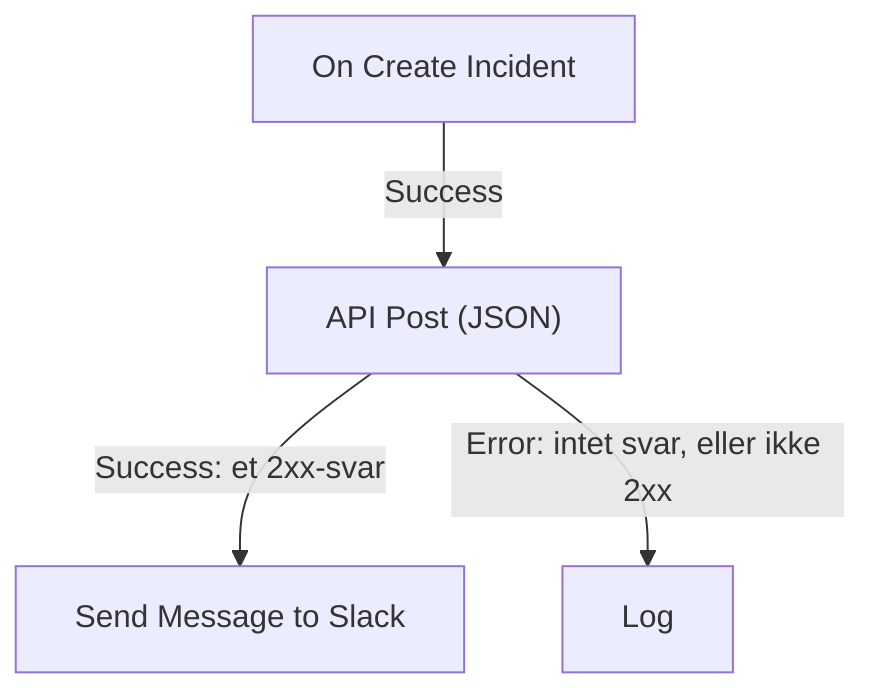

# Workflow-komponenter

Komponenter er de blokke, du tilføjer efter triggeren. Hver gør én ting — sender en besked, kalder en API, tjekker en betingelse, ændrer en OneUptime-post — og tager derefter en af sine udgange til de blokke, der er forbundet til den. Denne side er kataloget: hvad hver blok har brug for, hvad den returnerer, og hvornår den tager hver udgang.

Du får sjældent brug for at have den åben, mens du bygger. Hver bloks indstillinger slutter med **How to use**: hvad blokken gør, trinnene til at konfigurere den, et eksempel bygget ud fra dit eget workflow og de fejl, folk ofte laver. Se [Opret et workflow](/docs/workflows/authoring) om at tilføje og forbinde blokke.

:::cards
- [Send en besked](#slack): Slack, Microsoft Teams, Discord, Telegram, IRC og e-mail.
- [Kald en API](#api): Send en forespørgsel til enhver HTTP-API, og læs svaret.
- [Tilføj logik](#conditions): Forgren på en værdi, omform data, vent eller log.
- [Arbejd med OneUptime-poster](#oneuptime-datakomponenter): Find, opret, opdater og slet monitorer, hændelser og meget mere.
:::

## Hvilken komponent skal jeg bruge?

| For at…                                                       | Brug                                                              |
| ------------------------------------------------------------- | ----------------------------------------------------------------- |
| Poste i et chatværktøj                                        | [Slack](#slack), [Microsoft Teams](#microsoft-teams), [Discord](#discord), [Telegram](#telegram) eller [IRC](#irc) |
| Sende en e-mail gennem din egen mailserver                    | [Email](#email)                                                   |
| Kalde enhver anden API eller din egen tjeneste                | [API](#api)                                                       |
| Opsummere, klassificere eller skrive udkast til tekst         | [Generate Text with AI](#generate-text-with-ai)                   |
| Tage den ene eller den anden vej afhængigt af en værdi        | [Conditions](#conditions)                                         |
| Omforme data mellem to blokke                                 | [JSON](#json) eller [Custom Code](#custom-code)                   |
| Vente før den næste blok                                      | [Sleep](#sleep)                                                   |
| Starte et andet workflow                                      | [Execute Workflow](#execute-workflow)                             |
| Læse eller ændre hændelser, monitorer og andre poster         | [OneUptime-datakomponenter](#oneuptime-datakomponenter)           |

En dedikeret blok slår en generisk: Slack-blokken kender Slacks grænser, og en postblok kender postens felter, så du får tydeligere fejl og logs end fra en **API**-blok, der gør det samme arbejde.

## Sådan virker hver blok

En blok kører, når blokken før den tager den udgang, der er forbundet til den. Den læser sine indstillinger, gør sit arbejde og tager så en af sine udgange. Kun de blokke, der er forbundet til den udgang, kører bagefter.



- **Indstillinger** er det, du udfylder. Indstillinger mærket **(Valgfrit)** kan stå tomme. Mindre brugte indstillinger er foldet sammen under **Flere felter**.
- **Outputs** er punkterne på den nederste kant. De fleste blokke har **Success** og **Error**; [Conditions](#conditions) har **Yes** og **No**.
- **Returns** er de værdier, en blok giver videre til senere blokke, som en API's **Response Body**. En senere blok læser en med `{{local.components.<block ID>.returnValues.<value ID>}}`; knappen **{ }** i en indstilling indsætter den for dig. Se [Variabler](/docs/workflows/variables#komponent-output-data-fra-tidligere-blokke).

En blok, der tager **Error**, får ikke kørslen til at mislykkes: kørslen følger vejen **Error**, eller slutter der, hvis intet er forbundet til den. En påkrævet indstilling, der er efterladt tom, eller en indstilling, der aldrig kan virke, stopper derimod kørslen med en fejl.

## API

Lav en HTTP-forespørgsel til enhver URL. Der er én blok pr. metode: **API Get (JSON)**, **API Post (JSON)**, **API Put (JSON)**, **API Patch (JSON)** og **API Delete (JSON)**.

| Indstilling         | Hvad den gør                                                                                                                         |
| ------------------- | ------------------------------------------------------------------------------------------------------------------------------------ |
| **URL**             | Adressen, der skal kaldes, `http` eller `https`.                                                                                     |
| **Request Body**    | Den JSON, der skal sendes. Som regel er det kun `POST`-, `PUT`- og `PATCH`-forespørgsler, der har brug for en.                      |
| **Request Headers** | Headere, der skal sendes med, som en API-nøgle. Under **Flere felter**. Deres værdier er skjult i kørslens log.                      |

| Udgang      | Hvornår                                                                                        |
| ----------- | ---------------------------------------------------------------------------------------------- |
| **Success** | Serveren svarede med en 2xx-status.                                                            |
| **Error**   | Forespørgslen mislykkedes: serveren kunne ikke nås, eller den svarede med en anden status.     |

Uanset hvad returnerer blokken **Response Status**, **Response Headers** og **Response Body**, plus **Error** med årsagen, når den mislykkedes. Læs et felt i et JSON-svar ved at tilføje dets navn til referencen, som i `{{local.components.api-get-1.returnValues.response-body.id}}`.

Omdirigeringer følges ikke, så peg blokken på den adresse, der svarer. Forespørgsler sendes fra OneUptime: en URL, der peger på en privat netværksadresse, afvises, medmindre en administrator af en selvhostet installation tillader det, og kørslen stopper med årsagen. Se [Udgående netværksadgang](/docs/workflows/configuration#udgående-netværksadgang).

## AI

### Generate Text with AI

Generér ét tekstsvar ud fra en prompt og valgfri JSON-kontekst. Blokken bruger projektets standard-LLM-udbyder eller installationens globale udbyder, når projektet ikke har en. Udbydere konfigureres centralt under **Projektindstillinger → AI → LLM-udbydere**; deres nøgler og endpoints er aldrig indstillinger på blokken.

| Indstilling               | Hvad den gør                                                                                                                                                      |
| ------------------------- | ----------------------------------------------------------------------------------------------------------------------------------------------------------------- |
| **System Instructions**   | Valgfri vejledning om modellens rolle, tone og begrænsninger.                                                                                                    |
| **Prompt**                | Opgaven. Den sendes præcis, som du skriver den, så Markdown er fint, og den kan indeholde variabler og værdier fra tidligere blokke.                              |
| **Context**               | Valgfri JSON, du bevidst sender med. Den tilføjes efter en eksplicit markering for beskedens slutning og behandles som upålidelige data.                          |
| **Temperature**           | Under **Flere felter**. Variation fra `0` til `1`; standardværdien er `0.2`, for forudsigelig automatik. Nuværende Claude-modeller, Opus 4.7 og nyere og alle Claude 5-modeller, vælger selv deres sampling: OneUptime udelader **Temperature** fra deres forespørgsler, så den har ingen virkning på dem. |
| **Maximum Output Tokens** | Under **Flere felter**. Fra `1` til `4096`; standardværdien er `1024`.                                                                                           |

System Instructions, Prompt og den serialiserede Context er tilsammen begrænset til 50.000 tegn. Et billede, der er indlejret i dem som base64, som et skærmbillede fra en syntetisk monitor i en hændelses beskrivelse, erstattes af en kort note som `[image omitted: PNG, 340 KB]`, før de måles, fordi modellen læser tekst, ikke billeder. Kørslens log siger, hvad der blev udeladt. Forespørgslen til udbyderen varer højst 60 sekunder og forsøges én gang. Højst tre AI-forespørgsler fra workflows kan køre samtidig pr. projekt.

Den returnerer **Response** (den genererede tekst), **Provider** og **Model** (det, der svarede), **Total Tokens** og **Completion Tokens** (forbruget, som udbyderen rapporterede), **LLM Log ID** (kaldets post i AI-loggene) og **Error**.

Forbind **Success** til de blokke, der bruger svaret, og **Error** til en reserveløsning: fejl i validering, adgang, udbyder, budget, fakturering og timeout tager alle den vej. Blokken sender ingen værktøjer, så modellen kan ikke selv forespørge OneUptime, kalde API'er eller ændre data.

> [!WARNING]
> Modellens output er upålidelig tekst. Gennemgå det, før det når kunder, og lad aldrig fri AI-tekst alene afgøre en destruktiv handling. Se [AI-komponenter](/docs/workflows/configuration#ai-komponenter) for, hvad der sendes til udbyderen, hvad der logges, og hvad det koster.

## Slack

Post en besked i en Slack-kanal via en indgående webhook.

| Indstilling                    | Hvad den gør                                                                                                                                                                                                 |
| ------------------------------ | ------------------------------------------------------------------------------------------------------------------------------------------------------------------------------------------------------------ |
| **Slack Incoming Webhook URL** | Webhooken for den kanal, der skal postes i. Den skal begynde med `https://hooks.slack.com/services/`. Slacks vejledning til at [oprette en](https://api.slack.com/messaging/webhooks) tager et par minutter. |
| **Message Text**               | Teksten, der skal sendes. Den sendes præcis, som du skriver den, så brug Slacks egen formatering: `*bold*`, `_italic_`, `~strikethrough~` og `<https://example.com|a link>`. En tekst, der er længere end én Slack-sektion (3.000 tegn), sendes som flere; ud over ti sektioner afkortes den og slutter med "… (truncated — see OneUptime for the full text)". |

**Success** udløses, når Slack tog imod beskeden, og **Error**, når Slack afviste den, med Slacks årsag i **Error**. Disse blokke poster gennem webhooken i deres indstillinger, ikke gennem dit projekts Slack-forbindelse.

## Microsoft Teams

Post en besked i en Microsoft Teams-kanal. Blokken hedder **Send Message to Teams**.

| Indstilling                    | Hvad den gør                                                                                                                                                                                                                                  |
| ------------------------------ | --------------------------------------------------------------------------------------------------------------------------------------------------------------------------------------------------------------------------------------------- |
| **Teams Incoming Webhook URL** | Kanalens webhook, der skal postes til, en `https`-URL på `office.com`, `office365.com`, `logic.azure.com` eller `environment.api.powerplatform.com`. Microsofts vejledning viser, hvordan du [opretter en med Teams Workflows](https://support.microsoft.com/en-us/teams/apps-service/create-incoming-webhooks-with-workflows-for-microsoft-teams). |
| **Message Text**               | Teksten, der skal sendes. En besked, der er større, end en indgående webhook tager imod (cirka 12.000 tegn, målt som den sendes), afkortes og slutter med "… (truncated — see OneUptime for the full text)".                                    |

## Discord

Post en besked i en Discord-kanal via en indgående webhook.

| Indstilling                      | Hvad den gør                                                                                                                                       |
| -------------------------------- | -------------------------------------------------------------------------------------------------------------------------------------------------- |
| **Discord Incoming Webhook URL** | Kanalens webhook, en `https`-URL på `discord.com` eller `discordapp.com`.                                                                          |
| **Message Text**                 | Teksten, der skal sendes. En besked på mere end 2.000 tegn, Discords grænse, afkortes og slutter med "… (truncated — see OneUptime for the full text)". |

## Telegram

Send en besked til en Telegram-chat med en bot.

| Indstilling            | Hvad den gør                                                                                                                                       |
| ---------------------- | -------------------------------------------------------------------------------------------------------------------------------------------------- |
| **Telegram Bot Token** | Det token, BotFather gav din bot, som `123456789:ABCdef…`. Et token i enhver anden form stopper kørslen, uden at tokenet skrives i loggen.          |
| **Chat ID**            | Chatten, der skal postes i: dens ID, eller en kanals `@username`. Tilføj først botten til gruppen eller kanalen. For at skrive til en person skal personen have startet en chat med botten. |
| **Message Text**       | Teksten, der skal sendes. En besked på mere end 4.096 tegn, Telegrams grænse, afkortes og slutter med "… (truncated — see OneUptime for the full text)". |

Når Telegram afviser beskeden, udløses **Error** med Telegrams årsag.

## IRC

Post en besked i en IRC-kanal på et hvilket som helst IRC-netværk: Libera.Chat, OFTC eller din egen server. IRC har ingen webhooks, så blokken forbinder selv til serveren, går ind i kanalen, sender beskeden og forlader den igen.

| Indstilling      | Hvad den gør                                                                                                                                                                                                                                       |
| ---------------- | -------------------------------------------------------------------------------------------------------------------------------------------------------------------------------------------------------------------------------------------------- |
| **IRC Server**   | Serverens værtsnavn, som `irc.libera.chat`. Kun navnet: intet `ircs://` og ingen port.                                                                                                                                                             |
| **Channel**      | Kanalen, der skal postes i, som `#ops`. Det skal være en kanal: et kaldenavn, der skrives her, afvises i stedet for at få en privat besked.                                                                                                         |
| **Message Text** | Teksten, der skal sendes. Hver linje sendes som sin egen IRC-besked, og en lang linje deles, så den passer. En besked sendes som højst 15 IRC-linjer: en længere afkortes, og dens sidste linje siger det. IRC har ingen Markdown, så teksten sendes, som den er skrevet; IRC's egne formateringskoder, som fed og farver, virker. |

Under **Flere felter**:

| Indstilling                              | Hvad den gør                                                                                                                                                                                                       |
| ---------------------------------------- | ------------------------------------------------------------------------------------------------------------------------------------------------------------------------------------------------------------------ |
| **Nickname**                             | Hvem beskeden er fra. Standard er `OneUptime`. Er kaldenavnet optaget, prøver blokken det med en understregning eller et tal tilføjet, og derefter med et sådant tegn i stedet for de sidste tegn, til en server, der ikke tager et længere kaldenavn. |
| **Port**                                 | Serverens port. Standard er `6697`, eller `6667` med **Disable TLS** slået til.                                                                                                                                    |
| **Disable TLS**                          | Blokken forbinder over TLS og tjekker serverens certifikat. Slå dette til kun for en server, der ikke tilbyder TLS; en eventuel adgangskode sendes så ukrypteret. For at stole på et certifikat fra din egen certifikatudsteder sætter en selvhostet installation i stedet `NODE_EXTRA_CA_CERTS`. |
| **Channel Key**                          | Nøglen til en kanal, der har en (tilstand `+k`).                                                                                                                                                                   |
| **Send Without Joining**                 | Poster uden at gå ind i kanalen, så kanalen ikke ser blokken komme og gå. Virker kun, hvor kanalen tager imod beskeder udefra (ingen tilstand `+n`).                                                               |
| **Server Password**                      | En adgangskode, som serveren eller din bouncer beder om ved forbindelse.                                                                                                                                          |
| **SASL Username** og **SASL Password**   | Log ind på din konto på netværk, der bruger SASL, som Libera.Chat, der kræver det for forbindelser fra visse cloud- og VPN-adresser. Udfyld begge eller ingen.                                                     |

**Success** udløses, når serveren har taget imod hver linje. Blokken tjekker det ved at bede serveren om at svare på et ping efter den sidste linje: en server svarer i rækkefølge, så en eventuel afvisning af beskeden kommer først. En bouncer som ZNC svarer selv på pinget, så blokken lytter et sekund længere efter svaret fra netværket bag den.

**Error** udløses, når serveren ikke kan nås, afviser forbindelsen, kaldenavnet, en adgangskode eller kanalen, eller afviser beskeden. Den videregiver årsagen, med serverens egne ord, hvor den gav dem. En manglende **IRC Server**, **Channel** eller **Message Text**, eller en indstilling, der aldrig kunne virke, stopper derimod kørslen.

Hver kørsel af blokken er sin egen forbindelse, og IRC-netværk begrænser, hvor ofte én adresse må forbinde: en byge af beskeder kan afvises med en årsag som "Reconnecting too fast", og tager **Error** som enhver anden afvisning. For et workflow, der kan udløses mange gange i minuttet, så saml det, det har at sige, i én besked, eller send det gennem din egen server.

Opbevar adgangskoderne i [hemmelige globale variabler](/docs/workflows/variables#globale-variabler), og brug variablen i indstillingen; de er skjult i kørselsloggene under alle omstændigheder. Forbindelser til loopback- (`localhost`, `127.0.0.1`), link-local- og cloudmetadata-adresser afvises. I OneUptime Cloud afvises også en server på en privat netværksadresse eller et navn, der peger på en. Selvhostede installationer kan nå en IRC-server på deres eget netværk, medmindre `DATA_SOURCE_BLOCK_PRIVATE_ADDRESSES` er sat til `true`.

## Email

Send en e-mail gennem en SMTP-server, som du angiver på blokken. Blokken hedder **Send Email**.

| Indstilling                             | Hvad den gør                                                                                          |
| --------------------------------------- | ----------------------------------------------------------------------------------------------------- |
| **From Email**                          | Afsenderen, for eksempel `Alerts <alerts@company.com>`.                                               |
| **To Email**                            | Modtagerens adresse. Adskil flere adresser med kommaer eller semikoloner.                             |
| **Subject**                             | Emnelinjen.                                                                                           |
| **Email Body**                          | Beskeden, sendt som HTML.                                                                             |
| **SMTP HOST** og **SMTP Port**          | Den mailserver, der skal forbindes til.                                                               |
| **SMTP Username** og **SMTP Password**  | Valgfrie. Udfyld begge eller ingen.                                                                   |
| **Use Implicit TLS**                    | Slå til for implicit TLS, som regel på port 465. Lad den være slået fra for STARTTLS, som regel på port 587. |

**Success** udløses, når SMTP-serveren tog imod beskeden. **Error** udløses, når SMTP-værten afvises, serveren ikke kan nås, eller den afviser beskeden, og videregiver fejlmeddelelsen. En manglende **To Email**, **From Email**, **SMTP HOST** eller **SMTP Port** stopper derimod kørslen.

Blokken forbinder direkte til serveren i sine indstillinger. Den bruger ikke dit projekts [SMTP](/docs/emails/smtp)-indstillinger eller OneUptimes egen mailserver, og de e-mails, den sender, vises ikke i notifikationsloggene. For at tjekke, hvad den gjorde, ser du på workflowets [Kørsler](/docs/workflows/runs-and-logs).

Forbindelser til loopback- (`localhost`, `127.0.0.1`), link-local- og cloudmetadata-adresser afvises. I OneUptime Cloud afvises også en SMTP-vært på en privat netværksadresse eller et navn, der peger på en. Selvhostede installationer kan nå en mailserver på deres eget netværk, medmindre `DATA_SOURCE_BLOCK_PRIVATE_ADDRESSES` er sat til `true`. En afvist vært tager udgangen **Error**, og intet sendes.

## Custom Code

Kør et par linjer JavaScript, når de andre blokke ikke kan det, du har brug for. Blokken hedder **Run Custom JavaScript**.

| Indstilling         | Hvad den gør                                                                                                                         |
| ------------------- | ------------------------------------------------------------------------------------------------------------------------------------ |
| **JavaScript Code** | Din kode. Det, den returnerer med `return`, bliver blokkens **Value**. Den kan bruge `await`.                                       |
| **Arguments**       | Et JSON-objekt med værdier til koden, som læser dem som `args`. Sæt variabler og værdier fra tidligere blokke her; selve koden kan ikke læse dem. |

```json title="Arguments"
{ "title": "{{local.components.incident-on-create-1.returnValues.model.title}}" }
```

```javascript title="JavaScript Code"
const words = args.title.split(" ");

return {
  shortTitle: words.slice(0, 5).join(" "),
  wordCount: words.length,
};
```

En senere blok læser den korte titel som `{{local.components.javascript-1.returnValues.returnValue.shortTitle}}`.

Koden kører i en sandkasse med `args`, `console.log` (skrevet til kørslens log), `axios` til HTTP-forespørgsler, `crypto` og `sleep`. Den har intet filsystem og ingen proces, og dens forespørgsler er underlagt de samme adresseregler som API-blokken. Den har 5 sekunder som standard; en selvhostet installation ændrer det med `WORKFLOW_SCRIPT_TIMEOUT_IN_MS`.

**Success** udløses med den returnerede **Value**, og **Error**, når koden kaster en fejl eller løber tør for tid, med meddelelsen i **Error**. Til tungere scripts bruger du i stedet en [Runbook](/docs/runbooks/index).

## JSON

Konvertér mellem tekst og JSON, eller kombiner to JSON-objekter.

| Blok             | Tager                                    | Returnerer                                                                                                 |
| ---------------- | ---------------------------------------- | ---------------------------------------------------------------------------------------------------------- |
| **JSON to Text** | **JSON**, et objekt                      | **Text**: objektet som en streng. Praktisk, når den næste blok forventer tekst.                            |
| **Text to JSON** | **Text**, der kan fylde flere linjer     | **JSON**: det fortolkede objekt, så du kan læse dets felter. Brug den på JSON, der kom som tekst.          |
| **Merge JSON**   | **JSON 1** og **JSON 2**                 | **JSON**: ét objekt med nøglerne fra begge. Hvor begge har en nøgle, vinder **JSON 2**.                    |

**Text to JSON** tager **Error**, når teksten ikke er JSON. Et manglende input, eller et input til **Merge JSON**, der ikke er et objekt, stopper kørslen.

## Conditions

Forgren på en sammenligning. I panelet **Tilføj komponent** hedder denne blok **If / Else**, under **Popular**.

Dens indstillinger læses som en sætning: **Hvis** *værdi, der skal tjekkes* *sammenligning* *værdi, der sammenlignes med*, fortsæt på **Yes**, ellers på **No**. Under indstillingerne læses betingelsen tilbage med ord, så du kan se, at den siger det, du mener. På lærredet viser blokken også sin betingelse, for eksempel *Hvis environment is equal to “production”*.

| Indstilling        | Hvad den gør                                                                                                                             |
| ------------------ | ---------------------------------------------------------------------------------------------------------------------------------------- |
| **Value to check** | Som regel en værdi fra en tidligere blok. Tryk på **{ }** i feltet for at vælge en, eller skriv `{{`.                                    |
| **Comparison**     | Hvordan der sammenlignes, med ord. Sammenligningerne står nedenfor.                                                                      |
| **Compare with**   | Det, der sammenlignes med, skrevet eller valgt på samme måde. **er tom**, **er ikke tom**, **is true** og **is false** bruger det ikke.   |
| **Compare as**     | Foldet væk under sammenligningen: **Text**, **Tal** eller **True / False**. Vælg **Text** for at sortere datoer skrevet `2026-10-01`, eller **Tal** for at gøre `200` og `200.0` ens. |

Sammenligningerne:

- **is equal to** og **is not equal to**;
- for tekst: **indeholder**, **indeholder ikke**, **starter med** og **slutter med**;
- for tal: **er større end**, **is greater than or equal to**, **er mindre end** og **is less than or equal to**;
- **er tom** og **er ikke tom**, som tjekker, om værdien overhovedet er der;
- **is true** og **is false**.

Talsammenligningerne sammenligner tal, og tekstsammenligningerne sammenligner tekst, så du har sjældent brug for **Compare as**. Sådan sammenlignes værdierne:

- Som tekst tæller store bogstaver: `Error` er ikke `error`.
- Som tal tæller tekst, der ikke er et tal, som `0`. Indstillingerne gør opmærksom på en sådan skrevet værdi.
- Som sand eller falsk tæller kun `true` som sand.
- **er tom** opfyldes af slet ingenting, blank tekst, en tom liste eller et tomt objekt, eller en værdi, som den tidligere blok ikke havde, som et felt, webhooken ikke sendte. `0` og `false` er værdier, så de er ikke tomme.

**Yes** kører, når betingelsen er opfyldt, og **No**, når den ikke er. Blokke, der blev sat op, før indstillingerne havde disse navne, kører præcis som før. Et gammelt valg tilbydes ikke længere: at sammenligne en værdi som **Null** eller **Undefined**, hvilket ignorerede, hvad værdien indeholdt. En blok, der stadig bruger det, siger det, når du åbner den; vælg **er tom** for at tjekke for en manglende værdi.

## Sleep

Sæt kørslen på pause før den næste blok, for at give et andet system et øjeblik til at indhente sig eller for at følge op senere.

**Days**, **Hours**, **Minutes** og **Seconds** lægges sammen. Den længste ventetid er 30 dage: en længere afkortes til 30 dage, og kørslens log siger det.

Mens den venter, lægges kørslen til side med status **Venter** og samles op igen, når tiden er gået, så en lang ventetid holder intet op. En kørsel, hvis workflow i mellemtiden blev slået fra eller arkiveret, annulleres, når den vågner.

## Log

Skriv en værdi til kørslens log. Den ændrer intet andet sted, hvilket gør den til den nemmeste måde at se, hvad en værdi indeholdt.

**Value** er det, der skal skrives. Den kan fylde flere linjer og indeholde værdier fra tidligere blokke, som `{{local.components.webhook-1.returnValues.request-body}}`. Blokken tager **Out**, når den er færdig.

## Execute Workflow

Start et andet workflow i samme projekt. Dit workflow fortsætter uden at vente på, at det andet bliver færdigt.

| Indstilling   | Hvad den gør                                                                                                                              |
| ------------- | ----------------------------------------------------------------------------------------------------------------------------------------- |
| **Workflow**  | Det workflow, der skal startes. Det skal være aktiveret og, for at modtage argumenter, have en **Manual**-trigger.                        |
| **Arguments** | JSON, der skal sendes med. Det andet workflows Manual-trigger giver hver nøgle videre som en værdi for sig: med `{"customerId": "42"}` læser det `{{local.components.manual-1.returnValues.customerId}}`. |

**Out** udløses, så snart det andet workflow står i kø. **Error** udløses, når det ikke kan: det findes ikke, er slået fra eller arkiveret, eller at starte det ville give en løkke.

Brug det til at dele fælles logik: byg et «post i hændelseskanalen»-workflow én gang, og start det fra hvert workflow, der har brug for det. En kæde af workflows, der starter hinanden, kan ikke gå i ring tilbage til sig selv og er højst 10 led dyb. Se [Konfiguration og sikkerhed](/docs/workflows/configuration#grænse-for-at-kalde-andre-workflows).

## OneUptime-datakomponenter

For hver slags post i OneUptime (monitorer, hændelser, advarsler, statussider, vagtpolitikker og mange flere) har panelet **Tilføj komponent** disse komponenter: under **OneUptime resources** klikker du på posttypen (**Browse all resources** har dem, der ikke vises), eller du søger på typens navn. Hver titel genereres ud fra posttypen, så sættet for Monitor lyder:

| Komponent                | Hvad den gør                                                                   |
| ------------------------ | ------------------------------------------------------------------------------ |
| **Find One Monitor**     | Læser én post, der matcher forespørgslen.                                      |
| **Find Many Monitors**   | Læser en liste af poster, der matcher forespørgslen.                           |
| **Create One Monitor**   | Tilføjer én post ud fra et JSON-objekt.                                        |
| **Create Many Monitors** | Tilføjer flere poster ud fra et JSON-array.                                    |
| **Update One Monitor**   | Anvender de data, der skal skrives, på én matchende post.                      |
| **Update Many Monitors** | Anvender de data, der skal skrives, på matchende poster, op til **Limit**.     |
| **Delete One Monitor**   | Sletter én matchende post.                                                     |
| **Delete Many Monitors** | Sletter matchende poster, op til **Limit**.                                    |

Det samme sæt giver dig tre triggere — **On Create Monitor**, **On Update Monitor** og **On Delete Monitor**. Se [Triggere](/docs/workflows/triggers#oneuptime-begivenhedstriggere).

En type tilbyder kun de komponenter, dens model tillader. En skrivebeskyttet type har de to Find-komponenter og intet andet, så finder du ikke **Delete One Monitor** i panelet, tillader den type det ikke.

Sådan læser og ændrer et workflow OneUptime-data. For eksempel kan en webhook fra dit CI-værktøj bruge **Create One Incident** til at åbne en hændelse med detaljerne om fejlen.

Disse komponenter handler som Project Admin for workflowets projekt: det, en Project Admin ikke må, eller som dit abonnement ikke omfatter, afvises, og kørslens log siger hvorfor. Se [Hvad workflow-trin må gøre](/docs/workflows/configuration#hvad-workflow-trin-må-gøre).

### Erklær en hændelse ud fra en skabelon

**Create One Incident** kan erklære hændelsen ud fra en af dine [hændelsesskabeloner](/docs/incidents/settings#hændelsesskabeloner): vælg den under **Incident Template**, trinnets første indstilling. Skabelonen udfylder alle de felter, som **JSON Object** udelader — titlen, beskrivelsen, alvorligheden, starttilstanden, monitorerne og andre ressourcer, vagtpolitikkerne, etiketterne, statussiderne og de brugerdefinerede felter — og dens ejere bliver hændelsens ejere. Alt, hvad du angiver i **JSON Object**, går forud for skabelonens, også tilstanden, så med en valgt skabelon behøver **JSON Object** kun det, der skal være anderledes, og kan stå tomt.

Hændelsen registrerer den skabelon, den blev erklæret ud fra, i `createdIncidentTemplateId`. Den kolonne sætter OneUptime selv: et trin, der sender den i **JSON Object**, afvises, og dets kørselslog henviser dig til **Incident Template**. En skabelon fra et andet projekt, eller en, der er slettet, får trinnet til at tage sin udgang **Error**, og på et abonnement, der ikke omfatter hændelsesskabeloner, afvises trinnet med det abonnement, der kræves. Se [Sådan anvendes en skabelon](/docs/incidents/settings#sådan-anvendes-en-skabelon).

## Arbejd med poster

Hvert felt på en datakomponent bruger postens egne **kolonne**navne — de samme navne som API'et, ikke etiketterne i dashboardets formular. ID-kolonnen er `_id`. Stavemåden `id` accepteres som alias overalt, hvor du kan skrive et kolonnenavn, men `_id` er det, en post returnerer, så det er det, du skal læse på vej ud:

```json
{ "_id": "00000000-0000-0000-0000-000000000000" }
```

**Query** afgør, hvilke poster komponenten arbejder på. Nøgler er kolonner, værdier er det, der skal matches:

```json
{ "monitorType": "Website", "isEnabled": true }
```

En forespørgsel er altid begrænset til det projekt, workflowet kører i. Du kan ikke nå et andet projekts poster, og du behøver ikke selv tilføje projektet til forespørgslen.

**JSON Object** på Create One, **JSON Array** på Create Many og **Data (JSON Object)** på Update-komponenterne bærer de felter, der skal skrives, med de samme nøgler:

```json
{ "name": "Checkout API", "monitorType": "Website" }
```

En nøgle, der ikke er en kolonne, ignoreres i stedet for at blive afvist — kørslens log nævner dem, der blev droppet, så kig der, når et felt ikke lander. **Select Fields**, på Find-komponenterne og triggerne, bruger de samme kolonnenøgler med værdien `true`: `{"_id": true, "name": true}`.

**Brugerdefinerede felter** er én kolonne, `customFields`, der rummer hvert brugerdefineret felts værdi under feltets navn. Update-komponenterne ændrer kun de brugerdefinerede felter, du nævner, og alle andre beholder deres værdi:

```json
{ "customFields": { "Notification Count": 1 } }
```

sætter **Notification Count** og lader postens andre brugerdefinerede felter være, som de var. Sæt et brugerdefineret felt til `null` for at rydde det, eller sæt selve `customFields` til `null` for at rydde dem alle. To workflows, der opdaterer forskellige brugerdefinerede felter på samme post i samme øjeblik, lander begge. Det gælder kun Update-komponenterne: OneUptime-API'et skriver `customFields` i sin helhed, så en forespørgsel til det skal have hvert brugerdefineret felt med, du vil beholde.

Du skriver sjældent disse nøgler selv. I komponentens indstillinger viser **Add a field** (eller **Add a condition** på en forespørgsel) modellens kolonner ved navn, med den slags værdi, hver tager. Søg ved navn, ved kolonnenøgle eller ved det, feltet gør, og tryk på **Enter** for at tilføje det bedste match. Ved oprettelse kommer de felter, posten ikke kan oprettes uden, først, derefter modellens hovedfelter (dem, den selv udfylder, hvis du udelader dem) og så resten.

Felter, som OneUptime selv udfylder, tilbydes ikke, når du skriver en post: postens `_id`, **Oprettet den**, **Opdateret den**, **Created by User**, slugs, postnumre og notifikationsstatusser. Hvem der oprettede, arkiverede eller løste en post, og hvornår, er aldrig et workflows at sætte: en post, som et workflow opretter, er oprettet af ingen, en værdi, et workflow sender for et af de felter ved siden af andre felter, ignoreres, og en Update, der ikke sender andet, mislykkes med en meddelelse, der nævner dem. En opdatering tilbyder kun felter, der kan ændres, efter at en post findes. En forespørgsel tilbyder stadig ID'et, tidsstemplerne og **Created by User**, fordi de er nyttige at filtrere på. **Deleted At** tilbydes ingen steder: poster slettes helt, så det er altid tomt.

**Skip** og **Limit** er to talfelter på Find Many, Update Many og Delete Many, under **Flere felter** — `Skip: 0` med `Limit: 100` tager de første hundrede match. **Limit** er som standard `10`, og på Update Many og Delete Many begrænser den, hvor mange poster der faktisk skrives, ikke kun hvor mange der kommer tilbage. Så `Items Deleted: 10` betyder, at ti poster blev slettet, ikke at ti matchede. Hæv **Limit**, når du vil ændre mere end ti.

**Success** og **Error** siger, om forespørgslen kørte, ikke hvad den fandt. En forespørgsel, der ikke matcher noget, returnerer `0` og går stadig ud via **Success** — det er ikke en fejl. For at forgrene på, om noget matchede, læser du det returnerede antal i en **If / Else**-blok.

## Næste trin

:::cards
- [Variabler](/docs/workflows/variables): Send værdier mellem blokke, og hold hemmeligheder ude af dem.
- [Kørsler](/docs/workflows/runs-and-logs): Se, hvad hver blok modtog og returnerede i en kørsel.
- [Konfiguration og sikkerhed](/docs/workflows/configuration): Grænser, tilladelser og hvad trin må.
:::
