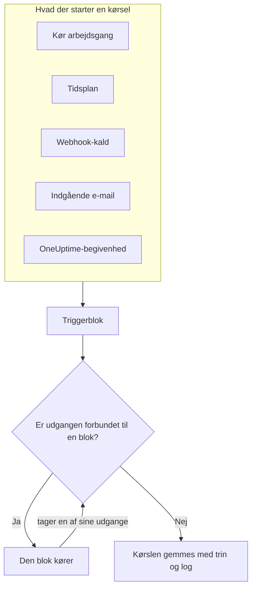
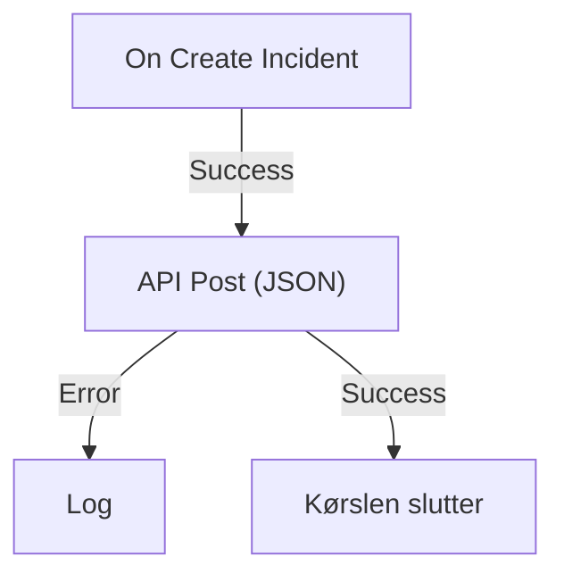

# Workflows – Oversigt

Workflows automatiserer arbejde i OneUptime uden kode. Du sætter blokke på et lærred, forbinder dem, og workflowet kører af sig selv, hver gang dets trigger udløses: en hændelse oprettes, en tidsplan er nået, et andet værktøj kalder en URL, eller der kommer en e-mail. Brug dem til at forbinde OneUptime med resten af din stak og til at tage dig af den rutinemæssige opfølgning, mens du arbejder på selve problemet.

:::cards
- [Opret et workflow](/docs/workflows/authoring): Opret et workflow, og tilføj, forbind og konfigurer derefter blokkene på lærredet.
- [Triggere](/docs/workflows/triggers): Start et workflow manuelt, efter en tidsplan, fra en webhook, en e-mail eller en OneUptime-begivenhed.
- [Komponenter](/docs/workflows/components): Alle de blokke, du kan tilføje, fra API-kald til OneUptime-poster.
- [Kørsler](/docs/workflows/runs-and-logs): Se, hvad hver kørsel gjorde, trin for trin.
:::

## Sådan virker et workflow

Hvert workflow har tre dele:

1. **En trigger** — det, der starter workflowet: en manuel kørsel, en tidsplan, et webhook-kald, en indgående e-mail eller en begivenhed i OneUptime, som en ny hændelse. Hvert workflow har præcis én.
2. **Komponenter** — det, workflowet gør: sende en besked, kalde en API, tjekke en betingelse, oprette eller opdatere en OneUptime-post.
3. **Forbindelser** — de linjer, du trækker fra én blok til den næste. De afgør, hvad der kører efter hvad.

Når triggeren udløses, starter OneUptime en **kørsel**. Hver blok slutter med at tage en af sine udgange, som **Success** eller **Error**, **Yes** eller **No**, og kun de blokke, der er forbundet til den udgang, kører bagefter. Er der ingen blok forbundet til den udgang, en blok tog, slutter den vej der. Kørslen gemmes med sin status, den vej, den tog, og det, hver blok modtog og returnerede.



Du bygger det hele visuelt på et lærred. De fleste workflows kræver ingen kode overhovedet; når et gør, kører en **Run Custom JavaScript**-blok et par linjer JavaScript.

## Hvad du kan bruge workflows til

- **Forbind OneUptime med dine andre værktøjer** — post i Slack, Microsoft Teams, Discord, Telegram eller IRC, opret Jira-sager, eller send en forespørgsel til enhver API i din stak.
- **Reager på det, der sker i OneUptime** — når en hændelse oprettes, så giv den rigtige kanal besked og åbn automatisk en sag.
- **Kør job efter en tidsplan** — hvert femte minut, hver nat, hver mandag morgen.
- **Modtag data udefra** — lad andre systemer starte et workflow ved at kalde dets URL eller skrive til dets e-mailadresse.
- **Genbrug fælles automatik** — byg den én gang, og start den fra ethvert andet workflow med en **Execute Workflow**-blok.

## Vigtige begreber

| Begreb                 | Hvad det betyder                                                                                                   |
| ---------------------- | ------------------------------------------------------------------------------------------------------------------ |
| **Workflow**           | Hele automatikken: et navn, et lærred med blokke og en kontakt til at slå det til og fra.                         |
| **Trigger**            | Den første blok. Den afgør, hvornår workflowet kører. Hvert workflow har præcis én.                               |
| **Komponent**          | Enhver anden blok: den sender en besked, laver en forespørgsel, tjekker en betingelse eller ændrer en post.        |
| **Udgang**             | Et punkt nederst på en blok, som **Success** eller **Error**. Linjer derfra fører til de næste blokke.             |
| **Kørsel**             | Én kørsel af workflowet, gemt med status, tidsstempler og det, hver blok gjorde.                                   |
| **Global variabel**    | En værdi, som en API-nøgle, du gemmer én gang og bruger i alle projektets workflows.                              |

## Før du starter

- **Et abonnement, der omfatter workflows.** I OneUptime Cloud kræver workflows abonnementet **Growth** eller højere, og hvert abonnement tillader et antal kørsler hver 30. dag — se [Plangrænser](/docs/workflows/configuration#plangrænser). Selvhostede installationer uden fakturering har ingen af grænserne.
- **Tilladelse til at bygge.** At oprette og ændre workflows kræver **Workflow Admin**, **Project Admin** eller **Project Owner**, eller en brugerdefineret rolle med de tilsvarende tilladelser. Et **Workflow Member** kan åbne workflows og køre dem manuelt, men ikke ændre dem. Se [Tilladelser](/docs/workflows/configuration#tilladelser).

## Hvor du finder workflows i OneUptime

Åbn **Produkter** i topbjælken, og vælg **Arbejdsgange** under **Dashboards og automatisering**. Dens menu indeholder:

- **Arbejdsgange** — din liste over workflows. Opret et nyt, eller åbn et eksisterende.
- **Globale variabler** — værdier, som alle dine workflows deler.
- **Protokoller → Kørsler** — kørselshistorikken for alle workflows i dit projekt.
- **Indstillinger → Etiketregler** og **Ejerregler** — sæt automatisk etiketter på nye workflows, og tildel deres ejere.
- **Avanceret → Arkiveret** — workflows, du har arkiveret. De kører aldrig og er udeladt af listen; fjern dem fra arkivet her. Se [Arkivér et workflow](/docs/workflows/configuration#arkivér-et-workflow).
- **Udvikler** — sådan administrerer du workflows med Terraform, API'et eller en AI-assistent.

Åbn et enkelt workflow, og dets egen menu indeholder:

- **Oversigt** — navn, beskrivelse, etiketter og kontakten **Aktiveret**.
- **Bygger** — lærredet, hvor du designer workflowet, med kontakten **Aktiveret** øverst.
- **Arbejdsgangsvariabler** — værdier, der kun gælder dette ene workflow.
- **Protokoller → Kørsler** — hver kørsel af dette workflow, med detaljer.
- **Ejere** — de personer og teams, der er ansvarlige for workflowet.
- **Udvikler** — sådan administrerer du dette workflow med Terraform, API'et eller en AI-assistent.
- **Indstillinger** — duplikér, eksportér og arkivér.

**Indstillinger** ligger i menuens sektion **Avanceret** sammen med **Auditlogs** og **Slet arbejdsgang**. **Avanceret** og **Udvikler** starter sammenfoldet, i denne menu og i alle andre, så de sider, du bruger hver dag, kommer først. Klik på en sektions navn for at vise dens sider. Den folder sig selv ud, når du er på en af dem.

## Byg dit første workflow

Hvert workflow bliver til på samme måde:

:::steps
1. **Opret** — vælg et udgangspunkt, og giv så dit workflow et navn. Se [Opret et workflow](/docs/workflows/authoring).
2. **Vælg en trigger** — manuel, planlagt, webhook, indgående e-mail eller en begivenhed fra OneUptime. Se [Triggere](/docs/workflows/triggers).
3. **Tilføj komponenter** — sæt handlinger på lærredet, og forbind dem. Se [Komponenter](/docs/workflows/components).
4. **Slå det til** — slå **Aktiveret** til øverst i **Bygger**. Et deaktiveret workflow kan slet ikke køre, heller ikke manuelt.
5. **Test** — klik på **Kør arbejdsgang** i **Bygger**, og følg kørslen, mens den sker.
:::

Eksemplet nedenfor følger disse trin for et rigtigt workflow.

## Eksempel: send nye hændelser til en webhook

Dette workflow sender et JSON-resumé af hver ny hændelse til en URL, du vælger — et sagssystem, et datavarehus, alt, der tager imod en webhook — og skriver årsagen i kørslens log, når forespørgslen mislykkes.



> [!TIP]
> Skabelonen **Forward new incidents to another system** bygger det samme workflow for dig. Du finder den under **Hændelser**, når du opretter et workflow.

:::steps
### Opret workflowet

Åbn **Arbejdsgange**, og klik på **Opret arbejdsgang**. Klik på **Start fra bunden**, giv workflowet navnet `Send new incidents to a webhook`, og klik på **Opret arbejdsgang**.

Det nye workflow åbner i **Bygger**, slået fra.

### Tilføj triggeren

Klik på den stiplede blok **Choose what starts this workflow**, og klik så på **On Create Incident** under **Popular** i panelet **Add Trigger**.

Triggeren tager den stiplede bloks plads. ID'et på den, `incident-on-create-1`, er det, senere blokke henviser til den med.

### Vælg hændelsens felter

Klik på triggeren. Under **Select Fields** sætter du flueben ved de felter, forespørgslen skal have med, som titlen og beskrivelsen, og klikker på **Gem**.

Triggeren sender den nye hændelse videre med disse felter. Et felt, du ikke vælger, kommer tomt frem.

### Tilføj API-blokken

Klik på **Tilføj komponent**, og klik så på **API Post (JSON)** under **Popular**. Træk fra triggerens punkt **Success** ned til det øverste punkt på den nye blok.

### Udfyld forespørgslen

Klik på API-blokken, hvor der står **Click to set up**. Skriv dit endpoint i **URL**. Skriv i **Request Body** det JSON, der skal sendes, brug **{ }** til at indsætte hændelsens felter, hvor du har brug for dem, og klik på **Gem**.

```json title="Request Body"
{
  "id": "{{local.components.incident-on-create-1.returnValues.model._id}}",
  "title": "{{local.components.incident-on-create-1.returnValues.model.title}}",
  "description": "{{local.components.incident-on-create-1.returnValues.model.description}}"
}
```

Hver `{{…}}`-reference erstattes med hændelsens værdi, når workflowet kører. Se [Variabler](/docs/workflows/variables) for syntaksen.

### Fang fejl

Klik på **Tilføj komponent**, og klik så på **Log**. Forbind API-blokkens punkt **Error** til den, og sæt Log-blokkens **Value** til `Could not send the incident: {{local.components.api-post-1.returnValues.error}}`.

En forespørgsel, der mislykkes — en URL, der ikke kan nås, eller et svar, der ikke er 2xx — tager nu denne vej, og kørslens log siger hvorfor.

### Slå det til

Slå **Aktiveret** til øverst i **Bygger**.

### Test det

Klik på **Kør arbejdsgang**, indtast **Hændelses-ID** for en hændelse i dette projekt, klik på **Run Workflow Manually**, og bekræft med **Run**.

Et panel **Arbejdsgangskørsel** åbner og følger kørslen. Åbn trinnet **API Post (JSON)** for at se den body, det sendte, og det svar, det fik.
:::

Fra nu af starter hver ny hændelse i projektet en kørsel. Du finder dem alle under workflowets [Kørsler](/docs/workflows/runs-and-logs).

> [!NOTE]
> Forespørgslen sendes fra OneUptime. I OneUptime Cloud skal URL'en kunne nås fra internettet. En selvhostet installation afviser private netværksadresser, medmindre en administrator tillader dem — se [Udgående netværksadgang](/docs/workflows/configuration#udgående-netværksadgang).

## Sådan passer workflows ind i resten af OneUptime

- **Monitorer** opdager problemet. **Hændelser** og **advarsler** registrerer det. **Workflows** reagerer på det.
- **Runbooks** er beredskabsprocedurer, dit team gennemgår ved en hændelse, en advarsel eller en vedligeholdelse: manuelle trin, godkendelser og scripts, med mennesker involveret. Workflows kører uden opsyn. Brug en [runbook](/docs/runbooks/index), når en person skal træffe beslutninger undervejs, og et workflow, når hvert trin er automatisk.
- **Arbejdsområdeforbindelser** forbinder et projekt med Slack og Microsoft Teams til hændelseskanaler og notifikationer. Workflowenes Slack- og Microsoft Teams-blokke bruger dem ikke: hver blok poster via sin egen indgående webhook-URL.

## Næste trin

:::cards
- [Opret et workflow](/docs/workflows/authoring): Arbejd med lærredet, blokkene og deres indstillinger.
- [Variabler](/docs/workflows/variables): Send data mellem blokke, og hold hemmeligheder ude af dine workflows.
- [Konfiguration og sikkerhed](/docs/workflows/configuration): Tilladelser, grænser og sikkerhed, før du går live.
:::
