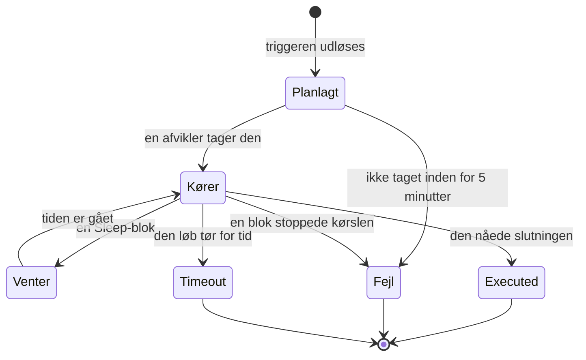

# Workflow-kørsler

Hver gang et workflow kører, gemmer OneUptime en registrering af, hvad der skete — hvornår det kørte, om det lykkedes, og hvad hver blok modtog og returnerede. Den registrering hedder en **kørsel**. Med kørsler bekræfter du, at et workflow virkede, finder fejl i et, der ikke gjorde, og ser tilbage på tidligere aktivitet.

:::cards
- [Status for en kørsel](#status-for-en-kørsel): Hvad Planlagt, Venter, Executed og de andre statusser betyder.
- [Læs en kørsel](#læs-en-kørsel): Følg den vej, en kørsel tog, blok for blok.
- [Fejlfinding](#fejlfinding): Et workflow, der ikke kørte, en blok, der aldrig kørte, en værdi, der kom tom frem.
:::

## Hvor du finder dem

| Side                                                 | Hvad du ser                                                                                        |
| ---------------------------------------------------- | -------------------------------------------------------------------------------------------------- |
| **Arbejdsgange → Protokoller → Kørsler**             | Hver kørsel af hvert workflow i projektet. Filtrer på workflownavn, status og tid.                 |
| **Arbejdsgang → Protokoller → Kørsler**              | Kun dette ene workflows kørsler. Her er der et filter **Kørsels-ID** i stedet for et workflowfilter. |
| **En enkelt kørsel**                                 | Åbnes med knappen **Vis logge** på en kørsels række — selve rækkerne kan ikke klikkes.             |

Starter du en kørsel fra **Bygger**, åbner den samme visning **Arbejdsgangskørsel**, som allerede følger kørslen, så du kan se den ske i stedet for at skulle lede efter den bagefter.

## Status for en kørsel

| Status                              | Hvad den betyder                                                                                                                                                                                                                                                      |
| ----------------------------------- | --------------------------------------------------------------------------------------------------------------------------------------------------------------------------------------------------------------------------------------------------------------------- |
| **Planlagt**                        | Triggeren blev udløst, og kørslen står i kø til en afvikler. Som regel en brøkdel af et sekund. En kørsel, der stadig er planlagt efter 5 minutter, mislykkes: intet tog den.                                                                                         |
| **Kører**                           | Workflowet er i gang.                                                                                                                                                                                                                                                 |
| **Venter**                          | Kørslen holder ved en **Sleep**-blok og fortsætter af sig selv. Den optager ingen worker, mens den venter.                                                                                                                                                           |
| **Executed**                        | Kørslen nåede slutningen uden at mislykkes. Det er successtatussen: pillen siger **Executed**, ikke «Lykkedes».                                                                                                                                                       |
| **Fejl**                            | En blok stoppede kørslen. Bruges også, når en kørsel i kø aldrig bliver taget, når genoptagelsen af en sovende kørsel går tabt, når et tidsplanudtryk ikke kan opløses, og når workflowet blev slået fra eller arkiveret, mens kørslen ventede ved en **Sleep**-blok. |
| **Timeout**                         | Kørslen tog længere tid end tilladt: 2 minutter som standard. Se [Hvor længe en kørsel må tage](/docs/workflows/configuration#hvor-længe-en-kørsel-må-tage).                                                                                                             |
| **Execution Exceeded Current Plan** | Projektet har brugt sine workflowkørsler for de seneste 30 dage, eller abonnementet er ubetalt. Kørslen registreres, men udføres ikke. Kun OneUptime Cloud.                                                                                                         |

En blok, der tager sin udgang **Error** — en API-blok, der fik en 4xx, for eksempel — får ikke kørslen til at mislykkes. De blokke, der er forbundet til **Error**, kører, og kørslen slutter stadig som **Executed**. Selve trinnet tegnes med rødt, så du kan finde det.

## Læs en kørsel

Klik på **Vis logge** på en kørsel for at åbne den. Visningen **Arbejdsgangskørsel** har to faner, **Trin** og **Full Log**.

### Fanen Trin

Den vej, kørslen tog, med ét nummereret kort pr. blok, i den rækkefølge, de kørte. Uden at åbne noget viser hvert kort:

- Blokkens titel og ID, om den **Lykkedes** eller **Mislykkedes**, og hvor lang tid den tog.
- Hvilken udgang den tog, med det navn, lærredet giver den, og hvor den førte hen: det næste trins nummer og navn, eller en note om, at intet er forbundet til den, så kørslen eller den gren sluttede dér. Et trin, den førte til, men som aldrig kørte, siger **(did not run)**. Udgangen Error tegnes med rødt; Yes og No er bare den vej, kørslen gik. Hold musen over udgangens navn for at se, hvad den betyder.
- Trinnets fejl, hvis det mislykkedes, og eventuelle advarsler om det — for eksempel en `{{…}}`-reference, der blev opløst til ingenting.

Åbn et kort for at se to blokke med detaljer:

| Blok         | Hvad den viser                                                                                                                                                                                                  |
| ------------ | --------------------------------------------------------------------------------------------------------------------------------------------------------------------------------------------------------------- |
| **Received** | De indstillinger, blokken fik, ved navn og i den rækkefølge, dens indstillingsliste har dem, efter at alle variabler blev udfyldt. En indstilling, der henviser til et andet trin eller en variabel, viser referencen ved siden af den værdi, den blev til, og **Did not resolve**, når den blev til ingenting. |
| **Returned** | Det, den producerede, med hver værdis ID (den sidste del af en `returnValues`-reference). Lister og objekter vises med indrykning.                                                                              |

Mislykkede trin, trin med en advarsel og en kørsels eneste trin starter åbne. Fanen **Trin**s tæller bliver rød, når noget mislykkedes, og orange, når et trin har en advarsel.

Nogle få kørsler læses anderledes:

- **En test af ét trin.** En kørsel, der blev startet med **Run just this step**, siger **Only this step ran** øverst. Trinnene før det kørte ikke, så værdier, det læser fra dem, mangler (forvent en advarsel **Did not resolve** for dem), og trinnene efter det siger **(not run in this test)**. Brug **Kør arbejdsgang** til at prøve hele vejen.
- **En kørsel, der stoppede mellem trin.** Stoppede kørslen af en grund, som intet trin forklarer — den løb tør for tid mellem to trin, eller den mislykkedes før sit første trin —, slutter vejen med **The run stopped here** og årsagen.
- **En sovende kørsel.** En kørsel, der venter ved en **Sleep**-blok, slutter med **Sleeping** og det tidspunkt, hvor den fortsætter af sig selv; trinnene efter Sleep siger **(not run yet)**.

ID'et under hvert trins titel er præcis det, der skal stå i en `{{local.components.<id>.returnValues.…}}`-reference, hvilket gør dette til den hurtigste måde at få en reference rigtig på.

De viste værdier er det, blokken modtog, efter at variablerne blev udfyldt, og før blokken gjorde noget med dem, med to undtagelser: hemmeligheder og felter, som blokken markerer som følsomme, skjules, og en værdi på mere end 4.000 tegn afkortes med "… (truncated)". En kørsel beholder sine seneste 100 trin; en lang eller ofte genoptaget kørsel viser en orange note dér, hvor de tidligere blev droppet. Kørsler, der blev registreret, før udgangenes navne blev gemt, viser udgangen ved sit ID, uden hvor den førte hen.

### Fanen Full Log

Den rå log linje for linje, som afvikleren skrev, inklusive alt, hvad blokkene selv logede, som en **Log**-bloks værdi eller et scripts `console.log`. Brug den, når fanen Trin ikke forklarer fejlen.

## Kopiér og download en kørsel

Øverst i visningen **Arbejdsgangskørsel**, ved siden af lukkeknappen, lægger **Kopiér log** hele **Full Log** på din udklipsholder, klar til at indsætte i en chat eller en sag. **Download** gemmer kørslen som en fil:

| Download                                | Det får du                                                                                                                                                                                                                             |
| --------------------------------------- | -------------------------------------------------------------------------------------------------------------------------------------------------------------------------------------------------------------------------------------- |
| **Download log**                        | En `.txt`-fil med hele loggen, præcis som afvikleren skrev den, uanset længde, under en kort overskrift: workflowets navn og ID, kørslens ID, dens status, og hvornår den blev planlagt, startede og blev færdig.                       |
| **Download kørsel som JSON**            | En `.json`-fil med de samme oplysninger som data, de trin, som fanen **Trin** viser (hvad hvert trin modtog og returnerede, og hvilken udgang det tog), og loggen som en liste af linjer. Trinnene har samme form, som API'et returnerer en kørsels `stepTrace` i, og som i fanen **Trin** er det kørslens seneste 100. Loggen er altid komplet. |

De samme to downloads findes i menuen **⋯** for hver kørsel i begge lister over kørsler, så du kan gemme en kørsel uden at åbne den. En kørsel, du startede fra **Bygger**, kan kopieres eller downloades, mens den stadig er i gang; du får det, den har logget indtil da.

Filerne navngives efter workflowet, kørslen og hvornår den startede, i UTC, så en mappe med dem sorteres efter workflow og derefter tid: `nightly-sync-run-<run id>-2026-09-30T10-00-01.txt`.

En download indeholder intet, du ikke allerede kunne læse i kørslen. Hemmeligheder og felter, som en blok markerer som følsomme, skjules, når kørslen registreres, så de er også skjult i filen, og alle, der kan åbne en kørsel, kan downloade den.

## Fejlfinding

:::details Mit workflow kørte ikke
1. Sørg for, at workflowet er **Aktiveret**: kontakten sidder øverst i dets **Bygger**, som siger det over lærredet, når workflowet er slået fra. Nye workflows starter deaktiveret, og et deaktiveret workflow afviser alle kørsler — også manuelle. Et webhook-kald til det får HTTP 400 med en meddelelse om, hvordan du slår det til.
2. For en OneUptime-begivenhedstrigger skal du bekræfte, at begivenheden faktisk skete: åbn posten, og tjek dens historik. En **On Update**-trigger med **Listen on** udløses kun, når et af de felter ændrede sig.
3. For en webhook-trigger skal du bekræfte, at det andet system sender til den rigtige URL. De fleste værktøjer logger, når de sender en webhook — tjek dér.
4. For en tidsplantrigger skal du bekræfte, at cron-udtrykket svarer til det tidspunkt, du forventer. Tidsplaner kører i UTC.

Vises kørslen, med status **Execution Exceeded Current Plan**, har projektet brugt alle sine workflowkørsler for de seneste 30 dage, eller abonnementet er ubetalt. Kørslens log nævner antallet og dit abonnements grænse. Det gælder kun OneUptime Cloud.
:::

:::details En senere blok kørte aldrig
En blok, der ikke kører, er som regel et forbindelsesproblem. Åbn **Bygger**, og tjek:

- Er den tidligere bloks udgang forbundet til denne bloks input?
- Tog den tidligere blok en anden udgang, end du forventede — **Error** i stedet for **Success**, eller **No** i stedet for **Yes**? Fanen **Trin** siger, hvilken udgang den tog, og hvor den førte hen, eller at intet er forbundet til den.
:::

:::details En værdi kom tom frem, eller som {{…}}-tekst
Åbn kørslen, og se på trinnet. En reference, der ikke blev opløst, fremhæves på selve trinnet som en advarsel, og dens indstilling i blokken **Received** er markeret **Did not resolve**.

- Ser du den bogstavelige tekst `{{local.components.…}}`, blev referencen ikke opløst. Som regel er det en slåfejl i komponent-ID'et eller returværdiens ID — husk, at det er blokkens **Identifier**, ikke det navn, der står på den. Tjek også stavningen af selve `local.components`: `{{local.componets.api-get-1.returnValues.response-body}}` sendes som bogstavelig tekst, og kørslen melder stadig **Executed**. Var kørslen en test med **Run just this step**, kørte den tidligere blok slet ikke — kør hele workflowet i stedet.
- Ser du **Empty text**, kørte den tidligere blok, men producerede ikke det felt.

Den samme advarsel står i fanen **Full Log** som en linje, der begynder med `Warning:`.
:::

:::details Det virker, når jeg kører det manuelt, men ikke fra triggeren
Åbn **Bygger**, klik på **Kør arbejdsgang**, og udfyld triggerens felter med værdier, der ligner det, den rigtige trigger sender. Sammenlign derefter den kørsels **Received**-værdier med den rigtige kørsels, side om side. Forskellen ligger som regel i et enkelt felts navn eller type.
:::

## Kør et workflow igen

Der er ingen knap til at «prøve denne kørsel igen». Gamle kørsler køres aldrig igen automatisk, fordi deres bivirkninger — Slack-beskeder, API-kald, sager — måske ikke er sikre at gentage. For at gøre arbejdet om retter du workflowet og lader den næste rigtige trigger starte det, eller du åbner **Bygger** og klikker på **Kør arbejdsgang** med de samme værdier.

## Hvor længe gemmes kørsler?

I OneUptime Cloud gemmes kørsler i **30 dage** og slettes derefter — derfor siger begge lister over kørsler, at de dækker de seneste 30 dage. Selvhostede installationer gemmer kørsler, indtil du sletter dem; kører et workflow meget ofte og roder din historik til, så slå det fra eller slet det.

Kørsler, der blev registreret, før sporing af trin kom til, har intet indhold i **Trin** og viser kun deres **Full Log**.

## Næste trin

:::cards
- [Konfiguration og sikkerhed](/docs/workflows/configuration): Tidsgrænser, plangrænser og hvad der skjules i logge.
- [Variabler](/docs/workflows/variables): Den referencesyntaks, dine blokke bruger.
- [Komponenter](/docs/workflows/components): Hvad hver blok returnerer, og hvornår den tager hver udgang.
:::
