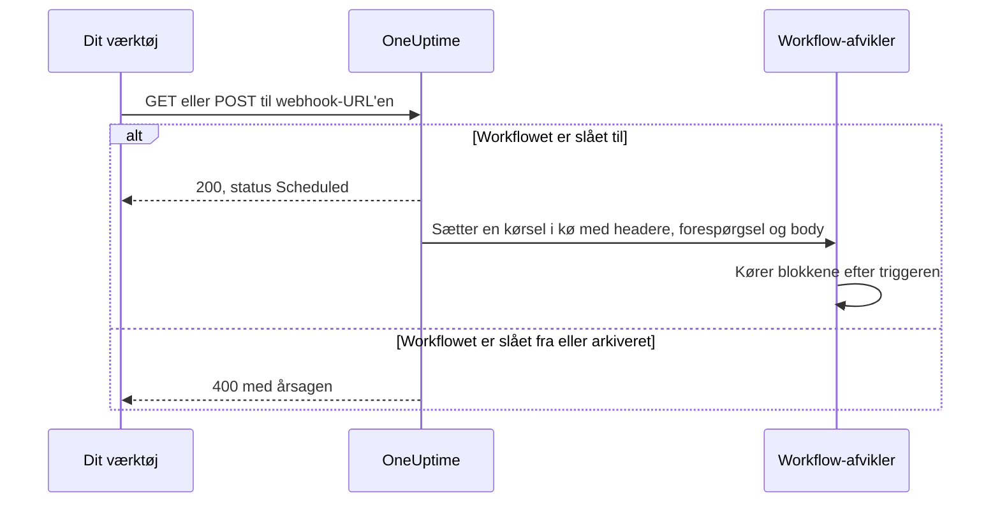
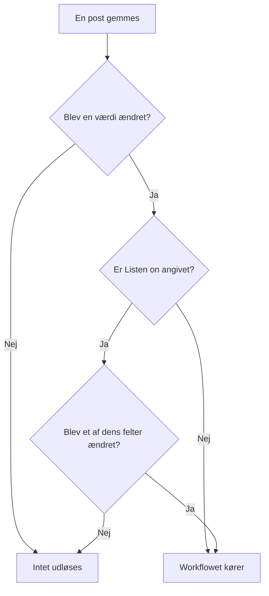

# Workflow-triggere

En trigger er den første blok i et workflow — den afgør, hvornår workflowet kører. Hvert workflow har præcis én trigger. Du vælger mellem fem typer.

:::cards
- [Manuel](#manual): Start workflowet fra Bygger eller fra et andet workflow.
- [Tidsplan](#schedule): Kør det efter en tilbagevendende tidsplan, skrevet som et cron-udtryk.
- [Webhook](#webhook): Lad et andet system starte det ved at kalde en URL.
- [Indgående e-mail](#incoming-email): Start det med hver e-mail, der sendes til dets egen adresse.
- [OneUptime-begivenhedstriggere](#oneuptime-begivenhedstriggere): Reager, når en post oprettes, opdateres eller slettes.
:::

For at tilføje triggeren klikker du på den stiplede blok **Choose what starts this workflow** på et nyt workflows lærred. For at ændre den sletter du triggerblokken, og den stiplede blok kommer tilbage. Se [Opret et workflow](/docs/workflows/authoring#tilføj-blokke).

## Hvilken trigger skal jeg bruge?

| Hvis du vil…                                   | Vælg                        |
| ---------------------------------------------- | --------------------------- |
| Klikke på en knap for at køre workflowet       | **Manual**                  |
| Køre efter en tilbagevendende tidsplan         | **Tidsplan**                |
| Lade et andet system sende data ind            | **Webhook**                 |
| Starte ud fra en e-mail                        | **Incoming Email**          |
| Reagere på noget i OneUptime                   | **OneUptime-begivenhed**    |

Et workflow kan kun have én trigger. Har du brug for to måder at starte den samme automatik på, så byg den fælles logik i et workflow med en **Manual**-trigger, og start den fra to tynde «indpaknings»-workflows med en **Execute Workflow**-blok.

## Manual

Kør workflowet, når du vil: klik på **Kør arbejdsgang** på siden **Bygger**, udfyld triggerens **JSON**, klik på **Run Workflow Manually**, og bekræft med **Run**. Et andet workflow kan også starte det med en **Execute Workflow**-blok.

God til: automatik med ét klik, som du vil have en knap til, som «udskift denne nøgle» eller «send en testadvarsel», og logik, du deler mellem workflows.

**Returns**: **JSON** — det, kørslen blev startet med.

- Fra **Kør arbejdsgang** er det den JSON, du skrev, som tekst. For at læse et felt i den sender du den først gennem en **Text to JSON**-blok.
- Fra en **Execute Workflow**-blok er hver nøgle i blokkens **Arguments** en værdi for sig. Med `{"customerId": "42"}` læser en senere blok `{{local.components.manual-1.returnValues.customerId}}`, hvor `manual-1` er Manual-triggerens ID.

## Schedule

Kør workflowet efter en tilbagevendende tidsplan. Angiv hvor ofte i **Schedule at**: vælg en af **Common schedules**, skriv et **Custom cron**-udtryk, eller vælg en **Variabel**, der indeholder et. Under feltet beskrives tidsplanen med ord sammen med de **Next runs**.

God til: oprydning om natten, synkronisering hver time, ugentlige rapporter.

Tider er i UTC, så regn om fra din egen tidszone, når du vælger timen. De fem dele af et cron-udtryk er minuttet, timen, dagen i måneden, måneden og ugedagen:

| Udtryk        | Kører                                  |
| ------------- | -------------------------------------- |
| `*/5 * * * *` | Hvert 5. minut.                        |
| `0 * * * *`   | Hver time, på slaget.                  |
| `0 0 * * *`   | Hver dag ved midnat UTC.               |
| `0 9 * * 1-5` | Hver hverdag kl. 9:00 UTC.             |
| `0 9 * * 1`   | Hver mandag kl. 9:00 UTC.              |

Intet planlægges, mens workflowet er slået fra. En tidsplan med **Variabel** læser en workflow- eller global variabel, som `{{local.variables.schedule}}`. Bliver den ikke til et gyldigt cron-udtryk, planlægges workflowet ikke, og en mislykket kørsel i dets liste over kørsler siger hvorfor.

For at teste workflowet uden at vente på tidsplanen klikker du på **Kør arbejdsgang** i **Bygger**: det starter en kørsel med det samme.

## Webhook

OneUptime giver workflowet sin egen URL. Alt, der kalder URL'en, starter workflowet og sender forespørgslens headere, forespørgselsparametre og body med.

God til: at tage imod data i OneUptime fra et andet værktøj — CI/CD-callbacks, advarsler fra anden overvågning, tilmeldinger i dit CRM.

For at få URL'en klikker du på Webhook-triggeren på lærredet. URL'en står øverst i dens indstillinger, med en knap **Kopiér URL**, de metoder, den accepterer, og en `curl`-kommando, du kan indsætte i en terminal for at prøve den:

```bash
curl -X POST "https://oneuptime.example.com/workflow/trigger/<secret key>" \
  -H "Content-Type: application/json" \
  -d '{"message": "Hello"}'
```

URL'en accepterer både `GET` og `POST`. Kalderen får en hurtig kvittering, `{"status": "Scheduled"}` — selve workflowet kører i baggrunden, så kalderen ser aldrig, hvad det gør. Et kald til et workflow, der er slået fra eller arkiveret, afvises med HTTP 400 og årsagen.



**Returns**:

| Værdi                    | Hvad den indeholder                                                                                                   |
| ------------------------ | --------------------------------------------------------------------------------------------------------------------- |
| **Request Headers**      | Hver header i forespørgslen, ved navn med små bogstaver, som `content-type`.                                          |
| **Request Query Params** | Forespørgselsparametrene i URL'en, ved navn.                                                                          |
| **Request Body**         | Den body, kalderen sendte. En JSON-body, sendt med `Content-Type: application/json`, kan læses felt for felt.         |

Læs et enkelt felt ved at tilføje dets navn til referencen, som i `{{local.components.webhook-1.returnValues.request-body.message}}`.

Når en forespørgsel er kommet, ved værdivælgeren i hver blok efter triggeren, hvad der var i den: den viser bodyens felter, headerne og forespørgselsparametrene, hver med sit indhold, så du kan vælge `incident.title` i stedet for at skrive en sti. Indtil da siger den, at ingen forespørgsel er kommet, og tilbyder **Copy test request**, en `curl`-kommando til URL'en; felterne dukker op, så snart den kørsel, forespørgslen starter, er færdig. Se [Brug værdier fra tidligere blokke](/docs/workflows/authoring#brug-værdier-fra-tidligere-blokke).

For at teste workflowet uden det andet værktøj klikker du på **Kør arbejdsgang** i **Bygger** og indtaster headere, forespørgselsparametre og en body.

### Hold URL'en privat

Den sidste del af URL'en er workflowets hemmelige nøgle, og alle, der har URL'en, kan starte workflowet. Derfor er nøglen skjult, indtil du klikker på **Vis**, og **Kopiér URL** kopierer hele URL'en uden at vise den.

Lækker URL'en, så klik på **Nulstil URL** samme sted: workflowet får en ny URL, og den gamle holder op med at virke med det samme, så opdater alt, der kalder den. Kun personer, der må redigere workflowet, kan se eller nulstille dets URL — se [Webhook-sikkerhed](/docs/workflows/configuration#webhook-sikkerhed).

> [!WARNING]
> Behandl URL'en som en adgangskode. Alle, der har den, kan starte dit workflow uden at logge ind.

## Incoming Email

OneUptime giver workflowet sin egen e-mailadresse. Hver e-mail, der sendes til den adresse, starter workflowet og sender e-mailen med: hvem der sendte den, hvem den var til, emnet, teksten og HTML'en, headerne og navnene på eventuelle vedhæftede filer.

God til: at handle på e-mails fra systemer, der ikke kan kalde en webhook — advarsler fra ældre overvågningsværktøjer, en leverandørs statusmeddelelser, den rapport, et natligt job mailer ud.

For at få adressen klikker du på Incoming Email-triggeren på lærredet. Adressen står øverst i dens indstillinger, med en knap **Kopiér adresse**. Giv den til det, der skal starte workflowet: et værktøj, der kun kan sende e-mail, en leverandørs notifikationsindstillinger eller en videresendelsesregel i din egen postkasse.

Hver e-mail starter sin egen kørsel. E-mailen når workflowet, uanset om adressen står i Til eller Cc, er en bcc eller nås gennem en videresendelsesregel. En e-mail, der nævner adressen to gange, starter én kørsel.

**Returns**:

| Værdi           | Hvad den indeholder                                                                                     |
| --------------- | ------------------------------------------------------------------------------------------------------- |
| **From**        | Afsenderens adresse.                                                                                    |
| **To**          | Alle, e-mailen var adresseret til, på én linje, som `ops@example.com, oncall@example.com`.              |
| **CC**          | Alle, e-mailen blev sendt som kopi til, på én linje.                                                    |
| **Subject**     | Emnelinjen.                                                                                             |
| **Body**        | E-mailens almindelige tekst.                                                                            |
| **HTML Body**   | E-mailens HTML, når den har noget. Body og HTML Body afkortes hver ved 1 MB.                            |
| **Headers**     | Hver header i e-mailen, ved navn med små bogstaver, som `message-id`.                                   |
| **Attachments** | Navn, type og størrelse på hver vedhæftet fil. Selve filerne gemmes ikke.                               |
| **Received At** | Hvornår OneUptime modtog e-mailen.                                                                      |

Når en e-mail er kommet, ved værdivælgeren i hver blok efter triggeren, hvad der var i den: den viser hver header og hver vedhæftet fil, e-mailen havde, med deres indhold, så du kan vælge `headers.message-id` i stedet for at skrive en sti. Indtil da siger den, at ingen e-mail endnu er nået frem til adressen. Se [Brug værdier fra tidligere blokke](/docs/workflows/authoring#brug-værdier-fra-tidligere-blokke).

For at prøve workflowet uden at sende en e-mail klikker du på **Kør arbejdsgang** på siden **Bygger** og udfylder en afsender, et emne og en body. De værdier, du udelader, kommer tomme frem.

E-mail starter kun workflowet, mens det er slået til. E-mail til et workflow, der er slået fra, ignoreres, og det samme gør e-mail til et workflow, hvis trigger ikke længere er Incoming Email.

### Hold adressen privat

Den del af adressen, der står før `@`, indeholder workflowets hemmelige nøgle, og alle, der har adressen, kan starte workflowet. Derfor er nøglen skjult, indtil du klikker på **Vis**, og **Kopiér adresse** kopierer hele adressen uden at vise den.

Lækker adressen, så klik på **Nulstil adresse** samme sted: workflowet får en ny adresse, og e-mail til den gamle ignoreres fra da af, så giv den nye til alt, der mailer workflowet. Kun personer, der må redigere workflowet, kan se eller nulstille dets adresse — se [Sikkerhed for indgående e-mail](/docs/workflows/configuration#sikkerhed-for-indgående-e-mail).

> [!WARNING]
> Alle kan sætte en hvilken som helst afsender på en e-mail, så **From** er intet bevis for, hvem der sendte den. Tjek noget, som kun den rigtige afsender ved, før et trin gør noget vigtigt.

> [!NOTE]
> På en selvhostet installation modtager OneUptime e-mail gennem en udbyder af indgående e-mail, som din administrator konfigurerer — se [SendGrid Inbound Email](/docs/self-hosted/sendgrid-inbound-email). Indtil da har triggeren ingen adresse, og dens indstillinger siger det.

## OneUptime-begivenhedstriggere

Næsten alt i OneUptime — monitorer, hændelser, advarsler, planlagte vedligeholdelser, statussider, vagtpolitikker, teams — kan starte et workflow. Hver tilbyder op til tre begivenheder:

- **On Create** — udløses, når en ny tilføjes.
- **On Update** — udløses, når en ændres. At gemme en post med de værdier, den allerede har, som en formular gemt uden ændringer eller en kontakt sendt, som den allerede står, er ikke en ændring og udløser den ikke.
- **On Delete** — udløses, når en slettes.

Sådan bygger du «når X sker i OneUptime, så gør Y» uden at skulle tjekke ting i en løkke.

**On Update** kan begrænses til nogle felter med **Listen on**: så udløses den kun, når en opdatering ændrer et af dem, til en hvilken som helst værdi — at slå en kontakt fra eller rydde et felt tæller med.



**On Create** og **On Update** sender posten videre til den næste blok, med de felter, du vælger i triggerens **Select Fields**. For eksempel sender triggeren **Incident → On Create** den nye hændelse videre, så den næste blok kan læse dens titel, beskrivelse, alvorlighed eller ethvert andet felt, du har valgt, som `{{local.components.incident-on-create-1.returnValues.model.title}}`. Et felt, du ikke valgte, kommer tomt frem.

**On Delete** sender kun den slettede posts ID videre: posten er væk, når workflowet kører, så dens andre felter kan ikke læses.

For at teste en begivenhedstrigger uden at vente på begivenheden klikker du på **Kør arbejdsgang** i **Bygger** og indtaster ID'et på en eksisterende post, som et **Hændelses-ID**. Kørslen læser den post med de felter, du valgte.

### Begivenheder, som teams bruger mest

| Ressource                                 | Hvad teams bruger den til                                                                 |
| ----------------------------------------- | ----------------------------------------------------------------------------------------- |
| **Hændelse**                              | Reagere, når en hændelse erklæres, opdateres (kvitteret, løst) eller slettes.             |
| **Advarsel**                              | De samme tre begivenheder, for advarsler.                                                 |
| **Overvågning**                           | Reagere, når en monitor tilføjes, redigeres eller fjernes.                                |
| **Planlagt Vedligeholdelse Begivenhed**   | Annoncere et vedligeholdelsesvindue automatisk, når det planlægges.                       |
| **Statusside Abonnent**                   | Byde en person velkommen, der abonnerer på en statusside.                                 |
| **Vagtpolitik**                           | Synkronisere ændringer i politikken med et andet vagtplansystem.                          |

I panelet **Add Trigger** ligger de under **OneUptime resources**: klik på ressourcen og derefter på triggeren. **Browse all resources** har dem alle, og søgefeltet finder en trigger ud fra få ord, som `incident created`.

## Næste trin

:::cards
- [Komponenter](/docs/workflows/components): De handlinger, du tilføjer efter triggeren.
- [Variabler](/docs/workflows/variables): Læs i senere blokke det, triggeren sendte med.
- [Kørsler](/docs/workflows/runs-and-logs): Bekræft, at din trigger blev udløst, og se, hvad den bragte.
:::
