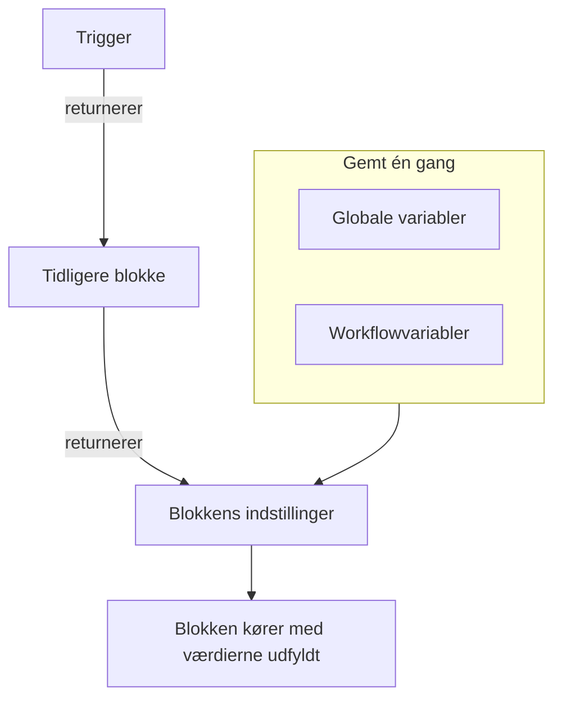
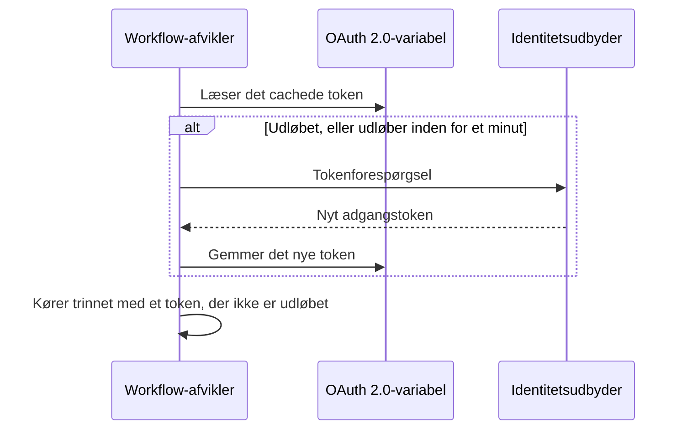

# Workflow-variabler

Variabler er måden, data bevæger sig gennem et workflow på: fra triggeren til den første blok, fra én blok til den næste, og fra værdier, du gemmer én gang, til hver blok, der har brug for dem. En bloks indstilling læser en værdi med en reference i dobbelte krøllede parenteser, og afvikleren udfylder den lige før blokken kører.

| Værdi                          | Hvor den kommer fra                                                  | Sådan læser en blok den                               |
| ------------------------------ | -------------------------------------------------------------------- | ----------------------------------------------------- |
| **Global variabel**            | Gemt under **Arbejdsgange → Globale variabler**                      | `{{global.variables.NAME}}`                          |
| **Workflowvariabel**           | Gemt på ét workflows side **Arbejdsgangsvariabler**                  | `{{local.variables.NAME}}`                           |
| **En tidligere bloks værdi**   | Det, triggeren eller en tidligere blok returnerede i denne kørsel    | `{{local.components.BLOCK_ID.returnValues.VALUE_ID}}` |



Du skriver sjældent en reference. Klik på **{ }** for enden af en indstilling, eller skriv `{{` i den, og vælg værdien på en liste. Se [Brug værdier fra tidligere blokke](/docs/workflows/authoring#brug-værdier-fra-tidligere-blokke).

## Globale variabler

Værdier for hele projektet, som du gemmer én gang og genbruger i hvert workflow: API-nøgler, URL'er, kanalnavne — alt, hvad du ikke vil kopiere ind i ti forskellige workflows.

:::steps
### Åbn de globale variabler

Gå til **Arbejdsgange → Globale variabler**, og klik på **Opret Workflow Variabel**.

### Navngiv variablen

Udfyld i trinnet **Variabel**:

- **Navn** — det, du henviser til den med. Mindst to tegn, ingen mellemrum, og kun bogstaver, tal, bindestreger og understregninger. `UPPER_SNAKE_CASE` er en god vane, fordi det skiller sig ud i dine blokke.
- **Beskrivelse** — valgfri, fritekst, der minder dig om, hvad den er til.

Klik på **Næste**.

### Giv den en værdi

Udfyld i trinnet **Værdi**:

- **Indhold** — selve værdien. Det er et felt til lang tekst, så værdier over flere linjer virker.
- **Hemmelighed** — når den er slået til, fjernes værdien fra kørselslogge og trinspor.

Klik på **Opret Workflow Variabel**. For at ændre navnet eller beskrivelsen før det klikker du på **Variabel** i listen over trin ved siden af formularen (vises på brede skærme); det, du skrev i begge trin, bevares.
:::

Brug en global variabel i et hvilket som helst workflow med:

```text
{{global.variables.NAME}}
```

Har du for eksempel gemt din PagerDuty-nøgle som `PAGERDUTY_KEY`, kan enhver blok bruge den som `{{global.variables.PAGERDUTY_KEY}}` — editoren gemmer referencen, og workflowets logning fjerner den opløste hemmelige værdi.

Listen viser hver variabels navn og beskrivelse. Klik på **Vis** i en række for at åbne variablens side. Den viser, om variablen er statisk eller OAuth 2.0, og det er her, du gør alt det andet:

| Knap                                       | Hvad den gør                                                                                                                                     |
| ------------------------------------------ | ------------------------------------------------------------------------------------------------------------------------------------------------ |
| **Rediger Variabel**                       | Ændrer navnet, beskrivelsen og — for en statisk variabel, der endnu ikke er hemmelig — hemmeligheds-markeringen. Når en variabel først er hemmelig, forbliver den hemmelig. |
| **Update Content**                         | Erstatter en statisk værdi. Det gemte indhold kan ikke læses tilbage, så du skriver den nye værdi i sin helhed.                                  |
| **Use in Workflows**                       | Viser den præcise reference, du skal indsætte i dine blokke, med en kopieringsknap.                                                              |
| **Slet Workflow Variabel**                 | Sletter den, efter at have bedt dig bekræfte. Bekræftelsen nævner variablen, så du kan tjekke, at det er den rigtige.                             |

For i stedet at oprette en variabel til et **OAuth 2.0-adgangstoken** åbner du menuen **Mere** (**⋯**) ved siden af **Opret Workflow Variabel** og vælger **Create OAuth 2.0 Variable**. OAuth 2.0-variabler har [deres egen sektion](#oauth-20-variabler-tokens-der-fornyer-sig-selv) nedenfor. En variabels type kan ikke ændres, efter at den er gemt.

Du kan også opdatere en variabel via API'et, hvilket er beskrevet [sidst på denne side](#opdatér-en-variabel-fra-et-workflow). Globale variabler og workflowvariabler er en funktion i abonnementet Growth.

## Lokale workflowvariabler

Variabler, der hører til ét workflow, administreret under **Arbejdsgangsvariabler** i det workflows menu. De virker på samme måde som globale variabler: **Opret Workflow Variabel** opretter en statisk variabel, menuen **Mere** (**⋯**) opretter en OAuth 2.0-variabel, og **Vis** åbner en variabels side. Henvis til dem med:

```text
{{local.variables.NAME}}
```

Brug en til en værdi, som kun det workflow har brug for, som en skabelons Slack-webhook-URL. Skabeloner, der beder om indstillinger, gemmer dem som workflowvariabler, så du kan ændre dem senere uden at redigere blokkene.

## OAuth 2.0-variabler (tokens, der fornyer sig selv)

Et bearer-token, der er indsat i en statisk variabel, virker, indtil det udløber, som regel inden for en time. Derefter mislykkes hver kørsel, der bruger det, med `401 Unauthorized`, indtil nogen indsætter et nyt. En variabel til et **OAuth 2.0-adgangstoken** gemmer det, OAuth-tokenudvekslingen har brug for, i stedet for selve tokenet, og OneUptime holder tokenet opdateret.

Du bruger den præcis som enhver anden variabel:

```http
Authorization: Bearer {{global.variables.CRM_API_TOKEN}}
```

### Sådan forbliver tokenet gyldigt



- Første gang et workflow bruger variablen, beder OneUptime din identitetsudbyders tokenendpoint om et adgangstoken og gemmer det.
- Før hvert trin, der henviser til variablen, tjekker afvikleren tokenet. Er det udløbet, eller udløber det inden for det næste minut, hentes et nyt, før trinnet kører. Komponenten får altid et token, der ikke er udløbet, uanset hvor længe variablen har ligget ubrugt, og hvor længe kørslen har været i gang.
- Kun trin, der faktisk henviser til variablen, udløser en fornyelse. En kørsel, der aldrig bruger en variabel, henter aldrig dens token og mislykkes ikke, fordi den udbyder er nede.
- Når mange kørsler skal bruge et nyt token på samme tid, henter én af dem det, og de andre bruger det.
- Siger udbyderen ikke, hvornår et token udløber (intet `expires_in`, og tokenet er ikke et JWT med en `exp`-claim), henter OneUptime et nyt én gang pr. kørsel og deler det mellem den kørsels trin.

### Tildelingstyper

| Tildelingstype                 | Brug den til                                                                                                                                                                                                                                        |
| ------------------------------ | --------------------------------------------------------------------------------------------------------------------------------------------------------------------------------------------------------------------------------------------------- |
| **Client Credentials**         | OneUptime logger ind som din applikation. Det sædvanlige valg til server-til-server-API'er som Microsoft Graph, Auth0- eller Okta-API'er eller en intern tjeneste bag Keycloak.                                                                    |
| **Opdateringstoken**           | Delegeret adgang på vegne af en bruger. Godkend applikationen én gang (for eksempel i din udbyders OAuth playground eller med Postman), og indsæt det refresh token, du får. OneUptime veksler det til adgangstokens og gemmer hvert nyt refresh token, hvis din udbyder roterer dem. En offentlig klient uden klienthemmelighed virker også. |

### Opret en

**Create OAuth 2.0 Variable** spørger om én ting pr. trin:

1. **Variabel**: det navn, workflows henviser til den med, og en beskrivelse.
2. **Udbyder**: vælg din **Identitetsudbyder**, så udfylder OneUptime dens **Token-URL**:

   | Identitetsudbyder | Token-URL, der udfyldes |
   |---|---|
   | Microsoft Entra ID | `https://login.microsoftonline.com/{tenant-id}/oauth2/v2.0/token` |
   | Google | `https://oauth2.googleapis.com/token` |
   | Okta | `https://{your-domain}/oauth2/default/v1/token` |
   | Auth0 | `https://{your-domain}/oauth/token` |

   Erstat delen i krøllede parenteser med din egen værdi, som dit katalog-ID (tenant) eller dit Okta-domæne. Formularen går ikke videre, så længe URL'en stadig har en. For enhver anden udbyder vælger du **Anden udbyder** og angiver selv dens tokenendpoint. Vælg derefter **Tildelingstype**. Vælger du Google, vælges **Opdateringstoken**, fordi Googles OAuth-klienter ikke kan bruge Client Credentials. Udbyderen udfylder kun formularen; den gemmes ikke med variablen.
3. **Loginoplysninger**: **Klient-ID** og **Klienthemmelighed** for den applikation, du registrerede hos udbyderen, og for tildelingstypen Refresh Token **Opdateringstoken**. En offentlig klient med tildelingstypen Refresh Token kan lade klienthemmeligheden stå tom.
4. **Avanceret**, alt sammen valgfrit:
   - **Omfang**: adskilt med mellemrum. Lad det stå tomt for at få udbyderens standardomfang. Til Client Credentials kræver Microsoft Entra ID et omfang, der slutter på `/.default` (som `https://graph.microsoft.com/.default`), og Okta kræver et brugerdefineret omfang.
   - **Yderligere parametre**: ekstra formularfelter til tokenforespørgslen, som `audience` til Auth0 (påkrævet for Client Credentials) eller `resource` til Azure AD v1. Alle, der kan læse variablen, kan læse dem, så læg ikke hemmeligheder her.
   - **Klientgodkendelse**: om klient-ID og hemmelighed sendes i en HTTP Basic-header (standard) eller i forespørgslens body. Svarer din udbyder `invalid_client`, så prøv den anden.

Under nogle felter tilføjer formularen en hjælpelinje til den udbyder, du valgte, for eksempel hvor Microsoft Entra ID viser dit tenant-ID, og at dens klienthemmelighed er hemmelighedens **Value**, ikke dens **Secret ID**.

Når du gemmer en ny OAuth 2.0-variabel, henter OneUptime dens første token med det samme og fortæller dig, hvad udbyderen svarede. En slåfejl i hemmeligheden eller URL'en viser sig da, ikke timer senere i en mislykket kørsel. At hente et token skriver til variablen, så det kræver tilladelse til at redigere workflowvariabler; kan du oprette variabler, men ikke redigere dem, er det den første workflowkørsel, der bruger variablen, der henter dens token.

Variablens side (klik på **Vis** i dens række) har et kort **OAuth 2.0 Settings**. **Rediger indstillinger** går gennem de samme trin **Udbyder** (token-URL), **Loginoplysninger** (klient-ID) og **Avanceret** (omfang, yderligere parametre, klientgodkendelse). **Næste** går videre, og **Gem ændringer** er på det sidste trin. Hvert trin er allerede udfyldt, så trinlisten ved siden af formularen åbner ethvert af dem: ændr én indstilling på dens trin, åbn så det sidste trin, og gem. Tildelingstypen er fast, når den er gemt.

### Kortet Adgangstoken

Kortet **Adgangstoken** på en OAuth 2.0-variabels side viser en af disse statusser:

| Status                     | Hvad den betyder                                                                                                                     |
| -------------------------- | ------------------------------------------------------------------------------------------------------------------------------------ |
| **Valid**                  | Det cachede token er endnu ikke udløbet.                                                                                             |
| **Udløbet**                | Normalt for en variabel, som intet workflow har brugt på det seneste. Den næste kørsel, der bruger den, henter et nyt token.          |
| **Ikke hentet endnu**      | Der er ikke hentet noget token, siden variablen blev oprettet, eller dens indstillinger blev ændret.                                 |
| **No expiry reported**     | Udbyderen sagde ikke, hvornår tokenet udløber, så hver kørsel henter et nyt.                                                         |
| **Refresh failed**         | Det seneste forsøg på at hente et token mislykkedes. Udbyderens årsag vises i sin helhed, med hvornår det skete. Den næste vellykkede fornyelse rydder den. |

**Opdater nu**, under statussen, henter et nyt token med det samme. Brug den til at tjekke nye indstillinger uden at køre et workflow. **Update Credentials**, på kortet **OAuth 2.0 Settings**, erstatter klienthemmeligheden eller refresh tokenet og henter derefter et token med dem. Ændrer du en indstilling (token-URL, klient-ID, omfang og så videre), kasseres det cachede token, så den næste kørsel henter et med de nye indstillinger.

### Når udbyderen siger nej

Det trin, der havde brug for tokenet, mislykkes, før det kører, og kørslens log nævner variablen og citerer udbyderens svar, for eksempel `Could not get an OAuth 2.0 access token for {{global.variables.CRM_API_TOKEN}}: The token endpoint refused the request (HTTP 400): invalid_grant - Token has been expired or revoked.` Den samme årsag vises på variablens kort **Adgangstoken**. `invalid_grant` på en Refresh Token-variabel betyder næsten altid, at selve refresh tokenet er udløbet eller tilbagekaldt, og **Update Credentials** er løsningen.

Mislykkes fornyelsen, mens det cachede token faktisk endnu ikke er udløbet (det var kun inden for marginen på ét minut), fortsætter trinnet med det cachede token, og loggen siger det.

### Sikkerhed

- OAuth 2.0-variabler er altid hemmelige. Adgangstokenet erstattes med `[REDACTED]` i kørselslogge og trinspor, også et token, der blev udskiftet midt i en kørsel.
- Klienthemmeligheden, refresh tokenet og adgangstokenet er krypteret i databasen og kan aldrig læses tilbage via API'et eller dashboardet. **Opdater nu** fortæller, hvornår det nye token udløber, aldrig tokenet.
- Token-URL'en skal være `http` eller `https`. Forespørgsler til loopback-, link-local- og cloudmetadata-adresser afvises. I OneUptime Cloud afvises også private netværksadresser. Selvhostede installationer kan nå en identitetsudbyder på deres eget netværk. OneUptime følger ikke omdirigeringer ved tokenforespørgsler, så peg Token-URL'en på den adresse, endpointet faktisk svarer på. En tokenforespørgsel giver op efter 20 sekunder.

### Skift et eksisterende statisk token til OAuth 2.0

En variabels type er fast, når den er gemt. Slet den statiske variabel, og opret en OAuth 2.0-variabel med **samme navn**. Workflows henviser til variabler ved navn, så de tager den nye i brug uden nogen ændring.

## Komponent-output (data fra tidligere blokke)

Hver trigger og hver komponent kan producere output under en kørsel. Indsæt en reference med knappen **{ }** i en indstilling, eller ved at skrive `{{` i den, i stedet for at skrive den ud — det indsætter de præcise ID'er, afvikleren forventer, og viser værdien som en chip, der nævner blokken og værdien.

Du kan også starte fra den blok, der producerer værdien: dens indstillinger viser hvert output under **Returns**, med den præcise reference og en knap til at kopiere den.

Henvis til en tidligere bloks output sådan her:

```text
{{local.components.COMPONENT_ID.returnValues.FIELD_ID}}
```

`COMPONENT_ID` er blokkens **Identifier** — det korte ID, der vises på blokken, ikke det navn, der står på den. Nye blokke får et som `api-get-1`, og du kan omdøbe det i blokkens sektion **ID**. Omdøber du det, går alle referencer, der allerede peger på det, i stykker, på samme måde som når du omdøber en variabel. `FIELD_ID` er værdiens ID, og en sti efter det læser et felt i en JSON-værdi.

| Efter en blok som…                                        | Læs                                                                                    |
| --------------------------------------------------------- | -------------------------------------------------------------------------------------- |
| En **API**-blok med ID'et `lookup-user`                   | Dens statuskode: `{{local.components.lookup-user.returnValues.response-status}}`. Dens body: `{{local.components.lookup-user.returnValues.response-body}}`. |
| En **Run Custom JavaScript**-blok med ID'et `transform`   | Det, den returnerede: `{{local.components.transform.returnValues.returnValue}}`.      |
| En **On Create Incident**-trigger med ID'et `incident-on-create-1` | Hændelsens titel: `{{local.components.incident-on-create-1.returnValues.model.title}}`. Posttriggere returnerer én værdi, `model`, som du går ned i. |

Blokværdier findes kun under den aktuelle kørsel. Hver ny kørsel starter forfra.

## Hvor variabler virker

Næsten alle tekstfelter tager imod variabler:

- URL'en på en API-blok.
- Beskedteksten på Slack, Teams, Discord, Telegram, IRC, Email.
- Emnet og bodyen i en e-mail.
- Headere og felter i bodyen (inde i strengværdier).
- Begge sider af en **If / Else**-blok.

I JSON-felter — **Data (JSON Object)**, **Query** og **Select Fields** på postkomponenterne, en API-bloks **Request Body**, **Arguments** på **Run Custom JavaScript** — udfyldes en reference efter, hvor den står:

- **Inden for anførselstegn er det tekst.** `{"title": "Down: {{local.components.ci-webhook.returnValues.request-body.service}}"}` sætter værdien ind i strengen. Anførselstegn, omvendte skråstreger og linjeskift i værdien escapes, så JSON'en forbliver gyldig, og værdien forbliver én streng.
- **Alene er det selve værdien.** `{"customFields": {{local.components.transform.returnValues.returnValue}}}` indsætter hele objektet, en liste forbliver en liste, og et tal forbliver et tal. Tekst, der selv er JSON — `5`, `true` eller et objekt, som en blok returnerede som JSON-tekst — indsættes som den værdi. Al anden tekst indsættes som en streng.

En reference inden for en nøgles anførselstegn er også tekst. Skal du bygge en struktur dynamisk, så byg den med en **Run Custom JavaScript**-blok, og send dens output videre til den næste blok.

**Run Custom JavaScript**-blokken får ikke variabler automatisk — intet injiceres i sandkassen. Sæt `{{global.variables.NAME}}` (eller en hvilken som helst komponentreference) i blokkens JSON-felt **Arguments**; de værdier indsættes, før scriptet kører, og kommer frem som `args`.

## Loop over arrays

I et tekstfelt kan du gentage et stykke tekst for hvert element i en liste med `{{#each path}}…{{/each}}`. Inde i blokken læser `{{property}}` fra det aktuelle element, `{{@index}}` er dets position fra 0, og `{{this}}` er selve elementet i lister med simple værdier. Navne inde i en `{{#each}}`-blok trimmes, så overflødige mellemrum gør ingen skade dér — i modsætning til alle andre steder.

For eksempel viser denne **Message Text** hver advarsel, som en webhook sendte:

```text title="Message Text"
{{#each local.components.ci-webhook.returnValues.request-body.alerts}}
- {{@index}}: {{name}} is {{status}}
{{/each}}
```

## Eksempler

### Byg en payload ud fra en webhook

En webhook kommer med en body som `{ "service": "checkout", "status": "failed" }`. For at gøre det til en OneUptime-hændelse:

1. En **Webhook**-trigger med ID'et `ci-webhook`.
2. En **If / Else**-blok: **Value to check** er feltet `status` i webhookens Request Body (`{{local.components.ci-webhook.returnValues.request-body.status}}`), **Comparison** er **is equal to**, og **Compare with** er `failed`.
3. Fra grenen **Yes** en **Create One Incident**-blok med:
   - Titel: `CI build failed: {{local.components.ci-webhook.returnValues.request-body.service}}`
   - Beskrivelse: `See {{local.components.ci-webhook.returnValues.request-body.url}} for the logs.`

### Brug en hemmelighed i et API-kald

Et workflow, der kalder PagerDuty:

1. Gem `PAGERDUTY_KEY` som en hemmelig global variabel.
2. Sæt på **API**-blokken headeren `Authorization` til `Token token={{global.variables.PAGERDUTY_KEY}}`.

Nøglen holdes ude af workflowet og loggene.

### Kæd to API-kald sammen

Det første kald giver dig et ID, som det andet har brug for:

1. **API**-komponenten `lookup-order`: brug i dens **URL**, efter `/orders?email=`, **{ }** til at indsætte den manuelle triggers JSON med stien `email`.
2. **API**-komponenten `cancel-order`: `POST /orders/{{local.components.lookup-order.returnValues.response-body.id}}/cancel`.

Mislykkes `lookup-order`, udløses dens udgang **Error** i stedet for **Success**. Forbind den til en Email- eller Slack-blok, så fejl ikke går ubemærket hen.

## Opdatér en variabel fra et workflow

Et almindeligt mønster er at udskifte en loginoplysning efter en tidsplan: hente et nyt token fra en tredjepart og så gemme det tilbage i variablen, så den næste kørsel bruger det. Gør det med en **API**-blok, der kalder OneUptime-API'et.

Er loginoplysningen et OAuth 2.0-adgangstoken, behøver du ikke selv at bygge dette. En [OAuth 2.0-variabel](#oauth-20-variabler-tokens-der-fornyer-sig-selv) henter og fornyer tokenet af sig selv.

Send `PUT /api/workflow-variable/<variable-id>` med en `ApiKey`-header og — det er her, folk falder i — de felter, du vil ændre, **pakket ind i et `data`-objekt**:

```json title="Request Body"
{
  "data": {
    "content": "{{local.components.get-token.returnValues.response-body.access_token}}"
  }
}
```

En flad body uden `data`-indpakningen afvises med en 400. Send kun de felter, du faktisk vil ændre; `name` og `description` kan blive ude af payloaden.

API-nøglen skal have **Edit Workflow Variables**. Der kræves ingen læsetilladelse — opdateringen læser ikke rækken tilbage.

To ting, du skal holde øje med:

- **Omdøb ikke en variabel, du henviser til.** `name` er en del af `{{local.variables.NAME}}`. Ændrer du det, efterlades alle eksisterende referencer uopløste, og en uopløst reference sendes videre som bogstavelig tekst — se [Fælder](#fælder).
- **En variabel kan skrives på denne måde, men aldrig læses tilbage.** `content` er kun til skrivning via API'et for alle variabler, hemmelige eller ej. Det er det, der gør en variabel til et sikkert sted at parkere et token, der udskiftes. Markerer du den som hemmelig, holdes værdien desuden ude af kørselslogge og trinspor.

## Fælder

- **Brug { } (eller skriv `{{`).** Det indsætter de præcise komponent-, returværdi- og variabel-ID'er, afvikleren forventer, og tilbyder kun værdier, der findes, når blokken kører.
- **Variabelnavne skelner mellem store og små bogstaver.** `{{global.variables.MyKey}}` og `{{global.variables.mykey}}` er forskellige.
- **En reference, der ikke kan opløses, efterlades, som den er, og bliver ikke tom.** At henvise til noget, der ikke findes, er ikke en fejl, og det giver dig heller ikke en tom streng: de krøllede parenteser sendes videre, som de er, så `{{local.components.api-get-1.returnValues.body}}` med et fejlstavet trin-ID ender ordret i din Slack-besked, din URL eller din forespørgsels body, og kørslen melder stadig **Executed**. Kørslens fane **Trin** viser en advarsel på trinnet, der nævner enhver reference, der slap igennem, og markerer den indstilling, den stod i, med **Did not resolve**; kørslens log har den samme advarselslinje.
- **Problempanelet kan ikke tjekke variabelnavne.** Det markerer komponentreferencer, det ikke kan matche — et ukendt trin-ID, en ukendt returværdi, en ugyldig rod —, før du gemmer. Det kan ikke se, om en variabel findes. En bloks indstillinger kan: en reference til en manglende variabel vises dér som en orange chip. Ellers fanges en omdøbt variabel kun af kørslens log.
- **Mellemrum inde i de krøllede parenteser trimmes ikke.** `{{ local.variables.NAME }}` er et andet opslag end `{{local.variables.NAME}}` og opløses aldrig. Den eneste undtagelse er inde i en `{{#each}}`-blok, hvor navne trimmes.

## Næste trin

:::cards
- [Komponenter](/docs/workflows/components): Hvad hver blok har brug for og returnerer.
- [Kørsler](/docs/workflows/runs-and-logs): Se, hvilken værdi hver reference blev til i en kørsel.
- [Konfiguration og sikkerhed](/docs/workflows/configuration#hemmeligheder): Hold hemmeligheder ude af blokke, eksporter og logge.
:::
