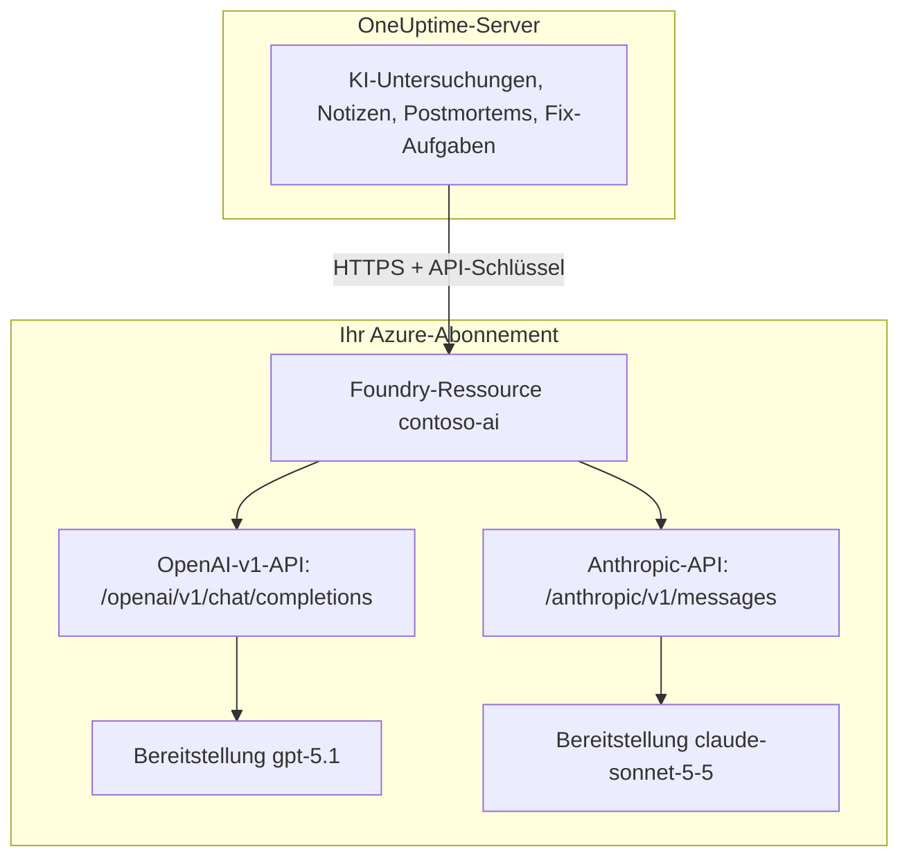

# Microsoft Foundry und Azure OpenAI

Betreiben Sie die KI-Funktionen von OneUptime mit Modellen, die Sie in Microsoft Foundry (früher Azure AI Foundry) oder Azure OpenAI bereitstellen. OneUptime sendet jede Anfrage direkt an Ihre Ressource in Ihrem Azure-Abonnement, sodass Prompts und Antworten von der Bereitstellung verarbeitet werden, die Sie gewählt haben, dort, wo Sie es gewählt haben. Diese Seite führt Sie von einem leeren Abonnement zu einem funktionierenden Anbieter: die Azure-Ressource, die Modellbereitstellung, Endpunkt und Schlüssel, die Einstellungen in OneUptime, das Netzwerk und was zu tun ist, wenn eine Anfrage fehlschlägt.

:::cards
- [Azure einrichten](#microsoft-foundry-einrichten): Ressource erstellen, Modell bereitstellen, Endpunkt und Schlüssel kopieren.
- [OneUptime verbinden](#oneuptime-verbinden): Vier Felder in den Projekteinstellungen, dann die Schaltfläche Testen.
- [Selbst gehostet](#eine-selbst-gehostete-instanz-mit-umgebungsvariablen-konfigurieren): Ein Anbieter für alle Projekte, aus Umgebungsvariablen.
- [Fehlerbehebung](#fehlerbehebung): 401, 403, eine fehlende Bereitstellung, eine api-version.
:::

## So funktioniert es

OneUptime ruft Ihre Foundry-Ressource über HTTPS vom OneUptime-Server aus auf, nie aus dem Browser der Benutzer. Jede Anfrage enthält einen der API-Schlüssel der Ressource und nennt die Bereitstellung, die sie beantworten soll.



Ein Anbietertyp, **Azure OpenAI / Microsoft Foundry**, deckt jede Bereitstellung der Ressource ab. Die Basis-URL sagt OneUptime, welche API aufzurufen ist:

| Bereitgestelltes Modell | API, die OneUptime aufruft | Basis-URL |
| --- | --- | --- |
| OpenAI-Modelle, etwa GPT-5.1 und GPT-4.1 | OpenAI v1 Chat Completions | `https://contoso-ai.openai.azure.com/openai/v1` |
| Foundry Models mit Chat Completions, etwa DeepSeek und Grok | OpenAI v1 Chat Completions | `https://contoso-ai.services.ai.azure.com/openai/v1` |
| Claude | Anthropic Messages | `https://contoso-ai.services.ai.azure.com/anthropic` |

> [!IMPORTANT]
> Die KI-Funktionen von OneUptime rufen Werkzeuge auf: Während sie arbeiten, fragen sie Ihre Monitore, Vorfälle und Telemetrie ab. Stellen Sie ein Modell bereit, das Tool Calling (Function Calling) unterstützt. Die Schaltfläche **Testen** des Anbieters prüft das für Sie.

## Bevor Sie beginnen

Sie benötigen ein Azure-Abonnement, eine Rolle, mit der Sie die Ressource erstellen und lesen können, und eine OneUptime-Rolle, die LLM-Anbieter hinzufügen darf.

| Wofür | Was Sie in Azure benötigen |
| --- | --- |
| Ressource erstellen | **Owner** oder **Contributor** auf der Ressourcengruppe, oder **Foundry Account Owner** |
| Modell bereitstellen | **Owner** oder **Contributor** auf der Ressourcengruppe, oder **Foundry Owner** bzw. **Foundry Account Owner** auf der Ressource. Für Claude zusätzlich die Berechtigung, Angebote im Azure Marketplace zu abonnieren |
| Schlüssel der Ressource lesen | Eine Rolle mit `Microsoft.CognitiveServices/accounts/listKeys/action`, etwa **Owner**, **Contributor** oder **Cognitive Services Contributor** |

OneUptime selbst benötigt keine Azure-Rolle. Ein Schlüssel gewährt für sich allein Zugriff auf jede Bereitstellung der Ressource, ohne Rollenprüfung. Behandeln Sie ihn deshalb wie ein Passwort.

In OneUptime darf einen Anbieter zu einem Projekt hinzufügen, wer **Project Owner**, **Project Admin**, **Project Member**, **Settings Admin**, **Settings Member** oder **Create LLM** hat. Eine selbst gehostete Instanz kann stattdessen aus Umgebungsvariablen einen Anbieter für alle Projekte registrieren; dafür ist Zugriff auf den Server nötig.

## Microsoft Foundry einrichten

:::steps
### Ressource erstellen

Erstellen Sie im [Foundry-Portal](https://ai.azure.com) eine Foundry-Ressource, oder wählen Sie eine vorhandene. Eine Azure-OpenAI-Ressource funktioniert genauso. Notieren Sie den Namen der Ressource: Er ist der erste Teil ihres Endpunkts, etwa `contoso-ai` in `https://contoso-ai.openai.azure.com`.

Wählen Sie eine Region, die das gewünschte Modell anbietet. Lassen Sie den Netzwerkzugriff der Ressource vorerst für alle Netzwerke offen; [Netzwerkanforderungen](#netzwerkanforderungen) erklärt, wann und wie Sie ihn schließen.

### Modell bereitstellen

Wählen Sie im Foundry-Portal **Discover**, dann **Models**, und wählen Sie ein Modell, zum Beispiel `gpt-5.1` oder `claude-sonnet-5-5`. Wählen Sie **Deploy**, dann **Custom settings**:

- **Deployment name**: Foundry trägt den Namen des Modells ein. OneUptime fragt die Bereitstellung unter diesem Namen an, notieren Sie ihn also genau.
- **Deployment type**: legt fest, wo Prompts verarbeitet werden. Siehe [Wo Ihre Daten verarbeitet werden](#wo-ihre-daten-verarbeitet-werden).

Wählen Sie **Deploy** und warten Sie, bis der Status der Bereitstellung **Succeeded** lautet.

### Endpunkt und einen Schlüssel kopieren

Öffnen Sie im [Azure-Portal](https://portal.azure.com) die Ressource, dann **Resource Management** > **Keys and Endpoint**. Kopieren Sie den **Endpoint** und **KEY 1**. Behalten Sie **KEY 2** für die Rotation: Stellen Sie OneUptime darauf um und generieren Sie dann **KEY 1** neu.

Im Foundry-Portal steht derselbe Schlüssel auf der Registerkarte **Details** der Bereitstellung, neben ihrem **Target URI**.
:::

:::details Lieber auf der Kommandozeile?
Dieselben Schritte mit der Azure CLI. `--model-version` erwartet eine Version, die der Modellkatalog für das Modell aufführt.

```bash
az cognitiveservices account create \
  --name contoso-ai --resource-group oneuptime-ai \
  --kind AIServices --sku S0 --location eastus2 \
  --custom-domain contoso-ai

az cognitiveservices account deployment create \
  --name contoso-ai --resource-group oneuptime-ai \
  --deployment-name gpt-5.1 \
  --model-name gpt-5.1 --model-version <version> --model-format OpenAI \
  --sku-name GlobalStandard --sku-capacity 50

# KEY 1
az cognitiveservices account keys list \
  --name contoso-ai --resource-group oneuptime-ai \
  --query key1 --output tsv
```

Mit `--custom-domain contoso-ai` lautet der Endpunkt der Ressource `https://contoso-ai.openai.azure.com`.
:::

## OneUptime verbinden

:::steps
### LLM-Anbieter öffnen

Gehen Sie zu **Projekteinstellungen** > **KI** > **LLM-Anbieter** und klicken Sie auf **LLM-Anbieter erstellen**.

### Den Anbieter benennen

Geben Sie unter **Grundinformationen** einen **Name** ein, etwa `Azure gpt-5.1`, und auf Wunsch eine **Beschreibung**. Klicken Sie auf **Weiter**.

### Anbietereinstellungen ausfüllen

| Feld | Was Sie eingeben |
| --- | --- |
| **LLM-Anbieter** | **Azure OpenAI / Microsoft Foundry** |
| **API-Schlüssel** | **KEY 1** oder **KEY 2** der Ressource |
| **Modellname** | Der Name der Bereitstellung, genau wie Foundry ihn anzeigt, etwa `gpt-5.1` |
| **Basis-URL** | Der Endpunkt der Ressource mit `/openai/v1`, etwa `https://contoso-ai.openai.azure.com/openai/v1`. Für Claude: `https://contoso-ai.services.ai.azure.com/anthropic` |

**Als Standard festlegen** unter **Weitere Felder** ist eingeschaltet: KI-Funktionen verwenden den Standardanbieter des Projekts. Klicken Sie auf **LLM-Anbieter erstellen**.

### Die Verbindung testen

Klicken Sie in der Zeile des Anbieters auf **Testen**. Ein funktionierender Anbieter antwortet mit "Connection successful. The LLM provider responded to a test prompt and used tool calling." Schlägt der Test fehl, sagt die Meldung, was Azure geantwortet hat und was zu ändern ist; siehe [Fehlerbehebung](#fehlerbehebung).
:::

Der fertige Anbieter als Beispiel:

```text
Name: Azure gpt-5.1
LLM-Anbieter: Azure OpenAI / Microsoft Foundry
API-Schlüssel: <KEY 1 von contoso-ai>
Modellname: gpt-5.1
Basis-URL: https://contoso-ai.openai.azure.com/openai/v1
```

Ab jetzt verwenden die KI-Funktionen des Projekts diese Bereitstellung. In OneUptime Cloud werden ihre Anfragen nicht aus den KI-Guthaben des Projekts bezahlt: Azure stellt sie Ihrem Abonnement in Rechnung.

## Formate der Basis-URL

OneUptime akzeptiert den Endpunkt in den Formen, in denen Azure-Portal und Foundry-Portal ihn anzeigen, und sendet jede Anfrage an die Adresse daneben. Bevorzugen Sie die kurzen: Die Basis-URL fasst höchstens 100 Zeichen.

| Basis-URL | Anfragen gehen an |
| --- | --- |
| `https://contoso-ai.openai.azure.com` | `https://contoso-ai.openai.azure.com/openai/v1/chat/completions` |
| `https://contoso-ai.openai.azure.com/openai/v1` | `https://contoso-ai.openai.azure.com/openai/v1/chat/completions` |
| `https://contoso-ai.services.ai.azure.com/openai/v1` | `https://contoso-ai.services.ai.azure.com/openai/v1/chat/completions` |
| `https://contoso-ai.openai.azure.com/openai/deployments/gpt-4o` | `https://contoso-ai.openai.azure.com/openai/deployments/gpt-4o/chat/completions?api-version=2024-10-21` |
| `https://contoso-ai.services.ai.azure.com/anthropic` | `https://contoso-ai.services.ai.azure.com/anthropic/v1/messages` |

- **Die v1-API** (`/openai/v1`) ist die aktuelle API von Microsoft. Sie braucht keine `api-version`, nimmt den Namen der Bereitstellung als Modell und bedient OpenAI-Modelle wie andere Foundry Models gleichermaßen. Verwenden Sie sie für neue Anbieter.
- **Eine Bereitstellungs-URL** (`/openai/deployments/<name>`) nennt die Bereitstellung selbst, und Azure richtet sich nach diesem Namen statt nach dem **Modellname**. OneUptime ergänzt `api-version=2024-10-21`, sofern die Basis-URL keine eigene `api-version` hat. So gespeicherte Anbieter funktionieren weiter wie bisher.
- **Der Target URI einer Bereitstellung**, vollständig aus dem Foundry-Portal eingefügt, funktioniert ebenfalls, solange er in 100 Zeichen passt.
- **Claude**: Foundry stellt Claude nur über die Anthropic Messages API bereit, unter dem Pfad `/anthropic` der Ressource. OneUptime ruft sie mit demselben Schlüssel auf. Der Anbietertyp **Anthropic** erreicht sie ebenfalls, mit derselben Basis-URL.

## Eine selbst gehostete Instanz mit Umgebungsvariablen konfigurieren

Auf einer selbst gehosteten Instanz registrieren die Variablen `GLOBAL_LLM_PROVIDER_*` beim Start einen globalen LLM-Anbieter, den jedes Projekt ohne eigenen Anbieter verwendet, KI-Fix-Aufgaben eingeschlossen. Der eigene Anbieter eines Projekts hat immer Vorrang.

```bash
GLOBAL_LLM_PROVIDER_TYPE=AzureOpenAI
GLOBAL_LLM_PROVIDER_NAME=Azure gpt-5.1
GLOBAL_LLM_PROVIDER_BASE_URL=https://contoso-ai.openai.azure.com/openai/v1
GLOBAL_LLM_PROVIDER_MODEL_NAME=gpt-5.1
GLOBAL_LLM_PROVIDER_API_KEY=<KEY 1 of contoso-ai>
```

:::tabs
@tab Docker Compose
Tragen Sie die Variablen in `config.env` ein und starten Sie OneUptime erneut so, wie Sie es gestartet haben:

```bash
(export $(grep -v '^#' config.env | xargs) && docker compose up --remove-orphans -d)
```
@tab Kubernetes
Legen Sie den Schlüssel in einem Secret ab und übergeben Sie die Variablen mit dem chartweiten `extraEnv`:

```bash
kubectl create secret generic azure-foundry \
  --namespace oneuptime --from-literal=api-key='<KEY 1 of contoso-ai>'
```

```yaml title="values.yaml"
extraEnv:
  - name: GLOBAL_LLM_PROVIDER_TYPE
    value: AzureOpenAI
  - name: GLOBAL_LLM_PROVIDER_NAME
    value: Azure gpt-5.1
  - name: GLOBAL_LLM_PROVIDER_BASE_URL
    value: https://contoso-ai.openai.azure.com/openai/v1
  - name: GLOBAL_LLM_PROVIDER_MODEL_NAME
    value: gpt-5.1
  - name: GLOBAL_LLM_PROVIDER_API_KEY
    valueFrom:
      secretKeyRef:
        name: azure-foundry
        key: api-key
```

Führen Sie dann `helm upgrade` mit diesen Werten aus.
:::

Der Anbieter folgt den Variablen: Werden sie geändert, wird er beim nächsten Start aktualisiert, und wird `GLOBAL_LLM_PROVIDER_TYPE` entfernt, wird er gelöscht. Fehlen für diesen Typ ein Schlüssel oder eine Basis-URL, nennt das Startprotokoll sie. Unter [LLM-Anbieter](/docs/ai/llm-provider) finden Sie alle Variablen und Anbietertypen.

## Netzwerkanforderungen

Der OneUptime-Server öffnet HTTPS-Verbindungen auf Port 443 zum Hostnamen der Ressource, etwa `contoso-ai.openai.azure.com` oder `contoso-ai.services.ai.azure.com`. Lassen Sie diesen ausgehenden Verkehr durch Ihre Firewall oder Ihren Proxy zu.

- **OneUptime Cloud** erreicht die Ressource über das Internet, daher muss die Ressource öffentlichen Verkehr annehmen. Um die Ressource aus dem Internet herauszuhalten, hosten Sie OneUptime selbst.
- **Selbst gehostet, privater Endpunkt**: Stellen Sie die Ressource hinter einen privaten Endpunkt in einem virtuellen Netzwerk, das der OneUptime-Server erreicht, und verknüpfen Sie die privaten DNS-Zonen `privatelink.openai.azure.com`, `privatelink.services.ai.azure.com` und `privatelink.cognitiveservices.azure.com` damit, sodass der übliche Hostname der Ressource auf ihre private Adresse aufgelöst wird. Die Basis-URL bleibt gleich.
- **Private Adressen**: Eine selbst gehostete Instanz verbindet sich mit privaten Adressen, sofern nicht `DATA_SOURCE_BLOCK_PRIVATE_ADDRESSES=true` gesetzt ist. Ein globaler LLM-Anbieter verbindet sich in jedem Fall mit ihnen.
- **Netzwerkregeln der Ressource**: Unter **Networking** der Ressource hält **Selected networks and private endpoints** alles andere fern. Eine Anfrage, die eine Regel abweist, scheitert mit 403.

## Wo Ihre Daten verarbeitet werden

Der Bereitstellungstyp, den Sie beim Bereitstellen des Modells wählen, entscheidet, wo Azure die Prompts von OneUptime und die Antworten des Modells verarbeitet. Gespeicherte Daten bleiben in der Azure-Geografie der Ressource.

| Bereitstellungstyp | Prompts und Antworten werden verarbeitet |
| --- | --- |
| Global Standard, Global Provisioned | In jeder Azure-Region |
| Data Zone Standard, Data Zone Provisioned | Nur innerhalb der Datenzone: Vereinigte Staaten, Europäische Union oder Asien-Pazifik |
| Standard, Regional Provisioned | Innerhalb der Azure-Geografie der Ressource |

Claude-Bereitstellungen sind entweder **Hosted on Azure** oder **Hosted on Anthropic**. Wählen Sie **Hosted on Azure**, damit Prompts und Antworten in Azure bleiben. Einzelheiten finden Sie in den [Bereitstellungstypen](https://learn.microsoft.com/en-us/azure/foundry/foundry-models/concepts/deployment-types) von Microsoft.

## Beispielanfrage und -antwort

Um eine Bereitstellung außerhalb von OneUptime zu prüfen, senden Sie ihr mit `curl` die Anfrage, die OneUptime sendet:

:::tabs
@tab OpenAI v1 API
```bash
curl https://contoso-ai.openai.azure.com/openai/v1/chat/completions \
  -H "Content-Type: application/json" \
  -H "api-key: $AZURE_API_KEY" \
  -d '{
    "model": "gpt-5.1",
    "messages": [
      { "role": "user", "content": "Reply with the word: OK" }
    ]
  }'
```

Die Antwort, gekürzt:

```json
{
  "id": "chatcmpl-7R1nGnsXO8n4oi9UPz2f3UHdgAYMn",
  "object": "chat.completion",
  "model": "gpt-5.1",
  "choices": [
    {
      "index": 0,
      "finish_reason": "stop",
      "message": { "role": "assistant", "content": "OK" }
    }
  ],
  "usage": { "prompt_tokens": 12, "completion_tokens": 2, "total_tokens": 14 }
}
```
@tab Anthropic API
```bash
curl https://contoso-ai.services.ai.azure.com/anthropic/v1/messages \
  -H "Content-Type: application/json" \
  -H "x-api-key: $AZURE_API_KEY" \
  -H "anthropic-version: 2023-06-01" \
  -d '{
    "model": "claude-sonnet-5-5",
    "max_tokens": 1024,
    "messages": [
      { "role": "user", "content": "Reply with the word: OK" }
    ]
  }'
```

Die Antwort, gekürzt:

```json
{
  "id": "msg_01XFDUDYJgAACzvnptvVoYEL",
  "type": "message",
  "role": "assistant",
  "model": "claude-sonnet-5-5",
  "content": [{ "type": "text", "text": "OK" }],
  "stop_reason": "end_turn",
  "usage": { "input_tokens": 14, "output_tokens": 4 }
}
```
:::

Die Anfragen von OneUptime selbst enthalten mehr: seine Anweisungen, den Gesprächsverlauf, die Werkzeuge, die das Modell aufrufen darf, und ein Token-Limit. Aus der Antwort liest es den Text, die Werkzeugaufrufe, den Grund, warum das Modell aufgehört hat, und den Token-Verbrauch, den **Projekteinstellungen** > **KI** > **KI-Protokolle** für jede Anfrage auflistet. **Zusätzliche Parameter** des Anbieters werden jeder Anfrage hinzugefügt.

## Microsoft Entra ID und Ressourcen ohne Schlüssel

OneUptime meldet sich mit einem der API-Schlüssel bei der Ressource an. Die Anmeldung mit Microsoft Entra ID, als Dienstprinzipal oder verwaltete Identität, wird noch nicht unterstützt.

Wenn Ihre Organisation den Schlüsselzugriff für KI-Ressourcen abschaltet (`disableLocalAuth`), scheitern Anfragen mit `AuthenticationTypeDisabled`. Erlauben Sie entweder den Schlüsselzugriff auf der Ressource, die OneUptime verwendet, oder schalten Sie Azure API Management davor:

1. Importieren Sie die Bereitstellung der Ressource in API Management als Azure-OpenAI-API. API Management meldet sich dann mit seiner eigenen verwalteten Identität bei der Ressource an.
2. Setzen Sie den Headernamen des Abonnementschlüssels der API auf `api-key`.
3. Setzen Sie in OneUptime die **Basis-URL** auf die Adresse der API in API Management für die Bereitstellung, etwa `https://contoso-apim.azure-api.net/aoai/openai/deployments/gpt-5.1`, mit der `api-version`, die die Bereitstellung braucht, wie bei jeder Bereitstellungs-URL. Setzen Sie den **API-Schlüssel** auf einen Abonnementschlüssel von API Management.

Claude-Modelle, die nur Microsoft Entra ID akzeptieren, etwa Claude Mythos, lassen sich noch nicht verwenden.

## Fehlerbehebung

OneUptime stellt an den Anfang des Fehlers, was zu ändern ist, danach die Antwort von Azure selbst. Die Schaltfläche **Testen** zeigt ihn vollständig; die **KI-Protokolle** behalten die ersten 490 Zeichen.

:::details "Azure did not accept the API key" (401)
Der Schlüssel ist falsch, wurde neu generiert oder gehört zu einer anderen Ressource. Kopieren Sie **KEY 1** erneut aus **Keys and Endpoint** der Ressource, die die Basis-URL nennt, und fügen Sie ihn in **API-Schlüssel** ein.
:::

:::details "Key-based authentication is turned off for this resource" (403)
Azure hat mit `AuthenticationTypeDisabled` geantwortet: Die Ressource akzeptiert nur Microsoft Entra ID. Siehe [Microsoft Entra ID und Ressourcen ohne Schlüssel](#microsoft-entra-id-und-ressourcen-ohne-schlüssel).
:::

:::details "Azure refused the request" (403)
Eine Netzwerkregel der Ressource hat die Anfrage abgewiesen. Prüfen Sie die Einstellungen unter **Networking** der Ressource anhand der [Netzwerkanforderungen](#netzwerkanforderungen).
:::

:::details "This resource has no deployment named ..." (404)
Azure hat mit `DeploymentNotFound` geantwortet. Setzen Sie den **Modellname** auf den Namen der Bereitstellung, genau wie das Foundry-Portal ihn auflistet. Eine Bereitstellung, die in den letzten Minuten erstellt wurde, ist möglicherweise noch nicht bereit. Ist die Basis-URL eine Bereitstellungs-URL, prüfen Sie den Namen nach `/openai/deployments/`.
:::

:::details "Azure found nothing at this address" (404)
Die Basis-URL führt zu keiner Azure-OpenAI-API. Verwenden Sie den Endpunkt der Ressource mit `/openai/v1`, etwa `https://contoso-ai.openai.azure.com/openai/v1`. Der Modell-Inferenzendpunkt des eingestellten Azure AI Inference SDK (`/models`) ist keine: Verwenden Sie `/openai/v1` auf derselben Ressource.
:::

:::details "This model needs api-version ... or later" (400)
Eine Bereitstellungs-URL fragt `api-version=2024-10-21` an, sofern sie keine andere nennt, und neuere Modelle, etwa die o-Serie und GPT-5, lehnen so alte Versionen ab. Stellen Sie die Basis-URL auf die v1-API um, `https://contoso-ai.openai.azure.com/openai/v1`, mit dem Namen der Bereitstellung als **Modellname**. Oder ergänzen Sie die Basis-URL um die Version, die Azure nennt, etwa `?api-version=2024-12-01-preview`.
:::

:::details "Azure's v1 API takes no dated api-version" (400)
Die Basis-URL endet auf `/openai/v1` und hat außerdem eine datierte `api-version`. Entfernen Sie die `api-version` aus der Basis-URL.
:::

:::details "Basis-URL darf nicht länger als 100 Zeichen sein."
Ein Target URI mit seiner `api-version` ist oft länger. Verwenden Sie den Endpunkt der Ressource mit `/openai/v1` und tragen Sie den Namen der Bereitstellung als **Modellname** ein.
:::

:::details "...could not be reached" oder "...host name could not be resolved"
Der OneUptime-Server konnte keine Verbindung zur Ressource herstellen. In OneUptime Cloud muss die Ressource aus dem Internet erreichbar sein. Prüfen Sie auf einer selbst gehosteten Instanz, dass der Server den Hostnamen der Ressource auflöst, bei einem privaten Endpunkt über die private DNS-Zone, und dass ausgehendes HTTPS erlaubt ist.
:::

:::details Zu viele Anfragen (429)
Das Kontingent an Tokens pro Minute der Bereitstellung ist aufgebraucht. KI-Funktionen warten und versuchen es erneut, bis zu zehn Versuche innerhalb von etwa fünf Minuten, bevor sie den Fehler melden; die Schaltfläche **Testen** gibt früher auf. Erhöhen Sie das Kontingent der Bereitstellung im Foundry-Portal, oder wechseln Sie zu einem anderen Bereitstellungstyp.
:::

## Nächste Schritte

:::cards
- [LLM-Anbieter](/docs/ai/llm-provider): Alle Anbietertypen und wie ein Projekt einen auswählt.
- [AI SRE](/docs/ai/ai-sre): Untersuchungen, die mit diesem Anbieter laufen.
- [Ask AI](/docs/ai/ask-ai): Fragen zu Ihrem System, beantwortet im Dashboard.
:::
