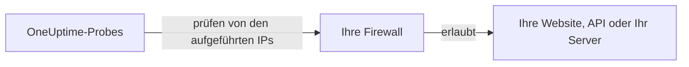

# IP-Adressen

Die Probes von OneUptime Cloud prüfen Ihre Websites, APIs und Server von einer festen Gruppe von IP-Adressen aus. Steht eine Firewall oder eine Allowlist vor dem, was Sie überwachen, erlauben Sie diese Adressen, damit die Prüfungen durchkommen.



## Zu erlaubende IP-Adressen

Erlauben Sie in Ihrer Firewall den Datenverkehr von diesen Adressen:

{{IP_WHITELIST}}

> [!NOTE]
> Diese Adressen können sich ändern. OneUptime informiert Sie vorab, wenn das passiert. Um auf dem neuesten Stand zu bleiben, ohne auf Ankündigungen zu achten, [rufen Sie die Liste ab](#die-liste-programmatisch-abrufen), wenn Sie Ihre Firewall aktualisieren.

## Die Liste programmatisch abrufen

Dieselbe Liste wird als JSON ausgeliefert, ganz ohne API-Schlüssel, damit ein Skript Ihre Firewall-Regeln aktuell halten kann:

```bash
curl -s https://oneuptime.com/ip-whitelist
```

```json
{
  "ipWhitelist": ["<list of IPs>"]
}
```

`ipWhitelist` ist ein Array mit einer Adresse pro Eintrag. So geben Sie eine Adresse pro Zeile aus, etwa für ein Firewall-Skript:

```bash
curl -s https://oneuptime.com/ip-whitelist | jq -r '.ipWhitelist[]'
```

## Selbst gehostetes OneUptime

Auf Ihrer eigenen Instanz zeigen diese Seite und der Endpunkt `/ip-whitelist` die Adressen aus der Einstellung `IP_WHITELIST` der Instanz, einer kommagetrennten Liste. Tragen Sie die Adressen ein, von denen Ihre eigenen Probes ihre Prüfungen senden.

:::tabs
@tab Kubernetes
Setzen Sie den Wert `ipWhitelist` des Helm-Charts:

```yaml title="values.yaml"
ipWhitelist: "203.0.113.1,203.0.113.2"
```
@tab Docker Compose
`config.env` gibt die Einstellung nicht an die App weiter. Fügen Sie sie der Umgebung des Dienstes `app` in einer `docker-compose.override.yml` neben `docker-compose.yml` hinzu und starten Sie OneUptime dann neu:

```yaml title="docker-compose.override.yml"
services:
  app:
    environment:
      IP_WHITELIST: "203.0.113.1,203.0.113.2"
```
:::

Ist nichts gesetzt, zeigt diese Seite **No IP addresses configured.** und der Endpunkt liefert ein leeres Array `ipWhitelist`.

## Nächste Schritte

:::cards
- [Benutzerdefinierte Probes](/docs/probe/custom-probe): Eine Probe in Ihrem eigenen Netzwerk betreiben, statt die Firewall zu öffnen.
- [Einen Monitor erstellen](/docs/monitor/create-monitor): Eine Website, eine API oder einen Server prüfen.
:::
