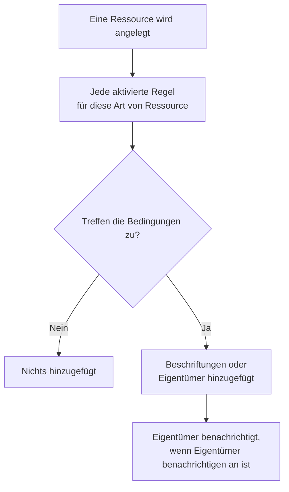

# Beschriftungs- und Eigentümerregeln

Beschriftungsregeln und Eigentümerregeln ordnen Ihre Ressourcen für Sie. Eine **Beschriftungsregel** versieht jede neue Ressource, auf die sie zutrifft, mit Beschriftungen, und eine **Eigentümerregel** fügt ihr Benutzer und Teams als Eigentümer hinzu – so erhält ein neuer Datenbank-Vorfall die Beschriftung _Datenbank_ und gehört dem Datenbank-Team, ohne dass jemand daran denken muss.

:::cards
- [Eine Regel anlegen](#eine-regel-anlegen): Zwei Schritte: worauf die Regel zutrifft, dann was sie hinzufügt.
- [Beschriftungen und Eigentümer erben](#beschriftungen-und-eigentümer-erben): Weitergeben, was die Monitore, Hosts und Dienste eines Ereignisses tragen.
- [Wann Regeln laufen](#wann-regeln-laufen): Neue Ressourcen, und **Jetzt ausführen** für die, die Sie schon haben.
:::

## So funktioniert es

Regeln laufen, wenn eine Ressource angelegt wird. Jede aktivierte Regel prüft ihre Bedingungen an der neuen Ressource, und jede Regel, die zutrifft, fügt hinzu, was sie hinzufügt.

Über Beschriftungen und Eigentümer filtern und gruppieren Sie Ressourcen, sie bestimmen, wen OneUptime über sie benachrichtigt, und was [auf Beschriftungen beschränkte und auf eigene Ressourcen beschränkte Berechtigungen](/docs/permissions/index) erreichen. Regeln halten sie einheitlich, ohne dass jemand daran denken muss.

## Wo Sie die Regeln finden

Jedes Produkt mit Beschriftungen und Eigentümern hat beide Arten unter seinen **Einstellungen** (bei Vorfällen, Warnungen und geplanter Wartung unter **Regeln**): Monitore, Vorfälle und Vorfall-Episoden, Warnungen und Warnungs-Episoden, Ereignisse geplanter Wartung, Statusseiten, Dienste, Hosts, Kubernetes-Cluster, Docker-Hosts, Docker-Swarm-Cluster, Podman-Hosts, Proxmox-Cluster, VMware-vCenter, Ceph-Cluster, Speicher-Arrays, Datenbanken, Warteschlangen, IoT-Flotten, Serverless-Funktionen, Cloud-Ressourcen, RUM-Anwendungen, Dashboards, Bereitschaftsrichtlinien, Bereitschaftspläne, Richtlinien für eingehende Anrufe, Workflows, Runbooks, Netzwerkgeräte und SLOs.

Beschriftungsregeln für Monitore finden Sie zum Beispiel unter **Monitore → Einstellungen → Beschriftungsregeln**, solche für Vorfälle unter **Vorfälle → Regeln → Beschriftungsregeln**. **Einstellungen** und **Regeln** sind im Seitenmenü anfangs eingeklappt: Klicken Sie auf den Titel des Abschnitts, um ihn zu öffnen. Die Seiten für Vorfälle und Warnungen haben einen Tab **Vorfallsregeln** (bzw. **Warnungsregeln**) und einen Tab **Episodenregeln**.

## Eine Regel anlegen

Jede Beschriftungs- und Eigentümerregel wird auf dieselbe Weise angelegt, in zwei Schritten.

:::steps
### Die Regelliste öffnen

Öffnen Sie die Seite **Beschriftungsregeln** oder **Eigentümerregeln** des Produkts und klicken Sie auf die Schaltfläche zum Anlegen, die nach der Regel benannt ist, zum Beispiel **Beschriftungsregel für Monitore erstellen**.

### Festlegen, worauf die Regel zutrifft

Klicken Sie im Schritt **Übereinstimmung** für jede Bedingung, die die Ressource erfüllen muss, auf **Bedingung hinzufügen**. Bei zwei oder mehr Bedingungen wählen Sie **Alle müssen zutreffen** oder **Eine muss zutreffen**. Eine Regel ohne Bedingungen trifft auf jede neue Ressource zu.

### Festlegen, was die Regel hinzufügt

Wählen Sie im Schritt **Beschriftungen** die **Hinzuzufügende Beschriftungen**. Bei einer Eigentümerregel heißt der Schritt **Eigentümer**: **Eigentümer hinzufügen** öffnet eine gemeinsame Liste von Personen und Teams.

Der **Name** wird aus Ihrer Auswahl gebildet (_Production hinzufügen_, _Platform als Eigentümer hinzufügen_) und folgt Ihrer Auswahl, bis Sie einen eigenen Namen eingeben. Eine Regel, die nur erbt, wird stattdessen danach benannt, wovon sie erbt (siehe unten).

### Die eingeklappten Felder prüfen

**Weitere Felder** enthält die optionale **Beschreibung** und bei einer Eigentümerregel **Eigentümer benachrichtigen**, das standardmäßig an ist: Die Eigentümer, die eine Regel hinzufügt, erhalten dieselbe Benachrichtigung „Sie wurden als Eigentümer hinzugefügt“ wie ein von Hand hinzugefügter Eigentümer. Schalten Sie es aus, um Eigentümer ohne Benachrichtigung hinzuzufügen.

### Die Regel speichern

Klicken Sie im letzten Schritt erneut auf die nach der Regel benannte Schaltfläche, etwa **Beschriftungsregel für Monitore erstellen**. Die Regel ist von Anfang an aktiviert, und die Liste zeigt sie mit einer grünen Markierung **Aktiviert**.
:::

Eine neue Regel muss etwas hinzufügen: mindestens eine Beschriftung (oder einen Eigentümer) oder, bei einer Regel für Vorfälle, Warnungen oder geplante Wartung, etwas, das sie erbt (siehe unten). Um eine Regel anzuhalten, ohne sie zu löschen, schalten Sie **Aktiviert** in ihrem Bearbeitungsformular aus; die Liste zeigt dann eine rote Markierung **Deaktiviert**.

### Wie auch immer die Regel angelegt wird

Dasselbe gilt für eine Regel, die über die API, Terraform, einen Workflow oder einen [Import von Beschriftungsregeln](/docs/configuration/label-rule-import-export) angelegt wird: OneUptime lehnt eine neue Regel ab, die nichts hinzufügt, mit einer Meldung, die die auszufüllenden Felder nennt. Die Meldungen sind in jeder Sprache englisch.

| Regel | Meldung |
| --- | --- |
| Beschriftungsregel | This label rule adds nothing. Choose at least one label in Labels to Add. |
| Beschriftungsregel für Vorfälle, Warnungen oder geplante Wartung | This label rule adds nothing. Choose at least one label in Labels to Add, or turn on an Inherit Labels switch. |
| Eigentümerregel | This owner rule adds nothing. Choose at least one user or team in Owner Users or Owner Teams. |
| Eigentümerregel für Vorfälle, Warnungen oder geplante Wartung | This owner rule adds nothing. Choose at least one user or team in Owner Users or Owner Teams, or turn on an Inherit Owners switch. |

- **API**: Setzen Sie `labelsToAdd` (oder `ownerUsers` / `ownerTeams`) auf mindestens einen Datensatz des Projekts oder einen der Schalter `inheritLabelsFrom…` (`inheritOwnersFrom…`) der Regel auf `true` – einen JSON-Boolean.
- **Terraform**: Eine Ressource für eine Beschriftungs- oder Eigentümerregel, die nichts hinzufügt, scheitert bei `terraform apply` mit der obigen Meldung. Geben Sie ihr `labels_to_add` (oder `owner_users` / `owner_teams`) oder schalten Sie einen ihrer Erben-Schalter ein.

Regeln, die Sie bereits haben, bleiben unberührt – siehe [Eine Regel bearbeiten](#eine-regel-bearbeiten).

## Beschriftungen und Eigentümer erben

Regeln für Vorfälle, Warnungen und geplante Wartung können außerdem weitergeben, was die Ressourcen tragen, die ein Ereignis betrifft. Unter **Hinzuzufügende Beschriftungen** (bzw. **Eigentümer**) enthält der eingeklappte Abschnitt **Beschriftungen erben** (bzw. **Eigentümer erben**) sechs Schalter:

- **Beschriftungen von Monitoren erben** – jede Beschriftung der Monitore des Vorfalls wird auch dem Vorfall zugeordnet. Eine Warnung hat einen einzigen Monitor, daher heißt der Schalter bei einer Warnungsregel **Beschriftungen von Überwachung erben** (und bei einer Eigentümerregel für Warnungen **Eigentümer vom Monitor erben**).
- **Beschriftungen von Hosts erben**, **Beschriftungen von Kubernetes-Clustern erben**, **Beschriftungen von Docker-Hosts erben**, **Beschriftungen von Podman-Hosts übernehmen** und **Beschriftungen von Diensten erben** tun dasselbe für diese Ressourcen.

Eigentümerregeln haben dieselben sechs Schalter für Eigentümer (**Eigentümer von Monitoren erben** und so weiter). Solange kein Schalter an ist, sagt der eingeklappte Abschnitt, wofür er da ist; bei einer Regel, die erbt, öffnet er sich von selbst. Episodenregeln haben keine Erben-Schalter.

Eine Regel, die erbt, kann **Hinzuzufügende Beschriftungen** (bzw. **Eigentümer**) leer lassen: Sie fügt hinzu, was sie erbt. Eine solche Regel wird danach benannt, wovon sie erbt:

| Eingeschaltete Schalter | Name |
| --- | --- |
| **Beschriftungen von Monitoren erben** | _Beschriftungen erben von: Monitore_ |
| **Beschriftungen von Monitoren erben** und **Beschriftungen von Hosts erben** | _Beschriftungen erben von: Monitore, Hosts_ |
| **Beschriftungen von Überwachung erben**, bei einer Warnungsregel | _Beschriftungen erben von: Überwachung_ |

Der Name folgt den Schaltern, bis Sie eine Beschriftung wählen – dann wird die Regel nach ihren Beschriftungen benannt – oder einen eigenen Namen eingeben.

## Eine Regel bearbeiten

Das Bearbeitungsformular einer Regel hat dieselben zwei Schritte und zusätzlich den Schalter **Aktiviert**. Es besteht nicht darauf, was die Regel hinzufügt: Eine Regel, die gespeichert wurde, bevor OneUptime danach fragte – über die API, Terraform, einen Import oder das alte Formular –, fügt vielleicht gar nichts hinzu, und eine Bearbeitung kann alles entfernen, was eine Regel hinzufügt.

Eine solche Regel lässt sich weiterhin umbenennen, ausschalten oder löschen, auch über die API und Terraform. Die Liste kennzeichnet eine Regel, die nichts hinzufügt, neben ihrem Status mit **Fügt nichts hinzu**, ebenso die eigene Seite der Regel. Bearbeiten Sie sie, um festzulegen, was sie hinzufügt, oder löschen Sie sie.

## Wann Regeln laufen

Jede aktivierte Regel läuft, wenn eine Ressource angelegt wird, im Dashboard oder über die API, und jede Regel, die zutrifft, fügt hinzu, was sie hinzufügt:

- Treffen mehrere Regeln zu, fügen sie alle ihre Beschriftungen und Eigentümer hinzu.
- Eine Regel entfernt nie etwas: weder Beschriftungen oder Eigentümer, die jemand von Hand hinzugefügt hat, noch solche, die sie selbst hinzugefügt hat.
- Eine deaktivierte Regel tut nichts.

Eine Regel, die Sie heute schreiben, gilt für die Ressourcen, die danach angelegt werden. Um sie auf die Ressourcen anzuwenden, die Sie schon haben, verwenden Sie **Jetzt ausführen** – siehe [Regeln für bestehende Ressourcen ausführen](/docs/configuration/run-rules-now). Beschriftungsregeln lassen sich auch zwischen Projekten kopieren – siehe [Beschriftungsregeln importieren und exportieren](/docs/configuration/label-rule-import-export).

## Nächste Schritte

:::cards
- [Regeln für bestehende Ressourcen ausführen](/docs/configuration/run-rules-now): Eine Regel auf die Ressourcen anwenden, die Sie schon haben.
- [Beschriftungsregeln importieren und exportieren](/docs/configuration/label-rule-import-export): Beschriftungsregeln als JSON zwischen Projekten kopieren.
- [Vorfalleinstellungen & Automatisierung](/docs/incidents/settings): Die anderen Regeln, die ein Vorfall ausführen kann.
- [SLO-Beschriftungs- und Eigentümerregeln](/docs/slo/label-and-owner-rules): Worauf SLO-Regeln zutreffen.
:::
