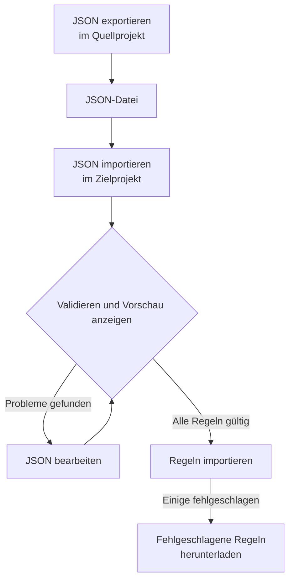

# Beschriftungsregeln importieren und exportieren

Kopieren Sie Beschriftungsregeln zwischen Projekten oder legen Sie viele auf einmal an, als JSON-Datei. Jede Seite **Beschriftungsregeln** hat die Aktionen **JSON exportieren** und **JSON importieren** in ihrem Menü **Weitere Optionen** (**⋯**), auch bei Vorfällen, Warnungen, Monitoren und Netzwerkgeräten. Die einzige Ausnahme ist VMware: Seine Beschriftungsregeln für vCenter haben keine der beiden.



## Regeln exportieren

Öffnen Sie **Weitere Optionen** und wählen Sie **JSON exportieren**, um alle Regeln dieses Typs im aktuellen Projekt herunterzuladen. Der Export umfasst auch Regeln auf anderen Seiten der Tabelle und ignoriert Tabellenfilter.

Die Datei behält für jede Regel den Status „aktiviert“, die Bedingungen, die hinzuzufügenden Beschriftungen und die Optionen zum Erben von Beschriftungen. Projekt-IDs, Regel-IDs und Prüffelder werden weggelassen.

Verknüpfte Beschriftungen, Monitore und Schweregrade werden mit ihrem genauen Namen geschrieben. Ein Import legt sie nicht an: Sie müssen im Zielprojekt bereits vorhanden sein.

## Regeln importieren

:::steps
### JSON importieren öffnen

Öffnen Sie die Seite **Beschriftungsregeln** des Zielprojekts und wählen Sie **Weitere Optionen → JSON importieren**.

### Die Datei hinzufügen

Laden Sie eine JSON-Exportdatei hoch oder fügen Sie ihren Inhalt ein.

### Validieren und Vorschau ansehen

Wählen Sie **Validieren und Vorschau anzeigen**. Jede Regel wird geprüft, bevor auch nur eine angelegt wird, und referenzierte Ressourcen müssen im Zielprojekt mit eindeutigen, passenden Namen existieren.

### Die Vorschau prüfen

Prüfen Sie Regelnamen, Status, Beschriftungen und Bedingungen. Ein großer Stapel wird seitenweise angezeigt. Um etwas zu korrigieren, wählen Sie **JSON bearbeiten** und validieren Sie erneut.

### Importieren

Wählen Sie die Import-Schaltfläche, die die Regeln zählt (zum Beispiel **Import 2 rules**), und lassen Sie das Fenster geöffnet, bis die Ergebnisse erscheinen.
:::

Importe fügen neue Regeln hinzu und behalten vorhandene, daher legt ein erneuter Import derselben Datei eine weitere Kopie an. Für jede Regel gelten die üblichen Berechtigungen zum Anlegen und die Validierung auf dem Server.

Wenn einige Regeln fehlschlagen, wählen Sie **Fehlgeschlagene Regeln herunterladen**, um nur diese Zeilen zu speichern, korrigieren Sie sie und importieren Sie diese Datei erneut. Wenn eine Anfrage in eine Zeitüberschreitung läuft, prüfen Sie die Regelliste, bevor Sie es erneut versuchen: Der Server hat die Regel möglicherweise gespeichert, bevor seine Antwort verloren ging.

## Einen Stapel in JSON anlegen

Exportieren Sie eine vorhandene Regel, um ein Beispiel für Ihren Ressourcentyp zu erhalten, und bearbeiten oder ergänzen Sie dann Einträge im Array `items`. Dieses Beispiel legt zwei Beschriftungsregeln für Monitore an. Die Beschriftungen `Production` und `Infrastructure` müssen im Zielprojekt bereits vorhanden sein.

```json title="monitor-label-rules.json"
{
  "fileType": "oneuptime-label-rules",
  "schemaVersion": 1,
  "resourceType": "MonitorLabelRule",
  "items": [
    {
      "name": "Production API monitors",
      "description": "Label production API monitors automatically",
      "isEnabled": true,
      "monitorNamePattern": "^api-prod-",
      "monitorLabels": [],
      "labelsToAdd": ["Production"]
    },
    {
      "name": "Database monitors",
      "isEnabled": false,
      "monitorNamePattern": "^database-",
      "labelsToAdd": ["Infrastructure"]
    }
  ]
}
```

| Feld | Was es enthält |
| --- | --- |
| `fileType` | Immer `oneuptime-label-rules`. |
| `schemaVersion` | Immer `1`. |
| `resourceType` | Die Art von Regel, die die Datei enthält, etwa `MonitorLabelRule`. |
| `items` | Die Regeln, je ein Objekt. Eine Datei braucht mindestens eine. |

Verwenden Sie JSON-Booleans für `isEnabled`, Text für Muster und Arrays von Namen für verknüpfte Ressourcen.

Folgendes stoppt den ganzen Stapel vor dem Importschritt: ungültige Muster, unbekannte Felder, fehlende Namen und mehrdeutige Verweise. Ebenso eine Regel, die nichts hinzufügt – ein leeres `labelsToAdd` und, bei einer Regel für Vorfälle, Warnungen oder geplante Wartung, kein Schalter `inheritLabelsFrom…` auf `true` –, denn OneUptime lehnt es ab, eine solche anzulegen (siehe [Beschriftungs- und Eigentümerregeln](/docs/configuration/label-and-owner-rules#wie-auch-immer-die-regel-angelegt-wird)). Ein Export kann eine solche Regel enthalten, wenn sie vor dieser Prüfung gespeichert wurde; geben Sie ihr eine Beschriftung oder entfernen Sie sie vor dem Import aus der Datei.

> [!NOTE]
> Dateien und eingefügtes JSON sind auf 10 MB begrenzt.

## Zwischen Ressourcentypen kopieren

Behalten Sie den ursprünglichen `resourceType` in der Datei und öffnen Sie **JSON importieren** auf der Zielseite. Kompatible Muster für den primären Namen oder Titel, Beschreibungsmuster und vorausgesetzte Beschriftungen werden den Feldern des Ziels zugeordnet, und die Vorschau listet diese Zuordnungen auf, damit Sie sie prüfen können. Verweise auf Schweregrade von Vorfällen und Warnungen werden mit den Namen der Schweregrade im Ziel abgeglichen.

Bedingungen oder Aktionen, die das Ziel nicht unterstützt, blockieren den Import. Eine Vorfallsregel, die auf bestimmte Monitore beschränkt ist, lässt sich zum Beispiel nicht in Netzwerkgeräte-Regeln kopieren, ohne diese Bedingungen zu bearbeiten.

> [!WARNING]
> Beschriftungsregeln für Netzwerkgeräte und SLOs unterstützen neben regulären Ausdrücken auch Platzhalter. Eine Übertragung zwischen diesen Regeln und anderen Regeltypen lehnt Muster ab, die `*` oder umgebende Leerzeichen enthalten, weil sie dort anders zutreffen. Bearbeiten Sie diese Muster für das Ziel oder behalten Sie die Regel innerhalb desselben Ressourcentyps. Beschriftungsregeln für Netzwerkgeräte und SLOs können beliebige Muster untereinander austauschen, weil sie auf dieselbe Weise zutreffen.

## Nächste Schritte

:::cards
- [Beschriftungs- und Eigentümerregeln](/docs/configuration/label-and-owner-rules): Worauf eine Beschriftungsregel zutrifft und was sie hinzufügt.
- [Regeln für bestehende Ressourcen ausführen](/docs/configuration/run-rules-now): Importierte Regeln auf die Ressourcen anwenden, die Sie schon haben.
:::
