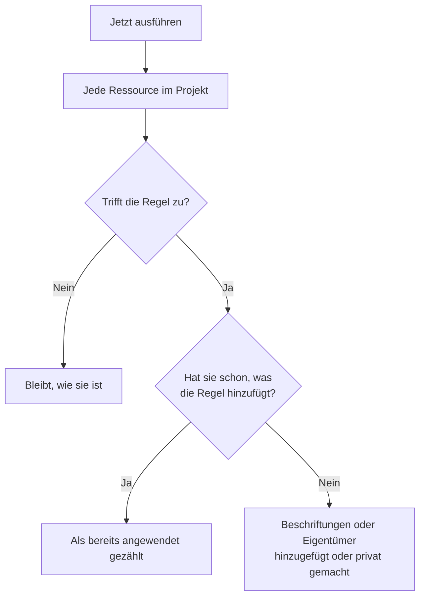

# Regeln für bestehende Ressourcen ausführen

Beschriftungsregeln, Eigentümerregeln und Datenschutzregeln laufen automatisch, wenn eine Ressource **angelegt** wird. Eine Regel, die Sie heute schreiben, ändert daher nichts an den Monitoren, Vorfällen oder Hosts, die Sie schon haben. **Jetzt ausführen** schließt diese Lücke: Es wendet eine Regel auf jede Ressource an, die im Projekt bereits existiert.

## Welche Regeln sich ausführen lassen

- **Beschriftungsregeln** und **Eigentümerregeln**, für jede Ressource, die sie hat: Monitore, Vorfälle, Vorfall-Episoden, Warnungen, Warnungs-Episoden, Ereignisse geplanter Wartung, Statusseiten, Dienste, Hosts, Kubernetes-Cluster, Docker-Hosts, Docker-Swarm-Cluster, Podman-Hosts, Proxmox-Cluster, VMware-vCenter, Ceph-Cluster, Speicher-Arrays, Datenbanken, Warteschlangen, IoT-Flotten, Serverless-Funktionen, Cloud-Ressourcen, RUM-Anwendungen, Dashboards, Bereitschaftsrichtlinien, Bereitschaftspläne, Richtlinien für eingehende Anrufe, Workflows, Runbooks, Netzwerkgeräte und SLOs.
- **Datenschutzregeln**, für Vorfälle, Warnungen, Vorfall-Episoden und Warnungs-Episoden.
- **Monitor-Regeln** auf einer Statusseite. Sie gleichen die Seite ohnehin bei jedem Speichern einer Regel neu ab; wenn Sie eine ausführen, geschieht das sofort.
- **Monitor-Regeln** auf einem SLO. Sie gleichen das SLO ohnehin bei jedem Speichern einer Regel neu ab; wenn Sie eine ausführen, werden die Monitore des SLOs sofort neu abgeglichen. Siehe [Monitore und Monitor-Regeln](/docs/slo/monitor-rules).

Regeln, die eine Aktion auslösen, statt eine Ressource zu beschreiben – **Bereitschaftsregeln**, **Runbook-Regeln**, **Regeln für automatische Behebung** und **Gruppierungsregeln** –, lassen sich nicht auf bestehende Datensätze anwenden. Sie auszuführen würde Personen alarmieren, Runbooks ausführen, Behebungen starten oder Episoden für Vorfälle umordnen, die längst vorbei sind.

## Bevor Sie beginnen

Um eine Regel auszuführen, brauchen Sie die Berechtigung, die Regel zu bearbeiten, **und** die Ressourcen zu bearbeiten, die sie ändert – eine Beschriftungsregel für Monitore braucht zum Beispiel sowohl die Bearbeitungsberechtigung für Beschriftungsregeln von Monitoren als auch die für Monitore. Eigentümerregeln brauchen zusätzlich die Berechtigung, Eigentümer hinzuzufügen. Monitor-Regeln auf einer Statusseite oder einem SLO brauchen nur die Berechtigung, die Regel zu bearbeiten.

> [!IMPORTANT]
> Eine Berechtigung, die auf bestimmte Beschriftungen oder auf Ihre eigenen Ressourcen beschränkt ist, reicht nicht: Eine Ausführung kann jede Ressource im Projekt ändern. Sperrlisten von Teams gelten wie überall sonst, und eine Sperre, die auf einige Beschriftungen beschränkt ist, zählt ebenfalls: Eine Ausführung würde die Ressourcen mit diesen Beschriftungen ändern, daher lehnt eine Sperre mit Beschriftungen auf das Bearbeiten der Ressourcen, die eine Regel ändert, die Ausführung ab.

Die Regeln eines Netzwerks verlangen dasselbe, wenn Sie sie auf die Geräte anwenden, die Sie schon haben. **Jetzt ausführen** einer Standortzuweisungs- oder Gerätebeschriftungsregel braucht die Berechtigung, die Regel zu bearbeiten, und **Edit Network Device**. **Probelauf** und **Regel ausführen** einer Auto-Import-Regel brauchen die Berechtigung, die Regel zu bearbeiten, **Create Network Device** und, wenn die Regel eine Monitor-Vorlage hat, **Create Monitor**. Jede muss das ganze Projekt erreichen. Siehe [Automatisch importieren mit Auto-Import-Regeln](/docs/monitor/network-device-monitor#importing-automatically-with-auto-import-rules).

## Eine Regel ausführen

:::steps
### Die Regelliste öffnen

Öffnen Sie die Regelseite, zum Beispiel **Monitore → Einstellungen → Beschriftungsregeln**.

### Jetzt ausführen wählen

Öffnen Sie das Menü **⋯** am Ende der Zeile der Regel und wählen Sie **Jetzt ausführen**, oder wählen Sie **Ansehen** und dann **Jetzt ausführen** auf der eigenen Seite der Regel. Ein Dialog sagt, was die Ausführung tun wird.

### Entscheiden, ob neue Eigentümer benachrichtigt werden

Entscheiden Sie bei einer Eigentümerregel, ob **Die von dieser Ausführung hinzugefügten Eigentümer benachrichtigen** gelten soll. Die Option ist standardmäßig aus und wirkt nur, wenn bei der Regel selbst **Eigentümer benachrichtigen** eingeschaltet ist. Ein Eigentümer wird für jede Ressource, der er hinzugefügt wird, einmal benachrichtigt.

### Die Regel ausführen

Wählen Sie **Regel ausführen** und lassen Sie den Dialog geöffnet. Bei einem großen Projekt zeigt der Dialog, wie weit die Ausführung gekommen ist.

### Den Bericht lesen

Wenn die Ausführung fertig ist, meldet der Dialog, auf wie viele Ressourcen die Regel zutraf, wie viele sie geändert hat und wie viele schon hatten, was die Regel hinzufügt.
:::

## Mehrere Regeln ausführen

Wählen Sie Regeln in der Tabelle aus, öffnen Sie das Menü der Sammelaktionen und wählen Sie **Jetzt ausführen**. Die ausgewählten Regeln laufen nacheinander.

- Eigentümer, die eine Sammelausführung hinzufügt, werden nie benachrichtigt. Um sie zu benachrichtigen, führen Sie stattdessen eine einzelne Regel aus.
- Eine Regel, die nicht laufen kann – zum Beispiel, weil sie deaktiviert ist –, wird mit dem Grund aufgeführt, und die anderen Regeln laufen trotzdem.

## Was eine Ausführung tut

- **Sie fügt nur hinzu.** Beschriftungen werden zugeordnet, Eigentümer hinzugefügt, Ressourcen privat gemacht. Nichts wird entfernt und nichts öffentlich gemacht, daher ist es sicher, eine Regel erneut auszuführen: Die zweite Ausführung meldet, dass alles bereits angewendet war.
- **Jede Ressource im Projekt wird geprüft**, auch gelöste Vorfälle und Warnungen.
- **Vorhandene Eigentümer werden übersprungen**, nie doppelt hinzugefügt.
- **Nur die eigenen Beschriftungen Ihres Projekts werden hinzugefügt.** Eine Beschriftung, die die Regel nennt und die nicht mehr zu den Beschriftungen Ihres Projekts gehört, wird übersprungen, und die anderen Beschriftungen der Regel werden trotzdem hinzugefügt. Dasselbe gilt, wenn eine Regel auf einer neuen Ressource läuft.
- **Die Regel wird genauso angewendet wie beim Anlegen**, einschließlich der Beschriftungen und Eigentümer, die von den Monitoren, Hosts und Diensten eines Vorfalls geerbt werden. Wo die Ressource einen Aktivitätsverlauf hat, hält der Verlauf fest, welche Regel sie geändert hat.
- **Deaktivierte Regeln laufen nicht.** Aktivieren Sie die Regel zuerst.
- **Monitor-Regeln von Statusseiten** fügen die Monitore hinzu, auf die sie zutreffen, und entfernen die Monitore, die sie früher hinzugefügt haben und auf die sie nicht mehr zutreffen. Von Hand zur Seite hinzugefügte Monitore werden nie angetastet.
- **Eine einzelne Ausführung umfasst bis zu 100.000 Ressourcen.** Bei einem größeren Projekt hält die Ausführung an und sagt das; führen Sie die Regel erneut aus, um fortzufahren.

## Nächste Schritte

:::cards
- [Beschriftungs- und Eigentümerregeln](/docs/configuration/label-and-owner-rules): Die Regeln schreiben, die eine Ausführung anwendet.
- [Beschriftungsregeln importieren und exportieren](/docs/configuration/label-rule-import-export): Beschriftungsregeln zuerst aus einem anderen Projekt übernehmen.
- [Vorfalleinstellungen & Automatisierung](/docs/incidents/settings): Regeln für Vorfälle, einschließlich Datenschutzregeln.
:::
