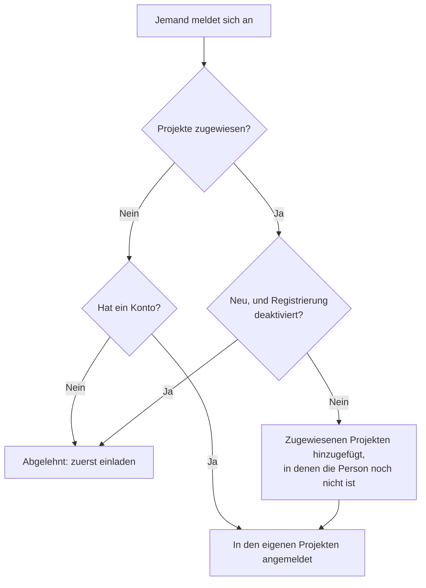

# Globales SSO

Mit Global SSO richtet ein **Instanzadministrator** (Master-Admin) von OneUptime einen SAML-2.0- oder OpenID-Connect-Identitätsanbieter (OIDC) **einmal** auf Instanzebene ein und verbindet ihn mit beliebigen Projekten auf dem Server. Statt dass jeder Projekteigentümer einen eigenen Identitätsanbieter konfiguriert, richtet ein Master-Admin einen ein, der die ganze Instanz bedient.

> [!NOTE]
> Global SSO, einschließlich des instanzweiten Schalters "Require SSO for Login", ist Teil jeder OneUptime-Edition: Jede selbst gehostete Instanz hat es, auch die Community Edition, und es braucht keine Lizenz. Es gehört zur Instanzverwaltung und gilt daher nicht für OneUptime Cloud. Was jede Edition enthält, sehen Sie unter [Enterprise Edition](/docs/self-hosted/enterprise).

:::cards
- [Einen Anbieter einrichten](#global-sso-einrichten): Anlegen, Ihrem Identitätsanbieter die URLs von OneUptime geben und testen.
- [So melden sich Benutzer an](#so-melden-sich-benutzer-an): Nur bestehende Mitglieder oder Neue, die den zugewiesenen Projekten hinzugefügt werden.
- [SSO durchsetzen](#sso-durchsetzen): SSO für ein Projekt oder für die ganze Instanz verlangen.
- [Einen Anbieter ausschalten](#einen-anbieter-ausschalten-oder-löschen): Was endet und welche Änderungen OneUptime ablehnt.
:::

## Global SSO und Projekt-SSO im Vergleich

|                  | Projekt-SSO                                       | Global SSO                                          |
| ---------------- | ------------------------------------------------- | --------------------------------------------------- |
| Eingerichtet von | Projekteigentümer/-admin (Projekteinstellungen)   | Master-Admin der Instanz (Admin Dashboard)          |
| Reichweite       | Ein einzelnes Projekt                             | Die ganze Instanz – mit jedem Projekt verbindbar    |
| Ergebnis der Anmeldung | Zugriff auf dieses eine Projekt             | Zugriff auf jedes Projekt, das der Benutzer erreicht |

Für den eigenen Anbieter eines einzelnen Projekts siehe [SSO](/docs/identity/sso).

## Global SSO einrichten

:::steps
### Die Anbieterliste öffnen

:::tabs
@tab SAML
Melden Sie sich als Master-Admin an und öffnen Sie das Admin Dashboard über **Admin-Einstellungen** in Ihrem Benutzermenü. Gehen Sie dann zu **Einstellungen** > **Authentifizierung** > **Global SSO**.
@tab OpenID Connect
Melden Sie sich als Master-Admin an und öffnen Sie das Admin Dashboard über **Admin-Einstellungen** in Ihrem Benutzermenü. Gehen Sie dann zu **Einstellungen** > **Authentifizierung** > **Global OIDC**.
:::

### Den Anbieter anlegen

:::tabs
@tab SAML
- Klicken Sie auf **Create Global SSO**.
- Geben Sie einen **Name**, die **Sign On URL** und den **Issuer** Ihres Identitätsanbieters ein und fügen Sie das **Public Certificate** ein. Alles Weitere ist unter **Weitere Felder** ausgefüllt: die **Signature Method** (`RSA-SHA256`), die **Digest Method** (`SHA256`) und eine Beschreibung (`Sign in with` und der Name). Ändern Sie sie nur, wenn Ihr IdP es verlangt. Beim Speichern öffnet sich die Seite des Anbieters.
@tab OpenID Connect
- Klicken Sie auf **Create Global OIDC**.
- Geben Sie einen **Name**, die **Issuer URL** sowie die **Client ID** und das **Client Secret** der App ein, die Sie in Ihrem IdP registriert haben. Die Discovery-URL des IdP in **Issuer URL** einzufügen funktioniert auch. Alles Weitere ist unter **Weitere Felder** ausgefüllt: die **Discovery URL** (der Issuer, gefolgt von `/.well-known/openid-configuration`), die **Scopes** (`openid email profile`), die Claim-Namen `email` und `name` sowie eine Beschreibung (`Sign in with` und der Name). Ändern Sie sie nur, wenn Ihr IdP es verlangt. Beim Speichern öffnet sich die Seite des Anbieters.
:::

### Die URLs von OneUptime in Ihren Identitätsanbieter kopieren

:::tabs
@tab SAML
Auf der Seite des Anbieters zeigt die Karte **Identity Provider URLs** die **ACS URL (Assertion Consumer Service / Reply URL)** und den **Issuer (Entity ID)**. Fügen Sie beide in Ihren Identitätsanbieter ein (Okta, Microsoft Entra ID, OneLogin, JumpCloud und andere).
@tab OpenID Connect
Auf der Seite des Anbieters zeigt die Karte **Identity Provider URL** die **Redirect URI (Callback URL)**. Fügen Sie sie den erlaubten Weiterleitungs-URIs Ihres Identitätsanbieters hinzu.
:::

### Den Anbieter einschalten

Ein neuer Anbieter ist zunächst ausgeschaltet. Klicken Sie auf der Seite des Anbieters auf **Edit Configuration** und schalten Sie **Aktiviert** ein.

Einen globalen Anbieter einzuschalten fügt der Anmeldeseite nur eine Option "Sign in with SSO" hinzu – es erzwingt nie SSO und sperrt niemanden aus. Sie können ihn also gefahrlos einschalten, testen und bei Bedarf wieder ausschalten.

### Den Anbieter testen

Mit dem Link in der Karte **Test this SSO provider** (**Test this OIDC provider** bei OpenID Connect) führen Sie eine vollständige Anmeldung über Ihren Identitätsanbieter durch. Sie müssen vorher keine Projekte zuweisen: Der Test meldet Sie in den Projekten an, zu denen Sie schon gehören. Der Anbieter muss eingeschaltet sein, damit der Link funktioniert.
:::

## So melden sich Benutzer an

Wie sich ein globaler Anbieter verhält, hängt davon ab, ob Sie ihm Projekte zuweisen:

- **Keine Projekte zugewiesen (alle Projekte / zuerst einladen):** Benutzer können sich mit dem Anbieter anmelden und **jedes Projekt, in dem sie schon Mitglied sind**, erreichen. Neue Benutzer werden **nicht** automatisch angelegt – ein Benutzer muss zuerst in ein Projekt eingeladen werden. Nutzen Sie das für unternehmensweites SSO, wenn Mitgliedschaften anderswo verwaltet werden.

- **Projekte zugewiesen (automatische Bereitstellung):** Öffnen Sie den Anbieter und weisen Sie über die Tabelle **Attached Projects** ein oder mehrere Projekte zu, jeweils mit einer Reihe von Standard-Teams. Benutzer, die sich anmelden, werden bei der ersten Anmeldung **automatisch bereitgestellt**: in diese Projekte aufgenommen und den Standard-Teams hinzugefügt. Ein zugewiesenes Projekt beginnt mit seinem Mitglieder-Team; wählen Sie andere Teams, wenn neue Benutzer mit anderem Zugriff starten sollen. Fügen Sie jeweils ein Projekt + Teams hinzu, um die Liste aufzubauen; um eine Zuweisung zu ändern, löschen Sie sie und fügen Sie sie erneut hinzu.

Wer bereits Mitglied eines zugewiesenen Projekts ist, behält dort seine Teams.

Zwei Schalter am Anbieter ändern das. Beide sind zunächst aus und unter **Weitere Felder** eingeklappt:

| Schalter | Was er bewirkt, wenn er eingeschaltet ist |
| --- | --- |
| **Disable Sign Up with SSO** | Personen müssen in ein Projekt eingeladen sein, bevor sie sich mit diesem Anbieter anmelden können, auch wenn Projekte zugewiesen sind. Bei der ersten Anmeldung wird niemand neu angelegt. |
| **Restrict to Attached Projects** | Die Anmeldung mit diesem Anbieter erfüllt die SSO-Pflicht nur in den ihm zugewiesenen Projekten, sodass bereits angemeldete Personen den Zugriff auf andere Projekte verlieren können. Ist der Schalter aus, erfüllt sie die Pflicht in jedem Projekt, zu dem die Person gehört, und zugewiesene Projekte bestimmen nur, wohin Neue kommen. |

## SSO durchsetzen

Einen globalen Anbieter einzurichten zwingt niemanden, ihn zu nutzen; die Anmeldung mit Passwort funktioniert weiter. Um SSO zu verlangen, schalten Sie die Anforderung für ein Projekt oder für die ganze Instanz ein:

- **Pro Projekt:** Ein Projekt kann SSO verlangen und optional einen *bestimmten* Anbieter (Projekt- oder globalen Anbieter). Siehe [SSO für Ihr Projekt verlangen](/docs/identity/sso#sso-für-ihr-projekt-verlangen).
- **Instanzweit:** Unter **Admin** > **Einstellungen** > **Authentifizierung** gibt es einen Schalter **SSO für die Anmeldung erfordern**, der SSO für jeden Benutzer der Instanz erzwingt. Er fragt vor dem Einschalten nach einer Bestätigung und speichert, sobald Sie bestätigen. Master-Admins bleiben ausgenommen, damit sie nicht ausgesperrt werden können.

Um **SSO für die Anmeldung erfordern** einzuschalten, braucht es einen SSO-Anbieter, der Personen anmeldet, damit niemand dadurch ausgesperrt wird:

- Für die ganze Instanz braucht jedes Projekt, das nicht selbst SSO verlangt, einen: einen eigenen SAML- oder OIDC-Anbieter, der eingeschaltet ist, oder einen globalen Anbieter, der eingeschaltet ist und Personen in das Projekt anmeldet. Solange ein Projekt keinen hat, wird das Einschalten abgelehnt, und die Meldung nennt die Projekte (oder, bei vielen, die ersten und wie viele es sind). Schalten Sie zuerst einen globalen Anbieter oder einen Anbieter in diesen Projekten ein. Ein Projekt, das einen bestimmten Anbieter verlangt, braucht genau diesen: Solange er ausgeschaltet oder gelöscht ist oder keine Personen in das Projekt anmeldet, nennt die Meldung das Projekt gesondert – schalten Sie zuerst diesen Anbieter ein oder verlangen Sie dort einen anderen.
- Für ein Projekt wird dasselbe für dieses Projekt geprüft und für den Anbieter, den es verlangt, falls es einen verlangt.
- Ein Speichern, das **SSO für die Anmeldung erfordern** als eingeschaltet sendet, obwohl es schon eingeschaltet ist – zusammen mit anderen Einstellungen oder über die API –, wird genauso geprüft, für die Instanz wie für ein Projekt, und ebenso eines, das den Anbieter nennt, den ein Projekt bereits verlangt.
- Für ein neues Projekt, das noch keinen eigenen Anbieter hat: Solange die Instanz SSO verlangt, braucht das Anlegen eines Projekts einen globalen Anbieter, der eingeschaltet ist und Personen in jedes Projekt anmeldet, sonst könnte niemand, auch nicht die Person, die es anlegt, es öffnen. Ohne ihn wird das Anlegen eines Projekts abgelehnt, und die Meldung bittet darum, dass ein Server-Admin einen einschaltet. Master-Admins können weiterhin Projekte anlegen. Ein Projekt, das mit bereits eingeschaltetem **SSO für die Anmeldung erfordern** angelegt wird, braucht dasselbe, egal wer es anlegt.

Das Ausschalten wird nie abgelehnt.

## Einen Anbieter ausschalten oder löschen

Einen globalen Anbieter auszuschalten, zu löschen oder auf seine zugewiesenen Projekte zu beschränken beendet die Anmeldungen, die er erteilt hat, überall dort, wo er keine Personen mehr anmeldet. Wo SSO verlangt wird, müssen sich Personen, die sich damit angemeldet haben, bei ihrer nächsten Anfrage erneut mit SSO anmelden, ihre geöffneten Seiten erhalten sofort keine Live-Updates mehr, und ein MCP-Client, den jemand nach einer Anmeldung damit verbunden hat, funktioniert im Projekt nicht mehr.

Den Anbieter wieder einzuschalten bringt diese Anmeldungen nicht zurück: Die Personen melden sich erneut damit an. Ein Anbieter, der beim Upgrade schon ausgeschaltet war, gilt als beim Upgrade ausgeschaltet.

Ein neues Zertifikat oder Client-Secret, andere URLs oder ein neuer Name lassen alle angemeldet.

### Jedes Projekt, das SSO verlangt, behält einen Weg hinein

Ein Projekt, das SSO verlangt – selbst oder weil die ganze Instanz es tut –, behält immer einen Anbieter, mit dem sich Personen dort anmelden können. Deshalb werden diese Änderungen abgelehnt, solange sie ein solches Projekt ganz ohne Anbieter ließen oder ihm den verlangten Anbieter nähmen:

- einen globalen Anbieter ausschalten, löschen oder auf seine zugewiesenen Projekte beschränken;
- bei einem auf seine zugewiesenen Projekte beschränkten Anbieter: das erste Projekt zuweisen (bis dahin meldet er Personen in jedem Projekt an), eine Zuweisung ausschalten, sie in ein anderes Projekt oder zu einem anderen Anbieter verschieben oder sie entfernen.

Die Meldung nennt die Projekte oder die ersten davon und wie viele es sind. Schalten Sie für sie zuerst einen anderen Anbieter ein, einen eigenen oder einen globalen, oder schalten Sie dort **SSO für die Anmeldung erfordern** aus. Ein Projekt, das genau diesen Anbieter verlangt, wird gesondert genannt: Verlangen Sie dort zuerst einen anderen Anbieter oder schalten Sie **SSO für die Anmeldung erfordern** aus.

Änderungen, mit denen ein Anbieter mehr Personen anmeldet – ihn oder eine Zuweisung einschalten, die Beschränkung aufheben –, werden nie abgelehnt. Sie erreichen alle App-Server sofort, so wie das Ausschalten von **SSO für die Anmeldung erfordern**: Personen können sich sofort mit dem Anbieter anmelden. Nur wenn im selben Moment eine andere Änderung am selben Anbieter gespeichert wird, kann ein App-Server bis zu einer Minute brauchen, um nachzuziehen.

Zwei Änderungen daran, wer sich anmelden kann, werden nacheinander geprüft. Wird im selben Moment eine andere gespeichert und dauert sie länger als üblich – das Einschalten von **SSO für die Anmeldung erfordern** für die ganze Instanz liest jedes Projekt –, wird eine Änderung mit "Another change to who can sign in with SSO is being saved. Try again in a moment." abgelehnt: Speichern Sie sie erneut. Ein Projekt, das in diesem Moment angelegt wird, wartet ebenfalls auf die Änderung, und wartet es zu lange, wird es mit "The server's SSO settings are being changed. Create the project again in a moment." abgelehnt.

## Fehlerbehebung

:::details "You must be invited to a project on this OneUptime instance before you can sign in with SSO"
Die Person hat noch kein OneUptime-Konto, und der Anbieter legt keines an: Entweder sind ihm keine Projekte zugewiesen, oder **Disable Sign Up with SSO** ist eingeschaltet. Laden Sie die Person in ein Projekt ein oder weisen Sie dem Anbieter ein Projekt zu.
:::

:::details "This SSO provider does not grant access to any project you are a member of"
**Restrict to Attached Projects** ist eingeschaltet, und die Person ist in keinem dem Anbieter zugewiesenen Projekt Mitglied. Weisen Sie eines ihrer Projekte zu oder fügen Sie sie einem zugewiesenen Projekt hinzu.
:::

:::details "You are not a member of any project on this OneUptime instance"
Die Person hat ein Konto, gehört aber zu keinem Projekt, und der Anbieter hat nichts, wohin er sie aufnehmen könnte. Laden Sie sie in ein Projekt ein oder weisen Sie dem Anbieter ein Projekt mit Standard-Teams zu.
:::

:::details "Issuer URL does not match"
Bei einem SAML-Anbieter ist der Issuer in der Antwort Ihres Identitätsanbieters nicht der **Issuer**, der am Anbieter gespeichert ist. Kopieren Sie ihn erneut aus Ihrem Identitätsanbieter; beide müssen genau übereinstimmen.
:::

## Nächste Schritte

:::cards
- [SSO](/docs/identity/sso): Den eigenen SAML- oder OIDC-Anbieter eines Projekts einrichten.
- [SCIM](/docs/identity/scim): Ihren Identitätsanbieter Personen automatisch hinzufügen und entfernen lassen.
- [Benutzer, Teams & Berechtigungen](/docs/permissions/index): Was die Teams, in die Neue kommen, ihnen erlauben.
:::
