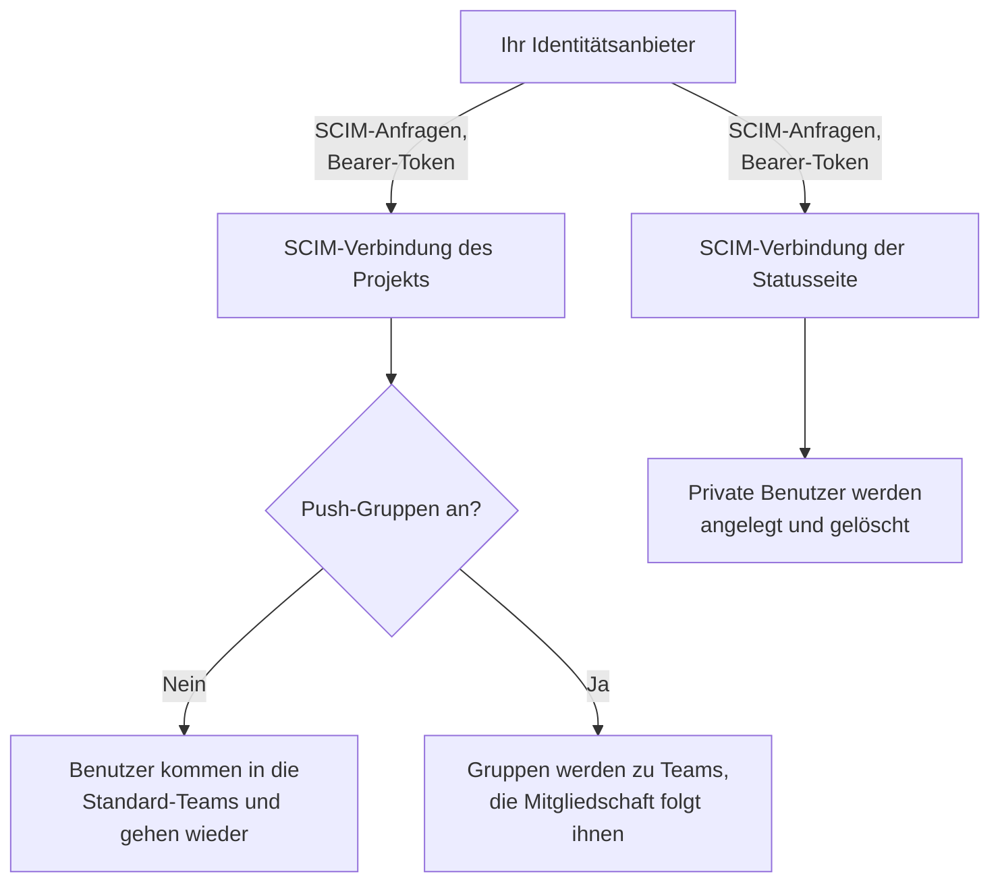
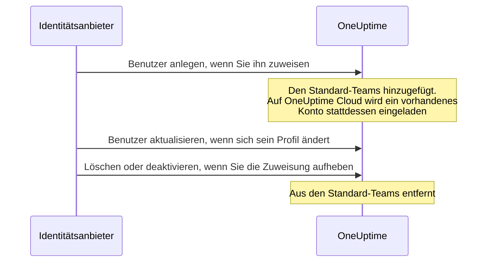

# SCIM

SCIM (System for Cross-domain Identity Management) stellt Personen automatisch bereit und entzieht ihnen den Zugang automatisch. Ihr Identitätsanbieter (IdP) – Microsoft Entra ID, Okta oder jedes andere SCIM-2.0-System – fügt Personen Ihren OneUptime-Projekten und privaten Statusseiten hinzu, wenn Sie sie zuweisen, und entfernt sie, wenn Sie die Zuweisung aufheben.

> [!NOTE]
> **Edition:** SCIM ist Teil der OneUptime Enterprise Edition. Auf OneUptime Cloud ist es ab dem Plan **Scale** verfügbar. Selbst gehostete Installationen brauchen das Image der Enterprise Edition und eine Lizenz. Siehe [Enterprise Edition](/docs/self-hosted/enterprise). Ohne gültige Lizenz (nach der 14-tägigen Testphase oder 30 Tage nach Ablauf einer Lizenz) werden SCIM-Anfragen abgelehnt, bis eine Lizenz aktiviert wird.

:::cards
- [Projekt-SCIM einrichten](#projekt-scim-einrichten): Eine Verbindung anlegen und Ihrem IdP ihre URL und ihr Token geben.
- [Statusseiten-SCIM einrichten](#statusseiten-scim-einrichten): Private Benutzer einer Statusseite bereitstellen.
- [Ihren Identitätsanbieter verbinden](#ihren-identitätsanbieter-einrichten): Schritt für Schritt für Microsoft Entra ID und Okta.
- [FAQ](#häufig-gestellte-fragen): Vorhandene Benutzer, Deprovisionierung, geänderte E-Mail-Adressen.
:::

## So funktioniert es

Ihr Identitätsanbieter ruft den SCIM-Endpunkt von OneUptime auf, authentifiziert mit einem Bearer-Token, sobald Sie jemanden zuweisen, ändern oder die Zuweisung aufheben. Was die Anfrage ändert, hängt davon ab, wo die Verbindung eingerichtet ist:



Die SCIM-Integration bietet folgende Vorteile:

- **Automatische Bereitstellung**: Benutzer werden in OneUptime angelegt, wenn sie in Ihrem IdP zugewiesen werden.
- **Automatische Deprovisionierung**: Benutzer werden aus OneUptime entfernt, wenn ihre Zuweisung in Ihrem IdP aufgehoben wird.
- **Abgleich der Benutzerattribute**: Die Benutzerinformationen bleiben zwischen Ihrem IdP und OneUptime gleich.
- **Zentrale Zugriffsverwaltung**: Der Zugriff auf OneUptime wird aus Ihrem vorhandenen Identitätsverwaltungssystem gesteuert.

SCIM und [SSO](/docs/identity/sso) sind unabhängig voneinander: SCIM entscheidet, wer in einem Projekt ist, SSO, wie sich die Personen anmelden. Die meisten Organisationen nutzen beides.

## SCIM für Projekte

Mit Projekt-SCIM verwalten Identitätsanbieter die Teammitglieder in OneUptime-Projekten.

### Projekt-SCIM einrichten

Nur ein Projekteigentümer kann die SCIM-Verbindung eines Projekts anlegen oder ändern oder ihr Bearer-Token sehen oder zurücksetzen: Über SCIM kann Ihr Identitätsanbieter Personen jedem Team im Projekt hinzufügen.
:::steps
1. **Projekteinstellungen öffnen**

   - Öffnen Sie Ihr OneUptime-Projekt
   - Gehen Sie zu **Projekteinstellungen** > **Sicherheit** > **SCIM**

2. **SCIM-Einstellungen festlegen**

   - Geben Sie einen **Name** ein. **Standard-Teams** beginnt mit dem Mitglieder-Team Ihres Projekts: Neue Benutzer kommen in diese Teams
   - Unter **Weitere Felder** sind **Benutzer automatisch provisionieren** (Benutzer hinzufügen, wenn sie in Ihrem IdP zugewiesen werden) und **Benutzer automatisch deprovisionieren** (Benutzer entfernen, wenn ihre Zuweisung in Ihrem IdP aufgehoben wird) eingeschaltet und **Push-Gruppen aktivieren** ist ausgeschaltet. Ändern Sie das dort bei Bedarf
   - Speichern Sie. Der Dialog mit der **SCIM Base URL** und dem **Bearer Token** für die Konfiguration Ihres IdP öffnet sich sofort

3. **Ihren Identitätsanbieter konfigurieren**

   - Verwenden Sie die **SCIM Base URL** aus dem Dialog. Auf OneUptime Cloud ist das `https://oneuptime.com/identity/scim/v2/<scim-id>`; eine selbst gehostete Installation zeigt ihren eigenen Host
   - Richten Sie die Authentifizierung per Bearer-Token mit dem **Bearer Token** aus dem Dialog ein
   - Ordnen Sie die Benutzerattribute zu (die E-Mail ist erforderlich). [Ihren Identitätsanbieter einrichten](#ihren-identitätsanbieter-einrichten) beschreibt das für Microsoft Entra ID und Okta
:::

Um die URLs erneut zu sehen, wählen Sie in der Zeile der Verbindung **SCIM-URLs anzeigen**. **Bearer-Token zurücksetzen** ersetzt das Token; hinterlegen Sie das neue in Ihrem Identitätsanbieter.

### So wird ein Projektbenutzer bereitgestellt



Wer schon ein OneUptime-Konto hatte, tritt auf OneUptime Cloud bei, sobald er die Einladung annimmt (siehe [FAQ](#häufig-gestellte-fragen)). Zugriff über Teams außerhalb der Standard-Teams der Verbindung bleibt unberührt.

## SCIM für Statusseiten

Mit Statusseiten-SCIM stellen Identitätsanbieter private Benutzer von Statusseiten bereit und entfernen sie wieder; diese Benutzer haben Zugriff auf private Statusseiten.

### Statusseiten-SCIM einrichten

:::steps
1. **Die Einstellungen der Statusseite öffnen**

   - Öffnen Sie **Statusseiten** und wählen Sie Ihre Statusseite
   - Gehen Sie zu **Sicherheit** > **SCIM**

2. **SCIM-Einstellungen festlegen**

   - Geben Sie einen **Name** ein. Unter **Weitere Felder** sind **Benutzer automatisch provisionieren** (private Benutzer hinzufügen, wenn sie in Ihrem IdP zugewiesen werden) und **Benutzer automatisch deprovisionieren** (private Benutzer löschen, wenn ihre Zuweisung in Ihrem IdP aufgehoben wird) eingeschaltet. Ändern Sie das dort bei Bedarf
   - Speichern Sie. Der Dialog mit der **SCIM Base URL** und dem **Bearer Token** für die Konfiguration Ihres IdP öffnet sich sofort

3. **Ihren Identitätsanbieter konfigurieren**

   - Verwenden Sie die **SCIM Base URL** aus dem Dialog. Auf OneUptime Cloud ist das `https://oneuptime.com/identity/status-page-scim/v2/<scim-id>`
   - Richten Sie die Authentifizierung per Bearer-Token mit dem angezeigten Token ein
   - Ordnen Sie die Benutzerattribute zu (die E-Mail ist erforderlich)
:::

Um die URLs erneut zu sehen, wählen Sie in der Zeile der Verbindung **SCIM-Endpunkt-URLs anzeigen**.

Statusseiten-SCIM unterstützt nur Benutzer. Gruppen oder die Bereitstellung von Gruppen unterstützt es nicht.

### So wird ein privater Benutzer bereitgestellt

```mermaid title="Das Leben eines privaten Benutzers mit Statusseiten-SCIM"
sequenceDiagram
    participant IdP as Identitätsanbieter
    participant O as OneUptime
    IdP->>O: Benutzer anlegen, wenn Sie ihn zuweisen
    Note over O: Der private Benutzer hat Zugriff<br/>auf die private Statusseite
    IdP->>O: Löschen oder active auf false setzen
    Note over O: Privater Benutzer und seine<br/>Sitzungen gelöscht
```

> [!WARNING]
> Die Deprovisionierung löscht den privaten Benutzer der Statusseite und alle seine Sitzungen für diese Statusseite endgültig. Wird der Benutzer später erneut zugewiesen, wird er als neuer privater Benutzer bereitgestellt. Ist **Benutzer automatisch deprovisionieren** ausgeschaltet, werden Aktualisierungen, die `active` auf `false` setzen, ignoriert und DELETE-Anfragen abgelehnt.

## Ihren Identitätsanbieter einrichten

Jeder Anbieter unten beginnt damit, in OneUptime eine SCIM-Verbindung für das Projekt anzulegen, und verbindet dann Ihren Identitätsanbieter damit.

### Microsoft Entra ID (früher Azure AD)

Microsoft Entra ID bietet Identitätsverwaltung für Unternehmen mit SCIM-Bereitstellung. Sie brauchen:

- Einen Microsoft-Entra-ID-Tenant mit einer Lizenz Premium P1 oder P2 (erforderlich für die automatische Bereitstellung).
- Ein OneUptime-Projekt mit dem Plan **Scale** oder höher auf OneUptime Cloud.
- Administratorzugriff auf Microsoft Entra ID und OneUptime.

:::steps
#### Die SCIM-Verbindung für Entra ID anlegen

1. Melden Sie sich in Ihrem OneUptime-Dashboard an
2. Gehen Sie zu **Projekteinstellungen** > **Sicherheit** > **SCIM**
3. Klicken Sie auf **SCIM erstellen**
4. Geben Sie einen sprechenden Namen ein (z. B. "Microsoft Entra ID Provisioning")
5. Prüfen Sie die Optionen:
   - **Standard-Teams**: beginnt mit dem Mitglieder-Team Ihres Projekts; neue Benutzer kommen in diese Teams
   - **Benutzer automatisch provisionieren** und **Benutzer automatisch deprovisionieren**: eingeschaltet, unter **Weitere Felder**
   - **Push-Gruppen aktivieren**: unter **Weitere Felder**; schalten Sie es ein, wenn Sie die Teammitgliedschaft über Gruppen in Entra ID verwalten möchten
6. Speichern Sie die Konfiguration
7. Kopieren Sie die **SCIM Base URL** und das **Bearer Token** aus dem Dialog, der sich öffnet – Sie brauchen beides für Entra ID

#### Eine Unternehmensanwendung in Entra ID anlegen

1. Melden Sie sich im [Microsoft Entra admin center](https://entra.microsoft.com) an
2. Gehen Sie zu **Identity** > **Applications** > **Enterprise applications**
3. Klicken Sie auf **+ New application** und dann auf **+ Create your own application**
4. Geben Sie einen Namen ein (z. B. "OneUptime")
5. Wählen Sie **Integrate any other application you don't find in the gallery (Non-gallery)** und klicken Sie auf **Create**

#### Entra ID mit OneUptime verbinden

1. Gehen Sie in Ihrer OneUptime-Unternehmensanwendung zu **Provisioning** und klicken Sie auf **Get started**
2. Setzen Sie **Provisioning Mode** auf **Automatic**
3. Setzen Sie unter **Admin Credentials** die **Tenant URL** auf die **SCIM Base URL** aus OneUptime (z. B. `https://oneuptime.com/identity/scim/v2/<scim-id>`) und das **Secret Token** auf das **Bearer Token**
4. Klicken Sie auf **Test Connection**, um die Konfiguration zu prüfen, und dann auf **Save**

#### Benutzerattribute in Entra ID zuordnen

1. Klicken Sie im Bereich Provisioning auf **Mappings** und dann auf **Provision Azure Active Directory Users**
2. Richten Sie die folgenden Attributzuordnungen ein, entfernen Sie nicht benötigte und klicken Sie auf **Save**:

| Azure-AD-Attribut                                             | SCIM-Attribut von OneUptime    | Erforderlich |
| ------------------------------------------------------------- | ------------------------------ | ------------ |
| `userPrincipalName`                                           | `userName`                     | Ja           |
| `mail`                                                        | `emails[type eq "work"].value` | Empfohlen    |
| `displayName`                                                 | `displayName`                  | Empfohlen    |
| `givenName`                                                   | `name.givenName`               | Optional     |
| `surname`                                                     | `name.familyName`              | Optional     |
| `Switch([IsSoftDeleted], , "False", "True", "True", "False")` | `active`                       | Empfohlen    |

#### Gruppen in Entra ID zuordnen (optional)

Wenn Sie in OneUptime **Push-Gruppen aktivieren** eingeschaltet haben:

1. Gehen Sie zurück zu **Mappings** und klicken Sie auf **Provision Azure Active Directory Groups**
2. Setzen Sie **Enabled** auf **Yes**
3. Richten Sie die folgenden Attributzuordnungen ein und klicken Sie auf **Save**:

| Azure-AD-Attribut | SCIM-Attribut von OneUptime |
| ----------------- | --------------------------- |
| `displayName`     | `displayName`               |
| `members`         | `members`                   |

#### Benutzer und Gruppen in Entra ID zuweisen

1. Gehen Sie in Ihrer OneUptime-Unternehmensanwendung zu **Users and groups**
2. Klicken Sie auf **+ Add user/group**, wählen Sie die Benutzer und Gruppen, die in OneUptime bereitgestellt werden sollen, und klicken Sie auf **Assign**

#### Die Bereitstellung in Entra ID starten

1. Gehen Sie zu **Provisioning** > **Overview** und klicken Sie auf **Start provisioning**
2. Der erste Bereitstellungszyklus beginnt; die erste Synchronisierung kann bis zu 40 Minuten dauern
3. Achten Sie in den **Provisioning logs** auf Fehler. Die zugewiesenen Personen erscheinen in OneUptime in den Teams des Projekts
:::

### Okta

Okta bietet flexible Identitätsverwaltung mit SCIM-Unterstützung. Sie brauchen:

- Einen Okta-Tenant mit Bereitstellung (die Funktion Lifecycle Management).
- Ein OneUptime-Projekt mit dem Plan **Scale** oder höher auf OneUptime Cloud.
- Administratorzugriff auf Okta und OneUptime.

:::steps
#### Die SCIM-Verbindung für Okta anlegen

1. Melden Sie sich in Ihrem OneUptime-Dashboard an
2. Gehen Sie zu **Projekteinstellungen** > **Sicherheit** > **SCIM**
3. Klicken Sie auf **SCIM erstellen**
4. Geben Sie einen sprechenden Namen ein (z. B. "Okta Provisioning")
5. Prüfen Sie die Optionen:
   - **Standard-Teams**: beginnt mit dem Mitglieder-Team Ihres Projekts; neue Benutzer kommen in diese Teams
   - **Benutzer automatisch provisionieren** und **Benutzer automatisch deprovisionieren**: eingeschaltet, unter **Weitere Felder**
   - **Push-Gruppen aktivieren**: unter **Weitere Felder**; schalten Sie es ein, wenn Sie die Teammitgliedschaft über Gruppen in Okta verwalten möchten
6. Speichern Sie die Konfiguration
7. Kopieren Sie die **SCIM Base URL** und das **Bearer Token** aus dem Dialog, der sich öffnet – Sie brauchen beides für Okta

#### Die Okta-Anwendung anlegen oder öffnen

Gehen Sie in der Okta Admin Console zu **Applications** > **Applications**:

- Wenn Sie Okta bereits für das SSO von OneUptime nutzen, öffnen Sie diese Anwendung.
- Andernfalls klicken Sie auf **Create App Integration**, wählen **SAML 2.0**, nennen sie "OneUptime" und schließen die SAML-Einrichtung ab (siehe [SSO](/docs/identity/sso)).

#### Die SCIM-Bereitstellung in Okta einschalten

1. Gehen Sie in Ihrer OneUptime-Anwendung zum Tab **General**
2. Klicken Sie im Bereich **App Settings** auf **Edit**, wählen Sie unter **Provisioning** die Option **SCIM** und klicken Sie auf **Save**
3. Ein neuer Tab **Provisioning** erscheint

#### Okta mit OneUptime verbinden

1. Klicken Sie auf dem Tab **Provisioning** auf **Integration**, dann auf **Configure API Integration**, und aktivieren Sie **Enable API integration**
2. Richten Sie Folgendes ein:
   - **SCIM connector base URL**: die **SCIM Base URL** aus OneUptime (z. B. `https://oneuptime.com/identity/scim/v2/<scim-id>`)
   - **Unique identifier field for users**: `userName`
   - **Supported provisioning actions**: Import New Users and Profile Updates, Push New Users, Push Profile Updates sowie Push Groups, wenn Sie gruppenbasierte Bereitstellung nutzen
   - **Authentication Mode**: **HTTP Header**
   - **Authorization**: das **Bearer Token** aus OneUptime. OneUptime erwartet den Header `Authorization: Bearer <token>`; zeigt Okta das Wort Bearer schon vor dem Feld an, geben Sie nur das Token ein
3. Klicken Sie auf **Test API Credentials**, um die Verbindung zu prüfen, und dann auf **Save**

#### Festlegen, was Okta bereitstellt

1. Klicken Sie auf dem Tab **Provisioning** auf **To App** und dann auf **Edit**
2. Aktivieren Sie **Create Users**, **Update User Attributes** und **Deactivate Users** und klicken Sie auf **Save**

#### Benutzerattribute in Okta zuordnen

Scrollen Sie zu **Attribute Mappings** und prüfen Sie diese Zuordnungen. Entfernen Sie nicht benötigte:

| Okta-Attribut      | SCIM-Attribut von OneUptime     | Richtung    |
| ------------------ | ------------------------------- | ----------- |
| `userName`         | `userName`                      | Okta zur App |
| `user.email`       | `emails[primary eq true].value` | Okta zur App |
| `user.firstName`   | `name.givenName`                | Okta zur App |
| `user.lastName`    | `name.familyName`               | Okta zur App |
| `user.displayName` | `displayName`                   | Okta zur App |

#### Gruppen aus Okta übertragen (optional)

Wenn Sie in OneUptime **Push-Gruppen aktivieren** eingeschaltet haben:

1. Gehen Sie zum Tab **Push Groups** und klicken Sie auf **+ Push Groups**
2. Wählen Sie **Find groups by name** oder **Find groups by rule**
3. Suchen und wählen Sie die zu übertragenden Gruppen und klicken Sie auf **Save**

#### Personen in Okta zuweisen

1. Gehen Sie zum Tab **Assignments**
2. Klicken Sie auf **Assign** > **Assign to People** oder **Assign to Groups**, wählen Sie, wer bereitgestellt werden soll, klicken Sie jeweils auf **Assign** und dann auf **Done**

#### Die Bereitstellung in Okta prüfen

1. Gehen Sie in der Okta Admin Console zu **Reports** > **System Log** und filtern Sie nach Ihrer OneUptime-Anwendung
2. Prüfen Sie, dass die Bereitstellungsereignisse erfolgreich waren und die Personen in OneUptime in den Teams des Projekts erscheinen
:::

### Andere Identitätsanbieter

Die SCIM-Implementierung von OneUptime folgt der Spezifikation SCIM v2.0 und funktioniert mit jedem konformen Identitätsanbieter:

| Einstellung | Wert |
| --- | --- |
| SCIM Base URL | Die **SCIM Base URL** aus OneUptime: `https://oneuptime.com/identity/scim/v2/<scim-id>` für ein Projekt oder `https://oneuptime.com/identity/status-page-scim/v2/<scim-id>` für eine Statusseite |
| Authentifizierung | HTTP-Bearer-Token |
| Eindeutige Benutzerkennung | `userName`, das eine gültige E-Mail-Adresse sein muss |
| Operationen | GET, POST, PUT, PATCH und DELETE für Users, in Projekt- und Statusseiten-SCIM. Groups werden nur im Projekt-SCIM unterstützt. |

## SCIM-API-Referenz

Die Pfade sind relativ zur **SCIM Base URL** der Verbindung.

| Endpunkt                 | Methoden                | Beschreibung                                         |
| ------------------------ | ----------------------- | ---------------------------------------------------- |
| `/ServiceProviderConfig` | GET                     | Fähigkeiten des SCIM-Servers                         |
| `/Schemas`               | GET                     | Verfügbare Ressourcenschemas                         |
| `/ResourceTypes`         | GET                     | Verfügbare Ressourcentypen                           |
| `/Users`                 | GET, POST               | Benutzer auflisten und anlegen                       |
| `/Users/{id}`            | GET, PUT, PATCH, DELETE | Einzelne Benutzer verwalten                          |
| `/Groups`                | GET, POST               | Gruppen/Teams auflisten und anlegen (nur Projekt-SCIM) |
| `/Groups/{id}`           | GET, PUT, PATCH, DELETE | Einzelne Gruppen verwalten (nur Projekt-SCIM)        |
| `/Bulk`                  | POST                    | Mehrere Operationen in einer Anfrage                 |

Was `/ServiceProviderConfig` meldet:

| Fähigkeit | Unterstützt |
| --- | --- |
| PATCH | Ja |
| Bulk | Ja, bis zu 1.000 Operationen und 1 MB pro Anfrage |
| Filter | Ja, bis zu 200 Ergebnisse |
| Sortieren | Ja |
| Passwort ändern | Nein |
| ETag | Nein |
| Authentifizierung | HTTP-Bearer-Token |

Eine Gruppe, die Ihr Identitätsanbieter anlegt, wird im Projekt zu einem Team mit demselben Namen; ein Team, das diesen Namen schon hat, wird statt eines neuen verwendet.

:::details SCIM-Benutzerschema
```json
{
  "schemas": ["urn:ietf:params:scim:schemas:core:2.0:User"],
  "userName": "user@example.com",
  "name": {
    "givenName": "John",
    "familyName": "Doe",
    "formatted": "John Doe"
  },
  "displayName": "John Doe",
  "emails": [
    {
      "value": "user@example.com",
      "type": "work",
      "primary": true
    }
  ],
  "active": true
}
```
:::

:::details SCIM-Gruppenschema
```json
{
  "schemas": ["urn:ietf:params:scim:schemas:core:2.0:Group"],
  "displayName": "Engineering Team",
  "members": [
    {
      "value": "user-id-here",
      "display": "user@example.com"
    }
  ]
}
```
:::

## Pläne und Lizenzen

Auf OneUptime Cloud braucht SCIM den Plan **Scale**. Eine selbst gehostete Installation braucht die Enterprise Edition und eine Lizenz, wie der Hinweis oben auf dieser Seite sagt.

### Unterhalb des Plans Scale

Auf OneUptime Cloud funktioniert die SCIM-Bereitstellung nur vollständig, solange das Projekt mindestens auf **Scale** ist. Darunter – nach dem Ende einer Scale-Testphase oder einer Herabstufung – entfernen die SCIM-Verbindungen des Projekts und seiner Statusseiten nur noch Personen, sodass jeder, der geht, seinen Zugriff trotzdem verliert:

- **Funktioniert weiter:** einen Benutzer deaktivieren (`active` auf `false`, bei einer Verbindung, die deaktivierte Personen entfernt), einen Benutzer löschen, Mitglieder aus einer Gruppe entfernen (das `Remove` von Entra ID auf `members` mit den Mitgliedern als Wert, das `remove` von Okta auf `members[value eq "..."]` oder das Ersetzen der Mitglieder durch einige der vorhandenen), eine Gruppe löschen und eine `Bulk`-Anfrage, die nur aus `DELETE`s besteht. Auch Abfragen werden beantwortet – Benutzer und Gruppen auflisten und filtern, was Identitätsanbieter tun, bevor sie jemanden entfernen –, aber unterhalb des Plans legt eine Abfrage nie jemanden an.
- **Abgelehnt:** einen Benutzer oder eine Gruppe anlegen, einen Benutzer reaktivieren (`active` auf `true` für jemanden, den die Verbindung wieder einem ihrer Teams hinzufügen würde), jemanden zu einer Gruppe hinzufügen, in der er nicht ist, und nur die E-Mail oder den Namen eines Benutzers oder den Namen einer Gruppe ändern. Eine Anfrage, die irgendjemanden hinzufügt, wird ganz abgelehnt, auch wenn sie zugleich Personen entfernt, denn ein SCIM-`PATCH` gilt ganz oder gar nicht. Die Ablehnung ist ein `402` mit einem Fehler im SCIM-Format, den Ihr Identitätsanbieter anzeigt: `SCIM provisioning needs the Scale plan. This project's plan does not include it, so its SCIM connections can only remove people: requests that add or change people or groups are refused. The connections are kept: upgrade the project to Scale in Project Settings > Billing and they work fully again.` Jede Ablehnung steht außerdem in den SCIM-Protokollen der Verbindung.
- **Eine Entfernung, die zugleich ein Profil ändert** – eine Deaktivierung, die eine neue E-Mail oder einen neuen Namen sendet, oder eine Gruppenaktualisierung, die Mitglieder entfernt und die Gruppe umbenennt – geht durch und lässt E-Mail, Namen oder Gruppennamen, wie sie sind. Identitätsanbieter senden erneut, was ihrer Ansicht nach abweicht; eine einmal abgelehnte Änderung kommt also mit ihren späteren Anfragen wieder, und eine Entfernung wartet nie auf den Plan. Eine Deaktivierung bei einer Verbindung, die deaktivierte Personen nicht entfernt (automatische Deprovisionierung aus oder stattdessen übertragene Gruppen), entfernt niemanden; eine damit gesendete neue E-Mail oder ein neuer Name wird deshalb als eigenständige Änderung abgelehnt.
- **Eine Anfrage, die nichts ändert, wird wie üblich beantwortet** – das `PUT` von Okta für einen unveränderten Benutzer mit `active` auf `true`, für jemanden, der schon in jedem Team der Verbindung ist; jemanden zu einer Gruppe hinzufügen, in der er schon ist; eine erneut gesendete E-Mail in anderer Schreibweise; Attribute, die OneUptime nicht speichert, etwa ein Titel oder eine Abteilung. Der private Benutzer einer Statusseite ist auf der Seite oder gar nicht, daher ändert `active` auf `true` bei ihm nie etwas.

Nichts wird gelöscht. Stufen Sie auf **Scale** hoch, und die Verbindungen funktionieren wieder vollständig, so wie sie sind, mit demselben Bearer-Token und ohne Neueinrichtung in Ihrem Identitätsanbieter; eine Planänderung wirkt innerhalb einer Minute. Identitätsanbieter rufen weiter nach ihrem eigenen Zeitplan an: Okta führt die Ablehnungen unter seinen Bereitstellungsfehlern, und Entra ID zeigt sie in seinen Provisioning logs und kann einen Job, der immer wieder scheitert, unter Quarantäne stellen, was seine Synchronisierungen – auch Entfernungen – auf etwa einmal täglich verlangsamt. Starten Sie die Bereitstellung dort nach dem Upgrade neu, damit die inzwischen hinzugefügten Personen bereitgestellt werden.

Unterhalb von **Scale** listen **Projekteinstellungen** > **Sicherheit** > **SCIM** und die Seite **SCIM** einer Statusseite die Verbindungen unter dem Upgrade-Angebot des Plans auf (**Noch eingerichtete SCIM-Verbindungen**) und sagen, dass sie nur Personen entfernen. Löschen Sie eine Verbindung, um sie zu entfernen. Eine Verbindung hinzuzufügen, zu ändern oder ihr Bearer-Token zu ersetzen erfordert **Scale**. Die Liste zeigt keine Bearer-Tokens, und nur Projekteigentümer können ein Token lesen, in jedem Plan.

## Fehlerbehebung

Beginnen Sie mit dem Tab **Protokolle** unter **Projekteinstellungen** > **Sicherheit** > **SCIM** (oder auf der Seite **SCIM** der Statusseite). Er listet die SCIM-Anfragen auf, die Ihr Identitätsanbieter gesendet hat, mit ihrem Status, und **Details anzeigen** zeigt die Anfrage und die Antwort von OneUptime.

:::details Entra ID: Test Connection schlägt fehl
Prüfen Sie, dass die **Tenant URL** genau die **SCIM Base URL** ist, wie OneUptime sie zeigt, und dass das **Secret Token** das aktuelle **Bearer Token** ist. Nach **Bearer-Token zurücksetzen** funktioniert das alte Token nicht mehr.
:::

:::details Okta: Der Test der API-Zugangsdaten schlägt fehl oder Anfragen erhalten 401 Unauthorized
Prüfen Sie die **SCIM connector base URL** und das Token. OneUptime liest den Header `Authorization: Bearer <token>`; achten Sie also darauf, dass das Wort Bearer genau einmal gesendet wird. Ist das Token verloren gegangen oder durchgesickert, wählen Sie in OneUptime **Bearer-Token zurücksetzen** und aktualisieren Sie Okta.
:::

:::details Benutzer werden nicht bereitgestellt
Prüfen Sie, dass die Benutzer der Anwendung in Ihrem Identitätsanbieter zugewiesen sind, dass die Bereitstellung dort eingeschaltet ist und dass die Attributzuordnungen stimmen. In Entra ID zeigen die **Provisioning logs** jeden Fehler, in Okta das **System Log**.
:::

:::details Doppelte Benutzer in Okta
Achten Sie darauf, dass `userName` eindeutig ist und auf die E-Mail-Adresse des Benutzers abgebildet wird.
:::

:::details Fehler beim Übertragen von Gruppen
Prüfen Sie, dass die Gruppen in Ihrem Identitätsanbieter existieren und die richtigen Mitglieder haben und dass **Push-Gruppen aktivieren** in OneUptime eingeschaltet ist.
:::

:::details Änderungen aus Entra ID kommen verzögert an
Entra ID stellt nach seinem eigenen Zeitplan bereit: Die erste Synchronisierung kann bis zu 40 Minuten dauern, spätere laufen etwa alle 40 Minuten. Ein Job, den Entra ID unter Quarantäne gestellt hat, synchronisiert seltener; beheben Sie die Fehler in seinen **Provisioning logs** und starten Sie ihn neu.
:::

## Häufig gestellte Fragen

:::details Was passiert, wenn ein Benutzer deprovisioniert wird?
Die Deprovisionierung kann mit einer DELETE-Anfrage oder durch Setzen von `active` auf `false` in einem PUT/PATCH angefordert werden:

- **Projekt-SCIM**: Ist **Benutzer automatisch deprovisionieren** eingeschaltet, wird der Benutzer aus den in den SCIM-Einstellungen festgelegten Standard-Teams entfernt; sein OneUptime-Konto bleibt bestehen. Zugriff über andere Teams bleibt unberührt. Sind Push-Gruppen eingeschaltet, wird die Teammitgliedschaft über die Gruppenbereitstellung verwaltet.
- **Statusseiten-SCIM**: Ist **Benutzer automatisch deprovisionieren** eingeschaltet, werden der private Benutzer der Statusseite und alle seine Sitzungen für diese Statusseite endgültig gelöscht. Ein separates OneUptime-Benutzerkonto eines Projekts wird dadurch nicht gelöscht.
:::

:::details Kann ich SCIM ohne SSO verwenden?
Ja, SCIM und SSO sind unabhängige Funktionen. Sie können SCIM für die Bereitstellung von Benutzern verwenden und Benutzer sich weiterhin mit ihrem OneUptime-Passwort oder einer anderen Methode anmelden lassen.
:::

:::details Wie gehe ich mit Benutzern um, die es in OneUptime schon gibt?
Wenn SCIM einen Benutzer anlegen will, den es schon gibt (Abgleich per E-Mail), legt OneUptime keinen doppelten Benutzer an. Was danach passiert, hängt davon ab, wo OneUptime läuft:

- **Selbst gehostet**: Der vorhandene Benutzer wird sofort den konfigurierten Standard-Teams hinzugefügt (bzw. mit Push-Gruppen dem Team der Gruppe).
- **OneUptime Cloud**: Ein OneUptime-Konto gehört der Person, nicht einem bestimmten Projekt. Deshalb kann SCIM niemanden eigenmächtig zum Mitglied Ihres Projekts machen. Der vorhandene Benutzer wird stattdessen zu den Teams **eingeladen** und erhält die übliche Einladungs-E-Mail. Er tritt bei, sobald er die Einladungen unter **Projekteinladungen** in OneUptime annimmt oder das Single Sign-On (SSO) Ihres Projekts über die E-Mail bestätigt, die OneUptime bei seiner ersten SSO-Anmeldung sendet. Bis dahin wird er als ausstehend geführt. Dasselbe gilt, wenn eine Gruppe einen vorhandenen Benutzer hinzufügt, der noch kein Mitglied Ihres Projekts ist.

Benutzer, die SCIM selbst erstellt, und Benutzer, die Mitglieder Ihres Projekts sind, werden in beiden Fällen sofort hinzugefügt. Wer das SSO Ihres Projekts bestätigt, wird dadurch Mitglied und deshalb ebenfalls sofort hinzugefügt; wer Ihr Projekt seitdem verlassen hat, wird erneut eingeladen.
:::

:::details Kann SCIM die E-Mail-Adresse oder den Namen eines Benutzers ändern?
Die E-Mail-Adresse eines OneUptime-Kontos ist das, womit sich die Person anmeldet, in jedem Projekt, zu dem sie gehört, und wohin ihre Links zum Zurücksetzen des Passworts gehen. Daher gilt:

- **OneUptime Cloud**: SCIM ändert nie eine E-Mail-Adresse. Eine Anfrage, die eine ändern würde, wird mit einem SCIM-Fehler `400` vom Typ `mutability` abgelehnt, und nichts aus dieser Anfrage wird übernommen; Ihr Identitätsanbieter zeigt den Grund an. Bitten Sie den Benutzer, seine Adresse in seinem eigenen OneUptime-Profil zu ändern. Eine Anfrage, die die Adresse wiederholt, die das Konto schon hat, ist keine Änderung und gelingt.
- **Selbst gehostet**: SCIM ändert die E-Mail-Adresse nur bei einem Benutzer, der diesem Projekt beigetreten ist, zu keinem anderen Projekt gehört und kein OneUptime-Administrator ist. Jede andere Änderung wird genauso abgelehnt.

Für Namen gilt überall dieselbe Regel: SCIM aktualisiert den Namen nur bei einem Benutzer, der diesem Projekt beigetreten ist, zu keinem anderen Projekt gehört und kein OneUptime-Administrator ist. Bei allen anderen bleibt der Name, wie er ist, und der Rest der Anfrage gelingt trotzdem.
:::

:::details Was ist der Unterschied zwischen Standard-Teams und Push-Gruppen?
- **Standard-Teams**: Alle über SCIM bereitgestellten Benutzer kommen in dieselben vorgegebenen Teams
- **Push-Gruppen**: Die Teammitgliedschaft verwaltet Ihr Identitätsanbieter, sodass verschiedene Benutzer je nach ihrer Gruppenmitgliedschaft im IdP in verschiedenen Teams sein können
:::

:::details Wie oft wird synchronisiert?
Das hängt von Ihrem Identitätsanbieter ab:

- **Microsoft Entra ID**: Die erste Synchronisierung kann bis zu 40 Minuten dauern, spätere laufen alle 40 Minuten
- **Okta**: Für die meisten Operationen nahezu in Echtzeit, mit regelmäßigen vollständigen Synchronisierungen
:::

## Nächste Schritte

:::cards
- [SSO](/docs/identity/sso): Die von SCIM bereitgestellten Personen sich mit Ihrem Identitätsanbieter anmelden lassen.
- [Benutzer, Teams & Berechtigungen](/docs/permissions/index): Was die Standard-Teams neuen Benutzern erlauben.
- [Globales SSO](/docs/identity/global-sso): Ein Identitätsanbieter für jedes Projekt einer selbst gehosteten Instanz.
:::
